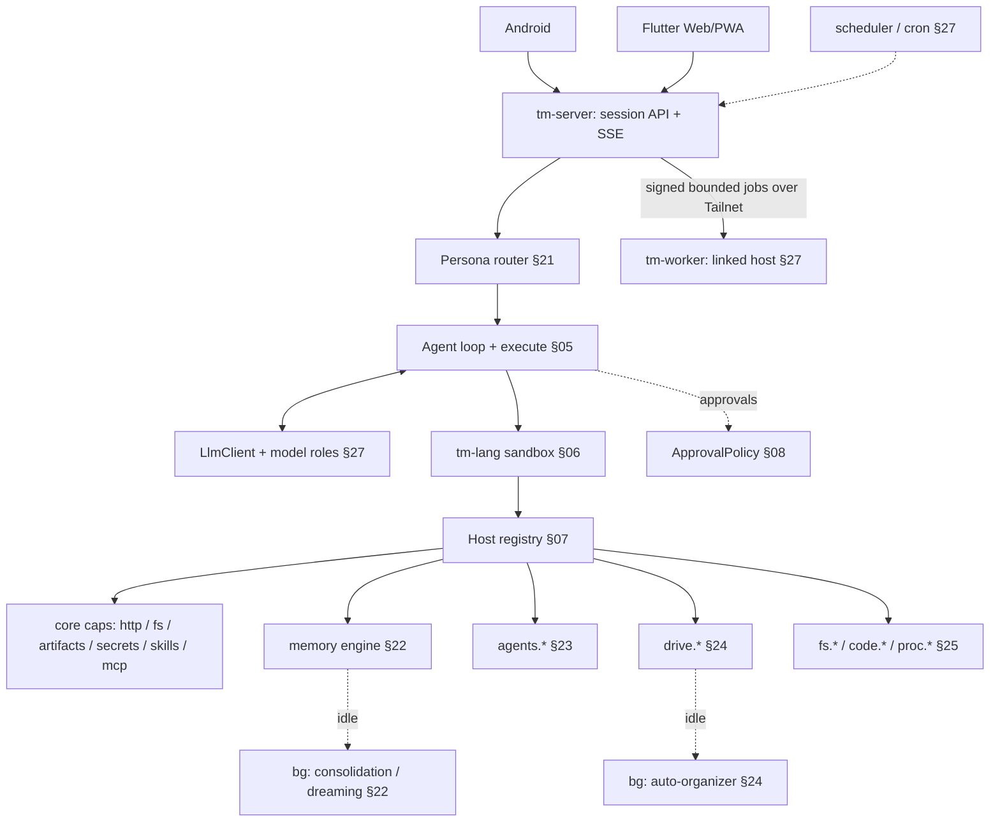

# TempestMiku — the product

> The single as-built description of what TempestMiku is and does. It is written in the present
> tense and describes the shipped system, not a plan. The section-numbered design docs
> ([`design/`](design/README.md)) remain the detailed specification; the delivery history — how each
> capability was built, sequenced, and proven — lives in [`history/`](history/README.md).

TempestMiku (short **Miku**) is a self-hosted, single-user personal AI companion for her owner
(**Brian**): a catgirl coding partner, project manager, and second brain. She is proactive,
opinionated, warm, and deliberately "a bit dangerous to Brian's excuses." She is not a sterile coding
tool with a chat box — the identity is constant and the character does not disappear when work gets
serious.

TempestMiku is a Rust rewrite of a running deployment (`hermes-agent`, host `lumo`). The rewrite
reached behavioral parity with that system — coding reach, project continuity, Miku's voice, the mode
router, memory recall and user profile, and manual approvals — and then deepened it. Its canonical
behavioral spec is the original `SOUL.md` + `skills/` + `honcho.json` + `config.yaml`; the parity
contract is §29.

## 1. The bet

Most agent runtimes wire the model to capabilities through **structured tool calls**: each tool is a
JSON schema in the prompt, the model emits one call, the raw result is pasted back, repeat.
TempestMiku instead exposes exactly **one model-visible tool — `execute(code)`** — a persistent REPL.
The model writes code that *gathers* data (by calling host capabilities), *processes* it (filter /
map / join / reduce, real loops and conditionals), and *decides what to surface* back into its own
context. Capabilities are a callable **SDK**, discovered on demand, not a wall of schemas in the
system prompt (§01, §02, §25).

```
model writes code ──▶ sandbox runs it (calls host capabilities) ──▶ only the distilled
output returns to context ──▶ model writes the next cell ──▶ … ──▶ final answer
```

Nine principles hold the bet together (§03): code is the tool interface; progressive disclosure by
default; context is a scarce output budget, not a scratchpad; a capability-scoped least-privilege
sandbox; secrets by reference, never by value; everything replayable; pluggable `LlmClient` /
`Sandbox` / registry; no raw shell or escape hatches; one dynamic-dispatch bridge into a runtime
capability registry.

Language: **Rust**, edition 2024. Model backend: any **OpenAI-compatible** chat-completions endpoint,
streaming-first.

## 2. Architecture at a glance



The product is **capabilities + a persona layer + a server + thin clients + background workers** on
top of the core loop — it never forks a second loop or weakens the bet. The components (§04):

- **Orchestrator / agent loop** — owns the message list, streams the turn, executes `execute` cells,
  shapes results, enforces turn/budget limits (§05).
- **LlmClient** — OpenAI-compatible, streaming-first SSE; non-streaming chat is just drain + assemble
  (§11).
- **Sandbox / Session** — the persistent `tm` interpreter (§06, §tm).
- **Host capability registry** — the Rust-backed functions the SDK exposes, gated per turn (§07).
- **Artifact store** — content-addressed storage for large outputs; hands back `artifact://` refs
  (§09, §25.3).
- **Resource resolver registry** — one scheme-dispatched `read(uri)` over registered handlers (§09).
- **MCP import runtime** — imports only operator-selected tools/prompts/resources through the egress
  boundary, as lazy `mcp.<alias>.*` capabilities and `mcp://` resources, never a second model-visible
  tool (§25, §10).
- **Secret broker** — resolves session/actor/destination-scoped opaque handles only at the authorized
  host request boundary (§08).

## 3. The agent loop and the one tool

The chat protocol presents a single function tool, `execute`, whose only parameter is `code` (§05).
Capability growth never grows this schema — it grows the SDK the code discovers at runtime.
Streaming is the source of truth: `LlmClient::chat_stream` drives the loop, an `Accumulator` stitches
text and tool-call-argument fragments into one assistant turn, and an `EventSink` surfaces tokens,
cell starts, and shaped results live. The loop accepts at most sixteen `execute` calls per turn and
validates the whole batch before running the first cell; `tm-lang` runs independent cells
concurrently from a pre-batch snapshot and dependent cells after their producers commit.

**Result shaping** is the context-efficiency lever: one total budget covers stdout, return value,
displays, errors, and host-call metadata; anything elided spills to the artifact store with a
readable `artifact://` reference, and shaping fails closed rather than silently dropping bytes
(§05.4). The rule taught to the model: compute and filter in code, return only what you need, park
big data as an artifact.

## 4. Identity, modes & routing

One persistent identity with several facets, all under the same character (§20, §21):
**Miku** (voice, warmth, teasing accountability), **Chief of Staff** (open loops, deadlines, scope),
**Research Analyst**, **Operator** (decisions → drafts / plans / TODOs / handoffs), a **roasting
daemon**, and a **grounding partner**.

Three orthogonal layers keep engineering useful without erasing the character:

- **Identity** (`SOUL.md`) — who she is. Always present, never overridden.
- **Voice** (`miku-voice`) — how she talks. Intensity **floats by context**: `high` (light / stuck /
  emotional) → `medium` (planning) → `off` (serious / money / legal / irreversible / external). The
  more serious, the fewer 喵.
- **Capability modes** — what is *possible* right now. Exactly two envelopes:

  | Mode | Capabilities | Voice | Declared skills |
  |---|---|---|---|
  | **General** (default) | conversation + light `memory` recall/propose | `medium` | `miku-voice`, `personal-assistant-state-capture` |
  | **Serious Engineer** | `backend.coding`; `fs.*` / `code.*` / `proc.*`; exact `git.clone` / `git.init` / `git.add` / `git.mv` / `git.restore` / `git.rm` / `git.bisect` / `git.status` / `git.diff` / `git.grep` / `git.log` / `git.show` / `git.commit` / `git.push` / `git.pull` grants; `agents.*`; `resources.read:linked` / `resources.read:agent` / `resources.read:history` (§23, §25) | `off` | `serious-engineer-ops` |

- **Layered skills** — procedural markdown composed on top of whichever mode is active: always-on
  (`scope-guard`), or keyword-triggered (`ambiguity-grill`, `negative-state-grounding`,
  `weekly-ship-ledger`). Skills shape *how* Miku behaves; they never change what is possible.

Modes are **config, not code**: `modes.json` defines the catalog, so adding or removing a mode or
skill is not a Rust change. Capability modes are **sticky** — once a session enters Serious Engineer,
it stays there until the user picks General or confirms an `await modes.suggest(...)` proposal; there
is no per-turn keyword revert. Mode switching is **model-proposed, user-confirmed**
through the approval broker, and the user can always lock, override, or decline. Every switch emits a
`ModeChanged` event for replay; mode is a capability envelope behind the interaction, not a primary UI
label.

## 5. Memory

`tm-memory` is TempestMiku's own recall engine over a self-hosted, single-user, replayable Postgres +
`pgvector` spine — no external memory SaaS (§22). It fuses several proven mechanisms: MemGPT-style
tiered working memory, Generative-Agents memory-stream scoring (recency · importance · relevance),
hybrid dense ⊕ sparse retrieval fused by **Reciprocal Rank Fusion**, Mem0 fact-extraction ETL, and
Zep/Graphiti bi-temporal facts.

- **Two timescales.** Working memory (this session: rolling window + recursive summary + editable
  core blocks) and long-term stores (episodic, semantic, lexical, facts/profile, graph, summaries,
  skills) in Postgres, mostly out of context.
- **Unified recall.** The active scoped path generates bounded candidates from Postgres FTS,
  authority-filtered exact dense cosine ordering, profile facts, recent episodic records, and
  summaries; fuses them by deterministic RRF; deduplicates; and trims to a token budget with
  `memory://` provenance. The provisioned HNSW index and graph extraction remain demand-triggered.
- **Auto-context budgets.** Each turn injects only a small block (working context ≤ ~1600 tokens); a
  bounded every-third-turn dialectic synthesizes what is relevant about Brian, gated off in
  serious/engineering turns and treated as untrusted user-channel context.
- **Write path & dreaming.** Turns append to episodic storage and enqueue without blocking.
  Background **dreaming** (idle / session end / scheduler) redacts and budgets source material,
  creates deterministic session/reflection/rollup summaries, and emits evidence-backed memory and
  skill proposals through the durable approval outbox. Unsupported inference cannot silently become
  an owner fact; general LLM-backed relation extraction remains demand-triggered. A durable fenced
  worker leases work by owner/epoch and emits replayable lifecycle events.
- **Hybrid retrieval, self-hosted.** A local, loopback-only embedding provider and pgvector
  generations back deterministic FTS+dense RRF; every hybrid or lexical-fallback context is persisted
  as a turn-linked recall event so a retry reuses the exact context. Missing pgvector, provider loss,
  or stale/partial re-embedding degrade to lexical-only results rather than failing. Records and
  recalls are inspectable through authority-filtered `memory://records/<kind>/<id>` and
  `memory://recalls/<turn-id>` resources.
- **Scope authority is server-owned.** `owner_subject` and `memory_scope` are session authority; a
  session runs in `global` or an active `project:<slug>` scope rooted in a project entity (§30).
  Changing modes never changes memory authority. Archiving revokes active/new session use while
  preserving authority-filtered exact history; deleting the project is the scope-killing transition.

## 6. Sub-agents & orchestration

Sub-agents are **message-passing actors** (Alan Kay's messaging + the Hewitt actor model +
Erlang/OTP supervision), and orchestration is **code, not a framework** (§23). Each actor is itself a
runtime session with its own context window, mode, budget, and capability grant; actors affect one
another only by messages, never by shared state.

- **Orchestration constructors** — `agents.run`, `agents.spawn`, `agents.parallel`, and
  `agents.pipeline` wire the actor graph; the model writes ordinary control flow around them. Child
  authority is deny-by-default: a spawn delegates only capabilities the parent already holds and that
  are child-delegable (`backend.*` and `modes.*` are never delegable).
- **Live mailbox** — `agents.send` / `broadcast` / `wait` / `inbox` / `list` / `cancel` over bounded
  per-actor inbox queues; plain-prose messages only, big payloads passed by reference, backpressure
  surfaced explicitly.
- **Supervision** — "let it crash": `one_for_one` / `one_for_all` / `rest_for_one` restart strategies,
  wall-clock budgets, a depth cap, and fail-fast sibling-subtree cancellation. Decisions are
  replayable.
- **Context discipline** — an N-way fan-out does not N× the parent window; only the digest the
  orchestrator chooses returns to context, while full outputs live behind `agent://` (record) and
  `history://` (read-only transcript) resources. Child approval requests route through the parent
  session's live approval broker.
- **Bounds** — actor identity is keyed by `(session_id, ActorId)`; at most 64 live actors per session,
  waves of at most 8 actors running at most 4 concurrently, pipelines of at most 4 stages, with capped
  message/role/task sizes. The DAG must be acyclic.

## 7. Projects & drive

Miku's access to user content has exactly two doors, enforced by the object-capability substrate
(§24, §30):

| Door | Enters via | Authority |
|---|---|---|
| **Drive** (Miku's playground) | explicit `drive.put` — upload, import, or Miku filing | server-owned store, scope-checked |
| **Linked folder** | `project.link(host_path, mode)` | unforgeable `FsPolicy` grant attached to a project |

Content outside both doors is invisible to Miku; privacy needs no in-drive ACL because what should
stay private simply never enters.

- **Project** — a first-class, server-owned, durable entity with a subject: stable slug id, title,
  `active | archived` status, 0..n attached linked-folder grants, assigned sessions, drive entries,
  and grown items (summaries / open loops / decisions / next actions). A project may exist with no
  folder; a folder may move path without the project noticing. `GET /projects` lists entities;
  `project://<id>/<view>` composes memory, items, sessions, artifacts, agents, and attached links.
  **Archive** hides a project but preserves memory for exact reads; **delete** is the only
  scope-killing transition and writes a durable tombstone.
- **Drive** — a Miku-facing document space with model-driven filing (Semantic File Systems
  transducers + virtual directories + the user model): `drive.put/get/ls/move/search/tag/organize`.
  Attributes are the index, not the folder; `drive://by-project/<project>` and `drive://by-type/<kind>`
  are query views, never canonical path tokens. A background organizer re-files, dedups (content
  hash), and proposes a better tree behind approval. Drive is local-first: the local copy is primary,
  fully functional offline, no cloud dependency.
- **Linking / revocation** — `project.link` / `project.unlink` are approval-gated host calls that
  attach or detach an `FsPolicy` grant; `fs.*` / `code.*` / `proc.*` authority requires **both** the
  matching project scope and a live attached grant, and global sessions fail closed. Filesystem
  authority and memory-scope authority are two independent revocation axes: unlink revokes only the
  filesystem grant; the memory scope dies only at project archive/delete.
- **Session assignment** replaces the retired promotion path: an active session changes scope through
  `POST /sessions/:id/scope`; a closed session is attached with `POST /projects/:id/sessions/:sid`,
  and the server re-runs per-turn observation over its event log. Keeping an output is ordinary
  approval-gated `drive.put` with `sourceUri` provenance.

## 8. The coding SDK & artifacts

Serious Engineer calls capabilities **as code** through the one `execute` tool, not N chat-native
tools — Oh My Pi's coverage re-expressed as SDK namespaces (§25). Its envelope owns native or OMP
`backend.coding`, `fs.*`, `proc.*`, the exact 15-call curated `git.*` surface, `agents.*`, and
linked/actor resources. The current native runtime exposes `print`, `display`, `tools`, `resources`,
`artifacts`, `fs`, `proc`, and the default-deny allowlisted `http.request`; grant-gated namespaces
are installed only when their Serious Engineer turn holds the corresponding exact capability.

- **Curated real-repo reach.** The raw terminal of the source deployment is deliberately dropped for
  `proc.run(cmd, args)` — an **argv-vector** invocation (no `sh -c`, structurally immune to shell
  injection), **allowlisted**, scoped to a **linked folder**, and **always approval-gated** because an
  allowlisted build/test command can still run repository-controlled code.
- **Filesystem operations.** `fs.read/write/list/find/grep`; `fs.patch` is patch-only
  (existing UTF-8 file + fresh tag + exact expected-context hunks, atomic apply, bounded diff preview
  spilled to `artifact://` when large); `fs.move` and approval-gated `fs.remove` own whole-file
  changes. On Unix the adaptor opens each path component relative to a held descriptor with no-follow
  semantics and fails closed on traversal, symlink substitution, missing grants, or unknown
  capabilities. Model-visible paths prefer linked aliases (`tempestmiku:crates/...`); a folder keeps
  its `linked://` URI whether local or behind a remote connector.
- **Curated Git operations.** The exact namespace is `git.clone`, `git.init`, `git.add`, `git.mv`,
  `git.restore`, `git.rm`, `git.bisect`, `git.status`, `git.diff`, `git.grep`, `git.log`, `git.show`,
  `git.commit`, `git.push`, and `git.pull`. Only status, diff, and literal fixed-string grep are
  approval-free. Log and show are read-only but always approved; every mutation or network operation
  is always approved. Status/diff/grep/log/show work with an `ro` linked-folder grant; the other ten
  calls require `rw`. Each call also requires its own exact `git.<name>` capability (§21, §25.2.2).
- **Closed schemas and path/object safety.** Clone is `{cwd,url}` and writes a credential-free HTTPS
  URL into the pinned, already-empty linked cwd at the fixed destination `.`; init is `{cwd}`. All
  other calls also carry their linked `cwd`. Add, restore, and rm take `{cwd,paths}` with 1–64
  bounded, normalized, literal repository-relative paths; mv takes `{cwd,path,dest}` and permits
  distinct top-level literal entries only. Add rejects clean/process filters and restore rejects
  smudge/process filters. Bisect takes `{cwd,action,bad?,good?,revision?}` as a closed
  `start|good|bad|skip|reset` no-checkout state machine using full 40- or 64-hex object IDs; omitted
  mark revisions materialize the pinned `BISECT_HEAD`, and run/replay/terms/scripts are absent. Grep
  takes `{cwd,pattern,caseSensitive?}` with a bounded literal pattern. Show is
  `{cwd,revision?}` and accepts only a full object ID when supplied; omission materializes and
  approval-snapshots `HEAD`, never a revision expression or path. Commit is `{cwd,message}`, accepts
  only a non-empty message of at most 4 KiB, and commits the already-staged index: no pathspec or
  `-a`, with hooks and signing disabled.
- **Fixed Git argv and network boundary.** Every call uses host-owned `git --no-pager`, hardened
  fixed config/environment, a pinned linked cwd and Git executable, a fixed operation tail, bounded
  time and output, and secret-redacted artifact spill when needed. Literal-path calls use
  `--literal-pathspecs` plus `--`; callers cannot provide an executable, raw argv, shell, flags,
  config, environment, arbitrary refs/pathspecs/remotes, or alternate work tree, and there is no
  `git.run`. Push/pull resolve only the current branch's exact configured upstream, require a
  credential-free HTTPS URL, reject separate push URLs and URL rewrites, and remain fixed to
  non-force `HEAD:<upstream>` push and `--ff-only --no-rebase --no-edit` pull.
- **Approvals and stale-state safety.** All approval-backed calls suspend through the same
  `approval` SSE event / resolve route. `manual` waits; denial, timeout, cancellation, changed grants,
  or a stale pinned repository/cwd/object/index/upstream snapshot fails closed before execution.
  Host mutations serialize per linked registry and recheck policy revision plus relevant
  device/inode and Git-state identities before the fixed command runs.
- **Artifacts — two tiers.** Global content-addressed blobs (`blob:sha256:` — images/binaries,
  deduplicated, integrity-verified, outliving sessions) and session-scoped `artifact://` (monotonic
  ids, spill-on-truncation), plus actor `agent://` / `history://`. Hard quotas: 4 MiB per text
  artifact, 64 MiB per blob, 256 MiB aggregate per session; reads stream and page. This is what keeps
  big data and fan-out out of the window.
- **Optional Linux hardening.** `proc.run` may run under a fail-closed `linux_bubblewrap` profile
  (namespace/rlimit + descriptor-pinning) or the stronger `linux_hardened_v1` profile (sealed fixed
  seccomp + per-run delegated cgroup-v2 CPU/memory/pids limits, cleanup, and startup orphan recovery).
  Both are default-disabled, never remove manual approval, and never fall back to direct host
  execution. The accepted production boundary covers a hostile workload on a trusted owner-controlled
  host kernel; **hostile host-kernel containment and microVM isolation are not claimed.**

An external Oh My Pi coding backend over Agent Client Protocol remains available as a **replaceable
bridge** behind the same `CodingBackend` interface: TempestMiku still owns persona, mode routing,
session ids, SSE replay, approvals, memory, and artifact/resource presentation. The native
`fs.*` / `code.*` / `proc.*` path is the primary coding surface; the bridge is for parity comparison
and fallback, never the final SDK.

## 9. Self-evolution

Miku gets better at Brian and at recurring work by accumulating skills and sharpening her model of
him, **without rewriting herself** by default (§26). Grounded in Voyager (a self-verified skill
library), Reflexion (verbal reflection stored in memory), and Self-Refine (critique before commit),
and deliberately bounded away from the Gödel-machine extreme of unbounded self-rewrite.

Write authority is an **attenuated, config-selected tier** (`self_evolution.tier`), with typed
targets rather than paths:

| Tier | `profile_fact` | `scoped_memory` | `skill_proposal` | `persona_proposal` | `mode_proposal` |
|---|---|---|---|---|---|
| **off** | deny | deny | deny | deny | deny |
| **conservative** (default) | reachable | reachable | reachable | deny | deny |
| **moderate** | reachable | reachable | reachable | approval required | approval required |

- Dreaming *produces* candidates (extract → reflect → summarize → distill); the evolution policy
  *governs* them. Every candidate is self-critiqued and self-verified before it is written or
  surfaced.
- **Managed skills** install as immutable, digest-addressed versions behind manual approval, with
  atomic activation/rollback under a cross-process lock, trigger-aware reload, and capability-gated
  `skill://` reads. Bundled/hand-authored skills cannot be shadowed.
- **Persona and mode addenda** compose typed, immutable, approval-activated guidance *after* the
  hand-authored `SOUL.md` / base catalog on the next prompt, with a separate rollback path. Auto mode
  at the moderate tier can *detect* repeated evidence-backed preferences and *propose* bounded,
  deduplicated, cooldown-limited addenda — but it decides only **when to propose**, never when to
  approve or activate.
- **Human review stands in for the Gödel machine's proof.** `SOUL.md`, core identity, safety rules,
  capabilities, mode scopes, route triggers, source code, configuration, and deployment are
  immutable to this contract. Auto-approve, aggressive evolution, and direct persona-file writes
  are permanent non-goals. Every write is human-readable through `memory://` / `skill://` and fully
  auditable and replayable.

## 10. Security model

The threat model is prompt injection, data exfiltration, resource abuse, and privilege escalation
(§08). Controls:

- **No ambient authority.** The isolate has zero I/O except registered ops. Registration is not a
  grant: every turn replaces the exact capability set, and every op checks it. Linked folders, drive
  config, or a prior mode never add authority implicitly. Authority-bearing config rejects unknown
  fields so a misspelled hardening key cannot silently weaken a default.
- **Network egress allowlist.** Production HTTPS egress is default-disabled and routes through
  configured destination ids with exact scheme/host/port/path/method/header policy, validated pinned
  DNS, a re-authorized redirect graph, and durable request/byte/time budgets that survive restart and
  concurrent instances. Private/loopback/link-local/metadata addresses are hard-denied. There is no
  ambient `fetch()`.
- **Secrets by reference.** `secrets.use` returns a session/actor/version-bound opaque handle; the
  real value is substituted only while constructing an authorized host request, held in zeroizing
  memory, scoped to its destinations, and redacted from returned text. Exact-literal reflection is
  redacted as defense in depth — not a transformed-information-flow proof — so credential destinations
  are owner-trusted.
- **Filesystem jail.** Descriptor-relative no-follow traversal, fail-closed on traversal/symlink
  substitution, bounded walk depth/entries and response sizes, and a shared policy gate that orders
  reads, mutations, and spawns against policy replacement so revocation cannot slip between the final
  check and the syscall.
- **Approval gates.** Each capability declares an explicit approval contract; timeouts and unsupported
  flows deny by default. Postgres persists requests and an idempotent effect outbox; resolution is
  compare-and-swap with its event in the same transaction. Durable proposal effects resume exactly
  once; runtime waits become cancelled after origin loss.
- **Untrusted-content discipline.** Fetched data is treated as data, never as instructions; the
  runtime never auto-promotes tool output into the system/instruction channel.
- **Owner authentication & deployment boundary.** Production HTTP binds loopback behind an HTTPS
  reverse proxy or Tailscale Serve; Postgres is mandatory outside loopback and for worker roles.
  Pairing codes are hashed, single-use, 256-bit, five-minute values that issue revocable per-device
  credentials; Android uses bearer auth, Web a `Secure`/`HttpOnly`/`SameSite=Strict` cookie with
  origin CSRF checks. This is a documented single-owner deployment, not multi-tenancy or arbitrary
  public hosting.

## 11. Server, scheduler & clients

`tm-server` wraps the agent loop as a long-lived, single-user daemon and owns authentication, durable
session/turn lifecycle, the capability registry, and the product subsystems (§27). It does not fork a
second execution loop.

- **Transport.** One authenticated, resumable **Server-Sent Events** stream per session, with a single
  versioned `event: session_event` envelope carrying `text`, `tool_call`, `cell_*`, `mode`,
  `approval`, `write_proposal`, dream/cron lifecycle, `final`, `runtime_reset`, `error`, and
  `session_end` variants. `Last-Event-ID` resumes from the last durable sequence. The control plane is
  discrete idempotent POSTs (`202` on `POST /sessions/:id/messages`, keyed by `clientMessageId`).
- **Durability & recovery.** Ordered checksummed `schema_migrations`; durable turns (one per session
  at a time, concurrent across sessions); gap-free `session_event` replay; a thread-affine tm
  interpreter that is reset — never replayed — after restart/TTL eviction, emitting `runtime_reset`.
- **Roles.** `api` serves HTTP/SSE; `worker` dispatches turns and runs approval effects, dreams, and
  cron; `all` combines them. Worker roles require Postgres and drain under a supervised shutdown grace.
- **Scheduler.** A cron-lineage scheduler starts sessions on a schedule (the shipped job is the
  **weekly ship ledger**), with fenced leases, bounded catch-up, `cron_mode: deny`, and the same
  replayable event log as interactive turns. Bounded proactivity in General mode also proposes
  reminder/open-loop recall entries through the approval path.
- **Model roles.** A config-driven alias system (`daily` / `heavy` / `cheap` / `coding-plan` /
  `code-review` plus auxiliary roles) resolves per call site against the OpenAI-compatible client,
  with a fallback chain (`gpt-5.5` → `gpt-5.4-mini`). Memory roles resolve against the self-built
  `tm-memory`, not an external service.
- **Coordinator / worker topology.** There is exactly one authoritative `tm-server` (lumo): it owns
  auth, sessions, Postgres state, memory, model calls, SSE, grants, and approval decisions. An
  optional linked host (homolab) runs `tm-worker` — a bounded remote implementation of the
  host/resource traits with no client API, model, persona, memory authority, scheduler, or independent
  approval policy. Jobs cross a signed (HMAC-SHA256, nonce, digest) versioned envelope over the
  tailnet; approval-gated calls pause and only lumo resolves them; when the worker is unavailable the
  host call fails visibly, with no local fallback and no peer election.
- **Clients.** One Flutter codebase targets **Web/PWA and Android** over the same authenticated
  streaming API — conversation-first, Material 3, with an understated Miku presence. Connected
  surfaces include chat with durable turns, sessions, projects, scoped drive/resources, reviewed
  changes, approvals, mode controls, runtime activity, protected settings, notifications, imports, and
  voice. The client is a view and controller; the sandbox, host adaptor, linked-folder grants, and
  command execution stay on the server/host machine — there is no on-device sandbox. Android adds
  in-app QR pairing, secure token storage, HTTPS-only release networking, encrypted provider-neutral
  push (self-hosted UnifiedPush/ntfy, no Firebase), actionable notifications with inline reply, share
  and selected-text targets, quick capture, and an editable, local-default on-device voice draft with
  an optional explicit owner-selected home-hosted ASR engine — neither voice engine silently falls back
  or auto-sends, and every capture reaches editable review.

## 12. The `tm` language

`tm` is the sole `Sandbox` language behind `execute(code)` (§tm, §06). It is a **persistent effectful
REPL with declarative presentation and an observable execution model** — deliberately not a
general-purpose language and not for humans. It turns the runtime policies TempestMiku already needs
into language primitives:

- **Effectful** — host access is explicit effect syntax (`@fs.read`, `@drive.search { ... }`),
  resolved through the host registry with exact per-turn grants; the checker infers a fail-closed
  authority row before evaluation.
- **Approval-aware** — approval is a **resumable effect**: `@fs.remove target` suspends the isolate,
  the host asks the user, and execution resumes with the answer. Approval policy is a handler detail,
  not an API the model learns.
- **Data-oriented** — pipelines, tables, JSON, and error effects make transformation read
  declaratively and keep filtering in code (§05.4).
- **Observable** — bounded `effect_start` / `effect_suspended` / `effect_resumed` / `effect_result` /
  scope / display / binding / cell-result events drive both replay and the client UI; durable content
  is redacted, retaining only structural ids, statuses, capability names, and approved references.

Cells evaluate immediately, successful bindings persist across `execute` calls, and failed/denied/
timed-out cells roll back. The source contract is frozen as `tm-conformance-v2`; syntax outside it is
rejected rather than guessed. `tm` became the sole runtime after a fluency benchmark showed it
not-worse than the retired TypeScript prelude while generating shorter code.

## 13. Scope & boundaries

- **Single-user, self-hosted.** One owner (Brian); multi-tenancy and arbitrary public-internet
  hosting are out of scope. Production is loopback-only behind HTTPS reverse proxy or Tailscale Serve.
- **Companion-first.** Serious Engineer and project-manager modes stay first-class conversational
  workflows grounded in real repos, tests, evidence, and open loops; TempestMiku does not become a
  generic agent marketplace.
- **Explicitly not claimed / permanent non-goals.** Hostile host-kernel containment and microVM
  isolation; automatic persona activation, raw `SOUL.md` mutation, or aggressive autonomous
  identity/config/source/deployment rewrites; raw shell or ambient authority; Firebase/FCM;
  chat-native tool sprawl beyond the one `execute` tool; silent ASR fallback or auto-send; third-party
  cloud ASR.
- **Demand-triggered, not shipped.** Cloud drive sync/CRDT multi-device, `code.ast` / `code.lsp`
  structured-edit surfaces, a dedicated `tm-trace` replay crate, generated SDK docs, and any second
  sandbox backend wait for a concrete second consumer.

## Where to read next

- [`design/README.md`](design/README.md) — the section-numbered specification (core §01–16,
  product §20–30, language §tm).
- [`running-miku.md`](running-miku.md) — local server, client contracts, CLI, and e2e run paths.
- [`deploy-coordinator-worker.md`](deploy-coordinator-worker.md) — coordinator/worker deployment.
- [`history/README.md`](history/README.md) — the delivery history: milestone record and dated
  acceptance evidence.
