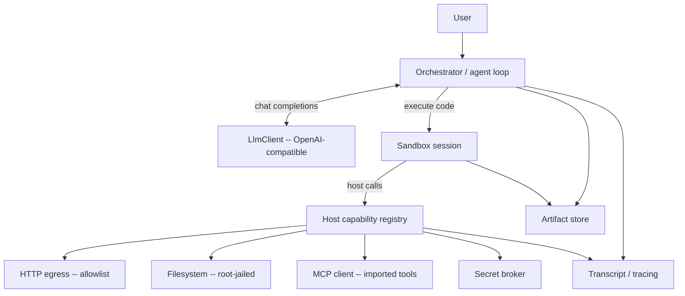
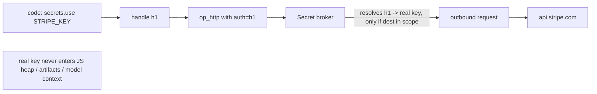

# TempestMiku — Code-Execution Agent Runtime

> Status: design draft v0.1
> Scope: the core runtime. UI, deployment, and multi-tenant concerns are out of scope here.

## 1. TL;DR — the bet

Most agent runtimes wire the model to capabilities through **structured tool calls**: every
tool is a JSON schema injected into the prompt, the model emits one call, the runtime runs it,
the raw result is pasted back into context, repeat. Call this **Tool Call 1.0**.

TempestMiku bets on the alternative Anthropic described in *Code execution with MCP* (Nov 2025):
the model's primary interface is a **single code-execution tool — a persistent REPL**. The model
writes code that *gathers* data (by calling host capabilities), *processes* it (filter / map /
join / reduce, with real loops and conditionals), and *decides what to surface* back into its own
context. Capabilities are presented to the code as a callable **SDK**, discovered on demand, not
as a wall of JSON schemas in the system prompt.

The whole runtime is one control loop around that idea:

```
model writes code ──▶ sandbox runs it (calls host capabilities) ──▶ only the distilled
output returns to context ──▶ model writes the next cell ──▶ … ──▶ final answer
```

Language: **Rust**. Model backend: any **OpenAI-compatible** chat-completions endpoint.

References: [Anthropic — Code execution with MCP](https://www.anthropic.com/engineering/code-execution-with-mcp),
[Anthropic — Agent Skills / progressive disclosure](https://www.anthropic.com/engineering/equipping-agents-for-the-real-world-with-agent-skills),
[Simon Willison's summary](https://simonwillison.net/2025/Nov/4/code-execution-with-mcp/).

---

## 2. Why code execution beats classic tool calls

### Tool Call 1.0 — the failure modes

| Problem | Why it happens |
|---|---|
| **Prompt bloat** | Every tool's full JSON schema is loaded upfront, every turn, whether used or not. Hundreds of tools = tens of thousands of tokens before the user even speaks. |
| **Result bloat** | Every intermediate result is re-tokenized into context. Fetch a 2 MB JSON to extract one field → the whole blob sits in the window. |
| **Weak composition** | Chaining N tools = N round-trips. Filtering, joining, or looping over results is done by the model *in prose*, badly and expensively. |
| **No data-side compute** | The model must reason over raw blobs token-by-token instead of running `data.filter(...)`. |
| **Privacy leak** | Sensitive intermediate values (PII, secrets, large corpora) necessarily pass through the model. |

### Tool Call 2.0 — what code execution buys

- **Progressive disclosure.** The system prompt only says *"you have a REPL and an SDK; discover
  capabilities with `tools.search()` / `tools.docs()`."* Tool definitions are read on demand.
  (Anthropic measures skill discovery at ~80 tokens each vs. loading everything upfront.)
- **Context-efficient results.** Code filters/aggregates *before* anything returns to the model.
  Only what the code explicitly `display()`s or returns reaches context; the 2 MB blob stays in
  the sandbox or becomes an `artifact://` handle.
- **Real control flow.** Loops, conditionals, retries, `Promise.all` fan-out — ordinary code,
  one tool round-trip instead of N.
- **Data never has to touch the model.** Values can flow from source A to sink B entirely inside
  the sandbox; the model orchestrates without seeing the payload.
- **Persistent state & skills.** Variables persist across cells (Jupyter-style); reusable
  functions can be saved as importable skills.

### The cost (be honest)

Running model-authored code demands a **secure sandbox, resource limits, and monitoring**. That
operational surface is the price of admission and the hardest part of this runtime — §7 and §8
are dedicated to it.

---

## 3. Core principles

1. **Code is the tool interface.** One first-class tool: `execute(code)`. Everything else is an
   SDK function the code may call.
2. **Progressive disclosure by default.** Nothing about a capability enters context until the
   code asks for it.
3. **The context window is a scarce output budget, not a scratchpad.** The sandbox is the
   scratchpad; context holds only decisions and distilled results.
4. **Capability-scoped, least-privilege sandbox.** Code can do *nothing* the host did not
   explicitly grant — no ambient network, filesystem, or secrets.
5. **Secrets by reference, never by value.** Code holds opaque handles; real secret values are
   substituted at the host boundary and never enter the sandbox heap or the model context.
6. **Everything is replayable.** Every cell, host call, and output is recorded; a session can be
   replayed deterministically.
7. **Pluggable everything.** `LlmClient`, `Sandbox`, and the host-function registry are traits.
   Swapping the REPL language or the model backend is a config change.
8. **No raw shell, no escape hatches.** There is no generic `bash`/`shell` capability. The model
   writes TS against typed, curated capabilities instead of escaping to another language; the
   REPL language's package ecosystem is a long-tail safety net, not the primary capability source.
9. **One bridge, a runtime registry.** Every extensible host call routes through a single
   dynamic-dispatch op into a capability **registry**. Adding a capability = register a handler +
   emit a stub — no new op, no rebuild of the bridge, hot-addable at runtime.

---

## 4. Architecture



Components:

- **Orchestrator** — owns the message list, runs the loop, applies the result-shaping policy,
  enforces turn/budget limits.
- **LlmClient** — talks to the OpenAI-compatible endpoint; **streaming-first** (SSE), with a non-streaming convenience that drains the stream.
- **Sandbox / Session** — executes code cells in a persistent, isolated environment.
- **Host capability registry** — the set of Rust-backed functions the SDK exposes to code.
- **Artifact store** — content-addressed storage for large outputs; hands back `artifact://` refs.
- **Secret broker** — resolves opaque secret handles to real values only at the host boundary.
- **Transcript / tracing** — structured record of the whole session for audit and replay.

---

## 5. The agent loop

### 5.1 Control flow

```
seed messages = [system_prompt, user_msg]
loop:
    stream = llm.chat_stream(messages, tools=[EXECUTE_TOOL])   # streaming is the only transport
    acc = Accumulator()
    for delta in stream:                  # text + tool-call-arg fragments, as they arrive
        sink.emit(delta)                  # assistant tokens reach the UI live
        acc.push(delta)
    turn = acc.finish()                   # assembled assistant message (text + tool_calls)
    append turn.message to messages
    if turn has tool_call "execute":
        out = session.eval(code = call.code, budget)
        append tool_result(call.id, shape_result(out)) to messages
        continue
    else:
        return turn.text                  # no tool call ⇒ final answer
until turn_budget exhausted
```

The session is **persistent across iterations** — cell 2 sees the variables cell 1 defined. The
loop ends when the model stops calling `execute` (it has its answer) or a budget is hit.

### 5.2 The one tool

```json
{
  "type": "function",
  "function": {
    "name": "execute",
    "description": "Run code in your persistent REPL session. Variables persist across calls. Only what you display()/return reaches you; everything else stays in the sandbox. Discover capabilities with tools.search()/tools.docs().",
    "parameters": {
      "type": "object",
      "properties": {
        "code": { "type": "string", "description": "Source to evaluate in the session." }
      },
      "required": ["code"]
    }
  }
}
```

That is the *entire* tool surface presented to the model. Capability growth never grows this
schema — it grows the SDK the code discovers at runtime.

### 5.3 Fallback for endpoints without function calling

Some OpenAI-compatible servers don't support `tools`. Provide a `Protocol` switch:

- `NativeTool` (default): use the `execute` function-call mechanism above.
- `FencedBlock`: instruct the model to emit exactly one fenced block
  ` ```run … ``` `; the orchestrator parses the block, runs it, and injects the result as the
  next user message. Same loop, brittler parsing. Used only when native tools are unavailable.

### 5.4 Result shaping (the context-efficiency lever)

`shape_result` turns an `EvalOutput` into the compact tool message the model sees. Policy:

- `stdout` and return value: capped (e.g. 8 KB) with head+tail elision markers.
- `display()` items: the model's *intended* outputs — included (text/markdown/table inline;
  images as blocks; large data as artifact refs).
- Anything over the cap → spilled to the artifact store; the model gets
  `artifact://<id>` + a preview + size, and can re-read slices on demand.
- `error`: message + trimmed traceback.
- A one-line **host-call summary** (which capabilities ran, bytes in/out) so the model — and the
  audit log — know what happened.

The system prompt teaches the model the rule: **compute and filter in code; return only what you
need; park big data as an artifact.**

### 5.5 Streaming (day 1)

Streaming is foundational, not a later add-on. `LlmClient::chat_stream` is the single transport;
the non-streaming `chat` is just "drain the stream and assemble." Two things stream out of every
turn as the bytes arrive:

- **Assistant text** — surfaced token-by-token through an `EventSink` so a UI/CLI renders the
  answer live.
- **Tool-call arguments** — the `execute` call's `{"code": …}` arrives as JSON fragments across
  deltas; an `Accumulator` stitches the fragments (and any text) into one `AssistantTurn` before
  the code runs.

```
SSE chunk ─▶ StreamEvent ─▶ Accumulator.push()   ─▶ AssistantTurn (text + tool_calls)
                     └▶ EventSink.on_text()  (UI, live)
```

What does *not* stream to the model in v1: a *running* cell's stdout. The sandbox still returns one
shaped result per finished cell (§5.4); the cell's live output may be mirrored to the UI but is
folded into a single tool message for the model. See §15.

---

## 6. The REPL / sandbox

### 6.1 Language choice

Decision matrix for the language the *model* writes — the axes that actually decide it:

| Option | Model fluency | Rust embeddability | Sandbox story | npm/stdlib | Verdict |
|---|---|---|---|---|---|
| **JS/TS via `deno_core`** (V8) | High | Good (single crate) | Excellent — ops opt-in, zero ambient I/O, in-process | ES + web APIs you expose | **Chosen** |
| JS via `rquickjs` (QuickJS) | High | Excellent (small, fast startup) | Excellent — no I/O unless bound | ES2020-ish, no npm | Alt (tests / minimal builds) |
| Python via subprocess (CPython) | Highest | Out-of-process + RPC | Strong on Linux (ns+seccomp); needs a container on macOS | Full PyPI | **Planned 2nd backend** |
| Pure-Rust DSL (`rhai`/`rune`) | Low | Excellent | Excellent | Tiny | Rejected — poor fluency |

**Decision: TypeScript on `deno_core`** — the only substrate that is portably sandboxed,
zero-external-dependency, *and* cheap to extend, all at once.

- **Real async event loop** — host calls are async ops; the model can `await Promise.all([...])`
  for natural fan-out.
- **Capability model is free** — nothing is callable unless we register it (no `fetch`/fs/`Deno.*`
  by default). That *is* the least-privilege boundary, in-process and portable — no container on macOS.
- **Cheap to extend** — capabilities route through one dispatch bridge into a runtime registry
  (§3 principle 9): add a handler + a generated stub, no new op, no rebuild.
- **Ecosystem worry is mostly moot** — capabilities come from the Rust host, not a package manager,
  and there is no raw shell (§3 principle 8), so the `bash("python …")` escape never arises.
- **Good model priors** — high TS fluency; matches Anthropic's own TS examples.

`rquickjs` stays as a lighter, faster-start alternative for tests and minimal builds. If the model
ever genuinely needs in-language Python libraries (`pandas`, `pdfplumber`, …), the
**CPython-subprocess backend** (§6.6) drops in behind the same `Sandbox` trait — same loop, SDK,
and registry, different executor. The choice is reversible by construction.

### 6.2 Session & state

A `Session` is one long-lived V8 isolate + context. `eval(code)` runs a cell in that context;
top-level `let/const/var` and assignments persist. `reset()` tears down and recreates the isolate
for a clean slate. Sessions are **pooled** to amortize V8 startup; a fresh isolate is handed out
per agent run and returned/reset afterward.

### 6.3 Resource limits

Per cell and per session:

- **Wall-clock timeout** → isolate terminated, `Timeout` error returned to the model.
- **Heap cap** (V8 `--max-old-space-size` / isolate heap limit) → `OutOfMemory`.
- **Output cap** (stdout + return bytes) → truncation + artifact spill.
- **Egress cap** (bytes/requests via host net ops) → `EgressLimit`.
- **Host-call rate/quota** per capability.

A killed cell never kills the host; it returns a structured error the model can react to.

### 6.4 The host-call bridge

The SDK (a TS prelude injected at session creation) is thin sugar over **ops** — Rust async
functions registered with the isolate. Sketch (deno_core `op2`):

```rust
#[op2(async)]
#[serde]
async fn op_tools_call(
    state: Rc<RefCell<OpState>>,
    #[string] name: String,
    #[serde] args: serde_json::Value,
) -> Result<serde_json::Value, AnyError> {
    let registry = state.borrow().borrow::<Arc<HostRegistry>>().clone();
    let ctx = state.borrow().borrow::<InvocationCtx>().clone();
    registry.invoke(&name, args, &ctx).await   // capability checks happen inside invoke()
}
```

```ts
// injected prelude (illustrative)
const tools = {
  search: (q: string)            => Deno.core.ops.op_tools_search(q),
  docs:   (name: string)         => Deno.core.ops.op_tools_docs(name),
  call:   (name: string, a: any) => Deno.core.ops.op_tools_call(name, a),
};
const display = (v: unknown, o?: DisplayOpts) => Deno.core.ops.op_display(v, o);
const http = {
  get:  (url: string, init?: ReqInit) => Deno.core.ops.op_http(  "GET", url, init),
  post: (url: string, body: unknown, init?: ReqInit) => Deno.core.ops.op_http("POST", url, init, body),
};
const artifacts = {
  put:   (data: Uint8Array | string, o?: PutOpts) => Deno.core.ops.op_artifact_put(data, o),
  slice: (id: string, s: number, e: number)       => Deno.core.ops.op_artifact_slice(id, s, e),
};
const secrets = { use: (name: string) => Deno.core.ops.op_secret_handle(name) };
```

**Two tiers of ops.** A small fixed set of **core primitives** (`display`, `print`, `artifacts`)
is bound directly; every other capability goes through one **dispatch bridge**
(`op_host_call` → registry, surfaced as `tools.call`). New capabilities take the bridge — register
a handler, emit a stub — so the op layer never grows and never needs a rebuild (§3 principle 9).

For an **out-of-process** backend (Python), the same SDK is implemented over **JSON-RPC** on a
pipe/socket: the in-sandbox `host.*` makes a blocking RPC, the Rust host services it
asynchronously and concurrently, and replies. Code stays simple (no async needed); concurrency
lives host-side or behind an explicit `host.parallel([...])`.

### 6.5 Async & parallelism

`deno_core` runs a Tokio-backed event loop, so the model's code can issue concurrent host calls
naturally:

```ts
const pages = await Promise.all(urls.map(u => http.get(u)));   // fan-out, one execute() round-trip
const hits  = pages.flatMap(p => p.json().items).filter(x => x.score > 0.8);
display(hits.slice(0, 20));   // only the distilled 20 reach context
```

### 6.6 Future backend: Python in isolation

When fluency demands Python: spawn CPython in a locked-down subprocess (Linux: namespaces +
seccomp + cgroups; or gVisor/Firecracker microVM), bridge via JSON-RPC. macOS lacks
production-grade local sandboxing — for dev, rely on subprocess + rlimits + capability-gated host
ops; for prod, run the Linux isolation path. Same `Sandbox` trait.

---

## 7. The host SDK / standard library

What the code can reach (each function is capability-checked at the boundary):

- `tools.search(query)` / `tools.docs(name)` / `tools.call(name, args)` — **progressive
  disclosure** over the capability catalog (incl. imported MCP tools). Catalog lives host-side;
  only summaries return until `docs()` is called.
- `http.get/post(...)` — egress through the network allowlist, with byte/req caps.
- `fs.read/write/ls(...)` — confined to a per-session workspace root (jail).
- `artifacts.put/slice/get(...)` — large-data store; returns `artifact://` handles.
- `display(value, opts)` — declare an intended output (text/markdown/json/table/image).
- `secrets.use(name)` — opaque handle; see §8.3.
- `skills.save(name, src)` / `import` — persist & reuse model-authored modules across runs
  (Anthropic "skills").

### Progressive disclosure flow

```mermaid
sequenceDiagram
    participant M as Model
    participant Cx as Code (sandbox)
    participant H as Host registry
    M->>Cx: execute(tools.search("salesforce contact"))
    Cx->>H: op_tools_search
    H-->>Cx: [{name:"sf.contacts.find", summary:"..."}]  %% names+summaries only
    Cx-->>M: 3 matches (≈60 tokens)
    M->>Cx: execute(tools.docs("sf.contacts.find"))
    Cx->>H: op_tools_docs
    H-->>Cx: full signature + examples
    Cx-->>M: docs (loaded only now)
    M->>Cx: execute(const c = await tools.call("sf.contacts.find", {...}); display(c.length))
```

The catalog never sits in the system prompt; tokens are spent only on what the run actually
touches.

---

## 8. Security model

### 8.1 Threat model

- **Prompt injection** via tool-returned/fetched content steering the code to exfiltrate or
  destroy.
- **Data exfiltration** — code POSTing secrets/PII to an attacker domain.
- **Resource abuse** — infinite loops, fork bombs, memory/egress exhaustion.
- **Privilege escalation** — code reaching host FS/process/network beyond its grant.

### 8.2 Controls

- **No ambient authority.** The isolate has zero I/O except the ops we register. Every op runs a
  capability check against the session's `Capabilities` before doing anything.
- **Network egress allowlist.** Default-deny; only configured domains; per-domain byte/req caps;
  egress logged.
- **Filesystem jail.** All `fs.*` resolved against a workspace root; path traversal rejected.
- **Resource limits** (§6.3) enforced by the isolate + host.
- **Approval gates.** Capabilities flagged `sensitive` (send email, write to prod, spend money)
  pause for human approval before the host executes them.
- **Untrusted-content discipline.** Data fetched from the world is treated as data, never as
  instructions; the runtime never auto-promotes tool output into the system/instruction channel.

### 8.3 Secrets by reference

```ts
const key = secrets.use("STRIPE_KEY");           // opaque handle, NOT the value
await http.post("https://api.stripe.com/...", body, { auth: key });
```

The string `STRIPE_KEY`'s real value is injected by the **secret broker** at the host boundary
(inside `op_http`), substituted into the outbound request, and **never** materialized in the JS
heap, the artifact store, or the model context. Handles are also egress-scoped: a handle usable
only against `api.stripe.com` can't be replayed against an attacker host.



---

## 9. Context & artifact management

- Outputs above the per-cell cap are **content-addressed** and stored; the model receives
  `artifact://<id>`, a MIME type, a size, and a short preview.
- The model re-reads on demand: `artifacts.slice(id, start, end)` — paged, never the whole blob.
- Artifacts are referenceable across cells and persist for the session (optionally the workspace).
- This is the mechanism that keeps a 2 MB fetch from ever entering the window: it lands in the
  store, the code works on it in-sandbox, and only `display(summary)` reaches context.

---

## 10. Rust implementation

### 10.1 Workspace layout

```
tempest-miku/
├── crates/
│   ├── tm-core/        # message types, the agent loop, result-shaping policy, config
│   ├── tm-llm/         # OpenAI-compatible client (chat + streaming), LlmClient trait
│   ├── tm-sandbox/     # Sandbox/Session traits + backends (deno, quickjs, py-subprocess)
│   ├── tm-host/        # host capability registry, ops, capability policy, secret broker
│   ├── tm-artifacts/   # content-addressed artifact store
│   ├── tm-mcp/         # MCP client -> imports external tools into the catalog
│   └── tm-trace/       # tracing, transcript record/replay
└── apps/
    └── tm-cli/         # binary: wiring, config, REPL/chat entrypoint
```

### 10.2 Key types & traits

```rust
// tm-core
pub enum Role { System, User, Assistant, Tool }

pub struct Message {
    pub role: Role,
    pub content: Vec<ContentBlock>,
    pub tool_calls: Vec<ToolCall>,        // assistant
    pub tool_call_id: Option<String>,     // tool result
}

pub enum ContentBlock { Text(String), Image { mime: String, data: Bytes }, Artifact(ArtifactRef) }
pub struct ToolCall { pub id: String, pub name: String, pub arguments: serde_json::Value }

#[async_trait]
pub trait LlmClient: Send + Sync {
    // Streaming is the one source of truth (day 1): deltas carry text + tool-call-arg fragments.
    async fn chat_stream(&self, req: &ChatRequest)
        -> Result<BoxStream<'static, Result<StreamEvent>>>;
    // Convenience: drain the stream into a complete turn. Default-implemented.
    async fn chat(&self, req: &ChatRequest) -> Result<AssistantTurn> { /* accumulate stream */ }
}

// streaming types (day 1)
pub enum StreamEvent {
    Text(String),                                   // assistant text fragment
    ToolCall { index: usize, id: Option<String>, name: Option<String>, arguments: Option<String> },
    Finish { reason: Option<String> },
    Usage(Usage),
}

pub struct AssistantTurn {                          // assembled from a delta stream
    pub text: String,
    pub tool_calls: Vec<ToolCall>,
    pub finish_reason: Option<String>,
    pub usage: Option<Usage>,
}

// The loop pushes streaming events here as they arrive; the CLI sink prints tokens live.
pub trait EventSink: Send + Sync {
    fn on_text(&self, _delta: &str) {}              // assistant token(s), streamed
    fn on_tool_call(&self, _name: &str) {}          // a tool call began
    fn on_cell_start(&self, _code: &str) {}         // sandbox eval starting
    fn on_cell_result(&self, _shaped: &str) {}      // shaped result returning to the model
    fn on_final(&self, _text: &str) {}              // final answer
}

#[async_trait]
pub trait Sandbox: Send + Sync {
    async fn open(&self, cfg: SessionConfig) -> Result<Box<dyn Session>>;
}

#[async_trait]
pub trait Session: Send {
    async fn eval(&mut self, code: &str, budget: CellBudget) -> Result<EvalOutput>;
    async fn reset(&mut self) -> Result<()>;
}

pub struct EvalOutput {
    pub stdout: String,
    pub result: Option<serde_json::Value>,
    pub displays: Vec<Display>,
    pub error: Option<EvalError>,
    pub artifacts: Vec<ArtifactRef>,
    pub host_calls: Vec<HostCallRecord>,
    pub usage: CellUsage,
}

// tm-host
#[async_trait]
pub trait HostFn: Send + Sync {
    fn descriptor(&self) -> &HostFnDescriptor;   // name, summary, params, docs — for progressive disclosure
    async fn invoke(&self, args: serde_json::Value, ctx: &InvocationCtx) -> Result<serde_json::Value>;
}

pub struct Capabilities {
    pub net: NetPolicy,            // allow/deny domains, byte+req caps
    pub fs: FsPolicy,              // root, ro/rw
    pub secrets: SecretScope,      // which named secrets are resolvable, and their egress scope
    pub limits: ResourceLimits,    // wall, heap, output, egress
    pub approvals: ApprovalPolicy, // which capabilities require human sign-off
}
```

### 10.3 The loop (sketch)

```rust
pub async fn run(agent: &Agent, user: Message, sink: &dyn EventSink) -> Result<String> {
    let mut msgs = vec![agent.system_prompt(), user];
    let mut session = agent.sandbox.open(agent.session_cfg()).await?;

    for _ in 0..agent.cfg.max_turns {
        // Stream the turn; tokens reach the sink (UI) the instant they arrive.
        let mut stream = agent.llm.chat_stream(&agent.request(&msgs)).await?;
        let mut acc = Accumulator::new();
        while let Some(ev) = stream.next().await {
            let ev = ev?;
            if let StreamEvent::Text(t) = &ev { sink.on_text(t); }
            acc.push(ev);
        }
        let turn = acc.into_turn();
        msgs.push(turn.to_message());

        let Some(call) = turn.execute_call() else {
            sink.on_final(&turn.text);
            return Ok(turn.text);                          // no tool call ⇒ final answer
        };
        sink.on_cell_start(&call.code);
        let out    = session.eval(&call.code, agent.cell_budget()).await?;
        let shaped = agent.shape_result(out);
        sink.on_cell_result(&shaped);
        msgs.push(Message::tool_result(&call.id, shaped));
    }
    Err(Error::TurnBudgetExhausted)
}
```

### 10.4 Conventions

- **Async runtime:** Tokio. `deno_core` event loop driven on a dedicated thread per isolate;
  `eval` is `async` and cancel-safe (drop ⇒ terminate isolate).
- **Errors:** `thiserror` per crate, `anyhow` at the binary edge. Sandbox errors are *data*
  returned to the model, not host failures.
- **Serialization:** `serde` everywhere; the op boundary is `serde_json::Value`.
- **Config:** layered (defaults → file → env → flags); capabilities are config, not code.

---

## 11. OpenAI-compatible integration

### 11.1 Request

```jsonc
POST {base_url}/v1/chat/completions
{
  "model": "…",
  "messages": [ /* system, user, assistant(tool_calls), tool(result), … */ ],
  "tools": [ /* the single execute() function from §5.2 */ ],
  "tool_choice": "auto",
  "stream": true
}
```

### 11.2 Loop mapping

- Assistant turn with `tool_calls[0].function.name == "execute"` → parse `arguments.code`, run,
  append a `role:"tool"` message keyed by `tool_call_id`.
- Assistant turn with content and no tool call → final answer; stop.
- Multiple tool calls in one turn: supported, but the default system prompt nudges one `execute`
  per turn (state persists, so there's no need to batch).

### 11.3 Compatibility notes

- **No-tools endpoints:** use the `FencedBlock` protocol (§5.3).
- **Streaming (day 1, default path):** assistant text streams to the UI token-by-token and
  `execute` arguments are accumulated from deltas before the cell runs (§5.5). A running cell's
  stdout may be mirrored to the UI but is folded into one tool result for the model.
- **Token accounting:** record prompt/completion tokens per turn; artifact spill keeps prompt
  growth flat regardless of data volume.

---

## 12. Observability & reproducibility

- **Tracing:** `tracing` spans — `turn` → `cell` → `host_call` — with token counts, bytes,
  durations, capability decisions.
- **Transcript:** the full session (messages + code + outputs + artifacts + host-call records)
  is persisted as a structured log.
- **Replay:** a recorded session can be re-run with host calls served from the log (deterministic
  for debugging) or live (to test prompt/model changes against real capabilities).

---

## 13. End-to-end example

**User:** *"Which of our last 100 support tickets mention 'refund', and what's the median
resolution time for those?"*

```
turn 1  assistant → execute:
        const cards = await tools.search("support tickets list");
        display(cards.map(c => c.name));
  tool ← ["tickets.list","tickets.get"]                              # ~30 tokens, not the schemas

turn 2  assistant → execute:
        const t = await tools.call("tickets.list", { limit: 100 });   # 100 tickets, ~600 KB
        const refunds = t.filter(x => /refund/i.test(x.subject + x.body));
        const mins = refunds.map(x => (x.resolved_at - x.created_at) / 60000).sort((a,b)=>a-b);
        const median = mins.length ? mins[Math.floor(mins.length/2)] : null;
        display({ matched: refunds.length, median_minutes: median });
  tool ← { matched: 12, median_minutes: 87 }                          # ~15 tokens; 600 KB never entered context

turn 3  assistant → (final answer)
        "12 of the last 100 tickets mention refunds; median resolution ≈ 1h27m."
```

The 600 KB payload was fetched, filtered, and reduced **in the sandbox**. Context spent tokens
only on two tiny `display()` results and the answer. That is the entire point.

---

## 14. Roadmap

| Milestone | Deliverable |
|---|---|
| **M0 — streaming protocol skeleton** | Streaming-first OpenAI client (SSE) + the agent loop consuming deltas live + an `EventSink` (assistant tokens token-by-token) + a stub sandbox (echoes code). Validates the streaming message protocol end-to-end; tests drive a scripted stream with no network. |
| **M1 — real REPL** | `deno_core` backend; ops for `display`, `http.get` (allowlisted), `artifacts`; result-shaping + artifact spill; system prompt. |
| **M2 — disclosure + tools** | `tools.search/docs/call`; `tm-mcp` imports external MCP tools into the catalog; secrets-by-reference. |
| **M3 — production loop** | Approval gates, audit log, session pooling, deterministic replay. (Streaming landed in M0.) |
| **M4 — backends & hardening** | `rquickjs` + Python-subprocess backends; Linux isolation (seccomp/cgroups/microVM); egress hardening. |

---

## 15. Open questions / risks

- **In-language Python ecosystem.** Decided: TS on `deno_core`. If real Python libraries become
  necessary in-REPL, the CPython-subprocess backend (§6.6) drops in behind the `Sandbox` trait —
  loop, SDK, and registry unchanged.
- **V8 startup cost.** Mitigated by session pooling; measure before optimizing.
- **Streaming a *running* cell's stdout to the model** (not just the UI) — deferred; assistant
  tokens and tool-call args stream from day 1 (§5.5), but the model still sees one shaped result
  per finished cell.
- **Long-running / background tasks** inside a cell — needs a job model; out of scope for v1.
- **Artifact token budgeting** — preview sizes and slice defaults need tuning against real usage.
- **Multi-tenant isolation** — one isolate per run is fine single-user; shared deployment needs
  per-tenant capability + resource partitioning.

---

## 16. References

- Anthropic — *Code execution with MCP: building more efficient AI agents* —
  <https://www.anthropic.com/engineering/code-execution-with-mcp>
- Anthropic — *Equipping agents for the real world with Agent Skills* (progressive disclosure) —
  <https://www.anthropic.com/engineering/equipping-agents-for-the-real-world-with-agent-skills>
- Simon Willison — *Code execution with MCP* (summary) —
  <https://simonwillison.net/2025/Nov/4/code-execution-with-mcp/>
- `deno_core` — <https://docs.rs/deno_core> · `rquickjs` — <https://docs.rs/rquickjs>
