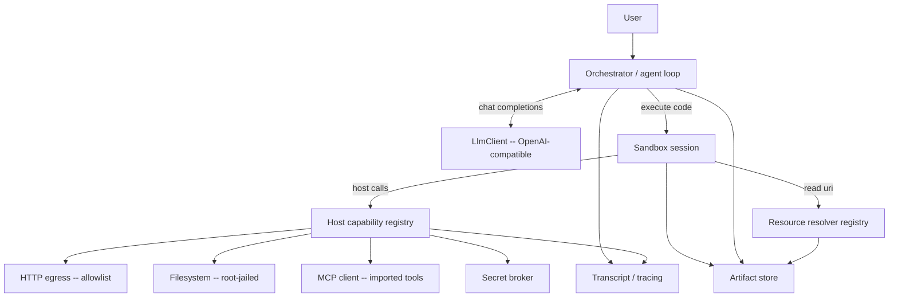

# 4. Architecture

Components:

- **Orchestrator** — owns the message list, runs the loop, applies the result-shaping policy,
  enforces turn/budget limits.
- **LlmClient** — talks to the OpenAI-compatible endpoint; **streaming-first** (SSE), with a non-streaming convenience that drains the stream.
- **Sandbox / Session** — executes code cells in a persistent, isolated environment.
- **Host capability registry** — the set of Rust-backed functions the SDK exposes to code.
- **Artifact store** — content-addressed storage for large outputs; hands back `artifact://` refs.
- **Resource resolver registry** — one scheme-dispatched `read(uri)` over registered handlers
  (currently `artifact://` / `workspace://session` / `linked://` / `project://` / `memory://` /
  `agent://` / `history://`; `drive://`, `cron://`, and `skill://` reads remain reserved until their
  owning milestones register handlers and grants); §9.2.
- **Secret broker** — resolves opaque secret handles to real values only at the host boundary.
- **Transcript / tracing** — structured record of the whole session for audit and replay.
