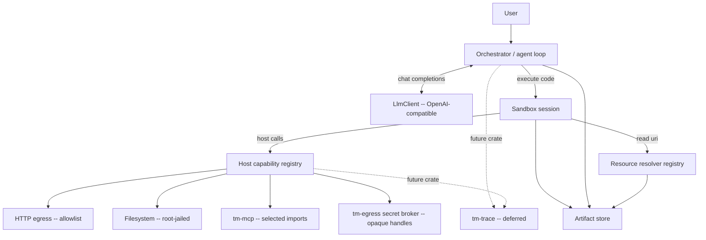

# 4. Architecture

Components:

- **Orchestrator** — owns the message list, runs the loop, applies the result-shaping policy,
  enforces turn/budget limits.
- **LlmClient** — talks to the OpenAI-compatible endpoint; **streaming-first** (SSE), with a non-streaming convenience that drains the stream.
- **Sandbox / Session** — executes code cells in a persistent, isolated environment.
- **Host capability registry** — the set of Rust-backed functions the SDK exposes to code.
- **Artifact store** — content-addressed storage for large outputs; hands back `artifact://` refs.
- **Resource resolver registry** — one scheme-dispatched `read(uri)` over registered handlers
  (currently `artifact://` / `workspace://session` / `linked://` / `project://` / `memory://` /
  `agent://` / `history://` / `cron://`, configured `drive://`, P7.1 managed `skill://` versions,
  and configured P10 `mcp://` resources; every optional handler still requires its scheme grant);
  §9.2.
- **MCP import runtime** — `tm-mcp` discovers only operator-selected tools, prompts, and resources
  through the P9 egress/opaque-secret boundary, then exposes lazy `mcp.<alias>.*` code capabilities
  and `mcp://` resources without adding another model-visible tool. Production bindings are immutable
  for one server/CLI process; restart is the explicit reload and stale-binding invalidation seam.
- **Secret broker** — P9 `tm-egress` resolves exact session/actor/destination-scoped opaque handles
  only at the authorized host request boundary. Values do not intentionally enter tm values,
  approval payloads, artifacts, events, or model results; exact literal reflection is redacted, but
  this is not a transformed-information-flow guarantee.
- **Transcript / tracing** — current structured events/artifacts provide audit evidence; a dedicated
  `tm-trace` replay crate remains deferred.

The product server (§27) wraps these components with authenticated durable turns and one replayable
SSE envelope. Postgres-backed `api`, `worker`, and `all` roles own persistence and supervision; they
do not create a second agent loop. A tm session remains thread-affine to its runtime shard while the
core loop continues to own accumulation, execution, and result shaping.
