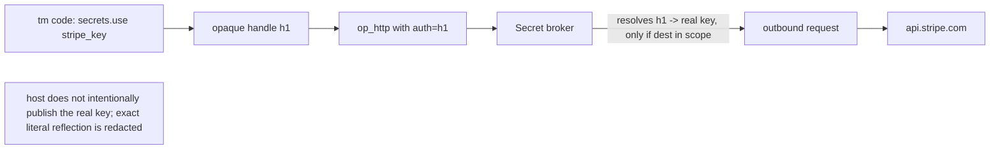

# 8. Security model

### 8.1 Threat model

- **Prompt injection** via tool-returned/fetched content steering the code to exfiltrate or
  destroy.
- **Data exfiltration** — code POSTing secrets/PII to an attacker domain.
- **Resource abuse** — infinite loops, fork bombs, memory/egress exhaustion.
- **Privilege escalation** — code reaching host FS/process/network beyond its grant.

### 8.2 Controls

- **No ambient authority.** The isolate has zero I/O except registered ops. Registration is not a
  grant: every turn replaces the sandbox's exact capability set, and every op checks it before doing
  anything. Linked folders, drive configuration, or a prior mode never add authority implicitly.
  Authority-bearing host, linked-folder, approval, self-evolution, egress, and isolation config
  rejects unknown fields so misspelling a hardening key cannot silently select a weaker default.
- **Network egress allowlist.** The system ships default-disabled production HTTPS egress through configured
  destination ids. Exact scheme/host/port/path/method/header policy, validated and pinned DNS answers,
  a manually re-authorized redirect graph, request/response/count/time budgets, current exact grants,
  revocation generations, and bounded durable audits all fail closed. Active-session usage and
  outstanding reservations are transactional in Postgres and survive restart/concurrent instances.
  Non-GET effects are durably claimed before transport and are never resent from a persisted
  started/uncertain state. There is no ambient `fetch()`.
- **Self-hosted ASR is a dedicated owner action, not model egress.** The optional voice broker is
  absent unless the operator fixes one upstream in server configuration, is reachable only through
  the authenticated client API, and cannot be invoked by tm code or supplied a destination by the
  client. It accepts only bounded 16 kHz mono PCM16 and retains neither audio nor transcript. It
  disables redirects and proxy discovery, bounds the upstream response and timeout, and never falls
  back to another recognizer. Upstreams use HTTPS, except that an exact literal Tailscale CGNAT
  address may use HTTP inside the owner's encrypted tailnet; this exception is local to the voice
  broker and does not widen the egress or sandbox authority. Re-pairing, logout, or any server-target change
  first cancels active capture/transcription and invalidates the remote-engine consent/catalog;
  stale requests, catalogs, and confirmations are epoch-fenced from the new authority.
- **Filesystem jail.** Linked-folder reads, walks, searches, and mutations traverse from an opened
  root descriptor with no-follow component opens on Unix; traversal and symlink substitution fail
  closed. Platforms without the required descriptor-relative APIs receive no linked-folder reach.
  Recursive walks reject more than 128 directory levels and stop after 100,000 visited entries;
  list/find/search responses use exact serialized-JSON accounting and are capped at 4 MiB.
  A shared policy gate orders bounded reads, final mutation syscalls, and process spawn against
  policy replacement/removal, so revocation cannot land between final revalidation and the syscall.
- **Resource limits** (§6.3) enforced by the isolate + host. The optional Linux bubblewrap profile
  also applies bounded `RLIMIT_AS`, `RLIMIT_NPROC`, and `RLIMIT_NOFILE` inside unshared namespaces;
  it fails closed and never falls back to host execution. The stronger `linux_hardened_v1` profile
  adds a sealed fixed seccomp policy and per-run delegated cgroup-v2 CPU/memory/swap/pids limits,
  kill-and-drain cleanup, counters, and exact-name startup orphan recovery. It has no fallback when
  its policy or delegated controllers are unavailable. `tm-server` performs recovery before its
  API/worker runtime exists and fails startup if it cannot complete. Production-host sizing/identity
  and any selected microVM remain separate deployment gates.
- **Approval gates.** Each capability declares an explicit approval contract (`none`, conditional,
  or always); approval is independent of its `sensitive` trace-privacy flag. Linked reads/list/find
  and code search are sensitive so raw paths/content previews are not persisted, but do not prompt.
  Overwrites, removal, and every `proc.run` use bounded redacted JSON approval actions, including
  invocations wrapped by the optional Linux isolation profile.
  Process approvals bind exact argv/executable/cwd identity and optional stdin presence, byte count,
  raw SHA-256, and a redacted 256-byte preview with explicit truncation. Unix children re-stat the
  executable device/inode in the final `pre_exec` hook; path exec still leaves a narrow final
  stat-to-exec race where fd-based exec is unavailable. On Linux the optional bubblewrap profile
  instead descriptor-pins the linked root/cwd, restricts mounts and environment, unshares user,
  mount, PID, IPC, UTS, and network namespaces, drops capabilities, and applies rlimits. The
  `linux_hardened_v1` approval additionally binds the seccomp policy/version/architecture/digest,
  delegated cgroup-root device/inode, and all cgroup limits. Disposable canaries prove those software
  controls; the retained homolab production report additionally binds service delegation, cgroup
  exclusivity, workload headroom, persistence, and restart behavior. Neither evidence class claims
  hostile-kernel containment or microVM isolation. Timeouts and unsupported flows deny by default.
  Postgres persists requests and an idempotent effect outbox; resolution is compare-and-swap with its
  event in the same transaction. Durable proposal effects resume exactly once, while ACP/native-runtime waits are
  non-resumable and become cancelled after origin loss. Memory, skill, and review-only
  persona/mode effects also carry a typed
  target and creation tier; the worker re-derives the target, rechecks the current tier, and renews
  its owner/epoch lease before mutation, so forged, downgraded, or stale work fails before a write.
  The append-only evolution audit projection is written transactionally with proposal/effect state,
  uses idempotency keys for retry/replay, and persists only redacted provenance, typed targets, and
  digests. Full candidates require the existing `resources.read:memory` capability. Moderate review
  effects persist only status: they recheck the live persona/mode base digest after approval and
  have no file-write or catalog-reload dispatch.
- **Untrusted-content discipline.** Data fetched from the world is treated as data, never as
  instructions; the runtime never auto-promotes tool output into the system/instruction channel.

### 8.2.1 Owner authentication and deployment boundary

- Production HTTP binds loopback behind an HTTPS reverse proxy or Tailscale Serve. Postgres is
  mandatory outside loopback and for worker roles; raw `0.0.0.0` HTTP is a debug-only override.
- Pairing codes are random 256-bit values, stored only as SHA-256 hashes, expire after five minutes,
  and are consumed once. They issue revocable per-device 256-bit credentials whose hashes are stored
  in `auth_devices`; bearer credentials never enter URLs, pairing HTML, events, or logs.
- Android authenticates every request and SSE connection with `Authorization: Bearer`. Web uses the
  same device record through a `Secure`, `HttpOnly`, `SameSite=Strict` cookie; state-changing cookie
  requests require a matching origin as CSRF protection.
- Forwarded host/protocol/identity headers are honored only from configured trusted proxy CIDRs.
  Public unauthenticated routes are limited to minimal health/static/pairing exchange surfaces; the
  pairing-code creator itself requires loopback, an authenticated device, or the explicit bootstrap
  credential.

### 8.3 Secrets by reference

The system exposes an opaque broker through tm effects, never a secret-value read:

```tm
let key = @secrets.use {name: "stripe_key"}
---
@http.request {method: "POST", url: "https://api.stripe.com/v1/...", body: body, auth: key}
```

The configured environment value is injected by the **secret broker** at the host boundary; the host
does not intentionally put it in the tm heap, config, artifact store, approval payload, event stream,
or model context. Handles are random, process-local references bound to session, actor, secret
version, current exact grant, and configured destination ids. An old handle cannot be replayed from
another session/actor, against an attacker host, after revocation/version change, or across restart.
Literal occurrences are redacted from bounded returned fields, but transformed/encoded/hashed
reflection is outside enforceable exact-value redaction. Any configured destination receiving a
credential is an owner-trusted endpoint; redaction is defense in depth, not authority to send a
secret to an untrusted reflector.


