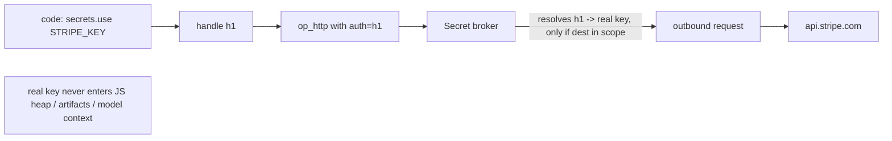

# 8. Security model

### 8.1 Threat model

- **Prompt injection** via tool-returned/fetched content steering the code to exfiltrate or
  destroy.
- **Data exfiltration** — code POSTing secrets/PII to an attacker domain.
- **Resource abuse** — infinite loops, fork bombs, memory/egress exhaustion.
- **Privilege escalation** — code reaching host FS/process/network beyond its grant.

### 8.2 Controls

- **No ambient authority.** The isolate has zero I/O except registered ops. Registration is not a
  grant: every turn replaces the sandbox's exact capability set, and every op checks it before doing
  anything. Linked folders, drive configuration, or a prior mode never add authority implicitly.
- **Network egress allowlist.** Current M1/P0 `http.get` is a default-deny deterministic allowlist
  helper, not ambient `fetch()` and not the production egress policy. Production live egress remains
  deferred until it has configured destinations, per-domain byte/request caps, redirect policy,
  auditing, and secret-broker integration.
- **Filesystem jail.** All `fs.*` resolved against a workspace root; path traversal rejected.
- **Resource limits** (§6.3) enforced by the isolate + host.
- **Approval gates.** Capabilities flagged `sensitive` pause for human approval before execution.
  Postgres persists requests and an idempotent effect outbox; resolution is compare-and-swap with its
  event in the same transaction. Durable proposal effects resume exactly once, while ACP/V8 waits are
  non-resumable and become cancelled after origin loss. Timeout and unsupported flows deny by default.
- **Untrusted-content discipline.** Data fetched from the world is treated as data, never as
  instructions; the runtime never auto-promotes tool output into the system/instruction channel.

### 8.2.1 Owner authentication and deployment boundary

- Production HTTP binds loopback behind an HTTPS reverse proxy or Tailscale Serve. Postgres is
  mandatory outside loopback and for worker roles; raw `0.0.0.0` HTTP is a debug-only override.
- Pairing codes are random 256-bit values, stored only as SHA-256 hashes, expire after five minutes,
  and are consumed once. They issue revocable per-device 256-bit credentials whose hashes are stored
  in `auth_devices`; bearer credentials never enter URLs, pairing HTML, events, or logs.
- Android authenticates every request and SSE connection with `Authorization: Bearer`. Web uses the
  same device record through a `Secure`, `HttpOnly`, `SameSite=Strict` cookie; state-changing cookie
  requests require a matching origin as CSRF protection.
- Forwarded host/protocol/identity headers are honored only from configured trusted proxy CIDRs.
  Public unauthenticated routes are limited to minimal health/static/pairing exchange surfaces; the
  pairing-code creator itself requires loopback, an authenticated device, or the explicit bootstrap
  credential.

### 8.3 Secrets by reference

This is the deferred P7 secret-broker contract, not a currently exposed SDK namespace. Today
`secrets` remains undefined and live production egress is closed; the runtime still redacts detected
credentials at all persistence/log boundaries.

```ts
const key = secrets.use("STRIPE_KEY");           // opaque handle, NOT the value
await http.post("https://api.stripe.com/...", body, { auth: key });
```

The string `STRIPE_KEY`'s real value is injected by the **secret broker** at the host boundary
(inside `op_http`), substituted into the outbound request, and **never** materialized in the JS
heap, the artifact store, or the model context. Handles are also egress-scoped: a handle usable
only against `api.stripe.com` can't be replayed against an attacker host.


