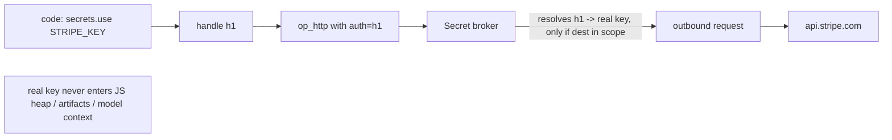

# 8. Security model

### 8.1 Threat model

- **Prompt injection** via tool-returned/fetched content steering the code to exfiltrate or
  destroy.
- **Data exfiltration** — code POSTing secrets/PII to an attacker domain.
- **Resource abuse** — infinite loops, fork bombs, memory/egress exhaustion.
- **Privilege escalation** — code reaching host FS/process/network beyond its grant.

### 8.2 Controls

- **No ambient authority.** The isolate has zero I/O except the ops we register. Every op runs a
  capability check against the session's `Capabilities` before doing anything.
- **Network egress allowlist.** Default-deny; only configured domains; per-domain byte/req caps;
  egress logged.
- **Filesystem jail.** All `fs.*` resolved against a workspace root; path traversal rejected.
- **Resource limits** (§6.3) enforced by the isolate + host.
- **Approval gates.** Capabilities flagged `sensitive` (send email, write to prod, spend money)
  pause for human approval before the host executes them. In the current server slice, the native
  Serious Engineer Deno backend routes approval-gated `fs.*` / `code.*` / `proc.*` host calls through
  the HTTP approval broker; timeout and unsupported flows deny by default.
- **Untrusted-content discipline.** Data fetched from the world is treated as data, never as
  instructions; the runtime never auto-promotes tool output into the system/instruction channel.

### 8.3 Secrets by reference

```ts
const key = secrets.use("STRIPE_KEY");           // opaque handle, NOT the value
await http.post("https://api.stripe.com/...", body, { auth: key });
```

The string `STRIPE_KEY`'s real value is injected by the **secret broker** at the host boundary
(inside `op_http`), substituted into the outbound request, and **never** materialized in the JS
heap, the artifact store, or the model context. Handles are also egress-scoped: a handle usable
only against `api.stripe.com` can't be replayed against an attacker host.


