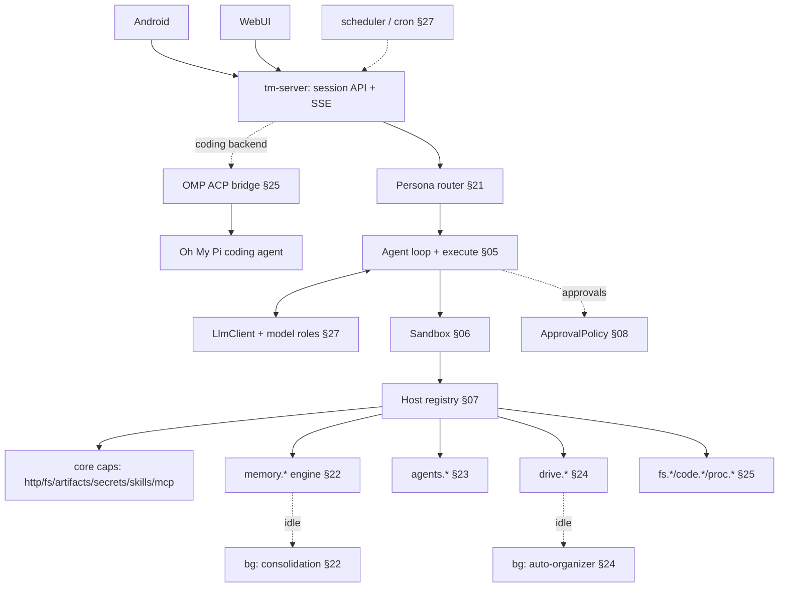

# 20. Product layer — overview

> Scope: the product **on top of** the runtime core (§01–16). The core is deliberately
> UI/deployment/multi-tenant-agnostic; this track adds the companion, personas, memory,
> storage, sub-agents, and clients.
> **Canonical behavioral spec:** `SOUL.md` + `skills/` + `honcho.json` + `config.yaml` from the
> source deployment (`hermes-agent`, host `lumo`). See the **parity baseline** (§29).

## What TempestMiku is

A self-hosted personal AI companion: **Tempest Miku** (short **Miku**) — a 貓娘 (catgirl) assistant,
**coding partner**, project manager, and second brain for her user (**Brian**). Proactive,
opinionated, warm, and deliberately "a bit dangerous to Brian's excuses." Coding is a first-class
workflow, but the product is not a sterile coding tool with a chat box.

One persistent identity with several facets (SOUL.md): **Miku** (voice / warmth / teasing
accountability), **Chief of Staff** (open loops, deadlines, scope), **Research Analyst**,
**Operator** (turns decisions into drafts / plans / TODOs / handoffs), a **roasting daemon**
(challenges avoidance / overwork / over-engineering / new pits), and a **grounding partner** (when
Brian is low).

- **Identity is constant; voice intensity floats** by context (miku-voice skill: 喵 density high in
  light/emotional, off in serious) (§21).
- **Modes underneath.** **Three capability-mode envelopes** — General / Serious Engineer / Handoff —
  change what's *possible*, never the identity; conversational postures like Ambiguity Grill and
  Negative-State Grounding are layered skills on top of whichever mode is active, not modes
  themselves (§21).
- **Built on the bet.** Still "one `execute` tool; capabilities are SDK functions the code calls"
  (§01, §03).

### This is a rewrite, not a greenfield

The behavioral source is the running `hermes-agent` TempestMiku deployment on `lumo`, with Honcho
memory, a skills hub, terminal, cron, MCP, and manual approvals. The Rust system preserves the
behavior specified by `SOUL.md`, the seven skills, `honcho.json`, and `config.yaml`, then extends it
behind the same identity, memory, and approval boundaries (§29).

### Hard non-goals (taste-level)

- Becoming a **sterile coding agent** whose voice and memory disappear once work gets serious.
- **Mechanical / robotic Q&A** as the default register.

Enforced, not aspirational: constant character, context-sensitive voice intensity, and first-class
Serious Engineer, project-manager, and General workflows keep engineering useful without letting it
erase the identity (§21).

## How the product maps onto the core

Almost everything new is **just another host capability** registered in `tm-host`
(principle #9 — hot-addable capabilities), plus a thin persona layer, a server, thin clients, and
background workers.

The bet survives because the product is **capabilities + a persona layer + a server/clients +
background workers** — not a rewrite of the loop.

A transitional OMP ACP bridge is the narrow exception: `tm-server` may delegate Serious Engineer execution to an external
`omp acp` process while TempestMiku still owns persona, approvals, SSE replay, memory, and
artifact/resource presentation. That bridge is a cutover aid, not the final capability architecture.

## The product-layer track

| Doc | Topic |
|---|---|
| [§21](21-persona-and-modes.md) | Persona, modes & routing |
| [§22](22-memory-dreaming.md) | Memory — self-built recall + "dreaming" |
| [§23](23-agents-orchestration.md) | Sub-agents & orchestration |
| [§24](24-drive-storage.md) | Smart file storage (drive) |
| [§25](25-coding-agent-sdk.md) | Coding-agent SDK (OMP translation) + artifacts |
| [§26](26-self-evolution.md) | Self-evolution |
| [§27](27-server-and-clients.md) | Server, scheduler & clients |
| [§28](28-product-roadmap.md) | Delivery history pointer |
| [§29](29-parity-baseline.md) | Parity baseline — the current deployment |

## Scope

- **Single-user (Brian), self-hosted.** Multi-tenant remains parked (§15).
- Server-backed; the Rust core runs as a daemon, clients are thin (§27).
