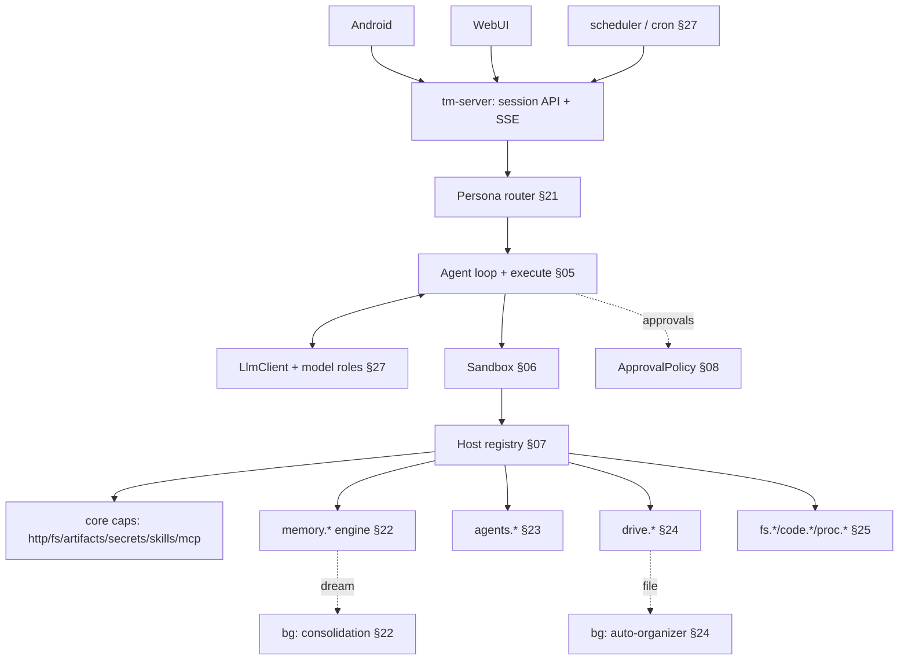

# 20. Product layer — overview

> Status: product design draft v0.2
> Scope: the product **on top of** the runtime core (§01–16). The core is deliberately
> UI/deployment/multi-tenant-agnostic; this track adds the companion, personas, memory,
> storage, sub-agents, and clients.
> **Canonical behavioral spec:** `SOUL.md` + the `skills/` + `honcho.json` + `config.yaml` of the
> current deployment (`hermes-agent`, host `lumo`). See the **parity baseline** (§29).

## What TempestMiku is

A self-hosted personal AI companion: **Tempest Miku** (short **Miku**) — a 貓娘 (catgirl) assistant,
**second brain**, and execution partner for her user (**Brian**). Proactive, opinionated, warm, and
deliberately "a bit dangerous to Brian's excuses." Not a generic chatbot; not a coding tool with a
chat box.

One persistent identity with several facets (SOUL.md): **Miku** (voice / warmth / teasing
accountability), **Chief of Staff** (open loops, deadlines, scope), **Research Analyst**,
**Operator** (turns decisions into drafts / plans / TODOs / handoffs), a **roasting daemon**
(challenges avoidance / overwork / over-engineering / new pits), and a **grounding partner** (when
Brian is low).

- **Identity is constant; voice intensity floats** by context (miku-voice skill: 喵 density high in
  light/emotional, off in serious) (§21).
- **Modes underneath.** A **5-mode router** — Personal Assistant / Ambiguity Grill / Negative-State
  Grounding / Serious Engineer / Handoff — changes *capabilities and register*, never the identity
  (§21).
- **Built on the bet.** Still "one `execute` tool; capabilities are SDK functions the code calls"
  (§01, §03).

### This is a rewrite, not a greenfield

There is a **running TempestMiku today**: `hermes-agent` (host `lumo`), built on an existing agent
framework with Honcho memory, a skills hub, terminal, cron, MCP, and manual approvals. The Rust
TempestMiku is its **next-gen runtime**. SOUL.md + the 7 skills + `honcho.json` + `config.yaml` are
the **behavioral spec the rewrite must preserve before adding anything** (§29).

### Hard non-goals (taste-level)

- Becoming **"another coding agent"** — a sterile, tool-shaped assistant.
- **Mechanical / robotic Q&A** as the default register.

Enforced, not aspirational: the constant character + the voice-intensity rule + folding coding into
the Serious Engineer / Handoff modes keep the engineering work from eating the identity (§21).

## How the product maps onto the core

Almost everything new is **just another host capability** registered in `tm-host`
(principle #9 — hot-addable capabilities), plus a thin persona layer, a server (+ scheduler), thin
clients, and background workers.

The bet survives because the product is **capabilities + a persona layer + a server/clients +
background workers** — not a rewrite of the loop.

## The product-layer track

| Doc | Topic |
|---|---|
| [§21](21-persona-and-modes.md) | Persona, modes & routing |
| [§22](22-memory-dreaming.md) | Memory — self-built recall + "dreaming" |
| [§23](23-agents-orchestration.md) | Sub-agents & orchestration |
| [§24](24-drive-storage.md) | Smart file storage (drive) |
| [§25](25-coding-agent-sdk.md) | Coding-agent SDK (OMP translation) + artifacts |
| [§26](26-self-evolution.md) | Self-evolution |
| [§27](27-server-and-clients.md) | Server, scheduler & clients |
| [§28](28-product-roadmap.md) | Product roadmap |
| [§29](29-parity-baseline.md) | Parity baseline — the current deployment |

## Scope

- **Single-user (Brian), self-hosted.** Multi-tenant remains parked (§15).
- Server-backed; the Rust core runs as a daemon, clients are thin (§27).
