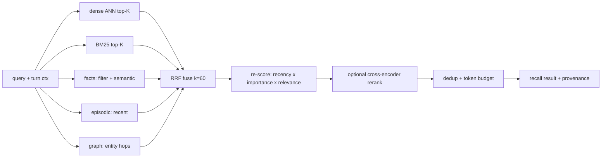

# 22. Memory — self-built multi-mechanism recall + "dreaming"

We do **not** integrate a memory service. `tm-memory` is **our own engine** that composes several
proven recall mechanisms over a self-hosted, single-user, replayable **Postgres** store. The current deployment's
`honcho.json` (§29) is kept only as the **behavioral target** — the knobs Brian already tuned
(hybrid recall, ToM, async write, a ~1600-token context budget, write-approval) — now realized
natively, not by calling out. Brian's metaphor stays literal: the system **dreams** — idles,
consolidates, wakes knowing him better — but the dream is **ours to build** (§22.5).

## 22.0 Design stance

- **Self-implemented, self-hosted, no external SaaS memory dependency.** One Postgres + `pgvector` spine
  (§22.6); every write replayable (principle #6).
- **Synthesis, not invention** — we adopt the best-tested pieces and fuse them (provenance §22.12):
  - **MemGPT / Letta** — OS-style tiered working memory (core / recall / archival) + FIFO recursive
    summary + self-editing blocks + paging.
  - **Generative Agents** — a memory *stream* scored by **recency · importance · relevance**, plus
    **reflection** (periodic higher-level insights).
  - **Hybrid retrieval** — dense (vector ANN) ⊕ sparse (BM25) fused by **Reciprocal Rank Fusion**,
    optional cross-encoder rerank.
  - **Mem0** — LLM **fact-extraction ETL on write** into a read-optimized profile store.
  - **Zep / Graphiti** — **bi-temporal** entity-relation graph that clarifies **event relationships** (§22.2).

## 22.1 Two timescales, two managers

| Tier | Horizon | What | Lives |
|---|---|---|---|
| **Working memory** (short-term) | this session | live transcript; rolling window; recursive summary; editable **core blocks** (state + pinned profile facts); scratchpad (open loops/entities) | in / near context |
| **Long-term memory** | across sessions | the **stores** below — episodic, semantic, lexical, facts/profile, graph, summaries, skills | Postgres + `pgvector`, mostly out of context |

Working memory is MemGPT-style: when the window overflows, oldest turns are **paged out** into the
episodic store and folded into a **recursive summary**; core blocks are small, always-in-context, and
**self-editable** by Miku (`memory.edit`) and the persona layer (§21).

## 22.2 The long-term stores

| Store | Holds | Recall mechanism | Source pattern |
|---|---|---|---|
| **Episodic** | every message/event, timestamped, per-session | recency + lexical + semantic | MemGPT recall memory |
| **Semantic** | embedded chunks (messages, notes, docs) | dense ANN (cosine) | vector RAG |
| **Lexical** | same text, tokenized | **BM25 / Postgres FTS** (exact terms, identifiers) | sparse RAG |
| **Facts / profile** (the user model) | LLM-extracted assertions about Brian: `(subject, predicate, object, confidence, provenance, valid_from/to)` | structured filter ⊕ semantic; deduped, contradiction-resolved (mark obsolete, don't delete) | **Mem0** ETL; **Zep** bi-temporal |
| **Entity graph** | entities + labeled relations, bi-temporal — clarifies **event / causal links** | graph traversal (recursive CTE) ⊕ vector/BM25 on names | **Zep / Graphiti** pattern on Postgres |
| **Summaries** | rolling session / daily / weekly / topic rollups | direct + semantic | hierarchical summarization |
| **Skills** | procedural playbooks (§26) | name + semantic | OMP consolidation |

The **facts/profile store replaces Honcho's representation + dialectic + peer card** — same job
(*"who is Brian, what does he want"*), built by our extraction + reflection passes (§22.5).

## 22.3 Unified recall — the integration

`memory.recall(query, ctx)` composes the stores instead of trusting any one:

1. **Candidate generation (parallel)** — dense, sparse, fact-store, episodic-recent, and **graph-hop**
   (1–2 hop neighbors of entities named in the turn) each return their top-K.
2. **Fusion — RRF** (`score(d) = Σ 1/(k + rank_i(d))`, `k≈60`): rank-based, needs no score
   normalization, and **degrades gracefully** if a store is down or empty (Cormack et al.).
3. **Memory-stream re-score** (Generative Agents): blend the fused rank with **importance**
   (LLM poignancy stored at write) and **recency** (exponential decay, factor ~0.995) — so a companion
   surfaces what *matters*, not just what's lexically near. Weights are config (§22.7); default leans
   relevance > importance > recency.
4. **Rerank (optional, later)** — cross-encoder over the fused top-N for precision; off by default
   (cost).
5. **Budget** — dedup, trim to the caller's token cap, attach provenance (`memory://` ids) so Miku can
   cite and so it stays heuristic (prefer live signal on conflict).

## 22.4 Auto-context — the always-on budgets (principle #3)

Each turn, only a small block is auto-injected; everything else is pull-on-demand via `memory.*` /
`memory://`. Three stacked, self-computed budgets reproduce the honcho.json behavior natively:

1. **Working context ≤ ~1600 tok** — rolling window + recursive summary (the `contextTokens` analog).
2. **ToM synthesis ≤ ~800 chars**, every **N=3rd** turn — an LLM pass over recalled profile facts
   answering *"what's relevant about Brian here"* (our self-built **dialectic**; cadence/cap = the
   `dialecticCadence` / `dialecticMaxChars` analogs, gated off in serious/engineer turns).
3. **Operational summary** — compact, at session start (separate cap; the OMP
   `summaryInjectionTokenLimit`, set far below its 5k default).

## 22.5 Write path + "dreaming"

- **Turn-time (sync-light):** append to episodic + enqueue; the turn **never blocks** on memory
  (`writeFrequency: async`). On failure, buffer locally and replay.
- **Background "dreaming"** (the consolidation engine — fully ours, on idle / session-end / scheduler
  §27 / `memory.reflect()`):
  1. **Embed** new chunks (§22.6).
  2. **Extract facts + relations** (Mem0 ETL): LLM distills durable assertions → upsert into the profile
     store; entities + labeled relations → upsert into the **graph** — both with **dedup + contradiction
     resolution** (supersede with `valid_to`, keep history — Zep bi-temporal).
  3. **Score importance** (Generative Agents poignancy) on new memories.
  4. **Reflect**: when cumulative importance of recent memories crosses a threshold, synthesize
     higher-level insights (with evidence links) and store them as derived memories.
  5. **Summarize** hierarchically (session → daily → weekly; feeds `weekly-ship-ledger`, §27.2).
  6. **OMP consolidation** → `MEMORY.md` + compact summary + `skills/` (§26).
  7. **Redact** secret/token patterns **before any disk write**.

There is no external deriver/dreamer to depend on or fall behind: steps 2–6 *are* the dream.

**Implemented P4 slice:** `tm-memory` owns the dream queue, summary, skill-proposal, evidence, and
redaction data contracts. `tm-server` persists a `dream_queue` row when `POST /sessions/:id/end` ends a
session. Session status, `session_end`, deterministic dream enqueue, and `dream_queued` commit in one
transaction or not at all; the transaction reads `owner_subject` and `memory_scope` from the locked
session row rather than trusting request data. It exposes a server-owned
`ServerDreamWorker` plus `DreamWorkerDaemon` runner. The current worker is deterministic and
external-service-free: it leases ready dreams by exact `lease_owner` + incrementing `lease_epoch`,
heartbeats and completes/fails only under that fence, and terminalizes exhausted work after three
attempts. Defaults are a 60-second lease, 15-second heartbeat, and 120-second execution timeout.
`worker` and `all` runtime roles supervise the daemon and drain it on shutdown. It emits `dream_started` / `dream_progress` /
`dream_completed` or `dream_failed`, records timeout failures back to the queue for bounded retry or
terminal failure, collects session messages/events through `DreamInputBudget` chunks, redacts obvious
secrets/credentials/PII before derived writes, writes a session summary with evidence links and input
budget metadata, and enqueues approval-backed writes into the durable idempotent effect outbox. Dream
completion happens only after downstream effects are durably enqueued. It reuses the existing
approval/default-deny memory proposal path for durable
facts/chunks with deterministic `importanceScore` metadata in provenance, and creates a constrained
approval-gated skill proposal when the session contains reusable-workflow signal. The `dream_progress`
`input_collected` payload reports total/included
messages, omitted/truncated messages, chunk count, redaction count, and input chars so clients can
inspect bounded dream context without raw transcript dumps. The daemon loops by poll interval, honors
configured concurrency, and exits on shutdown without leaving completed work locked.
When extracted candidates cross the configured cumulative importance threshold, the worker writes a
derived `reflection` summary that cites source evidence instead of storing a raw assertion. Each dream
also updates an idempotent `topic_project` rollup for the scope by folding recent session/reflection
summaries, keeping older context recallable without loading full logs.
`StoreMemoryProvider` now includes recent scoped `memory_summaries` alongside profile facts and scoped
recall chunks in the bounded session-start memory prompt, so later sessions can see open loops and next
actions without loading raw transcripts. Scoped recall uses exact/substring lexical matching, then
orders by deterministic importance and recency; empty optional recall stores return an empty context
instead of failing. Approved profile facts dedupe by normalized assertion, and a new active fact with
the same `(subject, predicate)` but a different object supersedes the older active fact by setting
`valid_to`; exact `memory://profile/.../facts/<id>` resources remain resolvable for history. Dense
embeddings, graph extraction, and LLM-backed extraction remain later memory expansion, outside the
audit hardening gate. When Postgres is
enabled, scoped recall also uses a `simple` `tsvector`/`plainto_tsquery` path with substring fallback;
the in-memory store keeps deterministic substring matching for normal tests.

P5 drive documents add a second bounded recall source at turn construction: when `tm-server` has a
configured drive store, project-scoped turns search filed drive entries for that project and inject at
most three summary/snippet lines with `drive://` URI, selector, and content hash. Raw document bodies
remain behind `resources.read("drive://...", selector)` paging. After a turn, the server also upserts
project-scoped recall chunks for matching filed drive documents with `drive://` URI, content hash,
extractor version, bounded attribute lines, and source session/event fields when supplied, using the
existing P4 recall store rather than a drive-owned memory table. Drive-derived recall records are keyed
by project scope plus content hash, so moving or tagging a document updates the persisted recall text
without losing source session/event provenance. Automatic source-event ids for drive host calls remain
follow-up hardening.

## 22.6 Storage substrate & embeddings (decisions)

- **Spine: PostgreSQL + `pgvector`** (self-hosted on `lumo`) — `pgvector` (HNSW index) for dense ANN;
  **Postgres FTS** (`tsvector` / `tsquery` + GIN) for BM25-style lexical *(true BM25 via the
  `pg_search` / ParadeDB extension if needed)*; facts / episodic / summaries as tables; the **graph** as
  `nodes` + `edges` tables (bi-temporal columns) traversed by recursive CTEs *(optional `Apache AGE` for
  openCypher traversal)*. One DB, replayable; scopes are rows, not files.
- **Embeddings:** dense vectors/pgvector remain disabled by default while lexical + summaries harden.
  The config surface already exists as `embeddings.provider: disabled | local | openai_compatible`;
  any enabled provider must pin `embeddings.dimensions` (switching provider/dimension ⇒ re-embed).
- **P8 rollout:** fuller memory became the active product stage when the owner explicitly deferred
  P6.6 on 2026-07-15; that sequencing decision does not close P6.6 or P6. P8 enables a self-hosted
  local embedding path on lumo, combines Postgres FTS and pgvector candidates through bounded fusion
  and reranking, and adds scoped episodic/semantic records, evidence, confidence,
  correction/supersession history, and recall-quality fixtures. `openai_compatible` remains an
  optional replaceable fallback, never a production requirement. LLM-backed extraction produces
  candidates and cannot silently promote unsupported inference into owner facts. P8
  provenance/correction gates must pass before Auto mode can begin P7.2b persona proposals.
- **Scope:** `owner_subject` and `memory_scope` are server-owned session authority. A session starts in
  `global` or an active linked `project:<slug>` scope; changing modes never changes memory authority.
  Exact read/list/recall operations compare their subject/scope to the authorized invocation context
  and return not-found on mismatch. Unlink tombstones revoke project scope immediately and survive
  restart (§24).

### 22.6.1 P0/P1 minimum schema

P0/P1 uses a **Postgres-shaped store** for the coding-agent and project-manager dogfood slices instead
of SQLite or file replay logs. `tm-server` can persist this store in Postgres when `TM_DATABASE_URL`
is configured; normal local development and `cargo test` may use the in-memory implementation so the
baseline suite stays external-service-free. The schema is deliberately expandable toward the full §22
engine while preserving project continuity:

- `sessions(id, owner_subject, memory_scope, created_at, updated_at, status, mode, persona_status)`
- `session_turns(id, session_id, client_message_id, content_hash, status, worker_id, error,
  created_at, started_at, completed_at)` — idempotent durable message work (§27)
- `session_events(session_id, seq, turn_id?, event_type, payload_json, created_at)` — SSE replay source (§27)
- `messages(session_id, seq, turn_id?, role, content, created_at)`
- `profile_facts(id, subject, predicate, object, confidence, importance, provenance, valid_from,
  valid_to)`
- `recall_chunks(id, scope, text, source, importance, created_at, embedding?)` — project summaries,
  decisions, open loops, and profile/user recall
- `dream_queue(id, session_id, subject, scope, reason, status, dedupe_key, source_event_seq,
  attempts, lease_owner, lease_epoch, heartbeat_at, enqueued_at, available_at, completed_at,
  error_at, last_error)` — session-end/manual/scheduled dream requests with fenced lifecycle,
  stale-owner rejection, bounded retry/backoff, and idempotent `dedupe_key`
- `memory_summaries(id, kind, subject, scope, title, body, evidence_json, source_dream_id,
  source_session_id, dedupe_key, created_at, updated_at)` — P4 summary records; `kind` includes
  session, reflection, daily, weekly, and topic-project rollups
- `skill_proposals(id, name, description, body, trigger, use_criteria, evidence_json,
  self_critique, verification_json, status, dedupe_key, source_dream_id, source_session_id,
  created_at, updated_at)` — reviewable skill proposals; accepted/rejected status does not mutate the
  live skill catalog
- `cron_jobs` / `cron_runs` (§27.2) — scheduler job definitions, bounds, and run history for P4
  proactive sessions
- `approval_requests` / `approval_effects` — durable compare-and-swap decisions plus an idempotent
  outbox for resumable memory/skill/drive effects (§27.6)

P0/P1 recall is profile facts + scoped recall chunks, enough to remember what changed, why it changed,
and what remains open between coding sessions and promoted projects. P4 adds deterministic
post-session summaries, proposal generation, and summary-aware session-start recall through the same
prompt budgeter, plus deterministic reflection summaries and recursive topic/project rollups; full
graph/RRF fusion, dense embeddings, and LLM-backed extraction/reranking remain later §22 work.

## 22.7 honcho.json behavior → `tm-memory` config

The current knobs become our config (now we own every one — none is an external call):

| Knob (honcho.json) | Realized as |
|---|---|
| `recallMode: hybrid` | the §22.3 fusion (dense ⊕ sparse ⊕ facts ⊕ graph, RRF) |
| `contextTokens: 1600` | working-context budget (§22.4) |
| `dialecticCadence: 3` / `dialecticMaxChars: 800` | ToM-synthesis cadence + cap (§22.4) |
| `dialecticReasoningLevel` / `reasoningLevelCap` | model-role + effort for the ToM pass (§27.3) |
| `writeFrequency: async` | enqueue + background dreaming (§22.5) |
| `sessionStrategy: per-session` | one episodic session-scope per chat |
| `observationMode` / `pinUserPeer` | single-user: Brian is the only modeled peer; pin = always-in core block |
| `user_profile` / `write_approval` | facts store on; durable writes approval-gated (§22.8) |
| *(new)* `dream.redaction.enabled` | fail-closed redaction policy; disabled redaction fails the dream before derived writes |
| *(new)* `dream.input_budget.{max_chunks,max_chunk_chars,max_message_chars}` | prompt budgeter for dream extraction input |
| *(new)* `dream.summary_cadence.{session_every_dream,rollup_every_dream}` | deterministic session-summary and recursive-rollup cadence |
| *(new)* `dream.retry_backoff`, `dream.max_attempts`, `dream.reflect_importance_threshold` | worker retry/terminal failure and reflection threshold |
| *(new)* `rrf_k`, `weights{recency,importance,relevance}`, `topK` | fusion + stream tuning |
| *(new)* `embeddings.provider: api\|local`, `graph.max_hops` | embedding backend toggle; graph-hop depth (§22.6, §22.3) |

## 22.8 Memory discipline & write-approval (SOUL.md + `personal-assistant-state-capture`)

- **Capture:** stable preferences; personal reminders; active projects / open loops; commitments +
  deadlines; decisions; recurring blind spots; shipped artifacts; reusable workflows.
- **Don't:** passing moods; one-off complaints; secrets; raw logs; large notes; sensitive PII unless
  asked; project-specific commands (→ `AGENTS.md`, not user memory).
- **Negative-state prompts:** overwhelmed / exhausted / self-deprecating / spiraling / stuck language
  is treated as a grounding posture (§21), not a durable memory signal. Do not propose a memory write
  from that prompt unless Brian explicitly asks to remember a stable preference, strategy, or boundary.
- **Approval-gated** (write-approval on): Miku proposes a one-line memory/fact and asks, unless standing
  permission exists. Episodic append stays unblocked; durable **assertions** (facts/notes/skills) are
  what get gated. Redaction always runs before disk.
- **P2.5 state capture:** when the `personal-assistant-state-capture` skill is active (declared by
  General mode, §21.2), the server runs its vendored rules as conservative proposal logic. It extracts one-line profile
  facts or scoped recall chunks for stable preferences, personal reminders, active projects/open loops,
  commitments/deadlines, decisions, shipped artifacts, reusable workflows, and recurring blind spots;
  it emits only `write_proposal` + shared `approval` events, never direct durable writes. Transient
  moods, secrets, raw logs, large notes, obvious sensitive PII, one-off complaints, and project-specific
  commands are skipped before proposal creation.
- **P2 server slices:** every turn receives a bounded `MemoryContext` prompt block with profile
  facts, scoped recall chunks, provenance labels, and budget metadata. Durable profile facts and scoped
  recall chunks are created through `write_proposal` events plus the shared `approval` / `approval_resolved`
  path; approve writes idempotently by normalized content, while deny/timeout writes nothing and remains
  replayable in `session_events`. Contradictory approved profile facts close the previous active fact
  with `valid_to` rather than deleting it. Approved writes emit previewable
  `memory://profile/<subject>/facts/<id>` and `memory://scopes/<scope>/chunks/<id>` record URIs.

## 22.9 `memory.*` capability + `memory://` resources

| Call | Effect |
|---|---|
| `memory.recall(query, opts?)` | unified hybrid + stream recall (§22.3) |
| `memory.ask(query)` | ToM synthesis about Brian (self-built dialectic) |
| `memory.note(text, tags?)` | durable operational note (approval-gated) |
| `memory.fact(assertion)` | upsert a profile assertion (approval-gated, dedup/contradiction) |
| `memory.edit(block, op)` | self-edit a core block (MemGPT-style) |
| `memory.reflect()` | enqueue a dream (extract → reflect → summarize → skills) |
| `memory.card()` | current profile snapshot (top facts) |

`memory://` URLs are resolved via the §9.2 registry and the session resource gateway. The implemented
P2/P4 surface remains deliberately small and fail-closed: `memory://root` returns the current injected
memory summary for Brian and the active session scope; `memory://user-model` returns the active
profile/facts view; approved write proposals expose exact record views at
`memory://profile/<subject>/facts/<id>` and `memory://scopes/<scope>/chunks/<id>`; P4 dream outputs
add `memory://dreams` queue status, exact `memory://dreams/<id>` dream records,
`memory://summaries/<id>`, and `memory://skill-proposals/<id>` previews. P7.0 adds bounded
`memory://evolution-audits`, `memory://evolution-proposals/<id>`, and typed review-only
`memory://review-proposals/<id>` resources without giving dreaming a persona/mode write path. The
server grants these reads
through `resources.read:memory`, and unknown memory paths or missing grants are denied. The JS/TS SDK
types these as resource URIs; the global `memory` namespace remains `undefined` until an explicit
`memory.*` API ships. Broader resources such as `…/MEMORY.md`, `…/episodic?q=…`, and
`…/projects/<name>/…` remain later `tm-memory` work. P7.1-approved managed skills are composed on the
next load and readable through capability-gated `skill://` active/version resources; the model-visible
`skills.*` import/write namespace remains closed (§9.3 / §26.4).

## 22.10 Crate layout (`tm-memory`, §28)

- P4 landed the ownership crate with `dream` queue types, profile/recall record shapes,
  summary/proposal/evidence records, `DreamInputBudget` chunking, redaction, `NoopDreamWorker`, and
  logical store traits for episodic input, profile/recall, summaries, skill proposals, and dream
  leases. `tm-server` still owns concrete durable store implementations and the deterministic dream
  runner; the richer modules below remain the target layout.
- `store` — Postgres + future `pgvector` spine: `episodic`, `vector`, `lexical` (Postgres FTS),
  `facts`, `summaries`, `graph` (`nodes` / `edges`); ordered migrations; server-owned
  `owner_subject`/`memory_scope` isolation.
- `recall` — candidate generation, RRF fusion, memory-stream re-score, budgeter, rerank?
- `working` — window, recursive summary, core blocks, paging.
- `dream` — embed, extract (facts + relations), importance, reflect, summarize, OMP consolidation, redaction; lease +
  heartbeat to avoid double-runs.
- `embed` — embeddings role client + local fallback.
- `resources` — registers the implemented `memory://` handler into the §9.2 resolver registry;
  `tm-modes` owns the separate P7.1 managed `skill://` handler and grant.

Dreaming/extraction use cheaper model roles (§27.3).

## 22.11 Failure modes & degradation

- **A logical store empty/unavailable** (graph not yet populated, embeddings missing) — RRF still fuses the rest; recall degrades, never errors.
- **Embeddings provider down** — switch to the `local` embedder, or BM25-only recall + cached profile.
- **Postgres unreachable** — durable server roles fail readiness and stop claiming work; they do not
  silently downgrade authority or effects into process-local state. The explicit no-database
  loopback development mode remains non-durable.
- **P4 worker misconfig/failure** — missing dream model-role config, disabled redaction, timeout, or
  store failure produces a replayable `dream_failed`/`last_error` path before partial unapproved writes.
- **Stale facts** — memory is heuristic; prefer live repo/user signal on conflict; bi-temporal history
  lets a superseded fact be re-surfaced if needed.
- **Idempotency** — content-hash dedup on episodic + chunk writes; reflection/extraction are re-runnable.
- **No external SaaS** — memory lives in self-hosted Postgres we already control; dropping the external
  Honcho service removes a whole network failure + latency surface (a deliberate gain).

## 22.12 Mechanism provenance

| We adopt | From | For |
|---|---|---|
| tiered working memory, recursive summary, self-edit, paging | **MemGPT / Letta** | short-term context management |
| memory-stream scoring (recency·importance·relevance), reflection | **Generative Agents** | companion-grade ranking + insight |
| dense ⊕ sparse, **RRF** fusion, optional rerank | **hybrid RAG** (Cormack RRF) | robust recall |
| LLM fact-extraction ETL, read-optimized profile | **Mem0** | the user model |
| bi-temporal entities/relations, supersede-not-delete | **Zep / Graphiti** | temporal facts + event-relationship graph |
| two-phase extract→consolidate, `MEMORY.md`/summary/skills, redaction | **Oh My Pi** | operational/procedural memory |

---

**Sources** (verified 2026-06-26): Generative Agents (arXiv 2304.03442 — memory stream, retrieval
score, reflection; LangChain `TimeWeightedVectorStoreRetriever`); MemGPT (arXiv 2310.08560) + Letta
context-hierarchy docs; Reciprocal Rank Fusion (Cormack et al. 2009; `score=Σ1/(k+rank)`, k≈60) and
hybrid BM25+dense+rerank practice; Mem0 (arXiv 2504.19413) extraction/update; Zep/Graphiti (arXiv
2501.13956) bi-temporal KG (`getzep/graphiti`, embeddable); Oh My Pi memory pipeline (`omp://memory.md`).
`honcho.json` is the behavioral target only — **not** a runtime dependency.
