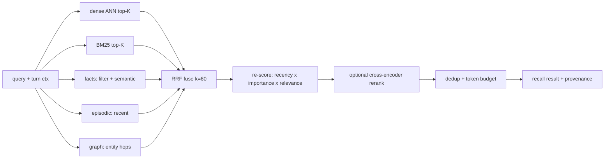

# 22. Memory — self-built multi-mechanism recall + "dreaming"

We do **not** integrate a memory service. `tm-memory` is **our own engine** that composes several
proven recall mechanisms over a self-hosted, single-user, replayable **Postgres** store. The current deployment's
`honcho.json` (§29) is kept only as the **behavioral target** — the knobs Brian already tuned
(hybrid recall, ToM, async write, a ~1600-token context budget, write-approval) — now realized
natively, not by calling out. Brian's metaphor stays literal: the system **dreams** — idles,
consolidates, wakes knowing him better — but the dream is **ours to build** (§22.5).

## 22.0 Design stance

- **Self-implemented, self-hosted, no external SaaS memory dependency.** One Postgres + `pgvector` spine
  (§22.6); every write replayable (principle #6).
- **Synthesis, not invention** — we adopt the best-tested pieces and fuse them (provenance §22.12):
  - **MemGPT / Letta** — OS-style tiered working memory (core / recall / archival) + FIFO recursive
    summary + self-editing blocks + paging.
  - **Generative Agents** — a memory *stream* scored by **recency · importance · relevance**, plus
    **reflection** (periodic higher-level insights).
  - **Hybrid retrieval** — dense (vector ANN) ⊕ sparse (BM25) fused by **Reciprocal Rank Fusion**,
    optional cross-encoder rerank.
  - **Mem0** — LLM **fact-extraction ETL on write** into a read-optimized profile store.
  - **Zep / Graphiti** — **bi-temporal** entity-relation graph that clarifies **event relationships** (§22.2).

## 22.1 Two timescales, two managers

| Tier | Horizon | What | Lives |
|---|---|---|---|
| **Working memory** (short-term) | this session | live transcript; rolling window; recursive summary; editable **core blocks** (state + pinned profile facts); scratchpad (open loops/entities) | in / near context |
| **Long-term memory** | across sessions | the **stores** below — episodic, semantic, lexical, facts/profile, graph, summaries, skills | Postgres + `pgvector`, mostly out of context |

Working memory is MemGPT-style: when the window overflows, oldest turns are **paged out** into the
episodic store and folded into a **recursive summary**; core blocks are small, always-in-context, and
**self-editable** by Miku (`memory.edit`) and the persona layer (§21).

## 22.2 The long-term stores

| Store | Holds | Recall mechanism | Source pattern |
|---|---|---|---|
| **Episodic** | every message/event, timestamped, per-session | recency + lexical + semantic | MemGPT recall memory |
| **Semantic** | embedded chunks (messages, notes, docs) | dense ANN (cosine) | vector RAG |
| **Lexical** | same text, tokenized | **BM25 / Postgres FTS** (exact terms, identifiers) | sparse RAG |
| **Facts / profile** (the user model) | LLM-extracted assertions about Brian: `(subject, predicate, object, confidence, provenance, valid_from/to)` | structured filter ⊕ semantic; deduped, contradiction-resolved (mark obsolete, don't delete) | **Mem0** ETL; **Zep** bi-temporal |
| **Entity graph** | entities + labeled relations, bi-temporal — clarifies **event / causal links** | graph traversal (recursive CTE) ⊕ vector/BM25 on names | **Zep / Graphiti** pattern on Postgres |
| **Summaries** | rolling session / daily / weekly / topic rollups | direct + semantic | hierarchical summarization |
| **Skills** | procedural playbooks (§26) | name + semantic | OMP consolidation |

The **facts/profile store replaces Honcho's representation + dialectic + peer card** — same job
(*"who is Brian, what does he want"*), built by our extraction + reflection passes (§22.5).

## 22.3 Unified recall — the integration

`memory.search(query)` composes the stores instead of trusting any one:

1. **Candidate generation (parallel)** — dense, sparse, fact-store, episodic-recent, and **graph-hop**
   (1–2 hop neighbors of entities named in the turn) each return their top-K.
2. **Fusion — RRF** (`score(d) = Σ 1/(k + rank_i(d))`, `k≈60`): rank-based, needs no score
   normalization, and **degrades gracefully** if a store is down or empty (Cormack et al.). When the
   active project is in a memory pool (§30.7), candidate generation also fans out across active
   pool-member scopes, tagged by source scope and down-weighted relative to the project's own scope —
   read-only; write authority and exact reads are unaffected.
3. **Memory-stream re-score** (Generative Agents): blend the fused rank with **importance**
   (LLM poignancy stored at write) and **recency** (exponential decay, factor ~0.995) — so a companion
   surfaces what *matters*, not just what's lexically near. Weights are config (§22.7); default leans
   relevance > importance > recency.
4. **Rerank (optional, later)** — cross-encoder over the fused top-N for precision; off by default
   (cost).
5. **Budget** — dedup, trim to the caller's token cap, attach provenance (`memory://` ids) so Miku can
   cite and so it stays heuristic (prefer live signal on conflict).

## 22.4 Model-controlled long-term context

The active transcript and bounded prior messages remain the automatic working context. Long-term
memory is **not** queried or injected on every turn. General mode receives the exact
`memory.search` capability, and the model decides whether the current request needs cross-session
preferences, commitments, decisions, project continuity, summaries, or other durable evidence.

When called, `memory.search(query)` runs the bounded unified retrieval path in §22.3 under the
server-authoritative owner and active memory scope. Its result includes provenance and budget
metadata as ordinary `execute` output; the model can use it for the current answer or ignore it.
The first result for a durable turn is persisted as `memory_recall` at
`memory://recalls/<turn-id>`, and retries reuse that exact result instead of querying again. If the
model does not call `memory.search`, the provider is not invoked and no recall trace is created.
Serious Engineer receives no `memory.search` grant; it uses explicit repository, linked-folder, and
Drive resources instead of silently importing companion memory into engineering work.

Drive documents follow the same rule: project Drive entries may be indexed into scoped memory
chunks after a turn, but their summaries are never appended to the user prompt automatically.
The model pulls them through `memory.search` or uses `drive.search` / `drive://` directly.

## 22.5 Write path + "dreaming"

- **Turn-time (sync-light):** append to episodic + enqueue; the turn **never blocks** on memory
  (`writeFrequency: async`). On failure, buffer locally and replay.
- **Background "dreaming"** (the consolidation engine — fully ours, on idle / session-end / scheduler
  §27 / `memory.reflect()`):
  1. **Embed** new chunks (§22.6).
  2. **Extract facts + relations** (Mem0 ETL): LLM distills durable assertions → upsert into the profile
     store; entities + labeled relations → upsert into the **graph** — both with **dedup + contradiction
     resolution** (supersede with `valid_to`, keep history — Zep bi-temporal).
  3. **Score importance** (Generative Agents poignancy) on new memories.
  4. **Reflect**: when cumulative importance of recent memories crosses a threshold, synthesize
     higher-level insights (with evidence links) and store them as derived memories.
  5. **Summarize** hierarchically (session → daily → weekly; feeds `weekly-ship-ledger`, §27.2).
  6. **OMP consolidation** → `MEMORY.md` + compact summary + `skills/` (§26).
  7. **Redact** secret/token patterns **before any disk write**.

There is no external deriver/dreamer to depend on or fall behind: steps 2–6 *are* the dream.

`tm-memory` owns the dream queue, summary, skill-proposal, evidence, and redaction data contracts.
`tm-server` persists a `dream_queue` row when `POST /sessions/:id/end` ends a session. Session status,
`session_end`, deterministic dream enqueue, and `dream_queued` commit in one transaction or not at
all; the transaction reads `owner_subject`, `project_id`, and `memory_policy` from the locked session
row and derives the memory scope rather than trusting request data. It exposes a server-owned
`ServerDreamWorker` plus `DreamWorkerDaemon` runner.
The worker is deterministic and external-service-free: it leases ready dreams by exact `lease_owner`
plus incrementing `lease_epoch`,
heartbeats and completes/fails only under that fence, and terminalizes exhausted work after three
attempts. Defaults are a 60-second lease, 15-second heartbeat, and 120-second execution timeout.
`worker` and `all` runtime roles supervise the daemon and drain it on shutdown. It emits `dream_started` / `dream_progress` /
`dream_completed` or `dream_failed`, records timeout failures back to the queue for bounded retry or
terminal failure, collects session messages/events through `DreamInputBudget` chunks, redacts obvious
secrets/credentials/PII before derived writes, writes a session summary with evidence links and input
budget metadata, and enqueues approval-backed writes into the durable idempotent effect outbox. Dream
completion happens only after downstream effects are durably enqueued. It reuses the existing
approval/default-deny memory proposal path for durable facts/chunks with deterministic
`importanceScore` metadata in provenance. Skill proposals are not inferred directly from transcript
phrasing: only active procedural policies whose estimated gain exceeds the configured threshold and
whose distinct positive support reaches `n_min` may crystallize. Each candidate retains bounded
positive trace references, applicability boundaries, decision procedure, verification rules,
estimated gain, and source-policy/support metadata, then uses the same approval/default-deny path.
The `dream_progress` `input_collected` payload reports total/included messages,
omitted/truncated messages, chunk count, redaction count, and input chars so clients can inspect
bounded dream context without raw transcript dumps. The daemon loops by poll interval, honors
configured concurrency, and exits on shutdown without leaving completed work locked.
The same deterministic worker captures one evolution episode per committed terminal turn, normalizes
bounded cell/effect/terminal traces, assigns explicit or runtime terminal reward, and performs
reflection-weighted value backfilling. Repeated positive evidence in distinct episodes induces
scope-bound procedural policies; counter-evidence recomputes their gain and can archive them.
At turn composition, trigger-matched managed skills are ranked by Beta-smoothed observed reliability,
versions below the archive threshold after the minimum trial count are suppressed, and only the
configured top-K enter the prompt. Selection persists the exact name/digest and one exposure; later
episode valuation records at most one pass/fail outcome for that durable turn. For a
`project:<id>` scope with at least two active policies, the worker maintains one versioned declarative
environment cognition containing capability families, recurring failure families, and the active
policy triggers. Persistence failures enqueue successor dreams with unique dedupe identities, so a
transient failure does not strand the derived cognition.
When extracted candidates cross the configured cumulative importance threshold, the worker writes a
derived `reflection` summary that cites source evidence instead of storing a raw assertion. Each dream
also updates an idempotent `topic_project` rollup for the scope by folding recent session/reflection
summaries, keeping older context recallable without loading full logs.
`StoreMemoryProvider` includes recent scoped `memory_summaries` alongside profile facts and scoped
recall chunks in the bounded session-start memory prompt, so later sessions can see open loops and
next actions without loading raw transcripts. Scoped recall uses exact/substring lexical matching,
then orders by deterministic importance and recency; empty optional recall stores return an empty
context instead of failing. Approved profile facts dedupe by normalized assertion, and a new active
fact with the same `(subject, predicate)` but a different object supersedes the older active fact by
setting `valid_to`; exact `memory://profile/.../facts/<id>` resources remain resolvable for history.
Graph extraction and general LLM-backed extraction remain demand-triggered. When Postgres is enabled,
scoped lexical recall uses a `simple` `tsvector`/`plainto_tsquery` path with substring fallback; the
in-memory store keeps deterministic substring matching for normal tests.

A frozen, versioned nine-case global/project recall manifest supplies tune and held-out cohorts. The
shared evaluator reports nDCG@5, Recall@5, unsafe precision failures, authority/scope leaks, prompt
tokens, candidate counts, and p50/p95 latency through the same `Store` queries and `MemoryContext`
budgeter used by turns. A gated PostgreSQL 16 test creates an isolated clean schema, applies the
ordered migrations, seeds the fixture, and must reproduce the checked-in deterministic
lexical/profile report; latency is remeasured and checked per case against the frozen ceiling. The
control also defines schema-versioned episodic and semantic record/resource shapes with explicit
server-owned `owner_subject`/`memory_scope`, session event/message or resource evidence, confidence
and importance, observed/effective time, status, and bidirectional correction/supersession links.
Embedding provenance pins provider, model id, dimensions, normalization, content hash, derived
embedding version, created time, state, and a deterministic re-embedding key. Both legacy stores
compile through explicit record adapters. The frozen control itself adds no tables, vectors, ranking
changes, or production embedding calls. Metrics, acceptance thresholds, known baseline failures, and
the replay command live in the
[`recall baseline evidence`](../../evidence/2026-07-15-p8-1-recall-baseline.md).

Ordered migration 0014 persists the versioned episodic/semantic records in `memory_records`,
normalizes evidence and correction/supersession relations, and stores embedding provenance plus
deduplicated jobs before vector work begins. `profile_facts`, `recall_chunks`, and
`memory_summaries` mirror through the same migration-triggered path while their legacy tables and
lexical query remain unchanged. New records use a SHA-256 logical content key independent of a
generated UUID and a state-bearing version key (excluding immutable creation time);
scope/owner-filtered reads apply only active/effective corrections before any later ranking. Project
scope revocation creates a durable tombstone, immediately denies future scoped reads/writes, and
cancels queued/running embedding jobs. The revocation trigger is rooted by §30: project archive
revokes; unlinking a folder only revokes that filesystem grant and leaves project memory intact.
Startup/readiness checks report schema corruption separately from
disabled/missing/unsupported pgvector and temporarily unavailable embeddings; a corrupt durable
schema fails closed. This durable-spine layer does not itself install the vector extension/index,
provider, hybrid ranker, or turn integration. Migration/restart/rollback and frozen-control evidence
lives in [`durable memory evidence`](../../evidence/2026-07-15-p8-2-durable-memory-spine.md).

Ordered migration 0015 records each scoped embedding generation and its atomic active-version
pointer. It never installs `pgvector` implicitly: when the operator has provisioned the extension,
staging a pinned local model creates a safe, version-derived `vector(N)` table and HNSW cosine index.
The generation snapshots active corrected records, enqueues deduplicated provenance jobs, and only
changes the pointer after every snapshot job is complete; a provider error returns its lease to the
queue, while a stale content hash fails that generation and leaves the prior pointer untouched. The
local HTTP client accepts only a loopback, unauthenticated OpenAI-shaped endpoint;
`openai_compatible` remains a contract-only option until that provider itself is routed through the
egress/secret boundary. Postgres FTS and the active dense table independently supply bounded
candidates, then `tm-memory` fuses them with deterministic RRF while retaining rank/score components,
evidence, subject, scope, and embedding version. Correction/supersession, non-active status,
tombstones, cross-scope results, stale vector content keys, and invalid dense dimensions are withheld
before later context budgeting. Disabled/missing/provider-loss/partial/stale/model-or-dimension
mismatch cases retain lexical-only candidates. This storage/ranking layer does not itself alter turn
assembly or `memory://`; the integration below owns that surface. Gates and limitations are recorded
in [`local-embedding evidence`](../../evidence/2026-07-15-p8-3-local-embeddings-hybrid.md).

`StoreMemoryProvider` embeds the turn query through the configured loopback client, retrieves the
active scoped hybrid generation, and passes the bounded fused candidates through the existing
`MemoryContext` prompt budgeter. The five-item prompt allocation reserves two profile facts, two
ranked recalls, and one recent summary, then refills unused slots in that order without exceeding the
existing 1,600-token limit. Every hybrid or typed lexical-fallback context is persisted as a
turn-linked `memory_recall` event before model execution; a durable retry reuses that exact event
rather than re-querying mutable memory. Exact records and recalls are inspectable through
authority-filtered `memory://records/<kind>/<id>` and `memory://recalls/<turn-id>` resources,
including evidence, correction state, component ranks/scores, embedding version, degraded reason,
and budget decisions. Approved proposals also upsert idempotent typed episodic/semantic records;
denial, timeout, unsupported inference, correction, supersession, or unlink cannot enter active
recall. The supervised worker incrementally embeds new active records, reclaims expired leases, and
advances an active generation only after complete current coverage. Frozen overall and held-out
quality, zero unsafe inclusions, provider loss/restart, resumable re-embedding, server restart,
strict Postgres/client gates, and the self-hosted lumo deployment are verified in the
[`fuller-memory evidence`](../../evidence/2026-07-15-p8-5-fuller-memory.md).
**Authority/lifecycle hardening:** ordered migrations 0017–0018 serialize project scope revocation
with every typed-memory, embedding-provenance, generation, pointer, and job write. Under §30 the
serialized revocation event is project archive rather than folder unlink.
Approved legacy plus typed memory effects now commit in one transaction and preserve every
contradictory predecessor. Exact resource replay and list/read paths consult the same durable scope
authority as live recall. Each embedding generation pins a monotonic generation order, scope
snapshot revision, model version, dimensions, and input limit; unchanged staging is a no-op, dirty
snapshots degrade lexically until complete, and older workers cannot replace a newer active pointer.
Dense queries pin that identity end to end and apply owner/scope/status/correction authority in a
materialized relation before exact cosine ordering. Oversized inputs fail independently from valid
batch peers and may be retried only after the configured input limit increases. The HNSW index remains
provisioned for a future authority-safe ANN plan, but it is not the authoritative scoped query path.

Drive documents add a second bounded recall source at turn construction: when `tm-server` has a
configured drive store, project-scoped turns search filed drive entries for that project and inject
at most three summary/snippet lines with `drive://` URI, selector, and content hash. Raw document
bodies remain behind `resources.read("drive://...", selector)` paging. After a turn, the server also
upserts project-scoped recall chunks for matching filed drive documents with `drive://` URI, content
hash, extractor version, bounded attribute lines, and source session/event fields when supplied,
using the existing recall store rather than a drive-owned memory table. Drive-derived recall records
are keyed by project scope plus content hash, so moving or tagging a document updates the persisted recall text
without losing source session/event provenance. Automatic source-event ids for drive host calls remain
follow-up hardening.

## 22.6 Storage substrate & embeddings (decisions)

- **Spine: PostgreSQL + `pgvector`** (self-hosted on `lumo`) — `pgvector` storage with an HNSW index
  provisioned for a future authority-safe ANN plan; the active scoped path materializes authorized
  rows and performs exact cosine ordering. Postgres FTS (`tsvector` / `tsquery` + GIN) supplies the
  lexical candidates; true BM25 through `pg_search` / ParadeDB remains optional. Facts, episodic
  records, semantic records, and summaries are tables. A future graph uses bi-temporal `nodes` +
  `edges` traversed by recursive CTEs (optionally Apache AGE for openCypher). One DB, replayable;
  scopes are rows, not files.
- **Embeddings:** `embeddings.provider` is `disabled | local | openai_compatible`; every enabled
  provider pins dimensions, model, normalization, and content provenance, and a provider/dimension
  change creates a new generation. The production self-hosted path uses a loopback-only local
  provider. `openai_compatible` remains reserved until that provider is routed through the
  egress/secret boundary; it is never a production requirement. Missing or unavailable embeddings
  degrade to lexical recall.
- **Hybrid and typed memory:** scoped episodic/semantic records retain evidence, confidence,
  correction/supersession history, and deterministic FTS+dense RRF traces. LLM-backed extraction
  produces candidates only and cannot silently promote unsupported inference into owner facts.
  Evidence-backed automatic persona proposals consume only bounded active records and never approve
  or activate their own guidance.
- **Session memory policy:** `owner_subject`, optional `project_id`, and `memory_policy` are
  server-owned session state selected by the user-facing session contract. `memory_policy` is
  `global | project`; `project` requires `project_id` and derives the durable
  `project:<project_id>` scope, while `global` remains global even when a project is selected.
  Project selection independently gates project-relative Drive/host resources (§24, §30), and mode
  changes alter neither field. Exact read/list/recall operations compare subject and derived scope
  to the authorized invocation context and return not-found on mismatch. Project archive revokes
  active project use and tombstones its memory scope; folder unlink does neither (§24.4).

### 22.6.1 Durable schema

The server uses a **Postgres-shaped store** rather than SQLite or file replay logs. `tm-server`
persists it in Postgres when `TM_DATABASE_URL` is configured; normal local development and
`cargo test` may use the in-memory implementation so the baseline suite stays
external-service-free. Ordered migrations expand this schema while preserving project continuity:

- `sessions(id, owner_subject, project_id?, memory_policy, created_at, updated_at, status, mode,
  persona_status)` — `memory_scope` is derived as `global` or `project:<project_id>`, never stored on
  the session row
- `session_turns(id, session_id, client_message_id, content_hash, status, worker_id, error,
  created_at, started_at, completed_at)` — idempotent durable message work (§27)
- `session_events(session_id, seq, turn_id?, event_type, payload_json, created_at)` — SSE replay source (§27)
- `messages(session_id, seq, turn_id?, role, content, created_at)`
- `profile_facts(id, subject, predicate, object, confidence, importance, provenance, valid_from,
  valid_to)`
- `recall_chunks(id, scope, text, source, importance, created_at, embedding?)` — project summaries,
  decisions, open loops, and profile/user recall
- `dream_queue(id, session_id, subject, scope, reason, status, dedupe_key, source_event_seq,
  attempts, lease_owner, lease_epoch, heartbeat_at, enqueued_at, available_at, completed_at,
  error_at, last_error)` — session-end/manual/scheduled dream requests with fenced lifecycle,
  stale-owner rejection, bounded retry/backoff, and idempotent `dedupe_key`
- `memory_summaries(id, kind, subject, scope, title, body, evidence_json, source_dream_id,
  source_session_id, dedupe_key, created_at, updated_at)` — session, reflection, daily, weekly, and
  topic-project rollups
- `skill_proposals(id, name, description, body, trigger, use_criteria, evidence_json,
  self_critique, verification_json, status, dedupe_key, source_dream_id, source_session_id,
  created_at, updated_at)` — reviewable skill proposals; accepted/rejected status does not mutate the
  live skill catalog
- `cron_jobs` / `cron_runs` (§27.2) — scheduler job definitions, bounds, and run history for
  proactive sessions
- `approval_requests` / `approval_effects` — durable compare-and-swap decisions plus an idempotent
  outbox for resumable memory/skill/drive effects (§27.6)

Profile facts and scoped recall chunks preserve what changed, why it changed, and what remains open
between coding sessions and assigned projects (§30). Deterministic post-session summaries, proposal
generation, summary-aware session-start recall, reflection summaries, recursive topic/project
rollups, typed episodic/semantic records, and hybrid RRF retrieval share the same authority and prompt
budgeter. Graph extraction and general LLM-backed extraction/reranking remain demand-triggered.

## 22.7 honcho.json behavior → `tm-memory` config

The current knobs become our config (now we own every one — none is an external call):

| Knob (honcho.json) | Realized as |
|---|---|
| `recallMode: hybrid` | the §22.3 fusion (dense ⊕ sparse ⊕ facts ⊕ graph, RRF) |
| `contextTokens: 1600` | working-context budget (§22.4) |
| `dialecticCadence: 3` / `dialecticMaxChars: 800` | ToM-synthesis cadence + cap (§22.4) |
| `dialecticReasoningLevel` / `reasoningLevelCap` | target model-role + effort for the ToM pass (§27.3); the current pass uses the configured interactive client until generic role resolution lands |
| `writeFrequency: async` | enqueue + background dreaming (§22.5) |
| `sessionStrategy: per-session` | one episodic session-scope per chat |
| `observationMode` / `pinUserPeer` | single-user: Brian is the only modeled peer; pin = always-in core block |
| `user_profile` / `write_approval` | facts store on; durable writes approval-gated (§22.8) |
| *(new)* `dream.redaction.enabled` | fail-closed redaction policy; disabled redaction fails the dream before derived writes |
| *(new)* `dream.input_budget.{max_chunks,max_chunk_chars,max_message_chars}` | prompt budgeter for dream extraction input |
| *(new)* `dream.summary_cadence.{session_every_dream,rollup_every_dream}` | deterministic session-summary and recursive-rollup cadence |
| *(new)* `dream.retry_backoff`, `dream.max_attempts`, `dream.reflect_importance_threshold` | worker retry/terminal failure and reflection threshold |
| *(new)* `rrf_k`, `weights{recency,importance,relevance}`, `topK` | fusion + stream tuning |
| *(new)* `embeddings.provider: api\|local`, `graph.max_hops` | embedding backend toggle; graph-hop depth (§22.6, §22.3) |

## 22.8 Memory discipline & write-approval (SOUL.md + `personal-assistant-state-capture`)

- **Capture:** stable preferences; personal reminders; active projects / open loops; commitments +
  deadlines; decisions; recurring blind spots; shipped artifacts; reusable workflows.
- **Don't:** passing moods; one-off complaints; secrets; raw logs; large notes; sensitive PII unless
  asked; project-specific commands (→ `AGENTS.md`, not user memory).
- **Negative-state prompts:** overwhelmed / exhausted / self-deprecating / spiraling / stuck language
  is treated as a grounding posture (§21), not a durable memory signal. Do not propose a memory write
  from that prompt unless Brian explicitly asks to remember a stable preference, strategy, or boundary.
- **Approval-gated** (write-approval on): Miku proposes a one-line memory/fact and asks, unless standing
  permission exists. Episodic append stays unblocked; durable **assertions** (facts/notes/skills) are
  what get gated. Redaction always runs before disk.
- **State capture:** when the `personal-assistant-state-capture` skill is active (declared by General
  mode, §21.2), the server runs its vendored rules as conservative proposal logic. It extracts
  one-line profile facts or scoped recall chunks for stable preferences, personal reminders, active
  projects/open loops, commitments/deadlines, decisions, shipped artifacts, reusable workflows, and
  recurring blind spots. It emits only `write_proposal` + shared `approval` events, never direct
  durable writes. Transient moods, secrets, raw logs, large notes, obvious sensitive PII, one-off
  complaints, and project-specific commands are skipped before proposal creation.
- **Turn integration:** every General turn exposes bounded `memory.search` through the one
  `execute(code)` model tool. Profile facts, summaries, scoped recall chunks, and hybrid candidates
  remain out of context unless the model calls it; the returned context carries provenance labels and budget
  metadata. Durable profile facts and scoped recall chunks are created through `write_proposal`
  events plus the shared `approval` / `approval_resolved` path; approve writes idempotently by
  normalized content, while deny/timeout writes nothing and remains replayable in `session_events`.
  Contradictory approved profile facts close the previous active fact with `valid_to` rather than
  deleting it. Approved writes emit previewable `memory://profile/<subject>/facts/<id>` and
  `memory://scopes/<scope>/chunks/<id>` record URIs.

## 22.9 Target `memory.*` capability + implemented `memory://` resources

| Call | Effect |
|---|---|
| `memory.search(query)` | model-controlled unified hybrid + stream recall; first durable-turn result is replayed exactly (§22.3–§22.4) |
| `memory.ask(query)` | Reserved pull surface; not registered. |
| `memory.note(text, tags?)` | durable operational note (approval-gated) |
| `memory.fact(assertion)` | upsert a profile assertion (approval-gated, dedup/contradiction) |
| `memory.edit(block, op)` | self-edit a core block (MemGPT-style) |
| `memory.reflect()` | enqueue a dream (extract → reflect → summarize → skills) |
| `memory.card()` | current profile snapshot (top facts) |

`memory://` URLs are resolved via the §9.2 registry and the session resource gateway. The surface is
deliberately bounded and fail-closed: `memory://root` returns the current injected memory summary for
Brian and the active session scope; `memory://user-model` returns the active profile/facts view;
approved write proposals expose exact records at `memory://profile/<subject>/facts/<id>` and
`memory://scopes/<scope>/chunks/<id>`. Dream outputs add `memory://dreams` queue status, exact
`memory://dreams/<id>` records, `memory://summaries/<id>`, and
`memory://skill-proposals/<id>` previews. Evolution uses bounded `memory://evolution-audits`,
`memory://evolution-proposals/<id>`, and typed review-only `memory://review-proposals/<id>` resources
without giving dreaming a persona/mode write path. Typed memory adds bounded `memory://records` and
`memory://recalls` lists, exact records at `memory://records/<episodic|semantic>/<id>`, and the exact
persisted turn context at `memory://recalls/<turn-id>`. Exact and preview reads preserve server-owned
subject/scope authority; record previews omit full content and evidence bodies while exact reads
expose bounded provenance and ranking traces. The server grants these reads through
`resources.read:memory`; unknown paths or missing grants are denied. The SDK types these as resource
URIs; the global `memory` namespace remains `undefined` until an explicit `memory.*` API ships.
Query-shaped ambient resources such as `…/MEMORY.md`, `…/episodic?q=…`, and
`…/projects/<name>/…` remain outside the product surface. Approved managed skills are composed on the
next load and readable through capability-gated `skill://` active/version resources; the
model-visible `skills.*` import/write namespace remains closed (§9.3 / §26.4).

## 22.10 Crate layout (`tm-memory`, §28)

- `tm-memory` owns dream queue types, profile/recall and typed record shapes,
  summary/proposal/evidence records, recall evaluation, embedding provenance and generation
  contracts, deterministic hybrid RRF, `DreamInputBudget` chunking, redaction, and logical store
  traits. `tm-server` owns the concrete durable stores and supervised dream/embedding runners.
- `store` — Postgres + future `pgvector` spine: `episodic`, `vector`, `lexical` (Postgres FTS),
  `facts`, `summaries`, `graph` (`nodes` / `edges`); ordered migrations; server-owned
  `owner_subject`/`memory_scope` isolation.
- `recall` — candidate generation, RRF fusion, memory-stream re-score, budgeter, rerank?
- `working` — window, recursive summary, core blocks, paging.
- `dream` — embed, extract (facts + relations), importance, reflect, summarize, OMP consolidation, redaction; lease +
  heartbeat to avoid double-runs.
- `embed` — embeddings role client + local fallback.
- `resources` — registers the implemented `memory://` handler into the §9.2 resolver registry;
  `tm-modes` owns the separate managed `skill://` handler and grant.

Dreaming/extraction use cheaper model roles (§27.3).

## 22.11 Failure modes & degradation

- **A logical store empty/unavailable** (graph not yet populated, embeddings missing) — RRF still fuses the rest; recall degrades, never errors.
- **Embeddings provider down** — switch to the `local` embedder, or BM25-only recall + cached profile.
- **Postgres unreachable** — durable server roles fail readiness and stop claiming work; they do not
  silently downgrade authority or effects into process-local state. The explicit no-database
  loopback development mode remains non-durable.
- **Dream worker misconfig/failure** — missing model-role config, disabled redaction, timeout, or
  store failure produces a replayable `dream_failed`/`last_error` path before partial unapproved writes.
- **Stale facts** — memory is heuristic; prefer live repo/user signal on conflict; bi-temporal history
  lets a superseded fact be re-surfaced if needed.
- **Idempotency** — content-hash dedup on episodic + chunk writes; reflection/extraction are re-runnable.
- **No external SaaS** — memory lives in self-hosted Postgres we already control; dropping the external
  Honcho service removes a whole network failure + latency surface (a deliberate gain).

## 22.12 Mechanism provenance

| We adopt | From | For |
|---|---|---|
| tiered working memory, recursive summary, self-edit, paging | **MemGPT / Letta** | short-term context management |
| memory-stream scoring (recency·importance·relevance), reflection | **Generative Agents** | companion-grade ranking + insight |
| dense ⊕ sparse, **RRF** fusion, optional rerank | **hybrid RAG** (Cormack RRF) | robust recall |
| LLM fact-extraction ETL, read-optimized profile | **Mem0** | the user model |
| bi-temporal entities/relations, supersede-not-delete | **Zep / Graphiti** | temporal facts + event-relationship graph |
| two-phase extract→consolidate, `MEMORY.md`/summary/skills, redaction | **Oh My Pi** | operational/procedural memory |

---

**Sources** (verified 2026-06-26): Generative Agents (arXiv 2304.03442 — memory stream, retrieval
score, reflection; LangChain `TimeWeightedVectorStoreRetriever`); MemGPT (arXiv 2310.08560) + Letta
context-hierarchy docs; Reciprocal Rank Fusion (Cormack et al. 2009; `score=Σ1/(k+rank)`, k≈60) and
hybrid BM25+dense+rerank practice; Mem0 (arXiv 2504.19413) extraction/update; Zep/Graphiti (arXiv
2501.13956) bi-temporal KG (`getzep/graphiti`, embeddable); Oh My Pi memory pipeline (`omp://memory.md`).
`honcho.json` is the behavioral target only — **not** a runtime dependency.
