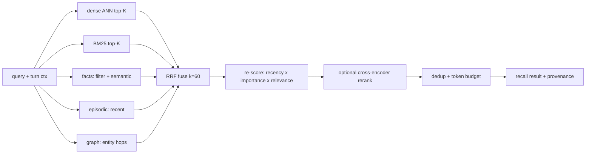

# 22. Memory — self-built multi-mechanism recall + "dreaming"

We do **not** integrate a memory service. `tm-memory` is **our own engine** that composes several
proven recall mechanisms over a self-hosted, single-user, replayable **Postgres** store. The current deployment's
`honcho.json` (§29) is kept only as the **behavioral target** — the knobs Brian already tuned
(hybrid recall, ToM, async write, a ~1600-token context budget, write-approval) — now realized
natively, not by calling out. Brian's metaphor stays literal: the system **dreams** — idles,
consolidates, wakes knowing him better — but the dream is **ours to build** (§22.5).

## 22.0 Design stance

- **Self-implemented, self-hosted, no external SaaS memory dependency.** One Postgres + `pgvector` spine
  (§22.6); every write replayable (principle #6).
- **Synthesis, not invention** — we adopt the best-tested pieces and fuse them (provenance §22.12):
  - **MemGPT / Letta** — OS-style tiered working memory (core / recall / archival) + FIFO recursive
    summary + self-editing blocks + paging.
  - **Generative Agents** — a memory *stream* scored by **recency · importance · relevance**, plus
    **reflection** (periodic higher-level insights).
  - **Hybrid retrieval** — dense (vector ANN) ⊕ sparse (BM25) fused by **Reciprocal Rank Fusion**,
    optional cross-encoder rerank.
  - **Mem0** — LLM **fact-extraction ETL on write** into a read-optimized profile store.
  - **Zep / Graphiti** — **bi-temporal** entity-relation graph that clarifies **event relationships** (§22.2).

## 22.1 Two timescales, two managers

| Tier | Horizon | What | Lives |
|---|---|---|---|
| **Working memory** (short-term) | this session | live transcript; rolling window; recursive summary; editable **core blocks** (state + pinned profile facts); scratchpad (open loops/entities) | in / near context |
| **Long-term memory** | across sessions | the **stores** below — episodic, semantic, lexical, facts/profile, graph, summaries, skills | Postgres + `pgvector`, mostly out of context |

Working memory is MemGPT-style: when the window overflows, oldest turns are **paged out** into the
episodic store and folded into a **recursive summary**; core blocks are small, always-in-context, and
**self-editable** by Miku (`memory.edit`) and the persona layer (§21).

## 22.2 The long-term stores

| Store | Holds | Recall mechanism | Source pattern |
|---|---|---|---|
| **Episodic** | every message/event, timestamped, per-session | recency + lexical + semantic | MemGPT recall memory |
| **Semantic** | embedded chunks (messages, notes, docs) | dense ANN (cosine) | vector RAG |
| **Lexical** | same text, tokenized | **BM25 / Postgres FTS** (exact terms, identifiers) | sparse RAG |
| **Facts / profile** (the user model) | LLM-extracted assertions about Brian: `(subject, predicate, object, confidence, provenance, valid_from/to)` | structured filter ⊕ semantic; deduped, contradiction-resolved (mark obsolete, don't delete) | **Mem0** ETL; **Zep** bi-temporal |
| **Entity graph** | entities + labeled relations, bi-temporal — clarifies **event / causal links** | graph traversal (recursive CTE) ⊕ vector/BM25 on names | **Zep / Graphiti** pattern on Postgres |
| **Summaries** | rolling session / daily / weekly / topic rollups | direct + semantic | hierarchical summarization |
| **Skills** | procedural playbooks (§26) | name + semantic | OMP consolidation |

The **facts/profile store replaces Honcho's representation + dialectic + peer card** — same job
(*"who is Brian, what does he want"*), built by our extraction + reflection passes (§22.5).

## 22.3 Unified recall — the integration

`memory.recall(query, ctx)` composes the stores instead of trusting any one:

1. **Candidate generation (parallel)** — dense, sparse, fact-store, episodic-recent, and **graph-hop**
   (1–2 hop neighbors of entities named in the turn) each return their top-K.
2. **Fusion — RRF** (`score(d) = Σ 1/(k + rank_i(d))`, `k≈60`): rank-based, needs no score
   normalization, and **degrades gracefully** if a store is down or empty (Cormack et al.).
3. **Memory-stream re-score** (Generative Agents): blend the fused rank with **importance**
   (LLM poignancy stored at write) and **recency** (exponential decay, factor ~0.995) — so a companion
   surfaces what *matters*, not just what's lexically near. Weights are config (§22.7); default leans
   relevance > importance > recency.
4. **Rerank (optional, later)** — cross-encoder over the fused top-N for precision; off by default
   (cost).
5. **Budget** — dedup, trim to the caller's token cap, attach provenance (`memory://` ids) so Miku can
   cite and so it stays heuristic (prefer live signal on conflict).

## 22.4 Auto-context — the always-on budgets (principle #3)

Each turn, only a small block is auto-injected; everything else is pull-on-demand via `memory.*` /
`memory://`. Three stacked, self-computed budgets reproduce the honcho.json behavior natively:

1. **Working context ≤ ~1600 tok** — rolling window + recursive summary (the `contextTokens` analog).
2. **ToM synthesis ≤ ~800 chars**, every **N=3rd** turn — an LLM pass over recalled profile facts
   answering *"what's relevant about Brian here"* (our self-built **dialectic**; cadence/cap = the
   `dialecticCadence` / `dialecticMaxChars` analogs, gated off in serious/engineer turns).
3. **Operational summary** — compact, at session start (separate cap; the OMP
   `summaryInjectionTokenLimit`, set far below its 5k default).

## 22.5 Write path + "dreaming"

- **Turn-time (sync-light):** append to episodic + enqueue; the turn **never blocks** on memory
  (`writeFrequency: async`). On failure, buffer locally and replay.
- **Background "dreaming"** (the consolidation engine — fully ours, on idle / session-end / scheduler
  §27 / `memory.reflect()`):
  1. **Embed** new chunks (§22.6).
  2. **Extract facts + relations** (Mem0 ETL): LLM distills durable assertions → upsert into the profile
     store; entities + labeled relations → upsert into the **graph** — both with **dedup + contradiction
     resolution** (supersede with `valid_to`, keep history — Zep bi-temporal).
  3. **Score importance** (Generative Agents poignancy) on new memories.
  4. **Reflect**: when cumulative importance of recent memories crosses a threshold, synthesize
     higher-level insights (with evidence links) and store them as derived memories.
  5. **Summarize** hierarchically (session → daily → weekly; feeds `weekly-ship-ledger`, §27.2).
  6. **OMP consolidation** → `MEMORY.md` + compact summary + `skills/` (§26).
  7. **Redact** secret/token patterns **before any disk write**.

There is no external deriver/dreamer to depend on or fall behind: steps 2–6 *are* the dream.

## 22.6 Storage substrate & embeddings (decisions)

- **Spine: PostgreSQL + `pgvector`** (self-hosted on `lumo`) — `pgvector` (HNSW index) for dense ANN;
  **Postgres FTS** (`tsvector` / `tsquery` + GIN) for BM25-style lexical *(true BM25 via the
  `pg_search` / ParadeDB extension if needed)*; facts / episodic / summaries as tables; the **graph** as
  `nodes` + `edges` tables (bi-temporal columns) traversed by recursive CTEs *(optional `Apache AGE` for
  openCypher traversal)*. One DB, replayable; scopes are rows, not files.
- **Embeddings:** an `embeddings` model role with a **config-selected provider** (`embeddings.provider:
  api | local`) — `api` = OpenAI-compatible backend (§27.3); `local` = in-process embedder
  (fastembed / candle). Dimension pinned per scope (switching provider ⇒ re-embed).
- **Scope:** a `scope` column on every row — a **global** scope (Brian) always, plus a
  **per-linked-project** scope when a folder/repo is linked (§24), so repo lore stays isolated.

### 22.6.1 P0/P1 minimum schema

P0/P1 uses a **Postgres-shaped store** for the coding-agent and project-manager dogfood slices instead
of SQLite or file replay logs. `tm-server` can persist this store in Postgres when `TM_DATABASE_URL`
is configured; normal local development and `cargo test` may use the in-memory implementation so the
baseline suite stays external-service-free. The schema is deliberately expandable toward the full §22
engine while preserving project continuity:

- `sessions(id, created_at, updated_at, status, mode, persona_status)`
- `session_events(session_id, seq, event_type, payload_json, created_at)` — SSE replay source (§27)
- `messages(session_id, seq, role, content, created_at)`
- `profile_facts(id, subject, predicate, object, confidence, provenance, valid_from, valid_to)`
- `recall_chunks(id, scope, text, source, created_at, embedding?)` — project summaries, decisions,
  open loops, and profile/user recall

P0/P1 recall is profile facts + scoped recall chunks, enough to remember what changed, why it changed,
and what remains open between coding sessions and promoted projects. Full dreaming, graph, RRF fusion,
and skill generation remain later §22 work.

## 22.7 honcho.json behavior → `tm-memory` config

The current knobs become our config (now we own every one — none is an external call):

| Knob (honcho.json) | Realized as |
|---|---|
| `recallMode: hybrid` | the §22.3 fusion (dense ⊕ sparse ⊕ facts ⊕ graph, RRF) |
| `contextTokens: 1600` | working-context budget (§22.4) |
| `dialecticCadence: 3` / `dialecticMaxChars: 800` | ToM-synthesis cadence + cap (§22.4) |
| `dialecticReasoningLevel` / `reasoningLevelCap` | model-role + effort for the ToM pass (§27.3) |
| `writeFrequency: async` | enqueue + background dreaming (§22.5) |
| `sessionStrategy: per-session` | one episodic session-scope per chat |
| `observationMode` / `pinUserPeer` | single-user: Brian is the only modeled peer; pin = always-in core block |
| `user_profile` / `write_approval` | facts store on; durable writes approval-gated (§22.8) |
| *(new)* `rrf_k`, `weights{recency,importance,relevance}`, `topK`, `reflect_threshold` | fusion + stream tuning |
| *(new)* `embeddings.provider: api\|local`, `graph.max_hops` | embedding backend toggle; graph-hop depth (§22.6, §22.3) |

## 22.8 Memory discipline & write-approval (SOUL.md + `personal-assistant-state-capture`)

- **Capture:** stable preferences; active projects / open loops; commitments + deadlines; decisions;
  recurring blind spots; shipped artifacts; reusable workflows.
- **Don't:** passing moods; one-off complaints; secrets; raw logs; large notes; sensitive PII unless
  asked; project-specific commands (→ `AGENTS.md`, not user memory).
- **Negative-state prompts:** overwhelmed / exhausted / self-deprecating / spiraling / stuck language
  is treated as a grounding posture (§21), not a durable memory signal. Do not propose a memory write
  from that prompt unless Brian explicitly asks to remember a stable preference, strategy, or boundary.
- **Approval-gated** (write-approval on): Miku proposes a one-line memory/fact and asks, unless standing
  permission exists. Episodic append stays unblocked; durable **assertions** (facts/notes/skills) are
  what get gated. Redaction always runs before disk.
- **P2.5 state capture:** when the Personal Assistant skill is active, the server runs the vendored
  `personal-assistant-state-capture` rules as conservative proposal logic. It extracts one-line profile
  facts or scoped recall chunks for stable preferences, active projects/open loops,
  commitments/deadlines, decisions, shipped artifacts, reusable workflows, and recurring blind spots;
  it emits only `write_proposal` + shared `approval` events, never direct durable writes. Transient
  moods, secrets, raw logs, large notes, obvious sensitive PII, one-off complaints, and project-specific
  commands are skipped before proposal creation.
- **P2 server slices:** every turn receives a bounded `MemoryContext` prompt block with profile
  facts, scoped recall chunks, provenance labels, and budget metadata. Durable profile facts and scoped
  recall chunks are created through `write_proposal` events plus the shared `approval` / `approval_resolved`
  path; approve writes idempotently by normalized content, while deny/timeout writes nothing and remains
  replayable in `session_events`. Approved writes emit previewable `memory://profile/<subject>/facts/<id>`
  and `memory://scopes/<scope>/chunks/<id>` record URIs.

## 22.9 `memory.*` capability + `memory://` resources

| Call | Effect |
|---|---|
| `memory.recall(query, opts?)` | unified hybrid + stream recall (§22.3) |
| `memory.ask(query)` | ToM synthesis about Brian (self-built dialectic) |
| `memory.note(text, tags?)` | durable operational note (approval-gated) |
| `memory.fact(assertion)` | upsert a profile assertion (approval-gated, dedup/contradiction) |
| `memory.edit(block, op)` | self-edit a core block (MemGPT-style) |
| `memory.reflect()` | enqueue a dream (extract → reflect → summarize → skills) |
| `memory.card()` | current profile snapshot (top facts) |

`memory://` URLs are resolved via the §9.2 registry and the session resource gateway. The implemented
P2 surface is deliberately small and fail-closed: `memory://root` returns the current injected memory
summary for Brian and the active session scope; `memory://user-model` returns the active profile/facts
view; approved write proposals expose exact record views at `memory://profile/<subject>/facts/<id>` and
`memory://scopes/<scope>/chunks/<id>`. The server grants these reads through `resources.read:memory`,
and unknown memory paths or missing grants are denied. Broader resources such as `…/MEMORY.md`,
`…/episodic?q=…`, and `…/projects/<name>/…` remain later `tm-memory` work. Skills are addressed
first-class as `skill://<name>` (→ `SKILL.md`), promoted out of the `memory://…/skills/` path (§9.3).

## 22.10 Crate layout (`tm-memory`, §28)

- `store` — Postgres + `pgvector` spine: `episodic`, `vector` (pgvector), `lexical` (Postgres FTS),
  `facts`, `summaries`, `graph` (`nodes` / `edges`); migrations; `scope`-column isolation.
- `recall` — candidate generation, RRF fusion, memory-stream re-score, budgeter, rerank?
- `working` — window, recursive summary, core blocks, paging.
- `dream` — embed, extract (facts + relations), importance, reflect, summarize, OMP consolidation, redaction; lease +
  heartbeat to avoid double-runs.
- `embed` — embeddings role client + local fallback.
- `resources` — registers the `memory://` + `skill://` handlers into the §9.2 resolver registry.

Dreaming/extraction use cheaper model roles (§27.3).

## 22.11 Failure modes & degradation

- **A logical store empty/unavailable** (graph not yet populated, embeddings missing) — RRF still fuses the rest; recall degrades, never errors.
- **Embeddings provider down** — switch to the `local` embedder, or BM25-only recall + cached profile.
- **Postgres unreachable** — turn-time writes buffer locally + replay (§22.5); reads degrade to the in-context working set until it returns.
- **Stale facts** — memory is heuristic; prefer live repo/user signal on conflict; bi-temporal history
  lets a superseded fact be re-surfaced if needed.
- **Idempotency** — content-hash dedup on episodic + chunk writes; reflection/extraction are re-runnable.
- **No external SaaS** — memory lives in self-hosted Postgres we already control; dropping the external
  Honcho service removes a whole network failure + latency surface (a deliberate gain).

## 22.12 Mechanism provenance

| We adopt | From | For |
|---|---|---|
| tiered working memory, recursive summary, self-edit, paging | **MemGPT / Letta** | short-term context management |
| memory-stream scoring (recency·importance·relevance), reflection | **Generative Agents** | companion-grade ranking + insight |
| dense ⊕ sparse, **RRF** fusion, optional rerank | **hybrid RAG** (Cormack RRF) | robust recall |
| LLM fact-extraction ETL, read-optimized profile | **Mem0** | the user model |
| bi-temporal entities/relations, supersede-not-delete | **Zep / Graphiti** | temporal facts + event-relationship graph |
| two-phase extract→consolidate, `MEMORY.md`/summary/skills, redaction | **Oh My Pi** | operational/procedural memory |

---

**Sources** (verified 2026-06-26): Generative Agents (arXiv 2304.03442 — memory stream, retrieval
score, reflection; LangChain `TimeWeightedVectorStoreRetriever`); MemGPT (arXiv 2310.08560) + Letta
context-hierarchy docs; Reciprocal Rank Fusion (Cormack et al. 2009; `score=Σ1/(k+rank)`, k≈60) and
hybrid BM25+dense+rerank practice; Mem0 (arXiv 2504.19413) extraction/update; Zep/Graphiti (arXiv
2501.13956) bi-temporal KG (`getzep/graphiti`, embeddable); Oh My Pi memory pipeline (`omp://memory.md`).
`honcho.json` is the behavioral target only — **not** a runtime dependency.
