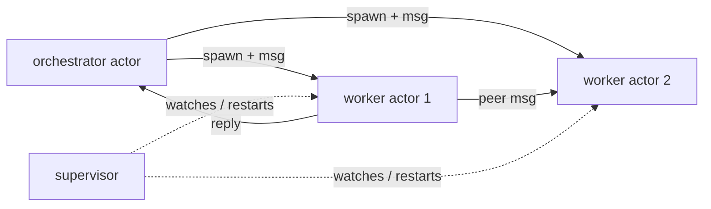
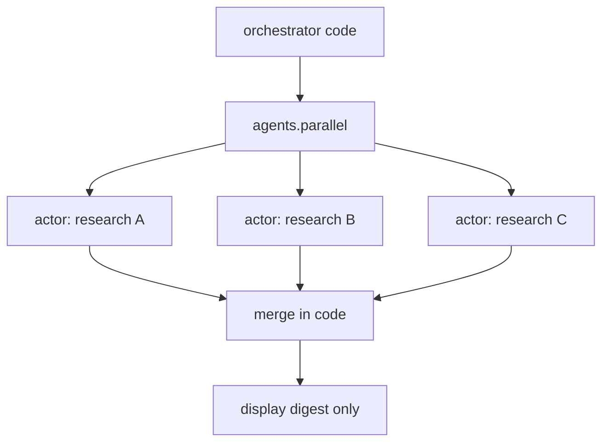

# 23. Sub-agents & orchestration

> Agents are **message-passing actors**. This section takes Alan Kay's original OOP literally:
> *"The big idea is messaging"* — design how the modules **communicate**, not their internals.

Powers the **Handoff** mode (§21, mode 5) and heavier delegation inside **Serious Engineer**.
Design choice (B2): **orchestration is code, not a framework** — and the things the code orchestrates
are **actors** that affect each other only by messages. The bet (§01) already has the model writing code
in a REPL, so spawning, wiring, and messaging sub-agents is just more code against an SDK.

## 23.0 Design stance — an agent is an object in Kay's sense

- **Messaging is the foundation, not a feature.** Alan Kay: *"I'm sorry that I long ago coined the term
  'objects' … The big idea is 'messaging'"* (1998), and *"OOP to me means only messaging, local retention
  and protection and hiding of state-process, and **extreme late-binding** of all things"* (2003). An agent
  is a **cell**: it hides its state-process, keeps its own local state, and affects others **only** by
  sending messages. The old §23.4 framing ("messaging optional, later") is **superseded** — messaging is
  the primitive.
- **Formal grounding — the actor model** (Hewitt, Bishop & Steiger, 1973). On receiving a message an actor
  may do exactly three things: **send** a finite number of messages to addresses it knows, **create** a
  finite number of new actors, and **designate the behavior** for the next message. No shared memory;
  everything is asynchronous; "designate next behavior" *is* private state change.
- **Engineering proof — Erlang/OTP** (Armstrong, 2003). Share-nothing lightweight processes + per-process
  **mailboxes** + **supervision trees** + **"let it crash"** is the most battle-tested realization of the
  actor model. We borrow its fault model wholesale (§23.4).
- **Reconciling with B2.** Three layers, not a contradiction: orchestration **code** *spawns and wires*
  actors (§23.3); **messages** are how live actors *coordinate* (§23.2); **supervision** is how failure is
  *contained* (§23.4). Capabilities stay config, not code (principle #9, §23.6).

## 23.1 The agent as actor — anatomy

Each sub-agent is itself a **runtime session** (recursion through `Sandbox` / loop, §05/§06) with its own
character + mode, budget, and capability grant. Cast as an actor:

| Actor property | TempestMiku realization |
|---|---|
| **Address** | stable agent id (CamelCase, ≤32 chars); `agent://<id>` |
| **Mailbox** | async inbox; a message reaches even idle / parked actors (and wakes them) |
| **Hidden local state** | its **own context window** (§22 working memory) + a granted **memory scope** (§22 store); no shared mutable state |
| **Behavior** | current **mode** (§21) + **role** + capability grant; resolved per message (late binding) |
| **Designate next behavior** | mode switch / scope update between messages (persona self-edit, §21) |
| **Create** | P3 MVP: `agents.spawn` / `agents.run` |
| **Send** | P3 MVP: `agents.msg`; P3-plus: broadcast (§23.2) |

Encapsulation is hard: one actor **never** reaches into another's context or transcript. `history://<id>`
is **read-only** observation, not state access; coordination is by message, not by shared memory.

## 23.2 Messaging substrate — the only inter-agent coupling

Async message passing is the sole way actors affect one another (Hewitt; Kay). No shared state, ever. The
reference implementation is the harness `irc` model. P3 MVP exposes the minimum handle-based
message send through `agents.msg`; the rest of this table is the P3-plus/full mailbox surface:

| Primitive | Semantics |
|---|---|
| `send(to, text)` | fire-and-forget to one id; per-recipient receipt (`delivered` / `failed`) |
| `send(to, text, await)` | request / reply: block for the recipient's reply |
| `broadcast(text)` (`to: all`) | to all live peers; no replies expected |
| `wait(from?, timeout)` | block for a message (optionally from one id); timeout = clean "none" |
| `inbox()` | drain pending without blocking |
| `list()` | roster: peers, status (`running` / `idle` / `parked`), unread, last activity |

**Protocol = Kay's "how modules communicate":**

- **Plain-prose messages**, never control-payload blobs (`{"type":"done"}` is banned). The message *is* the
  interface — keep it legible.
- **One ask per message**; lead with the answer when replying; set `replyTo`.
- **Pass big payloads by reference** (`local://`, `artifact://`, `memory://`), never inline — bandwidth
  discipline mirrors the context budget (principle #3).
- A `failed` receipt means unreachable → move on; **never** retry-loop.

## 23.3 Orchestration as code (`agents.*`) — wiring the actor graph

The `agents.*` calls are convenience constructors over spawn + message + await; the model writes ordinary
control flow (`for`, fan-out, `try`/`catch`) around them.

P3 ships the first concrete slice only:

| P3 MVP call | Effect |
|---|---|
| `agents.run(role, task, opts)` | spawn one actor, await its result |
| `agents.spawn(role, task) -> handle` | non-blocking; coordinate via the handle / messages |
| `agents.parallel([{role, task}, …])` | fan-out, bounded pool, **one wave**, ordered results |
| `agents.msg(handle, text, opts?)` | send to a spawned actor (request / reply or fire-and-forget) |

The §23 full surface stays P3-plus until the MVP gate passes:

| P3-plus call | Effect |
|---|---|
| `agents.pipeline(items, …stages)` | staged map, **barrier between stages** |
| `agents.broadcast(text)` | message all live children |
| `agents.send(to, text, opts?)` | lower-level send to one actor id |
| `agents.wait(from?, timeout)` | block for a message |
| `agents.inbox()` | drain pending messages without blocking |
| `agents.list()` | roster: peers, status, unread, last activity |

Handles **wire the DAG by reference** — an upstream result feeds a downstream prompt, so the large transcript
is never re-inlined. P3 MVP `parallel` = one wave; P3-plus `pipeline` = waves with a barrier. The graph
must be **acyclic**: an actor never waits on its own descendant.

## 23.4 Supervision & failure isolation — "let it crash" (Erlang/OTP)

- **Supervision tree.** Every spawned actor has a **supervisor** (its orchestrator, or a dedicated
  supervisor actor). A child crash is **isolated to its subtree**; the supervisor decides: **restart**,
  **escalate**, or **degrade**.
- **Restart strategies** (Armstrong): `one_for_one` (default — restart only the dead child), `one_for_all`
  (restart a coupled group), `rest_for_one` (restart the dead child + those started after it).
- **Let it crash.** Sub-agents **fail fast** instead of defensively patching unknown states; recovery lives
  in the supervisor, not smeared through every worker. Independent branches still finish when one aborts
  (a raising node aborts only its wave; wrap risky nodes so failure degrades only its dependent subtree).
- **Budgets as supervision policy.** Per-actor wall / heap / egress caps; a **depth limit** bounds
  recursion; cost accounting **rolls up** to the parent. Default conservative fan-out caps; measure before
  loosening (§15).
- **Replayable** (principle #6): spawns, messages, and results are logged; supervision decisions re-run.

## 23.5 Context & memory discipline per actor (principle #3)

- **Own window.** Each actor has its **own** context; an N-way fan-out does **not** N× the parent window.
  Only the **digest the orchestrator code chooses** returns to context; full outputs land as `agent://`
  artifacts (§25, two-tier handler).
- **No shared history.** Sub-agents start with no conversation history — everything needed is in the
  **assignment + shared context** (encapsulation). They coordinate by **messages**, not by reading each
  other's transcript.
- **Memory scope is granted, late-bound.** A spawn may grant a read scope (global facts, or a linked-project
  scope, §22); sub-agents are **ephemeral** and do **not** run the dreaming pipeline (§22) — the parent
  persists a digest if it matters.

## 23.6 Late binding & capabilities (principle #9)

A message names **intent**, not a hardcoded method. The receiver resolves the handler **at receive time** —
the **mode router** (§21) + the actor's **capability grant** decide *how* to respond. Capabilities are
**hot-addable config, not code**: a new capability is a new SDK surface the actor's code may call, not a new
message type baked into the protocol. This is Kay's *"extreme late-binding of all things."*

## 23.7 `agents.*` capability + `agent://` resources

- **P3 MVP calls:** `agents.run`, `agents.spawn`, `agents.parallel`, and `agents.msg`.
- **P3-plus calls:** `agents.pipeline`, `agents.broadcast`, and the lower-level mailbox primitives
  `agents.send`, `agents.wait`, `agents.inbox`, and `agents.list`.
- **Resources:** `agent://<id>` (output artifact, §25); `history://<id>` (read-only transcript).
  Roster listing through `agents.list()` is P3-plus.

## 23.8 Crate layout (`tm-agents`, §28)

- `actor` — identity, lifecycle (spawn / run / park / terminate), behavior binding (mode + grant); each a
  recursive runtime session (§05/§06).
- `mailbox` — async queue, addressing, delivery + receipts; P3-plus adds broadcast, wait / inbox.
- `orchestrate` — P3 MVP `agents.*` constructors (run / spawn / parallel / msg); P3-plus adds
  pipeline and lower-level mailbox helpers.
- `supervise` — supervision tree, restart strategies, budgets, depth cap, cost rollup.
- `resources` — registers the `agent://` + `history://` handlers into the §9.2 resolver registry;
  P3 MVP roster/resource discovery goes through the resource gateway, while `agents.list()` is P3-plus.

## 23.9 Failure modes & degradation

- **Child crash** — supervisor restarts / escalates / degrades the subtree; siblings unaffected ("let it crash").
- **Message to a dead actor** — `failed` receipt; sender moves on, no retry-loop.
- **Deadlock** (A waits on B waits on A) — forbidden by the **acyclic** rule; async messaging + `wait`
  timeouts prevent indefinite blocking.
- **Runaway recursion / cost** — depth cap + per-actor budgets + rollup; conservative defaults (§15).
- **Mailbox storm** — bounded mailbox + backpressure; broadcast targets live peers only.

## 23.10 Mechanism provenance

| We adopt | From | For |
|---|---|---|
| messaging as the foundation, encapsulation / state-hiding, **extreme late-binding** | **Alan Kay's OOP** | the whole inter-agent model |
| async message passing, mailboxes, addresses, **designate-next-behavior**, share-nothing | **Hewitt actor model** | formal coordination semantics |
| **supervision trees**, **let it crash**, restart strategies | **Erlang/OTP** (Armstrong) | fault isolation + recovery |
| orchestration-as-code DAG (parallel / pipeline / handles), digest-only context, `agent://` artifacts | **Oh My Pi** | code-driven wiring + context discipline |

---

**Sources** (verified 2026-06-26): Alan Kay — Squeak-dev email **1998-10-10** ("prototypes vs classes…";
*"The big idea is 'messaging'"*; *"design how its modules communicate rather than what their internal
properties and behaviors should be"*) and Kay → Stefan Ram email **2003-07-23** (*"OOP to me means only
messaging, local retention and protection and hiding of state-process, and extreme late-binding of all
things"*) — note the "extreme late-binding" wording is the **2003** source, not 1998. Hewitt, Bishop &
Steiger, *A Universal Modular ACTOR Formalism for Artificial Intelligence* (IJCAI **1973**; the
send / create / designate-next-behavior axioms) and Hewitt, *Actor Model of Computation* (arXiv
**1008.1459**). Joe Armstrong, *Making reliable distributed systems in the presence of software errors*
(PhD thesis, **2003**; share-nothing processes, mailboxes, supervision trees, "let it crash") + Erlang/OTP
design principles (supervisor restart strategies `one_for_one` / `one_for_all` / `rest_for_one`). Oh My Pi
`irc` / `task` / `agents` harness patterns (by-id messaging, fan-out, DAG handles, `agent://`).
**`agents.*` orchestration remains code, not a framework (B2); messaging + supervision are now core, not
"optional, later."**
