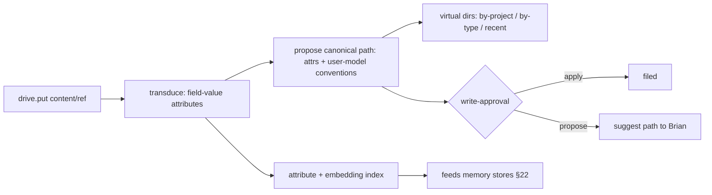

# 24. Smart file storage — `drive.*`

> **Drive is Miku's playground** (§30): the durable space of content shared with Miku — what Brian
> uploads, and what Miku files away as worth keeping. If content is neither in drive nor behind a
> linked-folder grant, Miku cannot see it. Grounded in three proven ideas: the system
> **derives** where a file belongs from its content (Semantic File Systems), real folders are reached
> **only** through an unforgeable explicit grant (object-capability model), and **your data lives on your
> machine** (local-first).

A Miku-facing document space layered on the FS jail (§07) and artifact store (§25), with model-driven
filing. Drive is **not** a Google-Drive replacement and not Brian's filesystem: content enters only
through an explicit put (upload, import, or Miku filing), so "shared with Miku" is a physical
boundary rather than an ACL. The project entity and its semantics live in §30.

## 24.0 Design stance — three foundations

- **Semantic filing** (Gifford, Jouvelot, Sheldon & O'Toole, SOSP 1991). Per-type **transducers** extract
  **field-value attributes** from a file; **virtual directories** interpret a path as a **conjunctive query**
  over those attributes, so navigation *is* query, not rigid hierarchy. We modernize the transducer with the
  **model-role system** (LLM + embeddings, §27.3) and let the **user model** (§22) supply conventions.
  Placement is **derived, not dumped in root**.
- **Object-capability security** (Dennis & Van Horn, 1966; Miller et al., *Capability Myths Demolished*,
  2003). The real filesystem has **no ambient authority**. A link mints an **unforgeable `FsPolicy`
  capability** (path + mode); code holds only the grants it was handed (**POLA** — least authority), and a
  grant can be **attenuated** (ro vs rw) or revoked. Same lineage as §23: a capability is a reference passed
  in a message, never forged.
- **Local-first** (Kleppmann, Wiggins, van Hardenberg & McGranaghan, 2019). Brian **owns the data**: the
  local copy is the **primary**, any cloud is an optional **secondary**, offline always works, and later
  multi-device sync uses **CRDTs** (no central bottleneck, no lock-in).
- **Non-goal:** a generic networked filesystem. Drive is the user's document space; the sandbox jail (§07)
  and the artifact store (§25) keep their separate roles below.

## 24.1 Three storage roles (keep distinct)

| Layer | For | Identity | Doc |
|---|---|---|---|
| **Blobs** | images / binaries | content hash (`blob:sha256:`) | §25 |
| **Artifacts / actor resources** | tool outputs and sub-agent records | session `artifact://`; actor `agent://` / `history://` | §25 / §23 |
| **Drive** | content shared with Miku (uploads + filed outputs) | user-facing path + attributes | this doc / §30 |

Drive entries may **reference** a blob (a filed image is a `blob:sha256:` under a drive path) — content is
addressed once, never copied (git / IPFS CAS lineage, §25). Host-facing `drive.put` accepts inline
content, `{ text }`, JSON content, and `blob:sha256:` refs only; other resource URIs must be read
explicitly through `resources.read` before filing.

## 24.2 `drive.*` capability

Capability-checked at the boundary like every host fn (§07/§08).

| Call | Effect |
|---|---|
| `drive.put(content_or_blob_ref, opts)` | store a doc / blob-ref; `opts.auto` → transduce + propose a path (§24.3) |
| `drive.get(path)` | fetch by canonical path (or `drive://` resource) |
| `drive.ls(path_or_query)` | list a real path **or** a **virtual directory** query view (§24.3) |
| `drive.move(from, to)` | re-file; corrections feed the user model (§22) |
| `drive.search(query)` | **hybrid** search — reuses the §22 recall engine over extracted attributes |
| `drive.tag(path, fields)` | add / edit field-value attributes by hand |
| ~~`drive.link`~~ → `project.link(host_path, mode)` (§30) | attach an `FsPolicy` grant to a project entity; moved out of `drive.*` (it never touched the document store) and no longer mints the project or its memory scope |
| ~~`drive.unlink`~~ → `project.unlink(alias_or_uri)` (§30) | detach and revoke a linked-folder `FsPolicy` grant; project memory is unaffected |
| `drive.organize()` | trigger the background re-filer (§24.3) |

### 24.2.1 Drive contract

The Rust implementation lives in `tm-drive` and is wired into `tm-lang` and `tm-server` through the
`DriveOperations` boundary. tm effects expose `drive.put`, `drive.get`, `drive.ls`, `drive.move`,
`drive.search`, `drive.tag`, and `drive.organize`; `drive.link` / `drive.unlink` move to
`project.link` / `project.unlink` under §30, and the `drive_linked` / `drive_unlinked` event types
retire with that move. Every call resolves
through the host registry, so the model still has one chat-native tool.
With `TM_DATABASE_URL`, `tm-server` uses a Postgres-backed metadata store over `drive_entries`,
`drive_attributes`, `drive_tags`, `drive_proposals`, `drive_organizer_runs`, `drive_corrections`,
`drive_entry_tombstones`, and `drive_links`, with optimistic record versions and path, hash, project,
doc-kind, tag, recency, and FTS indexes. The no-database local-development path intentionally retains
the historical in-memory metadata exception; artifact/blob persistence alone does not make that mode
durable. Runtime consumers depend on the trait-object boundary rather than the concrete in-memory store.

The data vocabulary is:

- entry id, canonical path, `drive://` URI, `blob:sha256:` URI, content hash, MIME, size, title,
  doc kind, project, entities, dates, amounts, tags, embedding placeholder, source URI,
  provenance, created/updated timestamps, status, attributes, and summary.
- provenance records include source URI, session id, event seq, actor id, source run id, content hash,
  extractor version, and timestamp.
- each extracted attribute carries confidence, extractor version, optional evidence selector/snippet,
  content hash, and the source URI/session/event fields when the write supplied them.
- organizer proposals include proposed move/tag/dedupe/archive/doc-kind/project actions, evidence,
  confidence, policy decision, approval id, status, source run id, replay metadata, and timestamps.

Canonical paths are normalized with `/` separators, no `..`, no raw absolute host paths, no Windows
drive prefixes, no NUL bytes, and no non-drive resource URI aliases. Stored paths are relative; the
model-visible URI is `drive://<path>`. Collisions default to `keep-both` (`file-2.ext`), while
explicit overwrite remains an approval-bound operation at the host boundary.

Virtual directory grammar in v1 is `/recent`, `/by-project/<project>`, `/by-type/<doc_kind>`,
`/by-tag/<tag>`, and `/by-date/<yyyy>/<mm>`. These map to attribute/search filters and never move the
canonical file.

`DrivePutOptions` are `auto`, `suggestedPath`, `project`, `docKind`, `tags`, `sourceUri`, `mime`,
`title`, `approvalMode`, `dedupe`, `collision`, `overwrite`, `conventions`, and `modelExtraction`.
Convention templates default to
`finance/{year}/{docKind}/{filename}` and `inbox/{date}/{filename}`; the historical
`projects/{project}/{docKind}/{filename}` default is retired under §30 — project is a validated
entity-reference attribute, never a canonical-path token, and the per-project view stays on the
`/by-project/<project>` virtual directory. Callers may override
finance/inbox templates with those same safe slugged tokens. `DriveSearchOptions` are `query`,
`project`, `docKind`, `tags`, `limit`,
`includeArchived`, `since`, `until`, and `returnSnippets`.
For host-facing `drive.put`, `auto: true` plans the write first and then requires the existing approval
policy before committing a `drive://` entry. Explicit `approvalMode: "requireApproval"` also always asks;
caller-supplied `approvalMode: "auto"` is normalized back to the conservative propose path at the sandbox
host boundary. Deny or timeout leaves no drive entry or proposal record. Trusted server/background policy
may still call the store directly with `DriveApprovalMode::Auto` for configured low-risk internal flows.
Browser/client drops use the same call path with a `drop://...` `sourceUri`, session id, and source
event sequence in provenance; after approval they emit the same replayable `drive_put` payload as
other filed documents.
Missing `drive://` reads return a stable not-found error with up to three nearby drive paths from the
same authorized store; raw host paths are never included in the suggestion text.
Model-visible text reads follow the artifact paging contract: no selector returns at most 64 KiB or
200 lines, and an explicit line selector is rejected above 256 KiB or 1,000 lines. Selection walks the
text iterator without collecting every line into a second buffer; `hasMore` tells callers to request
another bounded page.

Replayable `session_event.data.type` values reserved for client/server use are `drive_put`, `drive_transduced`,
`drive_path_proposed`, `drive_write_proposed`, `drive_filed`, `drive_moved`, `drive_tagged`,
`drive_organizer_started`, `drive_organizer_completed`, and `drive_organizer_failed`; the historical
`drive_linked` / `drive_unlinked` types retire under §30 (link events become project events). The first implementation proves the JSON wire shapes in `tm-drive`.
Successful `drive.put`, `drive.move`, and `drive.tag` calls emit compact
session events with mobile-friendly preview text, classification metadata, and resource refs, as do
`project.link` / `project.unlink` (§30) on the project-event surface.
`drive.organize` emits replayable organizer started/completed/failed events through the same host event
sink, while each organizer proposal also appears on the shared `write_proposal` surface with
`kind: "drive"`, mobile-friendly previews, and `drive://` source/proposed resource refs. Native server
sessions persist both event families to `session_events` and emit them through the single versioned
`event: session_event` SSE envelope; pending drive proposals remain visible through
the existing pending-events transcript shape. Organizer apply uses the same `InvocationCtx` approval
policy path as `fs.*`, `proc.*`, and other drive writes rather than a drive-only approval
channel. Broader drag/drop browser UI remains demand-triggered.

Local research composes the drive primitives directly: `@drive.search {query, project?, returnSnippets?}`
returns bounded hits with `drive://` citations, and `@drive.get {uri, selector?}` reads a bounded
selector of a cited document. Drive citations carry `drive://` URIs so later external/fetched research
can be distinguished without a dedicated research envelope. Explicit actor research can still be
composed with `agents.*` by tm code when a turn holds those grants. External/network research is
available only through operator-selected MCP objects crossing the default-disabled egress/opaque-secret
boundary. Drive remains local-first and has no ambient publish/send namespace; destructive
local mutations retain the existing approval gates.

## 24.3 Auto-organize — transducers + virtual directories + user model

- **Transduce (write time).** A type-specific extractor (modernized with model roles) pulls attributes —
  mime, dates, entities, project, doc-kind (`invoice` / `receipt` / `paper` / `note`), amounts, embedding.
  **Attributes are the index, not the folder.**
- **Model extraction hook.** `modelExtraction.enabled` is false by default. When config enables it,
  transduction emits a `modelRequest` descriptor for a named role (default `document_extractor`) with
  requested fields and a bounded redacted text preview; normal tests do not call a live model.
- **Propose a canonical path** from attributes + the user model's conventions (§22: *"invoices under
  `finance/YYYY/`"*). **Virtual directories** then give query-views (`/by-project/X`, `/by-type/invoice`,
  `/recent`) **without** moving the canonical file.
- **Apply vs propose** is gated by **write-approval**: sandbox host calls stay conservative and ask
  before durable writes. Organizer host calls follow the same split: `drive.organize()` records
  pending Move proposals by default and `drive.organize({ apply: true })` applies authorized
  pending/approved proposals only after approval. There is no auto-apply/config policy layer.
- **Organizer generator.** The implemented generator proposes deterministic **Move** proposals only;
  it does not run background dedupe or policy auto-application. The manual `drive.organize()` path
  proposes by default; `drive.organize({ apply: true })` applies pending/approved proposals only after
  approval, and marks denied/timeout/stale proposals with a replayable status instead of mutating
  silently. `DriveMetadataStore` records organizer runs with queued/running/completed/failed status,
  attempts, locked heartbeat time, retry availability, terminal errors, and the proposal ids produced
  by a completed run; stale leases can be reclaimed, while duplicate workers cannot claim a fresh
  running organizer lease. Postgres persists those rows, proposals, corrections, version counters,
  entries, links, and tombstones; moves and organizer application use compare-and-swap so concurrent
  workers mutate once. `OrganizerActionKind::{Tag,Dedupe,Archive,SetDocKind,SetProject}` remain
  decodable and applicable for already-persisted proposal rows but are not generated or advertised.
  Organizer event payloads include proposal ids, source/proposed `drive://` refs, statuses,
  confidence, and compact previews so session replay and mobile clients can show pending filing
  decisions without reading full document bodies.
- Extracted attributes also flow into the **memory stores** (§22 semantic / lexical), so filed docs become
  **recallable**. The current server bridge persists project-scoped recall chunks with `drive://` and
  content-hash provenance after turns; move/tag changes update the same content-hash-keyed recall
  record; automatic source-event ids for those host calls remain hardening work. `drive.search` is hybrid recall over
  drive metadata.

## 24.4 Sandbox-default, linked-folder opt-in (decision C, amended by §30)

> **Current §30 contract.** Linking lives under `project.link` / `project.unlink`, no longer mints
> the project or its memory scope, and unlink no longer tombstones project memory. Project selection
> and session memory policy are independent. The bullets below are the live contract.

- **Default = sandbox jail** (§07/§08): **no ambient real-FS authority**. The drive lives in the
  per-session sandbox workspace; nothing touches the real machine.
- **Link = attach a capability to a project (§30).** `project.link(host_path, ro | rw)` is an
  approval-gated host call, `project.unlink(alias_or_uri)` the matching revocation. Linking registers
  an **unforgeable `FsPolicy` grant** (real path, alias, canonical root, mode) in the shared
  linked-folder registry and attaches it to an existing project entity. The historical coupling —
  one link also opening the per-linked-project memory scope (§22.6) — is superseded: the project
  record owns scope creation. Same-root mode replacement still narrows `fs.*` access, and unlink
  still removes the alias from the shared registry; both now leave project memory untouched.
- **Durable links fail closed on restart.** Postgres persists active, revoked, and invalid link
  records with versions. Startup restores only active records whose directory still exists and whose
  canonical identity, non-symlink root, mode, and alias policy all revalidate. A failure is persisted
  as `invalid`; invalid and revoked records are not auto-reactivated on later restarts.
- **Project authority is session state (§30).** A session with no `project_id` may access only
  unprojected Drive entries. A session with `project_id = <slug>` may access only entries for that
  project, including `drive://` virtual/search listings. Drive host calls, resource reads, child
  actors, and organizer proposal application inherit that exact project id. Linked-folder, `fs.*`,
  `code.*`, and `proc.*` authority requires **both** the matching project id and a live attached
  grant; sessions without a project fail closed. The independent memory policy may be global or
  project-scoped without changing this authority.
- **Attenuation & revocation are two independent axes.** `ro` vs `rw` is attenuation; a grant narrows
  or revokes, never escalates. Unlink revokes only the filesystem axis; project archive tombstones
  the project memory scope (§30.4). This remains the **only** path by which **Serious Engineer** (§21)
  and `fs.*` / `proc.*` (§25) reach real repos. A linked folder is exposed for read/list/preview as
  `linked://<alias>/…` (§9.3), and through the project aggregate view as
  `project://<id>/linked-folders/<alias>/...`, not as `drive://`; writes and commands still go
  through the explicit SDK capabilities. No ambient access, no `sh -c` (principle #8).

## 24.5 Sync — local-first (decision)

- **Local-first default** (Kleppmann et al.): the local copy is primary, fully functional **offline**; **no
  cloud dependency in v1** (the user owns the data).
- **Demand-triggered:** an optional **secondary** replica with **CRDT-based** sync for multi-device
  (Flutter Web/PWA + Android, §27) may be added only with a concrete consumer; ownership, privacy,
  and offline use must remain preserved and merges conflict-free.

## 24.6 Crate layout (`tm-drive`, §28)

- `store` — canonical entries + attribute index; references blobs (§25), no copy.
- `transduce` — per-type attribute extractors (model role + embeddings, §27.3).
- `organize` — placement proposer + background re-filer (lease + heartbeat); tier-gated apply / propose.
- `vdir` — virtual-directory query views; maps a path to a conjunctive attribute query.
- `policy` — `FsPolicy` grants (mint / attenuate / revoke); link ⇒ memory-scope coupling (§22.6).
- `resources` — registers the `drive://<path>` handler into the §9.2 resolver registry when a drive
  store is configured; drive browser feed (§27) remains client work.

## 24.7 Failure modes & degradation

- **Transducer fails on a type** — fall back to mime + filename + recency; the file is still filed, never lost.
- **Bad auto-placement** — `drive.move` corrects it; the correction is learned into the user model (§22).
- **Link revoked / path vanished** — the grant invalidates; capability checks **fail closed**; the
  sandbox copy is unaffected. Project memory, items, and drive entries are also unaffected (§30);
  project archive tombstones the memory scope.
- **Dedup integrity** — content-addressed (`sha256`); collisions are practically nil; integrity verified on `get`.
- **Offline / no cloud** — local-first means **full function**; later sync resumes via CRDT merge with no data loss.

## 24.8 Mechanism provenance

| We adopt | From | For |
|---|---|---|
| transducers, **virtual directories**, query-as-navigation | **Semantic File Systems** (Gifford et al., 1991) | deriving where a file belongs |
| **unforgeable grants**, **no ambient authority**, attenuation / POLA | **object-capability model** (Dennis & Van Horn 1966; Miller 2003) | `FsPolicy` + sandbox-default |
| data ownership, **local primary copy**, **CRDT** sync, offline | **local-first software** (Kleppmann et al., 2019) | the sync stance |
| content-addressed dedup (`blob:sha256:`) | **git / IPFS** CAS | blob storage (§25) |
| propose-vs-apply gating, background re-file, write-approval | **Oh My Pi** + §22 / §26 | safe auto-organization |

---

**Sources** (verified 2026-06-26): David K. Gifford, Pierre Jouvelot, Mark A. Sheldon & James W. O'Toole,
*Semantic File Systems* (**SOSP 1991**, ACM 10.1145/121133.121138 — type-specific transducers extract
field-value attributes; virtual directories interpret paths as conjunctive queries; navigation is query).
Jack B. Dennis & Earl C. Van Horn, *Programming Semantics for Multiprogrammed Computations* (**1966** —
capability addressing) and Mark S. Miller, Ka-Ping Yee & Jonathan Shapiro, *Capability Myths Demolished*
(**2003** — unforgeable capabilities, **no ambient authority**, POLA, attenuation / membranes). Martin
Kleppmann, Adam Wiggins, Peter van Hardenberg & Mark McGranaghan, *Local-First Software: You Own Your Data,
in spite of the Cloud* (**Onward! / SPLASH 2019**, Ink & Switch — seven ideals, local primary copy,
CRDT-based sync). Content-addressable storage from git / IPFS object models (→ §25). Oh My Pi artifact /
consolidation patterns for propose-vs-apply gating. **Decision C holds with the §30 amendment:
sandbox-default, real folders only on an explicit link; a link grants filesystem (`FsPolicy`) access
attached to a project entity, and memory-scope lifecycle belongs to the project record (§30), not
the link.**
