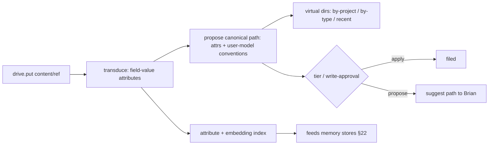

# 24. Smart file storage — `drive.*`

> "Like Google Drive, but it figures out where things go." Grounded in three proven ideas: the system
> **derives** where a file belongs from its content (Semantic File Systems), real folders are reached
> **only** through an unforgeable explicit grant (object-capability model), and **your data lives on your
> machine** (local-first).

A user-facing document space layered on the FS jail (§07) and artifact store (§25), with model-driven
filing. Drive is the one storage role the user thinks of as **"my files."**

## 24.0 Design stance — three foundations

- **Semantic filing** (Gifford, Jouvelot, Sheldon & O'Toole, SOSP 1991). Per-type **transducers** extract
  **field-value attributes** from a file; **virtual directories** interpret a path as a **conjunctive query**
  over those attributes, so navigation *is* query, not rigid hierarchy. We modernize the transducer with the
  **model-role system** (LLM + embeddings, §27.3) and let the **user model** (§22) supply conventions.
  Placement is **derived, not dumped in root**.
- **Object-capability security** (Dennis & Van Horn, 1966; Miller et al., *Capability Myths Demolished*,
  2003). The real filesystem has **no ambient authority**. A link mints an **unforgeable `FsPolicy`
  capability** (path + mode); code holds only the grants it was handed (**POLA** — least authority), and a
  grant can be **attenuated** (ro vs rw) or revoked. Same lineage as §23: a capability is a reference passed
  in a message, never forged.
- **Local-first** (Kleppmann, Wiggins, van Hardenberg & McGranaghan, 2019). Brian **owns the data**: the
  local copy is the **primary**, any cloud is an optional **secondary**, offline always works, and later
  multi-device sync uses **CRDTs** (no central bottleneck, no lock-in).
- **Non-goal:** a generic networked filesystem. Drive is the user's document space; the sandbox jail (§07)
  and the artifact store (§25) keep their separate roles below.

## 24.1 Three storage roles (keep distinct)

| Layer | For | Identity | Doc |
|---|---|---|---|
| **Blobs** | images / binaries | content hash (`blob:sha256:`) | §25 |
| **Artifacts / actor resources** | tool outputs and sub-agent records | session `artifact://`; actor `agent://` / `history://` | §25 / §23 |
| **Drive** | the *user's* documents | user-facing path + attributes | this doc |

Drive entries may **reference** a blob (a filed image is a `blob:sha256:` under a drive path) — content is
addressed once, never copied (git / IPFS CAS lineage, §25).

## 24.2 `drive.*` capability

Capability-checked at the boundary like every host fn (§07/§08).

| Call | Effect |
|---|---|
| `drive.put(content_or_ref, opts)` | store a doc / blob-ref; `opts.auto` → transduce + propose a path (§24.3) |
| `drive.get(path)` | fetch by canonical path (or `drive://` resource) |
| `drive.ls(path_or_query)` | list a real path **or** a **virtual directory** query view (§24.3) |
| `drive.move(from, to)` | re-file; corrections feed the user model (§22) |
| `drive.search(query)` | **hybrid** search — reuses the §22 recall engine over extracted attributes |
| `drive.tag(path, fields)` | add / edit field-value attributes by hand |
| `drive.link(host_path, mode)` | mint an `FsPolicy` grant **and** open the per-project memory scope (§24.4) |
| `drive.organize()` | trigger the background re-filer (§24.3) |

## 24.3 Auto-organize — transducers + virtual directories + user model

- **Transduce (write time).** A type-specific extractor (modernized with model roles) pulls attributes —
  mime, dates, entities, project, doc-kind (`invoice` / `receipt` / `paper` / `note`), amounts, embedding.
  **Attributes are the index, not the folder.**
- **Propose a canonical path** from attributes + the user model's conventions (§22: *"invoices under
  `finance/YYYY/`"*). **Virtual directories** then give query-views (`/by-project/X`, `/by-type/invoice`,
  `/recent`) **without** moving the canonical file.
- **Apply vs propose** is gated by the **self-evolution tier** (§26) and **write-approval**: conservative →
  propose and ask; higher tiers may auto-file low-risk types.
- **Background organizer** (the files analog of §22 "dreaming"): periodically re-files, **dedups**
  (content-hash), and proposes a better tree; lease + heartbeat to avoid double-runs.
- Extracted attributes also flow into the **memory stores** (§22 semantic / lexical), so filed docs become
  **recallable**; `drive.search` is hybrid recall over them.

## 24.4 Sandbox-default, linked-folder opt-in (decision C) — object-capability framing

- **Default = sandbox jail** (§07/§08): **no ambient real-FS authority**. The drive lives in the
  per-session sandbox workspace; nothing touches the real machine.
- **Link = mint a capability.** P0 first pass links folders from config; later UI may expose
  `drive.link(host_path, ro | rw)`. Either path mints an **unforgeable `FsPolicy` grant** (real path,
  mode, approval-gated when interactive). This **single act also opens the per-linked-project memory
  scope** (§22.6) — **one link, two grants** (filesystem + memory), revoked together.
- **Attenuation & revocation.** `ro` vs `rw` is attenuation; a grant narrows or revokes, never escalates.
  This is the **only** path by which **Serious Engineer** (§21) and `fs.*` / `proc.*` (§25) reach real
  repos. A linked folder is exposed for read/list/preview as `linked://<alias>/…` (§9.3), not as
  `drive://`; writes and commands still go through the explicit SDK capabilities. No ambient access, no
  `sh -c` (principle #8).

## 24.5 Sync — local-first (decision)

- **Local-first default** (Kleppmann et al.): the local copy is primary, fully functional **offline**; **no
  cloud dependency in v1** (the user owns the data).
- **Later (open question, §28):** an optional **secondary** replica with **CRDT-based** sync for multi-device
  (Flutter Web/PWA + Android, §27) — ownership, privacy, and offline use preserved; merges are conflict-free.

## 24.6 Crate layout (`tm-drive`, §28)

- `store` — canonical entries + attribute index; references blobs (§25), no copy.
- `transduce` — per-type attribute extractors (model role + embeddings, §27.3).
- `organize` — placement proposer + background re-filer (lease + heartbeat); tier-gated apply / propose.
- `vdir` — virtual-directory query views; maps a path to a conjunctive attribute query.
- `policy` — `FsPolicy` grants (mint / attenuate / revoke); link ⇒ memory-scope coupling (§22.6).
- `resources` — will register the `drive://<path>` handler into the §9.2 resolver registry; drive browser feed (§27).

## 24.7 Failure modes & degradation

- **Transducer fails on a type** — fall back to mime + filename + recency; the file is still filed, never lost.
- **Bad auto-placement** — `drive.move` corrects it; the correction is learned into the user model (§22).
- **Link revoked / path vanished** — the grant invalidates; capability checks **fail closed**; the sandbox
  copy is unaffected.
- **Dedup integrity** — content-addressed (`sha256`); collisions are practically nil; integrity verified on `get`.
- **Offline / no cloud** — local-first means **full function**; later sync resumes via CRDT merge with no data loss.

## 24.8 Mechanism provenance

| We adopt | From | For |
|---|---|---|
| transducers, **virtual directories**, query-as-navigation | **Semantic File Systems** (Gifford et al., 1991) | deriving where a file belongs |
| **unforgeable grants**, **no ambient authority**, attenuation / POLA | **object-capability model** (Dennis & Van Horn 1966; Miller 2003) | `FsPolicy` + sandbox-default |
| data ownership, **local primary copy**, **CRDT** sync, offline | **local-first software** (Kleppmann et al., 2019) | the sync stance |
| content-addressed dedup (`blob:sha256:`) | **git / IPFS** CAS | blob storage (§25) |
| propose-vs-apply gating, background re-file, write-approval | **Oh My Pi** + §22 / §26 | safe auto-organization |

---

**Sources** (verified 2026-06-26): David K. Gifford, Pierre Jouvelot, Mark A. Sheldon & James W. O'Toole,
*Semantic File Systems* (**SOSP 1991**, ACM 10.1145/121133.121138 — type-specific transducers extract
field-value attributes; virtual directories interpret paths as conjunctive queries; navigation is query).
Jack B. Dennis & Earl C. Van Horn, *Programming Semantics for Multiprogrammed Computations* (**1966** —
capability addressing) and Mark S. Miller, Ka-Ping Yee & Jonathan Shapiro, *Capability Myths Demolished*
(**2003** — unforgeable capabilities, **no ambient authority**, POLA, attenuation / membranes). Martin
Kleppmann, Adam Wiggins, Peter van Hardenberg & Mark McGranaghan, *Local-First Software: You Own Your Data,
in spite of the Cloud* (**Onward! / SPLASH 2019**, Ink & Switch — seven ideals, local primary copy,
CRDT-based sync). Content-addressable storage from git / IPFS object models (→ §25). Oh My Pi artifact /
consolidation patterns for propose-vs-apply gating. **Decision C holds: sandbox-default, real folders only
on an explicit link; one link grants both filesystem (`FsPolicy`) and memory scope (§22.6).**
