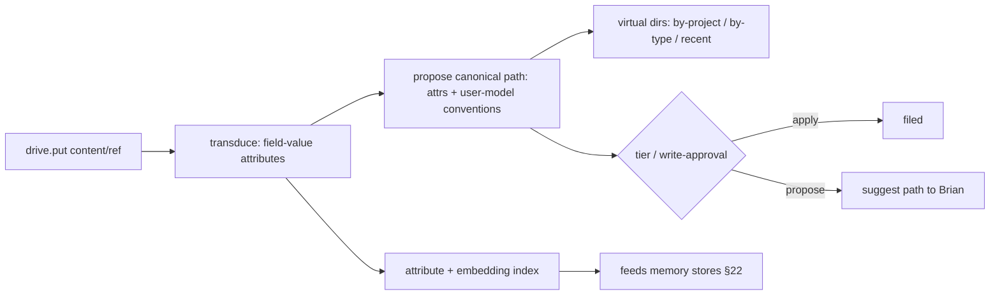

# 24. Smart file storage — `drive.*`

> "Like Google Drive, but it figures out where things go." Grounded in three proven ideas: the system
> **derives** where a file belongs from its content (Semantic File Systems), real folders are reached
> **only** through an unforgeable explicit grant (object-capability model), and **your data lives on your
> machine** (local-first).

A user-facing document space layered on the FS jail (§07) and artifact store (§25), with model-driven
filing. Drive is the one storage role the user thinks of as **"my files."**

## 24.0 Design stance — three foundations

- **Semantic filing** (Gifford, Jouvelot, Sheldon & O'Toole, SOSP 1991). Per-type **transducers** extract
  **field-value attributes** from a file; **virtual directories** interpret a path as a **conjunctive query**
  over those attributes, so navigation *is* query, not rigid hierarchy. We modernize the transducer with the
  **model-role system** (LLM + embeddings, §27.3) and let the **user model** (§22) supply conventions.
  Placement is **derived, not dumped in root**.
- **Object-capability security** (Dennis & Van Horn, 1966; Miller et al., *Capability Myths Demolished*,
  2003). The real filesystem has **no ambient authority**. A link mints an **unforgeable `FsPolicy`
  capability** (path + mode); code holds only the grants it was handed (**POLA** — least authority), and a
  grant can be **attenuated** (ro vs rw) or revoked. Same lineage as §23: a capability is a reference passed
  in a message, never forged.
- **Local-first** (Kleppmann, Wiggins, van Hardenberg & McGranaghan, 2019). Brian **owns the data**: the
  local copy is the **primary**, any cloud is an optional **secondary**, offline always works, and later
  multi-device sync uses **CRDTs** (no central bottleneck, no lock-in).
- **Non-goal:** a generic networked filesystem. Drive is the user's document space; the sandbox jail (§07)
  and the artifact store (§25) keep their separate roles below.

## 24.1 Three storage roles (keep distinct)

| Layer | For | Identity | Doc |
|---|---|---|---|
| **Blobs** | images / binaries | content hash (`blob:sha256:`) | §25 |
| **Artifacts / actor resources** | tool outputs and sub-agent records | session `artifact://`; actor `agent://` / `history://` | §25 / §23 |
| **Drive** | the *user's* documents | user-facing path + attributes | this doc |

Drive entries may **reference** a blob (a filed image is a `blob:sha256:` under a drive path) — content is
addressed once, never copied (git / IPFS CAS lineage, §25). Host-facing `drive.put` accepts inline
content, `{ text }`, JSON content, and `blob:sha256:` refs only; other resource URIs must be read
explicitly through `resources.read` before filing.

## 24.2 `drive.*` capability

Capability-checked at the boundary like every host fn (§07/§08).

| Call | Effect |
|---|---|
| `drive.put(content_or_blob_ref, opts)` | store a doc / blob-ref; `opts.auto` → transduce + propose a path (§24.3) |
| `drive.get(path)` | fetch by canonical path (or `drive://` resource) |
| `drive.ls(path_or_query)` | list a real path **or** a **virtual directory** query view (§24.3) |
| `drive.move(from, to)` | re-file; corrections feed the user model (§22) |
| `drive.search(query)` | **hybrid** search — reuses the §22 recall engine over extracted attributes |
| `drive.tag(path, fields)` | add / edit field-value attributes by hand |
| `drive.link(host_path, mode)` | mint an `FsPolicy` grant **and** open the per-project memory scope (§24.4) |
| `drive.unlink(alias_or_uri)` | revoke a linked-folder `FsPolicy` grant |
| `drive.organize()` | trigger the background re-filer (§24.3) |

### 24.2.1 Implemented P5 v1 contract

The first Rust slice lives in `tm-drive` and is wired into `tm-sandbox` and `tm-server` when an
`InMemoryDriveStore` is configured. The Deno SDK exposes `drive.put`, `drive.get`, `drive.ls`,
`drive.move`, `drive.search`, `drive.tag`, `drive.link`, `drive.unlink`, and `drive.organize`; each
wrapper forwards through `tools.call`, so the model still has one chat-native tool.
`tm-server` also bootstraps the gated Postgres schema for durable drive storage
(`drive_entries`, `drive_attributes`, `drive_tags`, `drive_proposals`, and `drive_links`) with path,
hash, project, doc-kind, tag, recency, and FTS indexes; the full Postgres-backed `DriveStore`
implementation remains a follow-up.

Data vocabulary is frozen for this slice as:

- entry id, canonical path, `drive://` URI, `blob:sha256:` URI, content hash, MIME, size, title,
  doc kind, project, entities, dates, amounts, tags, embedding placeholder, source URI,
  provenance, created/updated timestamps, status, attributes, and summary.
- provenance records include source URI, session id, event seq, actor id, source run id, content hash,
  extractor version, and timestamp.
- each extracted attribute carries confidence, extractor version, optional evidence selector/snippet,
  content hash, and the source URI/session/event fields when the write supplied them.
- organizer proposals include proposed move/tag/dedupe/archive/doc-kind/project actions, evidence,
  confidence, policy decision, approval id, status, source run id, replay metadata, and timestamps.

Canonical paths are normalized with `/` separators, no `..`, no raw absolute host paths, no Windows
drive prefixes, no NUL bytes, and no non-drive resource URI aliases. Stored paths are relative; the
model-visible URI is `drive://<path>`. Collisions default to `keep-both` (`file-2.ext`), while
explicit overwrite remains an approval-bound operation at the host boundary.

Virtual directory grammar in v1 is `/recent`, `/by-project/<project>`, `/by-type/<doc_kind>`,
`/by-tag/<tag>`, and `/by-date/<yyyy>/<mm>`. These map to attribute/search filters and never move the
canonical file.

`DrivePutOptions` are `auto`, `suggestedPath`, `project`, `docKind`, `tags`, `sourceUri`, `mime`,
`title`, `approvalMode`, `dedupe`, `collision`, `overwrite`, `conventions`, and `modelExtraction`.
Convention templates default to `projects/{project}/{docKind}/{filename}`,
`finance/{year}/{docKind}/{filename}`, and `inbox/{date}/{filename}`; callers may override
project/finance/inbox templates with those same safe slugged tokens. `DriveSearchOptions` are `query`,
`project`, `docKind`, `tags`, `limit`,
`includeArchived`, `since`, `until`, and `returnSnippets`.
For host-facing `drive.put`, `auto: true` plans the write first and then requires the existing approval
policy before committing a `drive://` entry. Explicit `approvalMode: "requireApproval"` also always asks;
caller-supplied `approvalMode: "auto"` is normalized back to the conservative propose path at the sandbox
host boundary. Deny or timeout leaves no drive entry or proposal record. Trusted server/background policy
may still call the store directly with `DriveApprovalMode::Auto` for configured low-risk internal flows.
Browser/client drops use the same call path with a `drop://...` `sourceUri`, session id, and source
event sequence in provenance; after approval they emit the same replayable `drive_put` payload as
other filed documents.
Missing `drive://` reads return a stable not-found error with up to three nearby drive paths from the
same authorized store; raw host paths are never included in the suggestion text.

Replayable event names reserved for client/server use are `drive_put`, `drive_transduced`,
`drive_path_proposed`, `drive_write_proposed`, `drive_filed`, `drive_moved`, `drive_tagged`,
`drive_linked`, `drive_unlinked`, `drive_organizer_started`, `drive_organizer_completed`, and
`drive_organizer_failed`. The first implementation proves the JSON wire shapes in `tm-drive`.
Successful `drive.put`, `drive.move`, `drive.tag`, `drive.link`, and `drive.unlink` calls emit compact
session events with mobile-friendly preview text, classification metadata, and resource refs.
`drive.organize` emits replayable organizer started/completed/failed events through the same host event
sink, while each organizer proposal also appears on the shared `write_proposal` surface with
`kind: "drive"`, mobile-friendly previews, and `drive://` source/proposed resource refs. Native server
sessions persist both event families to `session_events`/SSE and expose pending drive proposals through
the existing pending-events transcript shape. Organizer apply uses the same `InvocationCtx` approval
policy path as `fs.*`, `code.*`, `proc.*`, and other drive writes rather than a drive-only approval
channel. Broader drag/drop browser UI remains a client slice.

The first local research workspace is the SDK helper `research.drive(query, opts)`, implemented as
composition rather than a new host tool: it calls `drive.search`, reads bounded `drive://` selectors
through `resources.read`, and, when `agents.parallel` is available, fans out one digest worker per
selected document. The returned corpus contains only resource refs, selectors, snippets, content
hashes, digests, and citations; full document text stays inside the worker/local summarization step.
Local citations and corpus refs carry `sourceKind: "drive"` so later external/fetched research can be
distinguished without changing the result envelope.
`maxDocs`, `maxSnippets`, `maxBytesPerDoc`, `maxDigestBytes`, and `maxWorkers` are clamped in the SDK
helper, and the result reports the effective budget. `workerTimeoutMs` and `totalTimeoutMs` are
clamped there too; `research.drive` passes the effective per-worker limit into `agents.parallel`
child task budgets, capped by the remaining total run budget.
If child fan-out fails or is cancelled, the helper records bounded `workerFailures`, falls back to local
digests for the affected corpus, and leaves drive state untouched; the underlying `agents.parallel`
lifecycle remains responsible for replayable `actor_failed` / `actor_cancelled` session events. Normal
tests use the deterministic local fallback without network or live LLM access. External/network
research, publishing, and sending remain deferred to the future live-egress slice; P5 only has
default-deny/allowlisted `http.get`, absent publish/send namespaces, and the existing approval gates
for destructive local mutations.

## 24.3 Auto-organize — transducers + virtual directories + user model

- **Transduce (write time).** A type-specific extractor (modernized with model roles) pulls attributes —
  mime, dates, entities, project, doc-kind (`invoice` / `receipt` / `paper` / `note`), amounts, embedding.
  **Attributes are the index, not the folder.**
- **Model extraction hook.** `modelExtraction.enabled` is false by default. When config enables it,
  transduction emits a `modelRequest` descriptor for a named role (default `document_extractor`) with
  requested fields and a bounded redacted text preview; normal tests do not call a live model.
- **Propose a canonical path** from attributes + the user model's conventions (§22: *"invoices under
  `finance/YYYY/`"*). **Virtual directories** then give query-views (`/by-project/X`, `/by-type/invoice`,
  `/recent`) **without** moving the canonical file.
- **Apply vs propose** is gated by the **self-evolution tier** (§26) and **write-approval**: sandbox host
  calls stay conservative and ask before durable writes; trusted server/background policy may auto-file
  low-risk types by calling the store with `DriveApprovalMode::Auto`. Organizer automation follows the
  same split: host `drive.organize()` records pending proposals by default and `drive.organize({ apply:
  true })` applies them only after approval, while moderate/aggressive `autoApply` rules are reserved for
  trusted background policy paths rather than model-controlled SDK calls.
- **Background organizer** (the files analog of §22 "dreaming"): periodically re-files, **dedups**
  (content-hash), and proposes a better tree; lease + heartbeat to avoid double-runs.
  The manual `drive.organize()` path proposes by default; `drive.organize({ apply: true })` applies
  pending/current proposals only after approval, and marks denied/timeout/stale proposals with a
  replayable status instead of mutating silently. The in-memory store now records organizer runs with
  queued/running/completed/failed status, attempts, locked heartbeat time, retry availability, terminal
  errors, and the proposal ids produced by a completed run; stale leases can be reclaimed, while duplicate
  workers cannot claim a fresh running organizer lease. Organizer event payloads include proposal ids,
  source/proposed `drive://` refs, statuses, confidence, and compact previews so session replay and
  mobile clients can show pending filing decisions without reading full document bodies.
- Extracted attributes also flow into the **memory stores** (§22 semantic / lexical), so filed docs become
  **recallable**. The current server bridge persists project-scoped recall chunks with `drive://` and
  content-hash provenance after turns; move/tag changes update the same content-hash-keyed recall
  record, while full source-event ids remain a hardening slice. `drive.search` is hybrid recall over
  drive metadata.

## 24.4 Sandbox-default, linked-folder opt-in (decision C) — object-capability framing

- **Default = sandbox jail** (§07/§08): **no ambient real-FS authority**. The drive lives in the
  per-session sandbox workspace; nothing touches the real machine.
- **Link = mint a capability.** P0 first pass links folders from config; P5 exposes
  `drive.link(host_path, ro | rw)` as an approval-gated host call and `drive.unlink(alias_or_uri)` as
  the matching approval-gated revocation call. Either link path registers an
  **unforgeable `FsPolicy` grant** (real path, alias, canonical root, mode) in the shared
  linked-folder registry. This **single act also opens the per-linked-project memory scope** (§22.6)
  in the returned link plan — **one link, two grants** (filesystem + memory). The implemented v1
  filesystem surface supports same-root mode replacement, so relinking an existing alias as `ro`
  narrows `fs.*` access; `drive.unlink` removes the alias from the shared registry and returns the
  canonical root, `linked://` URI, memory scope id, and revocation timestamp. Project-scoped memory
  views are gated by the same live alias, so narrowing updates the visible mode and revocation makes
  the project memory facade fail closed with the linked folder.
- **Attenuation & revocation.** `ro` vs `rw` is attenuation; a grant narrows or revokes, never escalates.
  This is the **only** path by which **Serious Engineer** (§21) and `fs.*` / `proc.*` (§25) reach real
  repos. A linked folder is exposed for read/list/preview as `linked://<alias>/…` (§9.3), and through
  the project aggregate view as `project://<id>/linked-folders/<alias>/...`, not as `drive://`;
  writes and commands still go through the explicit SDK capabilities. No ambient access, no `sh -c`
  (principle #8).

## 24.5 Sync — local-first (decision)

- **Local-first default** (Kleppmann et al.): the local copy is primary, fully functional **offline**; **no
  cloud dependency in v1** (the user owns the data).
- **Later (open question, §28):** an optional **secondary** replica with **CRDT-based** sync for multi-device
  (Flutter Web/PWA + Android, §27) — ownership, privacy, and offline use preserved; merges are conflict-free.

## 24.6 Crate layout (`tm-drive`, §28)

- `store` — canonical entries + attribute index; references blobs (§25), no copy.
- `transduce` — per-type attribute extractors (model role + embeddings, §27.3).
- `organize` — placement proposer + background re-filer (lease + heartbeat); tier-gated apply / propose.
- `vdir` — virtual-directory query views; maps a path to a conjunctive attribute query.
- `policy` — `FsPolicy` grants (mint / attenuate / revoke); link ⇒ memory-scope coupling (§22.6).
- `resources` — registers the `drive://<path>` handler into the §9.2 resolver registry when a drive
  store is configured; drive browser feed (§27) remains client work.

## 24.7 Failure modes & degradation

- **Transducer fails on a type** — fall back to mime + filename + recency; the file is still filed, never lost.
- **Bad auto-placement** — `drive.move` corrects it; the correction is learned into the user model (§22).
- **Link revoked / path vanished** — the grant invalidates; capability checks **fail closed**; the sandbox
  copy is unaffected.
- **Dedup integrity** — content-addressed (`sha256`); collisions are practically nil; integrity verified on `get`.
- **Offline / no cloud** — local-first means **full function**; later sync resumes via CRDT merge with no data loss.

## 24.8 Mechanism provenance

| We adopt | From | For |
|---|---|---|
| transducers, **virtual directories**, query-as-navigation | **Semantic File Systems** (Gifford et al., 1991) | deriving where a file belongs |
| **unforgeable grants**, **no ambient authority**, attenuation / POLA | **object-capability model** (Dennis & Van Horn 1966; Miller 2003) | `FsPolicy` + sandbox-default |
| data ownership, **local primary copy**, **CRDT** sync, offline | **local-first software** (Kleppmann et al., 2019) | the sync stance |
| content-addressed dedup (`blob:sha256:`) | **git / IPFS** CAS | blob storage (§25) |
| propose-vs-apply gating, background re-file, write-approval | **Oh My Pi** + §22 / §26 | safe auto-organization |

---

**Sources** (verified 2026-06-26): David K. Gifford, Pierre Jouvelot, Mark A. Sheldon & James W. O'Toole,
*Semantic File Systems* (**SOSP 1991**, ACM 10.1145/121133.121138 — type-specific transducers extract
field-value attributes; virtual directories interpret paths as conjunctive queries; navigation is query).
Jack B. Dennis & Earl C. Van Horn, *Programming Semantics for Multiprogrammed Computations* (**1966** —
capability addressing) and Mark S. Miller, Ka-Ping Yee & Jonathan Shapiro, *Capability Myths Demolished*
(**2003** — unforgeable capabilities, **no ambient authority**, POLA, attenuation / membranes). Martin
Kleppmann, Adam Wiggins, Peter van Hardenberg & Mark McGranaghan, *Local-First Software: You Own Your Data,
in spite of the Cloud* (**Onward! / SPLASH 2019**, Ink & Switch — seven ideals, local primary copy,
CRDT-based sync). Content-addressable storage from git / IPFS object models (→ §25). Oh My Pi artifact /
consolidation patterns for propose-vs-apply gating. **Decision C holds: sandbox-default, real folders only
on an explicit link; one link grants both filesystem (`FsPolicy`) and memory scope (§22.6).**
