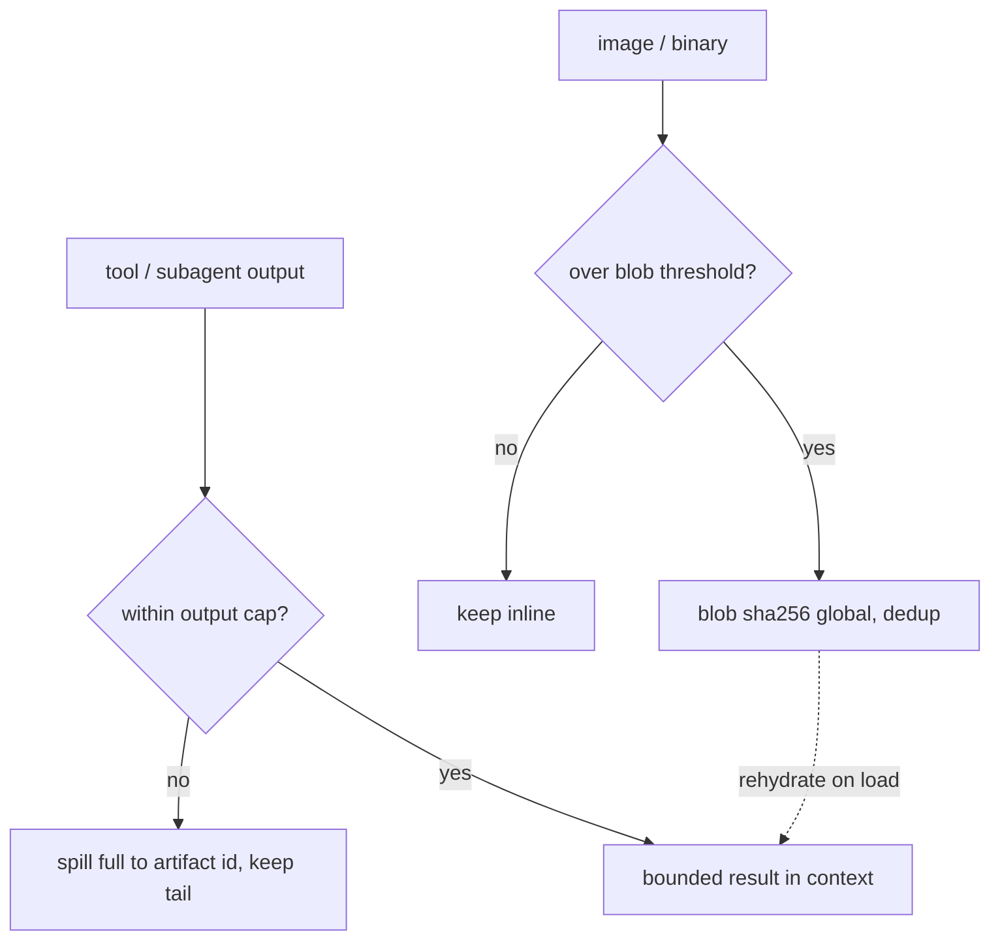

# 25. Coding-agent SDK & artifacts (OMP translation)

> The engineer modes call capabilities **as code** through one `execute` tool, not N chat-native
> tools. Grounded in Anthropic's *code execution with MCP* (a single execute tool + code that calls
> capabilities = massive token savings); real-repo reach is a curated, allowlisted `proc.run` (never
> raw shell); big outputs live in a two-tier, content-addressed store.

Engaged by **Serious Engineer** and **Handoff** modes (§21). Reference: **Oh My Pi** (OMP).

## 25.0 Design stance

- **Single tool + SDK, not multi-tool.** OMP exposes a **multi-tool** surface (read / search / edit /
  eval / task / …); TempestMiku bets on **one `execute` tool + an SDK** the model's code calls (§01).
  So "use OMP as the coding-agent reference" means a **paradigm translation**: take OMP's *capability
  coverage and behavior* and re-express each as an SDK namespace.
- **Why** (Anthropic, *Code execution with MCP*, 2025): loading hundreds of tool definitions plus
  every intermediate result through the model context is token-ruinous — their Google Drive →
  Salesforce workflow drops **~150,000 → ~2,000 tokens (98.7%)** by exposing capabilities as **code
  APIs**. Code can load tools **on demand**, **filter large data before it reaches the model**, run
  loops / retries / joins, keep sensitive data **out of context**, and persist state + reusable
  **skills** on the filesystem. The cost — secure sandboxing + resource limits — is exactly what §07
  (jail) and §08 (approval / budgets) provide.
- **Translating *from* MCP** (Anthropic Model Context Protocol, Nov 2024 — JSON-RPC; hosts / clients /
  servers; **resources / prompts / tools**; LSP-inspired). MCP/OMP-style multi-tool is the *source*;
  our SDK namespaces (`fs.*` / `code.*` / `proc.*` / `agents.*` / `memory.*` / `skills.*` /
  `artifacts.*`) are the *target* — same capabilities, made code-callable and **progressively
  disclosed** (`tools.search` / `docs`, §07) rather than all-loaded.
- This is the core bet (§01) realized at the product layer; the engineer modes are its heaviest users.

## 25.1 Translation map

The SDK is the **only** capability surface — there are no chat-native tools; the model writes code,
the code calls these namespaces, and unknown capabilities are discovered on demand (§07), not preloaded.

| OMP tool | TempestMiku SDK | Notes |
|---|---|---|
| read / write / ls | `fs.read/write/ls` | jail or linked folder (§24.4) |
| search (regex) / find (glob) | `code.search` / `fs.find` | RE2-style regex + glob |
| edit / ast-grep / ast-edit | `code.edit` / `code.ast` | surgical + structural |
| lsp | `code.lsp` | defs / refs / rename / diagnostics |
| eval (persistent kernel) | the `execute` loop itself | already the core (§05) |
| task / job / irc | `agents.*` | §23 |
| recall / retain / reflect | `memory.*` | §22 |
| skills | `skills.*` | §07, §26 |
| `artifact://` / `agent://` | `artifacts.*` + two-tier store | §25.3 |

## 25.2 Engineer reach: raw terminal → curated `proc.run` (a deliberate tightening)

The **current deployment exposes a raw local terminal** (`terminal: local`, cwd `/opt/workspace`,
180s — §29). The Rust rewrite **intentionally drops the raw terminal** for a curated capability,
honoring principle #8 (no generic shell / escape hatch):

- `proc.run(cmd, args)` — an **argument-vector** invocation (Rust `std::process::Command`; **no
  `sh -c`**, no shell string), so it is structurally immune to OS command injection. This is the OWASP
  Injection-Prevention guidance verbatim (pass argv, never concatenate into a shell string; CWE-78 /
  CWE-88) — and OWASP's **MCP05:2025** names exactly this risk: an agent translating input into
  system commands.
- **Allowlisted** commands only (the project's `cargo` / `pnpm` / `pytest`, etc.), scoped to a
  **linked** folder (restricted cwd, §24.4), **approval-gated** (§08 / §27.6, matching the current
  `approvals: manual`), least-privilege.
- The in-sandbox package ecosystem stays the long-tail safety net; `proc.run` is the narrow, audited
  door to real-repo build / test.
- **Behavioral parity is kept** (build / test still work); the escape hatch is not. One of the
  on-purpose changes vs. the current system (§29.4).

## 25.3 Artifact handler — two tiers (adopt OMP model into §09)

Two systems for two data shapes (OMP `blob-artifact-architecture`): content-addressed blobs optimize
**dedup + stable refs by content hash**; session artifacts optimize **append-only tooling + retrieval
by local id**.

- **Tier 1 — global content-addressed blobs** (`blob:sha256:<hash>`): images / binaries. **Content-
  addressed storage** (git object model + IPFS CID lineage — the address *is* the hash of the content,
  not a location): identical content → same hash → **dedup** + idempotent writes; the hash **verifies
  integrity** on read; blobs live in a global dir and **outlive sessions**. Externalized out of
  transcripts above a threshold (OMP `BLOB_EXTERNALIZE_THRESHOLD` = 1024 B), rehydrated on load. Note:
  `blob:` is a **persistence reference resolved at load**, not a router URL.
- **Tier 2 — session-scoped artifacts** (`artifact://<id>`, `agent://<name>`): full tool / sub-agent
  outputs. `artifact://` = session-local **monotonic integer** (`.log`); `agent://` = **name-based**
  (`.md`; `-2` suffix on repeat; nested `Parent.Child`). **Spill-on-truncation** via an output sink —
  bounded in context, full on disk (OMP `OutputSink`, spill at `DEFAULT_MAX_BYTES` = 50 KB). Output
  caps match the deployment: **50 KB / 2000 lines / 2000 line-length** (§29).
- **Resume / fork / move:** scan-and-continue ids; **fork copies artifacts, blobs are global (no
  copy)**; move renames the session + artifact dir together. Mirrors OMP `blob-artifact-architecture`.

Implemented in `tm-artifacts` (§10.1), extended from the single-tier sketch in §09 to the two-tier
model above. With §22 and §23, this is what keeps big data and fan-out **out of the window**.

## 25.4 Crate layout

- `tm-host` SDK namespaces — `fs` (read / write / ls / find; jail-or-linked §24.4), `code` (search /
  edit / ast / lsp), `proc` (run: **allowlist + argv + linked-cwd + approval**); wired to the
  capability registry (§07) + `ApprovalPolicy` (§08).
- `tm-artifacts` (§10.1) — `blob` (content-addressed store: sha256, dedup, MIME sidecar), `artifact`
  (session-local ids + `OutputSink` spill), `agent` (named sub-agent outputs), `resolve`
  (`artifact://` / `agent://` handlers + `blob:` rehydration at load).
- `agents.*` / `memory.*` / `skills.*` live in their own crates (§23 / §22 / §07 + §26); §25 is the
  **engineer-facing SDK + the artifact spine**.

## 25.5 Failure modes & degradation

- **Non-allowlisted command** — `proc.run` rejects it (fail-closed); **no linked folder** → no
  real-FS reach (sandbox only); **approval timeout** → denied, build / test deferred (§27.6).
- **Blob missing on rehydrate** — warn, keep the `blob:sha256:` ref in memory, load continues (OMP
  behavior); blob read ENOENT → returns null.
- **Artifact dir missing** — empty list, allocation starts fresh; **artifact id not found** → error
  lists available ids.
- **`OutputSink` file-sink init fails** — bounded in-memory output only; full output not persisted
  (degraded, logged).
- **Fork copy fails** — new session's artifact ids start from 0; blobs unaffected (global).
- **The single-tool tradeoff** — code execution **requires** the sandbox (§07) + resource limits
  (§08); without them the token win isn't safe. They are prerequisites, not options.

## 25.6 Mechanism provenance

| We adopt | From | For |
|---|---|---|
| single `execute` tool; capabilities as **code APIs** (load-on-demand, data stays out of context) | **Anthropic — *Code execution with MCP*** (2025) | the single-tool + SDK bet |
| the multi-tool protocol we translate **from** (resources / prompts / tools; JSON-RPC; LSP-inspired) | **Anthropic — Model Context Protocol** (2024) | the translation map (§25.1) |
| content-addressed blobs (hash = address; dedup; integrity; Merkle) | **git object model + IPFS CID** | tier-1 blobs (§25.3) |
| **argv-vector** exec, no shell, allowlist, least-privilege | **OWASP Injection Prevention / CWE-78, 88 / OWASP MCP05:2025** | `proc.run` (§25.2) |
| two-tier blob + artifact store; spill; resume / fork / move | **OMP `blob-artifact-architecture`** | the artifact spine (§25.3) |
| single `execute` loop, jail, approval | core §05 / §07 / §08 / §09 | the substrate |

---

**Sources** (verified 2026-06-26): Anthropic Engineering, *Code execution with MCP: Building more
efficient agents* (**2025-11-04**, `anthropic.com/engineering/code-execution-with-mcp` — expose MCP
servers as code APIs; load tools on demand; filter large data before the model; the Google Drive →
Salesforce example drops ~150k → ~2k tokens, 98.7%; requires secure sandboxing + resource limits).
Anthropic, *Introducing the Model Context Protocol* (**2024-11-25**; spec `2024-11-05` — open standard;
JSON-RPC 2.0; hosts / clients / servers; resources / prompts / tools; inspired by the Language Server
Protocol). **git** content-addressable object model (`git-scm` *Git Internals — Git Objects*: objects
addressed by hash of header + content; SHA-1, with SHA-256 support; dedup + integrity; Merkle-DAG) and
**IPFS** Content Identifiers (`docs.ipfs.tech` — CID = multihash, default sha-256; content-addressed;
dedup; self-verifying Merkle DAG). **OWASP** *Injection Prevention Cheat Sheet* + *MCP05:2025 — Command
Injection & Execution*, **CWE-78 / CWE-88** (prefer argv-vector APIs such as Rust `std::process::Command`,
never a shell string; allowlist + least-privilege). Oh My Pi `blob-artifact-architecture` (the two-tier
store: `blob:sha256:` global content-addressed + `artifact://` / `agent://` session-scoped; externalize
threshold 1024 B; `OutputSink` spill at 50 KB; fork copies artifacts, blobs global). **The bet (§01)
holds: one `execute` tool + SDK; real-repo reach only via curated `proc.run`; big data kept out of the
context window.**
