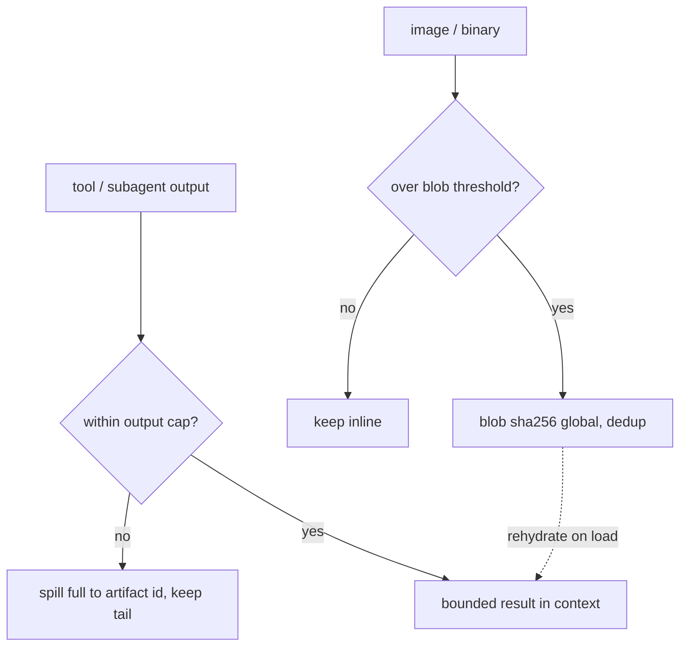

# 25. Coding-agent SDK & artifacts (OMP translation)

> The engineer modes call capabilities **as code** through one `execute` tool, not N chat-native
> tools. Grounded in Anthropic's *code execution with MCP* (a single execute tool + code that calls
> capabilities = massive token savings); real-repo reach is a curated, allowlisted `proc.run` (never
> raw shell); big outputs live in a two-tier, content-addressed store.

Engaged by **Serious Engineer** and **Handoff** modes (§21). Reference: **Oh My Pi** (OMP).

## 25.0 Design stance

- **Single tool + SDK, not multi-tool.** OMP exposes a **multi-tool** surface (read / search / edit /
  eval / task / …); TempestMiku bets on **one `execute` tool + an SDK** the model's code calls (§01).
  So "use OMP as the coding-agent reference" means a **paradigm translation**: take OMP's *capability
  coverage and behavior* and re-express each as an SDK namespace.
- **Why** (Anthropic, *Code execution with MCP*, 2025): loading hundreds of tool definitions plus
  every intermediate result through the model context is token-ruinous — their Google Drive →
  Salesforce workflow drops **~150,000 → ~2,000 tokens (98.7%)** by exposing capabilities as **code
  APIs**. Code can load tools **on demand**, **filter large data before it reaches the model**, run
  loops / retries / joins, keep sensitive data **out of context**, and persist state + reusable
  **skills** on the filesystem. The cost — secure sandboxing + resource limits — is exactly what §07
  (jail) and §08 (approval / budgets) provide.
- **Translating *from* MCP** (Anthropic Model Context Protocol, Nov 2024 — JSON-RPC; hosts / clients /
  servers; **resources / prompts / tools**; LSP-inspired). MCP/OMP-style multi-tool is the *source*;
  our SDK namespaces (`fs.*` / `code.*` / `proc.*` / future `agents.*` / `memory.*` / `skills.*` /
  `artifacts.*`) are the *target* — same capabilities, made code-callable and **progressively
  disclosed** (`tools.search` / `docs`, §07) rather than all-loaded.
- This is the core bet (§01) realized at the product layer; the engineer modes are its heaviest users.

## 25.0.1 P0a transitional OMP ACP backend

P0a adopted Oh My Pi first as an external coding backend over Agent Client Protocol (ACP). This is a
bridge, not a replacement for the single-`execute` bet: TempestMiku still owns persona, mode routing,
session ids, SSE replay, approvals, memory, and artifact/resource presentation; OMP owns coding-agent
execution behind the adapter when that backend is explicitly enabled.

The bridge shape is deliberately small:

- `tm-server` launches or connects to a pinned `omp acp` subprocess for a Serious Engineer / Handoff
  session.
- After `POST /sessions/:id/messages` queues a durable turn, the worker's `CodingBackend` adapter maps
  that turn into ACP session messages and maps ACP progress, diffs, tool events, and final output back
  into durable `session_events` associated with its `turn_id`.
- ACP permission requests become TempestMiku `approval` events and resolve only through the normal
  approval endpoint; generated OMP config may select yolo/prompt modes, but policy is explicit per
  bridge process, never an ambient default.
- OMP outputs are mirrored into TempestMiku artifacts or wrapped as resource refs so reconnect/replay
  and project promotion keep provenance.
- Miku owns the user-facing final answer and serious-mode voice cap; raw OMP transcript is evidence,
  not the personality layer.
- Transcript capture is bounded and redacted while streaming: individual JSONL artifact segments are
  at most 1 MiB, the complete capture is at most 16 MiB, and one entry is at most 128 KiB. A manifest
  records source/backend version, ACP session id, segment refs, captured/max bytes, redaction count,
  and explicit truncation reason; the event stream exposes that provenance instead of raw unbounded
  backend output.

P0a acceptance: a UI/API Serious Engineer session dispatches a real TempestMiku coding task through
`omp acp`, applies a patch in a linked repo, runs a targeted test, streams progress through existing
SSE, routes at least one permission path through TempestMiku approvals, and replays from
`Last-Event-ID`. Native `fs.*` / `code.*` / `proc.*` is now the P0/P1 dogfood path; OMP remains a
replaceable backend for parity comparison and fallback, not the final SDK surface.

## 25.1 Translation map

The SDK is the **only** capability surface — there are no chat-native tools; the model writes code,
the code calls these namespaces, and unknown capabilities are discovered on demand (§07), not preloaded.

| OMP tool | TempestMiku SDK | Notes |
|---|---|---|
| read / write / ls | `fs.read/write/ls` | jail or linked folder (§24.4) |
| search (regex) / find (glob) | `code.search` / `fs.find` | RE2-style regex + glob |
| edit / ast-grep / ast-edit | `code.edit` / `code.ast` | surgical + structural |
| lsp | `code.lsp` | defs / refs / rename / diagnostics |
| eval (persistent kernel) | the `execute` loop itself | already the core (§05) |
| task / job / irc | `agents.*` | §23 |
| recall / retain / reflect | `memory.*` | §22 |
| skills | reserved `skills.*`; current `skill://...` labels are prompt-composition-only | §07, §26 |
| `artifact://` | session artifacts via `tm-artifacts` | §25.3 |
| `agent://` / `history://` | actor resources via `tm-agents`, with large payloads stored out of context | §23 / §25.3 |

## 25.2 Engineer reach: raw terminal → curated `proc.run` (a deliberate tightening)

The **current deployment exposes a raw local terminal** (`terminal: local`, cwd `/opt/workspace`,
180s — §29). The Rust rewrite **intentionally drops the raw terminal** for a curated capability,
honoring principle #8 (no generic shell / escape hatch):

- `proc.run(cmd, args)` — an **argument-vector** invocation (Rust `std::process::Command`; **no
  `sh -c`**, no shell string), so it is structurally immune to OS command injection. This is the OWASP
  Injection-Prevention guidance verbatim (pass argv, never concatenate into a shell string; CWE-78 /
  CWE-88) — and OWASP's **MCP05:2025** names exactly this risk: an agent translating input into
  system commands.
- **Allowlisted** commands only (the project's `cargo` / `pnpm` / `pytest`, etc.), scoped to a
  **linked** folder (restricted cwd, §24.4), least-privilege. P0's coding-agent slice defaults to
  Pi-style **yolo within configured grants**: safe build/test/check commands and normal writes run
  without per-action approval once config grants them; destructive, external, or out-of-grant actions still require approval or fail closed.
- The in-sandbox package ecosystem stays the long-tail safety net; `proc.run` is the narrow, audited
  door to real-repo build / test.
- **Behavioral parity is kept** (build / test still work); the escape hatch is not. One of the
  on-purpose changes vs. the current system (§29.4).

### 25.2.1 P0 first pass: host adaptor + config-declared linked repos

P0 reaches real repos through the server/host adaptor and config, not ambient filesystem access or an
interactive folder picker. In the common local deployment the adaptor is in-process with `tm-server`;
if the server later runs away from the development machine, the same adaptor contract can run as a
local connector that owns the real filesystem and dials out. Either shape exposes only minted
`FsPolicy` grants to the SDK.

```toml
[[linked_folders]]
name = "tempestmiku"
path = "/path/to/repo"
mode = "rw"
commands = ["cargo", "pnpm"]
safe_args = [
  ["cargo", "test"],
  ["cargo", "fmt"],
  ["cargo", "clippy"],
  ["pnpm", "test"],
  ["pnpm", "playwright", "test"],
]
```

The exact config format may be TOML/YAML/JSON, but the semantics are fixed: linked root, project
alias, `ro` / `rw` attenuation, command allowlist, and safe argv prefixes. `proc.run(cmd, args)`
matches command + argv prefix structurally; it never parses a shell string.

Model-visible paths should prefer linked-folder aliases (`tempestmiku:crates/...`) over raw host
absolute paths. The adaptor resolves aliases, canonicalizes paths under the linked root, enforces
`ro` / `rw` and command grants, emits audit events, and fails closed on traversal, missing grants, or
unknown capabilities.

Each linked folder also registers a `linked://<alias>/` resource root (§9.3). `linked://` is the
read/list/preview route for UI and model inspection; writes and commands stay on the explicit SDK paths
(`fs.write`, `code.edit`, `proc.run`). Local vs remote is hidden behind the grant's host connector, so a
folder keeps the same URI if it moves from an in-process adaptor to a remote connector.

First `code.edit` is **patch edit only**. LSP (`code.lsp`) and AST (`code.ast`) stay in the SDK map
but are later milestones, not part of the first serious-engineer cut.

### 25.2.2 Current JS/TS runtime contract

The current serious-engineer and handoff runtime exposes the authoritative SDK surface in §7.1.
Product-layer scope is intentionally narrower than the full translation map:

- **Available:** `print`, synchronous `display`, `tools`, `resources`, `artifacts`, `fs`, `code`,
  `proc`, and the current M1/P0 default-deny deterministic allowlisted `http.get` helper. The
  `resources` namespace includes the P2 `memory://` gateway where the server registers the handler
  and grants `resources.read:memory`; P3/P3-plus Handoff and orchestration sessions also expose
  grant-gated `agents.run/spawn/parallel/msg/send/wait/inbox/list`.
- **Closed by default:** `secrets`, `memory`, `skills`, and `agents` are explicitly set to
  `undefined` in the base prelude so optional chaining and feature checks do not throw
  `ReferenceError`. The `memory` global staying undefined is intentional; present P2 memory reads are
  resource reads, not `memory.*` calls. `agents` is replaced with `AgentsNamespace` only when the
  session holds an `agents.*` grant.
- **Deferred:** `code.ast` and `code.lsp` remain in the translation map but are not first-pass runtime
  namespaces. A future namespace may exist while a method is incomplete; that method throws
  `NotImplementedError`.
- **Read shape:** `fs.read` and `resources.read` return the shared `ResourceContent` envelope, never a
  naked string.
- **Edit shape:** `code.edit` takes JSON hunks, not a string patch grammar.
- **Process shape:** `proc.run(cmd, args, opts)` is argv-vector only. Shell strings, pipes, redirects,
  and command concatenation are not accepted.
- **Approval shape:** in the native server Serious Engineer backend, approval-gated `fs.*`,
  `code.*`, and unsafe `proc.run` actions suspend through the same `approval` SSE event and
  `POST /sessions/:id/approvals/:approval_id` route as ACP permissions. `manual` mode waits for that
  route; `deny` and timeouts fail closed.

## 25.3 Artifact handler — two tiers (adopt OMP model into §09)

Two systems for two data shapes (OMP `blob-artifact-architecture`): content-addressed blobs optimize
**dedup + stable refs by content hash**; session artifacts optimize **append-only tooling + retrieval
by local id**.



- **Tier 1 — global content-addressed blobs** (`blob:sha256:<hash>`): images / binaries. **Content-
  addressed storage** (git object model + IPFS CID lineage — the address *is* the hash of the content,
  not a location): identical content → same hash → **dedup** + idempotent writes; the hash **verifies
  integrity** on read; blobs live in a global dir and **outlive sessions**. Externalized out of
  transcripts above a threshold (OMP `BLOB_EXTERNALIZE_THRESHOLD` = 1024 B), rehydrated on load. Note:
  `blob:` is a **persistence reference resolved at load**, not a router URL.
- **Tier 2 — session-scoped artifacts and actor resources** (`artifact://<id>`, plus `agent://<id>` /
  `history://<id>`): full tool and sub-agent outputs. `artifact://` is a session-local **monotonic
  integer** handled by `tm-artifacts`; `agent://` and `history://` are actor resource routes handled
  by `tm-agents`, using artifact storage for large child outputs as needed. **Spill-on-truncation**
  via an output sink — bounded in context, full on disk (OMP `OutputSink`, spill at
  `DEFAULT_MAX_BYTES` = 50 KB). Output caps match the deployment: **50 KB / 2000 lines / 2000
  line-length** (§29).
- **Storage/read quotas:** text artifacts are capped at 4 MiB, blobs at 64 MiB, and aggregate session
  artifacts plus unique logical blob references at 256 MiB. Default text reads return at most 64
  KiB/200 lines; callers cannot exceed
  256 KiB/1,000 lines. Reads stream, and every shaped-output elision includes a readable artifact ref.
- **Reference integrity:** ids are canonical, blob paths reject symlinks/root escape, writes are
  atomic no-clobber, and blob bytes are rehashed on read. Artifact metadata id/URI must match its
  filename; tampering returns an integrity error.
- **Resume / fork / move:** scan-and-continue ids; **fork copies artifacts, blobs are global (no
  copy)**; move renames the session + artifact dir together. Mirrors OMP `blob-artifact-architecture`.

Implemented in `tm-artifacts` (§10.1), extended from the single-tier sketch in §09 to the two-tier
model above. This section owns the **storage tiers** only; the **read / routing** of `artifact://`,
`agent://`, `history://`, and every other scheme is unified under the §9.2 resolver registry. With
§22 and §23, this is what keeps big data and fan-out **out of the window**.

## 25.4 Crate layout

- `tm-host` SDK namespaces — `fs` (read / write / ls / find; jail-or-linked §24.4), `code` (patch
  `edit` first; `ast` / `lsp` later), `proc` (run: **allowlist + argv + linked-cwd + yolo within
  configured grants, approval for destructive/external/out-of-grant actions**), plus the `linked://`
  resource handler for read/list/preview over granted local or remote folders; wired to the capability
  registry (§07) + `ApprovalPolicy` (§08).
- `tm-artifacts` (§10.1) — `blob` (content-addressed store: sha256, dedup, MIME sidecar), `artifact`
  (session-local ids + `OutputSink` spill), and `blob:` rehydration at load; it registers the
  `artifact://` handler into the §9.2 registry.
- `tm-agents` (§23) — `agents.*` host functions plus `agent://` and `history://` handlers; large actor
  payloads may spill through `tm-artifacts`.
- Future `memory.*` / `skills.*` live in their own crates (§22 / §07 + §26); §25
  is the **engineer-facing SDK + the artifact spine**.

## 25.5 Failure modes & degradation

- **`omp acp` missing / unsupported / exits** — P0a bridge reports the backend unavailable and keeps
  the TempestMiku session alive; no silent fallback to raw shell.
- **ACP permission unsupported / rejected / timed out** — translate to denied approval and skip the
  effect; never auto-allow because a client capability is missing.
- **ACP output cannot be mirrored** — keep the bounded event-log summary, mark artifact persistence
  degraded, and preserve the raw backend ref if one exists.
- **Native approval route unavailable / timed out** — approval-gated SDK calls return
  `ApprovalDeniedError` or `ApprovalTimeoutError`; the effect is skipped and the loop continues.

- **Non-allowlisted command** — `proc.run` rejects it (fail-closed); **no linked folder** → no
  real-FS reach (sandbox only); **destructive/external/out-of-grant action** → approval or fail-closed;
  **approval timeout** → denied, effect skipped (§27.6).
- **Blob missing/tampered on rehydrate** — retain the reference for diagnostics, but direct reads fail
  closed; a hash mismatch is an integrity error and never returns bytes.
- **Artifact dir missing** — empty list, allocation starts fresh; **artifact id not found** → bounded
  diagnostics built after releasing the store lock.
- **`OutputSink` file-sink init fails** — bounded in-memory output only; full output not persisted
  (degraded, logged).
- **Fork copy fails** — new session's artifact ids start from 0; blobs unaffected (global).
- **The single-tool tradeoff** — code execution **requires** the sandbox (§07) + resource limits
  (§08); without them the token win isn't safe. They are prerequisites, not options.

## 25.6 Mechanism provenance

| We adopt | From | For |
|---|---|---|
| single `execute` tool; capabilities as **code APIs** (load-on-demand, data stays out of context) | **Anthropic — *Code execution with MCP*** (2025) | the single-tool + SDK bet |
| the multi-tool protocol we translate **from** (resources / prompts / tools; JSON-RPC; LSP-inspired) | **Anthropic — Model Context Protocol** (2024) | the translation map (§25.1) |
| content-addressed blobs (hash = address; dedup; integrity; Merkle) | **git object model + IPFS CID** | tier-1 blobs (§25.3) |
| **argv-vector** exec, no shell, allowlist, least-privilege | **OWASP Injection Prevention / CWE-78, 88 / OWASP MCP05:2025** | `proc.run` (§25.2) |
| two-tier blob + artifact store; spill; resume / fork / move | **OMP `blob-artifact-architecture`** | the artifact spine (§25.3) |
| single `execute` loop, jail, approval | core §05 / §07 / §08 / §09 | the substrate |

---

**Sources** (verified 2026-06-26): Anthropic Engineering, *Code execution with MCP: Building more
efficient agents* (**2025-11-04**, `anthropic.com/engineering/code-execution-with-mcp` — expose MCP
servers as code APIs; load tools on demand; filter large data before the model; the Google Drive →
Salesforce example drops ~150k → ~2k tokens, 98.7%; requires secure sandboxing + resource limits).
Anthropic, *Introducing the Model Context Protocol* (**2024-11-25**; spec `2024-11-05` — open standard;
JSON-RPC 2.0; hosts / clients / servers; resources / prompts / tools; inspired by the Language Server
Protocol). **git** content-addressable object model (`git-scm` *Git Internals — Git Objects*: objects
addressed by hash of header + content; SHA-1, with SHA-256 support; dedup + integrity; Merkle-DAG) and
**IPFS** Content Identifiers (`docs.ipfs.tech` — CID = multihash, default sha-256; content-addressed;
dedup; self-verifying Merkle DAG). **OWASP** *Injection Prevention Cheat Sheet* + *MCP05:2025 — Command
Injection & Execution*, **CWE-78 / CWE-88** (prefer argv-vector APIs such as Rust `std::process::Command`,
never a shell string; allowlist + least-privilege). Oh My Pi `blob-artifact-architecture` (the two-tier
store: `blob:sha256:` global content-addressed + `artifact://` / `agent://` session-scoped; externalize
threshold 1024 B; `OutputSink` spill at 50 KB; fork copies artifacts, blobs global). **The bet (§01)
holds: one `execute` tool + SDK; real-repo reach only via curated `proc.run`; big data kept out of the
context window.**
