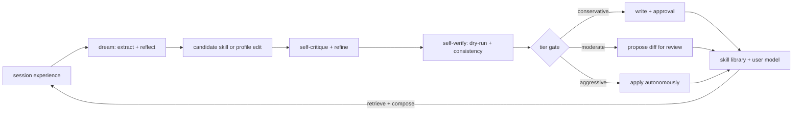

# 26. Self-evolution

> She gets better at *Brian* and at recurring work over time — by **accumulating skills** and
> **sharpening her model of him** — without (by default) rewriting herself. Grounded in Voyager
> (skills as an accumulating, self-verified code library), Reflexion (learn from experience via
> reflection stored in memory), and Self-Refine (critique-and-refine before committing) — and
> deliberately bounded away from the Gödel-machine extreme (full self-rewrite).

Reference: **Hermes Agent's self-evolution** — which is the **current TempestMiku itself** (§29).
Realized as the **skills-generation loop** + user-model refinement, governed so identity never drifts.

## 26.0 Design stance — four pillars (three we adopt, one we refuse)

- **Skill library as code** (Voyager, Wang et al. 2023): recurring workflows are distilled into
  reusable `skills/` playbooks, **indexed by description embeddings**, **retrieved and composed** on
  later runs. The library **grows**, so she stops re-deriving the same workflow each time (Voyager's
  anti-catastrophic-forgetting result). §22 dreaming *produces* them; `skills.*` (§07) imports them.
- **Learn from experience** (Reflexion, Shinn et al. 2023): **verbal** reflection over what happened,
  stored in memory (§22) as a "semantic gradient" for next time — **no weight updates**, fully
  replayable. This is exactly the §22 reflect step, reused here as the learning signal.
- **Critique before commit** (Self-Refine, Madaan et al. 2023): a candidate skill or profile edit is
  **self-critiqued and refined** before it is written or surfaced — a quality gate, not a raw dump.
- **Bounded, not Gödelian** (Gödel machine, Schmidhuber 2003 — the extreme we *refuse*): a Gödel
  machine rewrites *any* part of its own code once it can **prove** the rewrite raises utility. We have
  no such proof and want no unbounded self-rewrite. So **identity (SOUL) is hand-owned**, write-
  authority is **attenuated by tier** (least authority), and **human review stands in for the proof**.

**Division of labor:** §22 *produces* candidates (dreaming: extract → reflect → summarize → distill);
§26 *governs* them (what may be written, how it's reviewed, how it's bounded).

Everything self-evolution writes is a **human-readable file** (`memory://`, `skills/`) Brian can read,
edit, or delete; everything is replayable (principle #6).

## 26.1 What evolves

- **Skills** — Voyager-style: §22 Phase-2 dreaming distills recurring workflows into `skills/`
  playbooks (embedding-indexed; retrieved + composed via `skills.*`, §07). A new skill is
  **self-verified** (Self-Refine critique + a dry-run / consistency check) **before** it is committed.
- **User model** — the facts / profile store of Brian (§22) sharpens with each dream (Reflexion:
  reflections about his preferences and patterns are stored and recalled).
- **Explicitly NOT, by default** — SOUL identity, persona presets, mode definitions, capability config.
  This is the Gödel-machine territory we bound off; it is reachable **only** by raising the tier.

## 26.2 Current substrate (the evolution baseline)

The conservative tier writes to exactly what exists today (§29):

- the **7 hand-authored skills** — `miku-voice`, `ambiguity-grill`, `negative-state-grounding`,
  `oh-my-pi-handoff`, `personal-assistant-state-capture`, `scope-guard`, `weekly-ship-ledger`;
- the **user-profile / facts store** (§22).

Dreaming *adds to* these substrates; it doesn't invent a new one. Skill / memory writes honor
`write_approval: true` + `skills.write_approval: true` (§27.6 / §22.8) — even conservative writes can
be approval-gated by config.

## 26.3 Write-scope tiers (decision: user-selectable) — least-authority framing

A config knob (`self_evolution.tier`); capabilities are config (§10.4, principle #9). **Default
conservative.** Tiers are **attenuated write-capabilities** (object-capability least authority, cf.
§24): the gate sits at the **config / registry boundary**, not in a prompt — a lower tier
**physically cannot** reach a higher tier's targets.

| Tier | May write | Applied |
|---|---|---|
| **conservative** (default) | long-term memory / user-model, `skills/` | auto (dreaming), subject to `write_approval` — the Voyager + Reflexion loop, fully on |
| **moderate** | + *proposals* to persona presets / mode addenda (§21) / playbooks | **after Brian's review** (Self-Refine'd diffs) |
| **aggressive** | + its own prompts / personas / capability config | autonomously — the Gödel-machine-adjacent extreme |

- **conservative never touches the SOUL identity or modes** — protecting the §20 non-goal from drift.
  (`SOUL.md` stays authoritative and hand-owned unless Brian opts into a higher tier — and even then,
  he edits identity himself.)
- **aggressive** requires explicit enable + a full audit trail (§12); recommended **off**.

## 26.4 Review surface

`moderate` proposals land as **reviewable diffs** (clients, §27.1 / §27.4) against `persona` /
`modes` / `skills` config, surfaced as `write_proposal` events (§27.1). Accept / reject; accepted
edits are versioned and replayable (#6). **This human-in-the-loop is what stands in for the Gödel
machine's proof obligation** — Brian's approval, not a formal proof, certifies a self-change.

## 26.5 Crate layout

Self-evolution is **not a new crate** — it's a **policy layer** spanning existing ones:

- `tm-memory::dream` (§22.10) — *produces* candidates: extract / reflect / summarize / distill skill;
  the Self-Refine self-critique pass; redaction before any disk write.
- `tm-host` skills registry (`skills.*`, §07) — the **Voyager skill library**: store / embedding-index
  / retrieve / compose.
- `tm-server` (§27) — **tier enforcement** at the config / registry boundary; the review surface
  (`write_proposal` events §27.1); the audit trail (§12).
- config — `self_evolution.tier` (+ the `write_approval` knobs, §26.2).

## 26.6 Failure modes & degradation

- **Low-value skill distilled** — the Self-Refine critique + self-verify gate it; if one slips through
  it's a readable file Brian deletes, and retrieval ranking demotes never-used skills.
- **Skill-library bloat** — embedding-indexed retrieval surfaces only relevant skills; dreaming
  dedups / consolidates them (§22.5).
- **Profile drift / wrong fact** — bi-temporal supersede (§22, Zep lineage); Brian edits `memory://`.
- **Tier misconfig** — default is conservative; aggressive needs explicit enable; lower tiers
  **fail closed** — they cannot reach higher-tier targets.
- **Approval timeout** — the write is deferred / denied (§27.6) and the loop continues; nothing
  self-applies under conservative without the gate.

## 26.7 Mechanism provenance

| We adopt | From | For |
|---|---|---|
| skill library as accumulating, embedding-indexed, composable **code**; **self-verify before commit** | **Voyager** (Wang et al., 2023) | `skills/` generation + retrieval |
| learn-from-experience via **verbal reflection** stored in episodic memory | **Reflexion** (Shinn et al., 2023) | the learning signal (§22 reflect) |
| **self-critique → refine** before committing / surfacing | **Self-Refine** (Madaan et al., 2023) | the quality gate |
| the full-self-rewrite extreme we **bound off** (identity hand-owned, tiers, human review vs proof) | **Gödel machine** (Schmidhuber, 2003) | why tiers + conservative default |
| tiers as **attenuated write-capabilities** (least authority) | object-capability model (§24) | the tier boundary |
| candidate production (dreaming), write-approval, replay | §22 + Oh My Pi + #6 | the governed loop |

---

**Sources** (verified 2026-06-26): Guanzhi Wang et al., *Voyager: An Open-Ended Embodied Agent with
Large Language Models* (**arXiv 2305.16291**, 2023 — automatic curriculum; a **skill library** of
executable code, embedding-indexed, stored / retrieved / composed; **iterative prompting with
self-verification** that commits only programs that pass). Noah Shinn et al., *Reflexion: Language
Agents with Verbal Reinforcement Learning* (**arXiv 2303.11366**, NeurIPS 2023 — verbal
self-reflection stored in an episodic memory buffer as a semantic gradient; no weight updates). Aman
Madaan et al., *Self-Refine: Iterative Refinement with Self-Feedback* (**arXiv 2303.17651**, NeurIPS
2023 — a single model generates → critiques → refines, training-free). Jürgen Schmidhuber, *Gödel
Machines: Fully Self-Referential Optimal Universal Self-Improvers* (**arXiv cs/0309048**, 2003 — rewrite
any own code only on a formal proof of higher utility; the unbounded self-rewrite extreme we refuse).
Object-capability least authority for the tier boundary (§24). **Decision holds: conservative default;
identity (`SOUL.md`) hand-owned; self-improvement is bounded skill + user-model growth, governed by
tiers + human review, never unbounded self-rewrite.**
