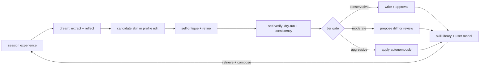

# 26. Self-evolution

> She gets better at *Brian* and at recurring work over time — by **accumulating skills** and
> **sharpening her model of him** — without (by default) rewriting herself. Grounded in Voyager
> (skills as an accumulating, self-verified code library), Reflexion (learn from experience via
> reflection stored in memory), and Self-Refine (critique-and-refine before committing) — and
> deliberately bounded away from the Gödel-machine extreme (full self-rewrite).

Reference: **Hermes Agent's self-evolution** — which is the **current TempestMiku itself** (§29).
Realized as the **skills-generation loop** + user-model refinement, governed so identity never drifts.

## 26.0 Design stance — four pillars (three we adopt, one we refuse)

- **Skill library as code** (Voyager, Wang et al. 2023): recurring workflows are distilled into
  reusable `skills/` playbooks, **indexed by description embeddings**, **retrieved and composed** on
  later runs. The library **grows**, so she stops re-deriving the same workflow each time (Voyager's
  anti-catastrophic-forgetting result). §22 dreaming *produces* them; future `skills.*` (§07)
  imports them.
- **Learn from experience** (Reflexion, Shinn et al. 2023): **verbal** reflection over what happened,
  stored in memory (§22) as a "semantic gradient" for next time — **no weight updates**, fully
  replayable. This is exactly the §22 reflect step, reused here as the learning signal.
- **Critique before commit** (Self-Refine, Madaan et al. 2023): a candidate skill or profile edit is
  **self-critiqued and refined** before it is written or surfaced — a quality gate, not a raw dump.
- **Bounded, not Gödelian** (Gödel machine, Schmidhuber 2003 — the extreme we *refuse*): a Gödel
  machine rewrites *any* part of its own code once it can **prove** the rewrite raises utility. We have
  no such proof and want no unbounded self-rewrite. So **identity (SOUL) is hand-owned**, write-
  authority is **attenuated by tier** (least authority), and **human review stands in for the proof**.

**Division of labor:** §22 *produces* candidates (dreaming: extract → reflect → summarize → distill);
§26 *governs* them (what may be written, how it's reviewed, how it's bounded).

Everything self-evolution writes is human-readable through `memory://` or `skill://`; managed skill
versions are immutable and changed only by approval-backed activation/rollback. Everything remains
auditable and replayable (principle #6).

## 26.1 What evolves

- **Skills** — Voyager-style: §22 dreaming distills recurring workflows into `skills/`
  playbooks (trigger-retrieved and prompt-composed from the managed catalog; richer embedding
  retrieval and `skills.*` remain future work, §07). A new skill is
  **self-verified** (Self-Refine critique + a dry-run / consistency check) **before** it is committed.
- **User model** — the facts / profile store of Brian (§22) sharpens with each dream (Reflexion:
  reflections about his preferences and patterns are stored and recalled).
- **Environment cognition** — project-scoped dreaming abstracts active procedural policies into one
  declarative, versioned environment record. It is read-only derived state, not an identity or
  capability change, and Serious Engineer pulls it explicitly through
  `project://<id>/environment` with `resources.read:project`.
- **Explicitly NOT, by default** — SOUL identity, persona presets, mode definitions, capability config.
  This is the Gödel-machine territory we bound off; it is reachable **only** by raising the tier.

## 26.2 Current substrate (the evolution baseline)

The conservative tier writes to exactly what exists today (§29):

- the **6 hand-authored skills** — `miku-voice`, `ambiguity-grill`, `negative-state-grounding`,
  `personal-assistant-state-capture`, `scope-guard`, `weekly-ship-ledger`;
- the **user-profile / facts store** (§22).

Dreaming *adds to* these substrates; it doesn't invent a new one. Skill / memory writes honor
`write_approval: true` + `skills.write_approval: true` (§27.6 / §22.8) — even conservative writes can
be approval-gated by config.

## 26.3 Write-scope tiers — least-authority framing

A config knob (`self_evolution.tier`); capabilities are config (§10.4, principle #9). The supported
tiers are `off`, `conservative`, and `moderate`. The compatibility-preserving fail-closed default is
`conservative`, matching the approval-backed memory and skill-proposal behavior; deployments can
explicitly select `off`. `aggressive` is reserved but **unsupported** and
fails deserialization/startup rather than silently falling back. Tiers are **attenuated
write-capabilities** (object-capability least authority, cf. §24): the shared policy lives in
`tm-host`, so config validation and effect dispatch use the same matrix rather than prompt or client
logic.

Targets are typed classes, never paths:

| Tier | `profile_fact` | `scoped_memory` | `skill_proposal` | `persona_proposal` | `mode_proposal` |
|---|---|---|---|---|---|
| **off** | deny | deny | deny | deny | deny |
| **conservative** (default) | reachable | reachable | reachable | deny | deny |
| **moderate** | reachable | reachable | reachable | approval required | approval required |

"Reachable" is only the tier upper bound. The exact registered capability, per-turn grant, payload
validation, and applicable write approval still must pass. Persona or mode activation also requires
its separate immutable versioned apply contract; review alone grants no file-write authority.
`SOUL.md`, prompts, capability configuration, source code, deployment configuration, and arbitrary
filesystem paths have no target class and cannot be dispatched through this contract.

Stable policy reason codes are `evolution_disabled`, `evolution_insufficient_tier`,
`evolution_aggressive_unsupported`, `evolution_unknown_target`,
`evolution_approval_required`, `evolution_stale_approval`, and `evolution_invalid_payload`.

The version-1 proposal envelope carries only proposal/origin identifiers, a typed target, a bounded
1 KiB preview, a SHA-256 digest, a byte count, and a capability-gated `memory://`, `artifact://`, or
`blob:sha256:` resource reference. Target identifiers are bounded opaque names and reject `/`, `\\`,
`:`, dot traversal, and control characters during deserialization. The matching audit wire record
carries provenance, configured tier, decision, approval/effect identifiers, status, timestamps, and
digest but no full candidate body. Unknown enum values fail closed; unknown object fields are ignored
for compatible additive evolution of the versioned envelope.

Tier enforcement threads the effective tier through HTTP proposal creation, personal state capture,
dream-generated memory/skill proposals, synchronous approval resolution, and the
supervised approval-effect worker. Durable `memory_write` and `skill_write` effects persist typed
evolution metadata containing their creation tier and target. Immediately before an approved
mutation, the server derives the target again from the actual payload, requires an exact metadata
match, re-evaluates the current tier, and heartbeats the owner/epoch-fenced effect lease. Missing,
unknown, mismatched, downgraded, or stale effects fail with stable policy codes before memory or
proposal state changes. Denied and timed-out approvals may still finalize their review state, but
never write the target. Tier checks remain orthogonal to exact capability grants and manual approval;
they add an upper bound and grant nothing themselves.

Audit history is an append-only projection of the existing approval/effect source of truth, not a
competing state machine. Migration 11 creates bounded `evolution_audits` rows and backfills one
snapshot for pre-existing typed effects. New proposal attempts, terminal approval resolutions,
applied effects, and failed attempts append idempotency-keyed records in the same Store transaction as
the corresponding request/effect transition. Each row contains only typed provenance, target,
configured tier, decision, digest, stable identifiers/status/error code, and timestamps. Candidate
bodies stay in the existing durable effect/proposal store: memory candidates are readable through
the capability-gated `memory://evolution-proposals/<id>` resource, and skill candidates through
`memory://skill-proposals/<id>`. Replayable `write_proposal` and approval scopes carry only a
redacted 512-byte preview, SHA-256 digest, and resource URI; they do not duplicate the full body.
The active session's bounded typed history is queryable through the same capability boundary at
`memory://evolution-audits`.

## 26.4 Review surface

`moderate` proposals land as **reviewable typed diffs** (clients, §27.1 / §27.4) for persona or mode
addenda, surfaced as `write_proposal` events (§27.1). Accept / reject always updates durable review
state; activation occurs only through the separately proven immutable versioned apply contracts
described below. **This human-in-the-loop is what stands in for the Gödel machine's proof
obligation** — Brian's approval, not a formal proof, certifies a proposed self-change.

The review endpoint is `POST /sessions/:id/evolution/review-proposals`. The request accepts only a
tagged `persona` or `mode` target plus typed addendum sections; serde rejects path fields and raw patch
payloads. Persona proposals may contain only behavior/voice guidance, while mode proposals may
contain only description/routing guidance. The server snapshots a version and digest from the loaded
persona/mode assets, bounds the complete change set to 8 KiB and 16 changes, persists it in migration
12, and emits only a redacted 512-byte preview, digest, and
`memory://review-proposals/<id>` link. Full before/after metadata remains behind
`resources.read:memory`.

Every Moderate proposal creates a durable manual approval; no auto-approve branch exists. Persona
and mode proposals use only their matching versioned addendum apply contract when the corresponding
managed root is configured. Immediately before either outcome, the effect rechecks the current tier,
typed target, proposal digest, live base profile digest, and active addendum digest. A tier downgrade,
forged payload, changed base, or stale pointer fails closed. Flutter/Web renders the same server-owned
approval and `write_proposal` lifecycle, opens the resource link, and lets server timeout events own
default-deny semantics.

Mode addenda apply only typed `description` and `routing_guidance` changes. The approved version is written
beneath the configured managed-mode-addendum root as immutable digest-addressed metadata, then a
per-mode `active.json` pointer is atomically replaced under a cross-process lock. The next prompt
composition reads the active version and adds an **Approved mode addendum** section. The base
`ModeProfile` remains byte-for-byte authoritative for capabilities, active skills, label, and route
triggers; `SOUL.md` and the hand-authored `modes.json` are never mutated. Session project and memory
policy are outside the mode profile and outside this evolution path.
Rollback is a separate durable manual approval and may activate an older immutable version
or restore the unmodified base catalog. Deny, timeout, stale base/pointer, malformed sections,
symlinks, and retries cannot change the active pointer.

**Skill candidate path:** post-session dreaming can distill a reusable workflow into a
`SkillProposalRecord` with name, description, trigger/use criteria, `SKILL.md`-style body, evidence
links, self-critique, verification checks, status, dedupe key, and source dream/session ids. The
proposal emits `write_proposal` with `kind: "skill"` and uses the shared approval/default-deny path.
Rejection or timeout leaves it pending/denied/timed-out without mutating the live catalog. Low-value
sessions do not create skill proposals, and candidates that fail self-verification emit a replayable
`skill_proposal_rejected` dream progress event instead of failing the whole dream or surfacing an
unsafe proposal. Completed dream re-runs reuse the existing queued dream/skill records and do not
duplicate skill approvals. The constrained candidate resource remains
`memory://skill-proposals/<id>`.

`SkillProposalRecord` is the only candidate format. `memory://skill-proposals` lists session
proposals, and read/preview expose the capability-gated candidate plus a deterministic lifecycle
descriptor: normalized identity, version, redacted SHA-256 digest, dream/session provenance,
reject-on-name-collision policy, immutable-version rollback contract, and catalog state. Validation
bounds the body and references, requires the title/Trigger/Procedure/Guardrails shape, rejects
traversal/absolute/schemed references and affirmative requests for prohibited authority, and marks
unqualified candidates `installable: false`. There is no path from the conservative evolution target
to `fs.write`, `fs.patch`, `fs.move`, `fs.remove`, or a hand-authored skill.

The managed-skill contract enables only the proven proposal-backed subset. An approved `skill_write`
effect revalidates the current tier, typed target, proposal provenance, candidate digest, and successful
self-verification before installing `<root>/<name>/versions/<sha256>/SKILL.md` plus its manifest. Version
directories are immutable, names colliding with bundled or hand-authored skills are rejected, and an
atomic `active.json` pointer selects the live version. `ModesConfig` reads that pointer on the next
prompt composition and adds the stored triggers to the layered catalog; it does not mutate process-global
state or broaden mode capabilities. Deny, timeout, tampered content, stale effects, invalid names/paths,
symlinks, and retries leave the active pointer unchanged.

Rollback is a separate durable manual approval created by
`POST /sessions/:id/evolution/skills/:name/rollback`. Its effect requires both the expected current
digest and a target digest already present in the same proposal-backed immutable version set, then
atomically swaps the pointer after the same tier/provenance re-check. The authenticated client gateway
and native tm resource registry expose `skill://`, active entries, version metadata, and immutable
version bodies from that catalog; native reads require `resources.read:skill`. The `skills.*`
namespace, MCP import/reload, arbitrary filesystem writes, persona apply, direct mode
file/capability changes, and aggressive evolution remain disabled.

**Persona-addendum contract:** the durable review path has a separate immutable
persona-addendum catalog. Only typed tone, address, and interaction-preference sections can receive
the `versioned_persona_addendum` apply contract. Approval atomically activates a digest-addressed
version, the next prompt composes it after the hand-authored `SOUL.md`, and a separate durable manual
approval rolls back to an older proposal-backed version or the hand-authored base. Legacy
behavior/voice review sections remain readable but cannot activate.

Unlocked Auto-mode turns at the Moderate tier can detect a small typed set of repeated owner
preferences or explicit persona mismatches after a turn completes. Repeated preferences require two
distinct active, included typed memory records with evidence; an explicit correction requires one. Detection
is bounded to five retrieval candidates and stores at most three evidence records with bounded,
redacted references. Legacy lexical recall and records lacking current evidence cannot drive a
candidate. A stable normalized SHA-256 key deduplicates pending/approved candidates and imposes a
seven-day cooldown after terminal outcomes. PostgreSQL serializes the check and insert with a
transaction-scoped advisory lock acquired before the duplicate query, so separate server instances
cannot race the same candidate into existence.

Auto mode decides only *when to propose*, never when to approve or activate. The proposal records a
stable base digest and uses the same durable manual approval/default-deny, stale-base, immutable
version, next-turn composition, and separate rollback path as a manual proposal. `SOUL.md`, core
Miku identity, safety rules, capabilities, route triggers, source code, configuration, and
deployment remain immutable. Session project and memory policy remain explicit owner controls and
cannot be proposed or changed by Auto mode. Auto approval, aggressive evolution, and direct
persona-file writes are permanent non-goals. The exact acceptance matrix is in the
[persona-addendum evidence note](../../evidence/2026-07-18-p7-2b-persona-addenda.md).

## 26.5 Crate layout

Self-evolution is **not a new crate** — it's a **policy layer** spanning existing ones:

- `tm-memory::dream` (§22.10) — *produces* candidates: extract / reflect / summarize / distill skill;
  the Self-Refine self-critique pass; redaction before any disk write.
- `tm-modes` managed catalog and `skill://` resource handler (§07) — immutable versions, atomic active
  pointers, trigger retrieval, and prompt composition. A future `skills.*` namespace or embedding
  index needs a concrete consumer and separate contract.
- `tm-server` (§27) — **tier enforcement** at the config / registry boundary; the review surface
  (`write_proposal` events §27.1), typed review persistence, base/digest revalidation, and the audit
  trail (§12).
- `tm-modes` — typed persona/mode addendum targets, managed-skill catalog, the immutable
  guidance-only mode-addendum catalog, and the immutable persona-addendum catalog; no direct persona
  file, capability, or hand-authored mode-file write authority.
- config — `self_evolution.tier` (+ the `write_approval` knobs, §26.2).

## 26.6 Failure modes & degradation

- **Low-value skill distilled** — Self-Refine + self-verification gate it; if an approved version still
  underperforms, Brian uses the approval-backed rollback to another immutable version.
- **Skill-library bloat** — embedding-indexed retrieval surfaces only relevant skills; dreaming
  dedups / consolidates them (§22.5).
- **Profile drift / wrong fact** — bi-temporal supersede (§22, Zep lineage); Brian edits `memory://`.
- **Tier misconfig** — default is conservative for source-deployment compatibility; aggressive and
  unknown values are rejected; lower tiers **fail closed** — they cannot reach higher-tier targets.
- **Approval timeout** — the write is deferred / denied (§27.6) and the loop continues; nothing
  self-applies under conservative without the gate.

## 26.7 Mechanism provenance

| We adopt | From | For |
|---|---|---|
| skill library as accumulating, embedding-indexed, composable **code**; **self-verify before commit** | **Voyager** (Wang et al., 2023) | `skills/` generation + retrieval |
| learn-from-experience via **verbal reflection** stored in episodic memory | **Reflexion** (Shinn et al., 2023) | the learning signal (§22 reflect) |
| **self-critique → refine** before committing / surfacing | **Self-Refine** (Madaan et al., 2023) | the quality gate |
| the full-self-rewrite extreme we **bound off** (identity hand-owned, tiers, human review vs proof) | **Gödel machine** (Schmidhuber, 2003) | why tiers + conservative default |
| tiers as **attenuated write-capabilities** (least authority) | object-capability model (§24) | the tier boundary |
| candidate production (dreaming), write-approval, replay | §22 + Oh My Pi + #6 | the governed loop |

---

**Sources** (verified 2026-06-26): Guanzhi Wang et al., *Voyager: An Open-Ended Embodied Agent with
Large Language Models* (**arXiv 2305.16291**, 2023 — automatic curriculum; a **skill library** of
executable code, embedding-indexed, stored / retrieved / composed; **iterative prompting with
self-verification** that commits only programs that pass). Noah Shinn et al., *Reflexion: Language
Agents with Verbal Reinforcement Learning* (**arXiv 2303.11366**, NeurIPS 2023 — verbal
self-reflection stored in an episodic memory buffer as a semantic gradient; no weight updates). Aman
Madaan et al., *Self-Refine: Iterative Refinement with Self-Feedback* (**arXiv 2303.17651**, NeurIPS
2023 — a single model generates → critiques → refines, training-free). Jürgen Schmidhuber, *Gödel
Machines: Fully Self-Referential Optimal Universal Self-Improvers* (**arXiv cs/0309048**, 2003 — rewrite
any own code only on a formal proof of higher utility; the unbounded self-rewrite extreme we refuse).
Object-capability least authority for the tier boundary (§24). **Decision holds: conservative default;
identity (`SOUL.md`) hand-owned; self-improvement is bounded skill + user-model growth, governed by
tiers + human review, never unbounded self-rewrite. The conservative default grants no moderate or
aggressive mutation authority.**
