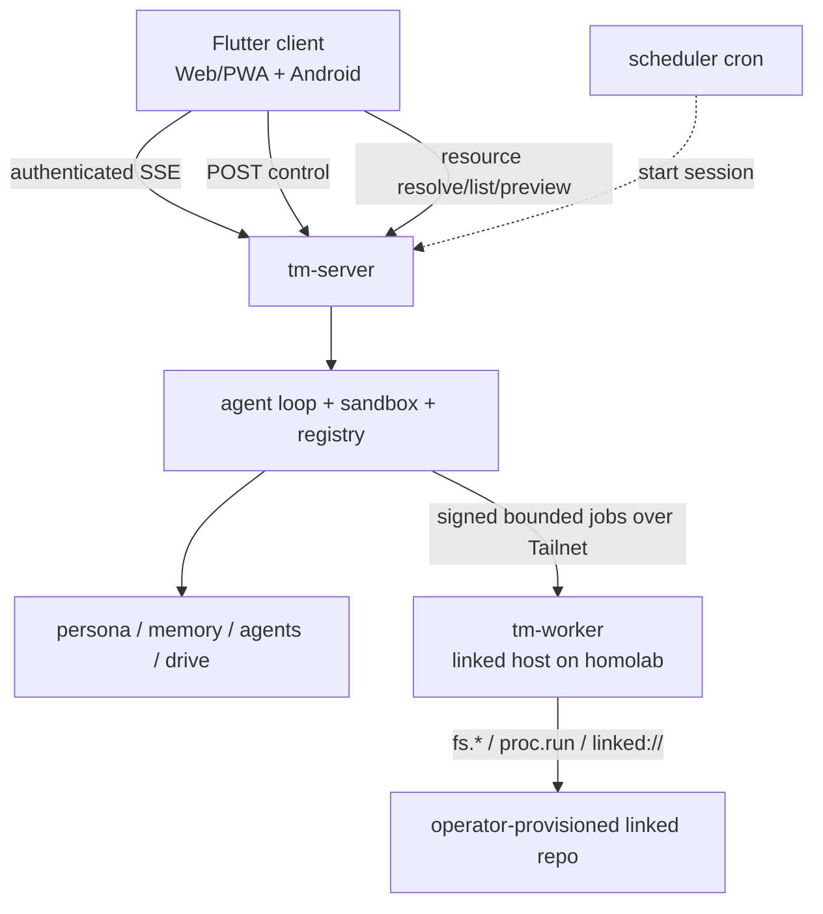

# 27. Server, scheduler & clients

> A headless, single-user, self-hosted daemon; one Flutter client targets Web/PWA and Android over
> the same authenticated streaming API. Grounded in two proven primitives: **Server-Sent Events**
> (the server pushes tokens / events down one long-lived connection) and **cron** (the companion is
> proactive on a schedule).

The core declared UI / deployment out of scope (design README). This is the deliberate expansion
(decision A): the Rust core runs as a long-lived service; clients are thin views over its event stream.

**Implementation status (2026-07-20):** the server/API and historical client acceptance evidence
remain valid. A runnable Flutter/Web presentation layer now uses the retained typed Dart HTTP/SSE
transports and platform bridges. Chat, durable turns, sessions, projects, scoped Drive/resources,
reviewed changes, approvals, Mode controls, runtime activity, protected settings, voice, and the
notification bridge are connected as described in §27.4.1. That table records the current local
software boundary, including the restored reviewed camera-QR flow; it does not replace or extend
signed physical acceptance evidence.

## 27.0 Design stance

- **Transport = Server-Sent Events** (WHATWG `text/event-stream` wire format). One long-lived HTTP
  connection, **unidirectional** server→client, resumed with `Last-Event-ID`. Native and Web use a
  generic authenticated fetch-stream decoder rather than browser `EventSource`, so bearer headers and
  one numeric-dedup path work on both targets. Chosen over WebSocket because the agent loop is
  **push-dominant** — tokens, cell
  events, mode changes, and approval prompts stream *out*; the client's input (send a message, lock a
  mode, resolve an approval) is **discrete** and fits plain POSTs. SSE is HTTP-native, proxy- and
  HTTP/2-friendly, and **resumable** — which lines up with the core's streaming-first LlmClient (§04)
  and `EventSink` (§05 / §10).
- **Scheduled proactivity = cron** (Vixie cron, 1987; the de-facto Unix scheduler, five-field
  crontab). `worker`/`all` roles supervise the weekly ship ledger scheduler with fenced leases,
  bounded catch-up, exact capabilities, and `cron_mode: deny`; prompt text is never the boundary.
- **Replayable** (core principle #6): every client surface is a **view over one ordered event
  stream**, so a session can be resumed, audited, and reproduced.
- **No on-device sandbox** (decision A): tm-lang stays on the server; clients never execute code.

## 27.1 `tm-server` & the session event stream

Wraps the agent loop (§05 / §10) as a long-lived service; owns authentication, durable session/turn
lifecycle, the capability registry, and the product subsystems (mode router §21, memory §22, agents
§23, drive §24, scheduler §27.2). It does not fork a second execution loop.



There is exactly one authoritative `tm-server` in the production topology: lumo owns auth,
sessions, Postgres state, memory, model calls, SSE, capability grants, and approval decisions.
Homolab runs `tm-worker`, not a second `tm-server`. The worker has no client API, model, persona,
memory authority, scheduler, or independent approval policy; it is a bounded remote implementation
of the existing host/resource traits. `tm-server`'s internal `api|worker|all` supervision roles still
refer to durable turn/dream/cron processing inside the coordinator and are unrelated to the external
`tm-worker` binary.

The v1 coordinator/worker contract is deliberately asymmetric:

- lumo creates UUID job ids and sends exact per-turn grants and scope through a versioned JSON
  envelope authenticated with HMAC-SHA256, timestamp, nonce, method, path, and body digest;
- homolab accepts plain HTTP only on loopback or Tailnet addresses, rejects replayed nonces and
  mismatched worker identity/protocol, and persists each state transition in an atomic job ledger;
- approval-gated host calls pause in `awaiting_approval`; only lumo may resolve the exact action
  digest through the existing user approval broker;
- retries with the same job id return the durable status instead of executing twice; interrupted
  non-terminal work becomes `indeterminate` after restart and is never silently replayed;
- worker artifacts cross the authenticated boundary with exact size/SHA-256 verification and are
  re-homed into the coordinator session artifact namespace; cancellation is forwarded best-effort;
- when homolab is asleep or unavailable, the host call fails visibly. There is no local linked-host
  fallback on lumo and no master/slave election or peer-to-peer worker coordination.

A session is one long-lived SSE stream, but the event name is deliberately singular:

```text
event: session_event
id: <durable numeric sequence>
data: {"type":"text","turnId":"<uuid-or-null>","payload":{...},"createdAt":"<rfc3339>"}
```

`type` carries core and product variants (`text`, `tool_call`, `cell_start`, `cell_result`, `mode`,
`approval`, `write_proposal`, dream/cron lifecycle, `final`, `runtime_reset`, `error`, and
`session_end`). Native/Web clients use a generic fetch-stream decoder and numeric sequence
deduplication; there is no named-event compatibility stream.

- **Resumability.** `Last-Event-ID` is the last durable sequence. Replay captures a high-water mark,
  then drops live events at or below it. Broadcast lag refills from Postgres after the last delivered
  sequence, and API-only processes poll the same store so worker-process deltas are visible without an
  in-process sender. The connection stays open across turn `final` events and closes only after
  `session_end`.
- **Durable control plane.** `POST /sessions/:id/messages` requires
  `{clientMessageId, content}` and returns `202 {turnId, clientMessageId, status:"queued"}`.
  `UNIQUE(session_id, client_message_id)` makes equal retries idempotent and conflicting content a
  `409`; `GET /sessions/:id/turns/:turnId` reports completion. One turn runs at a time per session,
  while workers process different sessions concurrently. Queued turns resume after restart; stale
  running turns fail rather than replay possible side effects.
- **History/runtime recovery.** A turn restores the newest 40 complete messages within 128 KiB into
  the sole core loop. tm interpreter state is thread-affine and not snapshotted: restart or TTL
  eviction opens a clean session and emits `runtime_reset`, never re-executing old cells. Structured
  runtime events that guard state transitions wait for durable sink acknowledgement; any turn that
  fails its event/storage boundary discards the cached interpreter so unconfirmed ephemeral state
  cannot leak into a retry. A successful live interpreter is still quarantined until the exact
  durable turn completes in the store. The dispatcher then explicitly promotes it; completion or
  ownership-heartbeat failure cancels, awaits, and evicts that turn's shard state before a
  same-session retry is eligible.
- **Single-owner auth.** `auth_devices` stores revocable hashed credentials. Android sends bearer
  auth on every request/SSE; Web uses the same device through a Secure/HttpOnly/SameSite=Strict cookie
  plus origin-based CSRF checks. Pairing codes are hashed, single-use, random 256-bit values with a
  five-minute expiry. The QR/browser form carries only the one-time code and origin; no bearer
  credential enters a URL, HTML, event, or log. Trusted forwarded headers are accepted only from
  configured proxy CIDRs.
- **Deployment boundary.** Production binds loopback behind an HTTPS reverse proxy or Tailscale
  Serve; setting a public URL never makes raw HTTP secure. Postgres is required outside loopback and
  for `worker`/`all`. The only non-loopback HTTP escape is a debug-build emulator override.

### 27.1.1 Postgres test gate

Production schema evolution is an ordered, checksummed `schema_migrations` ledger. Migrations upgrade
the existing pre-ledger schema in place and backfill owner/global authority; already-applied SQL is
never rewritten or destructively recreated. Startup fails if a checksum differs or a migration does
not apply. Postgres is mandatory outside loopback and for `worker`/`all` roles.

Normal `cargo test` stays external-service-free: server persistence tests use the in-memory store unless
Postgres coverage is explicitly enabled. The gated suite covers migration/backfill checksums, durable
turn/event replay, approval outbox effects, profile/recall rows, FTS, fenced dream/cron claims,
transactional session end, drive metadata/link tombstones, and cross-store stale-owner rejection. Run:

```sh
TM_POSTGRES_TESTS=1 TM_TEST_DATABASE_URL=postgres://... cargo test -p tm-server
```

`TM_TEST_DATABASE_URL` is preferred for tests; if it is absent, the tests fall back to
`TM_DATABASE_URL`. Without `TM_POSTGRES_TESTS=1`, the gated Postgres tests return early and do not
open a network or local database connection. The memory coverage exercises approve, deny,
timeout/default-deny, durable-write idempotency, replay, and both profile-fact and scoped-recall
record types through the normal HTTP approval route.

## 27.2 Scheduler & proactivity

General-mode turns can propose reminder and open-loop recall chunks through the existing
`write_proposal` + approval path. Approved entries are memory records visible through `memory://`;
they are not background jobs and never push on their own.

A **scheduler** (cron lineage) can start sessions on a schedule. The registered job is the
**weekly ship ledger** (`weekly-ship-ledger` skill, §29); deadline nudges and the drive organizer are
not registered scheduler jobs. The drive organizer's durable manual/proposal flow lives in §24;
automatic scheduled organizer policy remains an explicit future enablement.

- **Dream queue + worker:** `POST /sessions/:id/end` marks a session `ended`, writes an idempotent
  durable `dream_queue` record, and emits `session_end` + `dream_queued` in the same transaction. The server-owned
  `ServerDreamWorker` / `DreamWorkerDaemon` leases ready dreams with exact owner/epoch fencing, loops on a
  poll interval with configured concurrency, exits on shutdown, emits replayable `dream_started` /
  `dream_progress` / `dream_completed` / `dream_failed`, writes a bounded `memory://summaries/<id>`
  session summary, and emits approval-gated memory/skill `write_proposal` events without blocking
  normal chat turns.
- **Scheduler tables:** `cron_jobs` stores cron-style job definitions, bounds, `next_run_at`, and
  enabled state; `cron_runs` stores run history, status, result JSON, linked session id, and fenced
  lease state. Materializing a due fire and advancing `next_run_at` is one cursor-CAS transaction;
  `UNIQUE(job_id, scheduled_for)` prevents duplicate fires across scheduler processes. Execution is
  leased separately by exact owner/epoch, with heartbeat, stale reclaim, timeout, and three-attempt
  terminal failure. Missed-run catch-up is bounded from the stored schedule cursor; callers choose a
  `max_catch_up` count (the weekly ship ledger uses a single-fire policy) rather than backfilling
  unbounded offline history.
- **Bounds.** Scheduled runs honor `goals.max_turns` (baseline **8**), bounded missed-run catch-up
  (baseline **1**), the proactivity bounds (§21.3), and an exact background grant set with no
  mode/host authority beyond fixed core reads. `cron_mode: deny` disables approval waits in code,
  not merely in the prompt;
  `script_timeout_seconds` is capped at **120** (§29).
- **Visibility.** Dream and scheduled runs emit through the same `session_events` / SSE replay log,
  so they are streamed, audited, and replayable like interactive turns (#6). The session resource
  gateway exposes `cron://`, `cron://<job>`, `cron://<job>/runs`, and `cron://<job>/runs/<run>` for job
  definitions and run history.
- **Supervision.** `worker` and `all` roles supervise the turn dispatcher, approval expiry/effects,
  dream worker, and scheduler. They require Postgres, stop claiming on SIGINT/SIGTERM, keep
  heartbeats alive while draining, and abort remaining work after 30 seconds. `api` serves only the
  authenticated HTTP/SSE plane.

## 27.3 Model roles

The config carries a **model-role / alias system** (principle #9 — config, not code). `tm-llm` (§10)
gains **role resolution + the existing fallback chain** (default `gpt-5.5` → fallback `gpt-5.4-mini`);
the outbound call is OpenAI-compatible chat completions (§11, `api_mode: chat_completions`).

- **Primary aliases** (§29): `daily` · `heavy` · `cheap` · `openai-heavy` · `coding-plan` ·
  `code-review` (→ a distinct `codex-auto-review` model).
- **Auxiliary roles** (10, mostly → `cheap` / `gpt-5.4-mini` with per-role timeouts + fallback
  chains): `compression`, `web_extract`, `title_generation`, `approval`, `skills_hub`, `mcp`,
  `triage_specifier`, `kanban_decomposer`, `profile_describer`, `curator`. Dream worker config
  exposes `extraction`, `reflection`, `summarization`, `skill_distillation`, `self_critique`,
  `verification`, and a reserved `embeddings` role; defaults keep dream auxiliary roles on `cheap`
  until a live-test configuration explicitly overrides them. Empty dream role names fail the dream
  visibly with `last_error` before summaries/proposals are written.
- **Resolution per call site.** Interactive turns → `daily` / `heavy`; engineer plan / review →
  `coding-plan` / `code-review`; memory / consolidation / aux passes → `cheap` / aux roles (§22);
  embeddings → the `embeddings` role (`api | local`, §22).
- **Memory provider note.** The baseline `memory.provider: honcho` is a **parity artifact**; in
  TempestMiku these roles resolve against the **self-built `tm-memory`** (§22) — the alias system is
  unchanged, the backend is ours.

**Current implementation boundary.** Interactive calls use the configured `OPENAI_MODEL`; the
dialectic pass currently uses that same client/model with its own no-tool, low-temperature, bounded
request. Dream role names are validated configuration, but the generic alias/fallback resolver
described above is not yet a deployed runtime switch. Documentation and live evidence must not claim
a dedicated cheap dialectic model until that resolver is wired.

## 27.4 Clients

- **Flutter client (single codebase).** One **project-manager and companion** client serves Web/PWA
  and Android: message input, streamed token rendering, final response, approval prompts,
  artifact/resource links, and project/open-loop views. The normal product surface
  uses Material 3 with restrained color and status chrome; content, dialogs, and long scrolling
  regions stay opaque for contrast and predictable rendering. An understated Miku presence mark and
  cyan palette preserve identity without turning normal chat into debug or character-art chrome.
  Light and dark definitions exist, `ThemeMode.system` is the default, and Settings persists an
  explicit system/light/dark choice on that installation with fail-safe rollback. Mode/skill-bundle
  state is read from the runtime `GET /modes` catalog and remains in advanced controls instead of
  returning as a default chat badge.
- **Conversation-first adaptive shell.** The transcript and composer are the only persistent center
  surface. The left overlay drawer is a navigation hub: Drive, Project, and History open dedicated
  full-page routes with independent loading/retry state, while Resources, reviewed changes, and
  Settings retain their bounded inspector/control surfaces. Mode, scope, approvals, and session
  state live in the right context drawer. Pairing is an explicit welcome/offline state rather than an
  error hidden inside chat, and the replacement UI reviews either a pasted one-time link or a strict
  v1 camera scan before exchange. Scanning only fills the review form and never auto-pairs. The same
  shell remains usable from a phone-sized browser because remote control of the computer-hosted agent
  is a first-class workflow.
- **Chat interaction contract.** A send attempt owns its `clientMessageId` in the UI before transport,
  retains the edited draft when submission fails, and reuses that id for an explicit retry so a
  transient network failure cannot create a second durable turn. The transcript keeps the assistant
  answer before its activity and reasoning details during both streaming and final states, avoiding a
  completion-time reorder. Markdown is selectable; fenced code and wide tables scroll horizontally,
  code exposes a reachable copy action, and only HTTP(S) links are rendered as bounded, copyable
  external references rather than gaining navigation or capability authority. New-message following
  stops when the user scrolls away and exposes an explicit jump-to-latest action.
- **Mobile remote control.** Phone/browser control uses the same server API as every client: SSE for
  tokens/events, POSTs for messages/mode locks/approval resolution, project assignment/linking (§30),
  and the session-scoped resource gateway (§09) for `artifact://`, `agent://`, `workspace://`,
  `linked://`, `project://`, `memory://`, `history://`, `cron://`, configured `drive://`, and managed
  `skill://` links. The phone is only a view and controller; the sandbox, host adaptor,
  linked-folder grants, and command execution stay on the server/host machine (§25). The memory
  gateway exposes `memory://root`, `memory://user-model`, exact approved profile/scoped recall
  records, dream queue and record previews, summaries, skill proposals, bounded typed-record/recall
  lists, exact `memory://records/<kind>/<id>`, and turn-linked `memory://recalls/<turn-id>` provenance.
  Evolution adds audit history and typed persona/mode review-proposal resources; managed skills and
  mode addenda expose immutable versions plus review/apply/rollback, with compact previews and
  fail-closed unknown paths (§22.9 / §26.4).
- **Android target.** The signed acceptance client uses an in-app camera
  scanner (`mobile_scanner` 7.2.0, bundled ML Kit) for versioned one-time pairing QR data. The current
  replacement reconnects that camera route with strict v1 parsing, permission/error/cancel states,
  lifecycle fencing, and the same reviewed exchange; a scan alone never pairs or changes authority.
  No exported Android intent filter accepts the `tempestmiku://pair?...` payload and URL-only target
  changes are disabled. Before exchange it confirms HTTPS origin, host, effective port, and device
  name. The origin-bound bearer token lives in `flutter_secure_storage` 10.3.1; server/session cursor
  preferences are cleared with the credential when origins change. The current Flutter 3.41.9 target
  supports Android API 24+, credential backup/transfer is excluded, release cleartext is disabled,
  and release builds require a configured non-debug key.
  Debug/profile retain emulator-only cleartext support. The provider-neutral push foundation binds
  encrypted registration secrets to existing device authority, materializes approval request and
  resolution deliveries through a leased Postgres outbox, and keeps provider payloads limited to
  opaque routing identifiers. Android background-SSE notifications expose Approve once / Deny;
  Android 12+ requires device authentication, older releases reopen the authenticated approval UI,
  and lock-screen content remains generic. The production UnifiedPush adapter accepts only encrypted
  Android endpoint/key envelopes under one configured HTTPS origin, refuses redirects, and sends
  RFC 8291 `aes128gcm` routing payloads to the self-hosted ntfy distributor. The connector's native
  service renders/cancels notifications while Flutter is killed. The signed Android 15 physical
  canary proved remote request delivery and timeout-resolution cancellation through the live lumo
  provider on 2026-07-14. The exported `ACTION_SEND` target accepts `text/plain` only: native
  parsing removes control characters, caps body/subject sizes, and forwards at most one cold-start
  payload to Flutter. The client presents an editable review sheet with no preselected destination;
  the user must explicitly choose the current or a new session before the send action is enabled and
  the client calls the same authenticated durable message API. It accepts no
  files, URI grants, HTML, pairing payloads, or automatic sends. The signed Android 15 physical
  canary on 2026-07-14 proved system Sharesheet discovery, URL preview/edit/cancel without sending,
  one durable import into the current session, one into a newly created session, and cold-start
  recovery without preview replay or duplicate sends. `ACTION_PROCESS_TEXT` / `text/plain` is
  registered on that same singleTop activity under the `Ask Miku` filter label. Native parsing reads
  only `EXTRA_PROCESS_TEXT`, rejects URI-bearing or mismatched payloads, applies the same sanitization
  and bounds, and tags the event as selected text. Flutter changes only the review copy; the editor,
  explicit current/new-session choice, and authenticated durable send path remain shared with the share target.
  It never returns replacement text to the source app or sends on receipt. Local deterministic gates
  pass, and the signed Android 15 physical canary on 2026-07-14 proved system resolver discovery,
  cancel without sending, distinct current/new-session durable turns, warm delivery, and cold-start
  recovery without preview replay or duplicate user messages. The leased Postgres push outbox has a
  `session_ready` route materialized only from fresh final events for an
  active registered device. The encrypted payload carries versioned delivery/session/event ids and
  expiry, never reply or transcript text. Taps restore exactly that session or approval. Eligible
  session notifications expose Android inline reply; pressing Send is the explicit confirmation.
  The notification uses Android `MessagingStyle` plus a non-null action icon so HyperOS/MIUI renders
  the expandable direct-reply surface instead of retaining an invisible action. Native code
  sanitizes and bounds the text, encrypts the minimum WorkManager retry envelope with an
  Android Keystore key, and posts one stable client message id through the existing origin-bound
  device credential and durable message API. Each queued envelope is bound to a stable digest of
  that exact server origin and device token; re-pairing cannot replay an old envelope under the new
  authority, and clearing authority cancels pending reply work. Native route/action forwarding
  retains its delivery id, event sequence, expiry, and dedupe key when present while accepting the
  older identifier-only intents. Revocation, expiry, missing sessions, permanent
  failures, and bounded transient retry fail visibly without selecting another session, exposing
  reply text on the lock screen, or running a model. The deterministic Kotlin, Flutter, server API,
  and gated Postgres tests pass. The signed Android 15 canary on 2026-07-14 preserved the established
  signer, credentials, and transcript during an in-place upgrade; proved exact-context taps from
  foreground, background, and a swiped-away process; and proved distinct and double-tapped inline
  replies, offline retry, and cold-start recovery create exactly one durable message and turn.
  Empty input stayed disabled and cancel sent nothing; oversized input, expired routes, revoked
  credentials, deleted sessions, and ended sessions all sent nothing and surfaced terminal
  feedback. Quick capture uses one versioned `ACTION_QUICK_CAPTURE_V1` contract carrying a fresh UUID and
  optional sanitized text bounded to the existing 16,384-code-unit import limit. Native receipt
  rejects MIME, data URIs, `ClipData`, selectors, streams, URI grants, and unexpected extras. The
  static launcher shortcut uses a no-history trampoline to create that internal intent, while the
  Quick Settings `TileService` uses the same constructor and the Android 14+ `PendingIntent` launch
  API. Both entry points open an empty draft by default. They feed the existing platform event
  bridge and editable review sheet; Flutter keeps only the newest cold capture, deduplicates recent
  capture UUIDs, and still requires an explicit current/new-session choice before enabling Send. A
  second widget entry point was intentionally not added.

  The signed Android 15 quick-capture canary on 2026-07-15 preserved the established signer, pairing
  credential, and transcript through an in-place upgrade. The registered shortcut appeared in the
  real launcher long-press menu and the tile appeared in the HyperOS control center. Both opened the
  same empty review from foreground, background, and killed-process states; empty Send stayed
  disabled and cancel sent nothing. An edited current-session capture advanced the existing session
  from two to four durable messages, while a distinct new-session capture completed with exactly two
  messages. Repeated delivery of the same capture UUID opened no second review and changed neither
  count. Killing the process with a draft open and relaunching normally restored the paired chat
  without replaying that draft. There is still **no on-device sandbox**, added model authority,
  background send, or second execution path.

  Voice capture records at most 60 seconds / 1,920,000 raw bytes of PCM16-LE,
  16 kHz, mono audio. **Local** remains the default engine and runs a replaceable `LocalAsrEngine`
  in a killable on-device worker; in that mode raw audio never leaves the phone. A versioned model
  is installed only after explicit owner action, verified by SHA-256,
  capped at 350 MiB, kept app-private outside backup, and deletable. Its manifest pins the governing
  license version/URL, source/author attribution, and retained model name. The selected production
  route is commit-pinned `csukuangfj/sherpa-onnx-streaming-paraformer-zh` through `sherpa_onnx`
  `1.13.4`: 237,202,501 bytes installed outside the APK after exact size/hash verification. It runs
  two CPU threads over 0.1-second chunks and adds one second of local zero padding to flush final
  tokens without extending the 60-second microphone allowance. Inference times out at 45 seconds;
  cancel/timeout/process death delete any audio cache, and retry is explicit.

  An optional **self-hosted remote** engine is available only when the paired TempestMiku server has
  an operator-configured fixed ASR destination. It is disabled by default, accepts no client-supplied
  URL, and appears as a separate drawer choice. Switching to it requires an explicit confirmation
  that the next recordings will leave the phone for the owner's home service. The authenticated
  broker accepts only bounded 16 kHz mono PCM16 with a fresh capture id, wraps it as WAV in memory,
  and calls the configured upstream with bounded request/response sizes and a 45-second timeout.
  Redirects, ambient proxies, arbitrary destinations, persistence, transcript/audio logging, and
  automatic fallback in either direction are forbidden. HTTPS is required except for an exact
  literal address inside Tailscale's `100.64.0.0/10` CGNAT range; that narrow exception relies on the
  owner-controlled encrypted tailnet and does not extend the general egress policy (§08). If either hop
  fails, the capture produces no review or send and the selected engine does not silently change.
  Re-pairing, disconnect, and logout are authority transitions: they must retire any recording or
  in-flight transcription before changing credentials, immediately reset the engine to local, and
  reject stale catalog, confirmation, or transcript results from the previous server.

  Local and self-hosted transcripts enter the same editable review, which names their provenance;
  both still require explicit current/new-session send. This preserves device auth, revocation,
  signed upgrades, airplane-mode operation after model installation, cold-start exact-once behavior,
  and authority-free imported content. Deterministic runtime tests, pinned-model RTF/RSS/thermal
  proof, APK inspection, and signed physical evidence bound the supported surface.

  The original SenseVoice feasibility run and its limitations remain in the historical
  [voice deferment evidence](../../evidence/2026-07-15-p6-6-on-device-asr-deferment.md). The production
  boundary, selected-model provenance, frozen synthetic/real-speaker quality contract,
  production-exact host result, signed arm64 split, and physical acceptance are centralized in the
  [voice production evidence](../../evidence/2026-07-18-p6-6-on-device-asr-resumption.md). The
  software path, exact model activation, and airplane-mode cold-start inspection pass. A consented
  recording reached editable review without sending but failed quality. The latest `1.0.3+4`
  diagnostics/self-hosted package installed in place on 2026-07-19, matched the host APK hash byte
  for byte, retained pairing, exposed the configured production TEA-ASR label/model, and required an
  explicit disclosure/selection that sent no audio. A same-device, same-build, same-APK, same-corpus
  streaming/offline-candidate synthetic A/B passes all frozen text/resource/thermal gates.
  Permission denial, delete/reinstall, interrupted/corrupt recovery, restart persistence, backup/
  external-residue, production background/process-death cleanup, healthy and stopped-upstream
  self-hosted paths, and distinct exact-once current/new sends also pass. The consented 10-item
  production-local corpus passes mean CER `0.132922`, p90 `0.241379`, and code-switch mean `0.281980`
  with no empty/truncated/signal-warning item; its privacy-stripped retained report is
  [machine-readable](../../evidence/2026-07-19-p6-6-real-speaker-eval.json). These gates pass without
  broadening the no-fallback, editable-review, explicit-send boundary.
- All targets consume the same SSE stream, POST control plane, and resource gateway; nothing
  client-specific lives in the core.

### 27.4.1 Flutter capability coverage

The UI stays conversation-first: the transcript and composer own the center canvas, the left overlay
drawer launches collection/control destinations, Drive/Project/History use dedicated full-page
routes, and per-session controls live in the right context drawer. “Connected” means a real
native/Web/scripted contract and targeted local widget/contract coverage exist. It does not replace
backend evidence or assert a new physical-device acceptance run.

| Server or platform surface | UI home | Current coverage |
|---|---|---|
| durable sessions, message receipts/turn recovery, end, SSE replay, errors | conversation + History + session context | connected; caller-owned message ids, typed `202` receipts, queued/running/finalizing/terminal states, explicit retry, and reconnect recovery remain distinct |
| manual approvals and resolution | inline conversation card | connected; exact pending detail and explicit option resolution preserve the manual authority boundary |
| project entities, lifecycle, active-session scope, attached linked-resource reads | Project page | connected; lists entities rather than folder aliases, creates folderless projects, archives explicitly, browses optional attached folders, and can return a project-scoped conversation to `global` without discarding sent content or the unsent composer draft |
| scope-relative Drive playground feed, virtual-view metadata, organizer proposals, bounded previews | Drive page | connected; global sessions load the unprojected playground and project sessions load that project's shelf |
| Mode catalog, explicit override, lock/unlock, skills and capabilities | session context drawer | connected |
| project open loops, decisions, next actions, and closed-session assignment (§30) | Project page + History page | connected; active sessions use scope selection, only ended sessions expose assignment, and observation catch-up reports the grown item count |
| artifacts and generic `memory://`, `history://`, `agent://`, `skill://`, `cron://`, `mcp://` resources | Resources inspector | connected through the server-registered scheme catalog, exact-URI entry, and compact preview; text-compatible non-`skill://` resources add exact 200-line selectors with append/retry that preserve already loaded content |
| reviewed memory and persona/mode guidance proposals; immutable version history | Reviewed changes + inline approval + Resources inspector | connected; bounded typed proposals preserve the composer and never apply directly |
| mode/persona/skill rollback initiation | Reviewed changes + inline approval | connected; exact active/target digests are validated and confirmed before creating an approval-backed proposal |
| cell/effect/scope, actor, OMP/MCP, memory, dream/cron, Drive, egress/secret, and proposal events | inline activity under the assistant response | connected; correlated ids update one row, links open bounded exact-resource previews, and unknown/raw payloads stay quiet |
| protected readiness, queue/runtime diagnostics, device inventory/revocation, logout | Settings | connected; HTTP 503 readiness bodies remain inspectable and are not confused with metrics availability; a newly paired origin-bound device is marked as this device and uses the dedicated logout path rather than self-revocation |
| first-run/re-pairing with a reviewed one-time link | offline notice + Settings | connected; paste and Android camera QR both feed the same strict v1 target review with no auto-pair |
| local system/light/dark appearance preference | Settings | connected; system remains the default and failed reads/writes fail safe without changing server state |
| background notification opt-in, push registration receipt, session routes, and approval actions | Settings + native notification handoff | connected in local software; boot never prompts, status distinguishes permission/endpoint/current-launch receipt/cleanup uncertainty, and every approval action re-fetches exact pending state before resolution |
| foreground voice capture, verified local-model install/delete, explicit ASR engine selection, editable review | composer + Settings + review sheet | connected; local remains default, remote requires disclosure, neither path falls back, cleanup gates authority changes, and every transcript requires explicit current/new-session send |
| share/selected-text/quick-capture review and explicit current/new send | review sheet | connected to the retained Android import stream |

The client must not expose model-side SDK namespaces as ambient user controls. `fs.*`, `code.*`,
`proc.*`, agents, egress, secrets, and MCP mutation authority remain behind session grants, resource
views, streaming activity, and durable manual approvals.

## 27.5 API shape (resolved for the hardened server surface)

- **Outbound** (server→LLM): **settled** — OpenAI-compatible chat completions with `stream: true`
  (§11); SSE all the way from the model provider through the loop to the client.
- **Inbound (client→server):** **custom authenticated session API + SSE** is primary:
  `POST /sessions`, durable `POST /sessions/:id/messages`, `GET /sessions/:id/turns/:turnId`,
  `POST /sessions/:id/scope`, `POST /sessions/:id/end`, `GET /sessions/:id/events`,
  `GET|POST /sessions/:id/approvals/:approval_id`, `POST /sessions/:id/memory/proposals`,
  `POST /sessions/:id/evolution/review-proposals`,
  `POST /sessions/:id/evolution/modes/:name/rollback`,
  `POST /sessions/:id/evolution/personas/:name/rollback`,
  `POST /sessions/:id/evolution/skills/:name/rollback`,
  `POST /projects` / `POST /projects/:id/link` / `POST /projects/:id/unlink` / `POST /projects/:id/archive`
  plus retroactive `POST /projects/:id/sessions/:session_id` (§30; `POST /sessions/:id/promote` retired),
  `GET /modes`, authenticated `GET /projects`, mode lock / override endpoints, session-scoped
  resource endpoints (§09), protected `GET /ready`/`GET /metrics`, and minimal public `GET /health`.
  Optional addition: also expose an **OpenAI-compatible** endpoint (§11) so third-party
  clients / SDKs work drop-in, but that flattens product events to plain chat, so it is secondary and not
  a v1 blocker.

Device auth is centralized in router middleware. Public routes are limited to static assets, minimal
health, the pairing page/code exchange, while code creation itself requires loopback, an authenticated
device, or an explicit bootstrap credential. `GET /auth/devices`, device revocation, and logout are
authenticated. The pairing response returns a bearer token only to non-Web clients; Web receives an
HttpOnly cookie and no script-visible token. Device revocation invalidates new API calls and existing
SSE connections on their periodic auth check.

Push registration extends that same device identity rather than creating a second credential model.
`PUT /auth/push-registration` upserts the authenticated device's provider token and
`DELETE /auth/push-registration` disables it. Registration secrets are XChaCha20-Poly1305 encrypted
with device/provider-bound AAD and never serialized or logged. The Flutter contract parses the
successful `PUT` response as typed registration metadata; this is an acknowledgement observed by
the current client process, not a durable status query, because no registration `GET` endpoint
exists. Notification permission inspection is a separate non-prompting native call; only an
explicit owner action may invoke the OS permission request. Logout, device revocation, invalid
provider registrations, approval expiry, and approval resolution all close the corresponding
notification lifecycle. Notification approval omits `optionId`, so the existing broker selects
`allow_once` before any wider allow option.

The session resource gateway supports resolve/list/preview for the registered schemes:
`artifact://`, `workspace://session/...`, `linked://...`, `project://...`, the complete bounded
`memory://` surface (§22.9), `agent://` / `history://` actor resources (§23), `cron://` job/run views,
`drive://` documents/virtual directories when a drive store is configured, and `skill://` managed
catalog/version views. `GET
/sessions/:id/resources/preview` returns a bounded metadata envelope with empty `content`; clients
resolve full content only on demand.

`GET /projects` is the client-facing picker catalog for active project entities (§30). It
returns stable project/scope URIs plus each project's attached linked-folder URIs without host or
connector details; a project with no attached folder still appears and can be entered. The equivalent
`project://` resource-list root keeps generic resource browsers navigable. Flutter uses the catalog
to switch the current active session through `POST /sessions/:id/scope`, then opens the project's
first attached linked root directly as the flat project contents when one exists. The internal
`linked-folders` collection is not a
visible navigation level. Nested directories and explicitly selected files continue through the
existing resource gateway; the browser remains read-only and bounded by the linked resource handler.

The server also exposes a compact read-only drive browser feed at `GET /sessions/:id/drive/feed`: recent
drive docs, virtual directory roots, pending organizer proposals, and a pending-approvals slot for
mobile/web views. Full document content still flows through the normal resource gateway, and drive
writes remain approval/host-call mediated rather than client-authoritative.

Session authority is server-owned. `TM_OWNER_SUBJECT` is persisted/backfilled on sessions;
`POST /sessions` may choose only `global` or an active `project:<slug>` scope backed by a project
entity (§30), and
`POST /sessions/:id/scope` changes it explicitly while the session is active. Message/memory requests
cannot supply arbitrary subject or scope, and mode changes never change memory authority. Exact
memory/profile/drive reads compare the authorized subject/scope and return not-found on mismatch.
Project archive revokes active/new access while preserving exact history; project delete kills the
scope (§30), while folder unlink revokes only that filesystem grant.

Coding execution is a backend choice behind the same API. `TM_OMP_ACP_ENABLED=1` dispatches Serious
Engineer turns to the optional OMP ACP bridge; otherwise, when a real LLM is configured, `tm-server`
uses the native tm coding backend. The client API does not change: ACP and native tm events normalize
into the same durable `session_event` envelope.

Session assignment (§30) replaces the retired `POST /sessions/:id/promote`. Declaring a session's
project is a metadata transition, not a copy: active sessions use `POST /sessions/:id/scope`;
retroactive `POST /projects/:id/sessions/:session_id` attaches a closed session and re-runs the
per-turn observation extraction over its event log, so project items grow through one mechanism
regardless of when the session was assigned. User-initiated assignment is the approval;
Miku-initiated assignment emits a `write_proposal` and waits for approval. Session outputs worth
keeping are filed through ordinary approval-gated `drive.put` calls with `sourceUri` provenance and
an optional validated project reference — there is no `importResourcesToDrive` path and no
project-slugged drive convention.

## 27.6 Approvals surface

The server is the **client-side of the proactivity bounds** (§21.3, §08). Gated actions raise an
`approval` event (§27.1); the client resolves it via POST; on timeout the action is denied-by-default.

`approval_requests` persists origin, action, scope/options, expiry, status, and resumability;
`approval_effects` is an idempotent outbox. Resolution uses compare-and-swap and appends its event in
the same transaction. Local notification plus store polling lets another process resolve/apply an
effect exactly once. ACP/native-runtime waits are non-resumable and cancel after origin loss; durable
memory/skill/drive proposal effects can resume after restart. After an idempotent proposal mutation,
the terminal `write_proposal` append and effect `applied` transition commit atomically; broadcast is
post-commit, so a crash or local publish failure is recovered through durable event replay.

- **Baseline (parity §29):** `approvals.mode: manual`, `approvals.timeout: 60`, `cron_mode: deny`,
  `skills.write_approval: true`, `memory.write_approval: true`. MCP catalog changes are deliberately
  process-scoped: restart rebuilds the selected catalog, so `mcp_reload_confirm` is not an in-process
  mutation effect.
- **Enforced as `ApprovalPolicy` / approval-broker prompts** (§08) for: destructive / external /
  spend actions, **model-proposed mode switches** (§21 `modes.suggest`), **memory-write** (§22
  `memory.note`), **skill-write** (§26), **project/session assignment** when Miku proposes it (§30),
  **project-link**
  + auto-file (§24/§30), and locally annotated mutating MCP calls. MCP hot reload remains out of
  scope; operator restart is the explicit reload/stale-binding invalidation seam.
- **Mode switches:** a chat model invokes `await modes.suggest(targetMode, reason)` through the
  one `execute` tool. The grant-controlled host capability emits an `approval` event with backend
  `"mode"` and does not change the session until Brian approves. Approved suggestions persist
  through `ModeState` with `overrideSource: "model_suggestion"` and emit `mode`; denied, timed-out,
  stale, or locked suggestions leave the current mode unchanged. Only unlocked normal ChatRunner
  turns receive the `modes.suggest` grant; coding backends, actors, scheduler runs, and locked turns
  fail closed. The legacy `/mode/suggest` route is
  compatibility-only and never mutates mode state; explicit user switches use `/mode/apply` or
  `/mode/override`.
- **Memory writes:** `POST /sessions/:id/memory/proposals` emits `write_proposal` with
  `kind: "memory"`, `memoryKind`, `proposalId`, `status`, `dedupeKey`, provenance, and the candidate
  text/fact fields; the shared approval broker then emits `approval` and `approval_resolved`. Approved
  writes upsert one durable record by dedupe key, while denied, cancelled, and timed-out proposals emit a
  resolved `write_proposal` status without writing.
- **Personal-assistant state capture:** normal General-mode turns may enqueue the same memory
  write flow in the background when `personal-assistant-state-capture` finds stable state (§22.8).
  Message POSTs do not block on approval; clients see pending `write_proposal` / `approval` events and
  resolve them through the same approval route. Skipped transient, sensitive, or raw-log content emits no
  memory approval event.
- **Managed skill writes:** an approved, self-verified dream proposal installs one immutable
  digest-addressed version and atomically activates it; a denied/timed-out/stale effect cannot mutate
  the catalog. Rollback is a separate durable manual approval with expected-current and target digests.
  Both remain resumable through the approval outbox, and disconnected clients recover their pending
  events through `/sessions/:id/messages` `pendingEvents` after the terminal `session_end` fence.
- **OMP ACP bridge:** ACP `session/request_permission` and elicitation prompts are translated
  into the same `approval` event + POST resolution path; unsupported or timed-out prompts deny by
  default. If the bridge process disappears, its outstanding non-resumable requests are cancelled;
  they are never replayed into a new backend process.
- **Native tm coding backend:** `manual` mode maps host `ApprovalPolicy` requests for approval-gated
  `fs.*`, `code.*`, and unsafe `proc.run` calls into the same `ApprovalBroker`; approve, deny, and
  timeout are observable as `approval` / `approval_resolved` events. `deny` mode keeps default-deny
  behavior.
- This is the single choke point behind every "propose, don't apply" path in the product (§22 / §24 / §26).

## 27.7 Crate layout (`tm-server`, §28)

- `api` — authenticated inbound HTTP: device pairing/revocation, session create / durable turn send,
  turn status/scope, mode lock, approval resolve, session assignment,
  session-scoped resource resolve/list/preview gateway for `artifact://`, `workspace://`, `linked://`,
  `project://`, `memory://`, `skill://`, and the other registered schemes (§09), browser feeds; optional
  OpenAI-compatible endpoint (§27.5).
- `store` — explicit in-memory development and Postgres production implementations: ordered
  checksummed migrations; sessions, turns, messages, append-only events, approvals/effects, dreams,
  cron, project refs, durable drive metadata/link tombstones, and replay from `Last-Event-ID`.
- `runtime` — `api|worker|all` role validation, turn/effect/dream/scheduler supervision, protected
  readiness/metrics, SIGINT/SIGTERM drain, and 30-second abort grace.
- `scheduler` — cron-style scheduler, job/run tables, scheduled-fire claim/reuse, bounded
  missed-run catch-up, bounds (`max_turns`, `cron_mode`, `script_timeout_seconds`), weekly
  ship-ledger trigger, and `cron://` handler (list jobs / a job's
  def + run history) in the session resource gateway.
- `roles` — model-role resolution + fallback (delegates to `tm-llm` §10).
- `auth` — single-owner device records, hashed five-minute pairing codes, bearer/cookie+CSRF auth,
  local token/no-auth debug modes, and trusted-CIDR forwarded identity.
- `coding_backend` / `native_tm` / `omp_acp` — the common backend interface, native Serious
  Engineer tm backend, and the optional adapter that owns the `omp acp` subprocess, JSON-RPC framing, event
  normalization, permission translation, and bridge health/version checks.
- `tm-worker-protocol` / `apps/tm-worker` — versioned signed remote host jobs plus the minimal
  homolab HTTP executor. The coordinator registers the connector into each tm-lang sandbox through
  the existing `SessionHostConnector`; the worker reuses `tm-host` policy, linked-path, approval,
  artifact, and Linux-isolation implementations rather than defining a second capability system.
- Client contracts and the runnable Flutter presentation live **outside** the Rust workspace in
  `clients/miku_flutter`; `lib/miku_api.dart` remains the public boundary and `lib/main.dart` plus the
  package Web shell host the replacement UI. The obsolete `clients/miku_web` presentation and its
  Playwright suite remain removed.

## 27.8 Failure modes & degradation

- **SSE disconnect/broadcast lag** — client reconnects with `Last-Event-ID`; replay/live handoff
  deduplicates by numeric sequence and lag refills from Postgres after the last delivered id. A
  finished turn replays its `final` envelope and the connection remains open for later turns.
- **Offline / client-disconnected approvals** — unresolved `write_proposal` and `approval` events remain
  durable and are surfaced as `pendingEvents` when a client fetches the transcript or reconnects.
  Resumable proposal effects apply from the outbox exactly once; non-resumable origin-bound waits are
  cancelled. `cron_mode: deny` cannot create an interactive approval wait and never auto-acts.
- **Model role unavailable** — fallback chain (`gpt-5.5` → `gpt-5.4-mini`); an aux role down degrades
  to `cheap`.
- **Approval timeout (60s)** — denied-by-default (manual mode), logged; the loop continues without the
  gated effect.
- **Client diversity** — both clients are thin views of one stream; a missing client feature never
  blocks the server.
- **Postgres unavailable/migration mismatch** — worker roles stop claiming and readiness fails; the
  server never silently downgrades production state to process-local storage.
- **Remote host unavailable or restarted** — the current host call fails visibly. A retained
  terminal job remains queryable by id; an interrupted non-terminal job is `indeterminate`, never
  re-executed automatically. Coordinator state and unrelated chat/memory features stay on lumo.

## 27.9 Local E2E hatch

`apps/tm-e2e` is a local/dev harness that lets a scripted or opt-in live LLM actor speak to Miku
through the same authenticated session API as future clients. It creates sessions, sends durable turns,
reads SSE with `Last-Event-ID`, resolves approvals, verifies memory resources, assigns sessions to
projects, and reads resource views without adding a privileged debug endpoint or a second execution path.
The `evolution-policy` recording also runs real post-session dreaming, recovers pending install and
rollback approvals, activates two immutable versions, reads `skill://` through the public gateway,
and proves catalog reload plus rollback.

The preferred manual/dev gate is `cargo run -p tm-e2e -- record suite`. It starts an in-process
`tm-server` fixture, records raw SSE and HTTP evidence, captures referenced resources, and writes a
human-openable evidence bundle under
`target/tm-e2e/runs/<timestamp>-suite/` (`manifest.json`, `events.ndjson`, `http.ndjson`,
`transcript.md`, resource captures, `report.md`, and `index.html`).

Normal `cargo test` uses scripted API/actor coverage and an in-process `tm-server` fixture, so it stays
network-free and does not require Flutter or Playwright. Live actor recordings require
`TM_LLM_E2E_LIVE=1` plus `OPENAI_*` configuration. Native tm engineering keeps focused server tests
for `fs.*`, `code.*`, `proc.*`, artifacts, and approval approve/deny/timeout paths, while
`cargo run -p tm-e2e -- record native-coding` now composes those contracts through the public API in
one offline evidence run. It patches a disposable linked crate, runs a targeted argv-vector test,
resolves the resulting process-output spill through `artifact://`, proves denied/timed-out writes do
not apply, and preserves the message turn id on every replayed approval/cell/final event.

During the UI rewrite, client validation is contract-only: run `flutter analyze` and `flutter test`
from `clients/miku_flutter`. App builds and browser automation resume only after a new entrypoint and
presentation layer are deliberately added.

## 27.10 Mechanism provenance

| We adopt | From | For |
|---|---|---|
| `text/event-stream`, `Last-Event-ID` resume, one-way push; authenticated fetch decoder | **WHATWG HTML Living Standard** (SSE) | the streaming transport |
| five-field crontab, per-minute daemon, scheduled jobs | **Vixie cron** (Paul Vixie, 1987) | proactive scheduling (§27.2) |
| chat completions with `stream: true` | **OpenAI API** | outbound model transport (§11) |
| model-role aliases + fallback, manual approvals, `max_turns`, cron bounds | **deployment `config.yaml`** | parity behavior (§29) |
| ordered, resumable, replayable event log | **core principle #6** | resume / audit / reproduce |

---

**Sources** (verified 2026-06-26): WHATWG **HTML Living Standard — Server-Sent Events**
(`html.spec.whatwg.org/multipage/server-sent-events.html` — the `EventSource` interface, the
`text/event-stream` MIME type, `data:` / `event:` / `id:` / `retry:` fields, `Last-Event-ID`
reconnection resume, HTTP 204 to stop reconnection, unidirectional server→client over one long-lived
HTTP connection). **Vixie cron** (Paul Vixie, **1987**, later ISC Cron — the de-facto Unix scheduler;
the standard five-field crontab `minute hour day-of-month month day-of-week`; per-minute daemon;
lineage: Ken Thompson late-1970s → SysV cron, Keith Williamson 1979). **OpenAI Chat Completions API**
(streaming over SSE; §11) for the outbound model transport and the optional inbound compat surface.
Deployment **`config.yaml`** (host `lumo`, `hermes-agent`) for the model-role aliases + fallback,
`approvals` (manual / 60s / `cron_mode: deny` / `mcp_reload_confirm`), `goals.max_turns: 8`, and
`cron` knobs — the parity baseline (§29). **Decision A holds: headless single-user daemon; one Flutter
client targeting Web/PWA and Android through the authenticated fetch/SSE decoder; streaming-first;
no on-device sandbox.**
