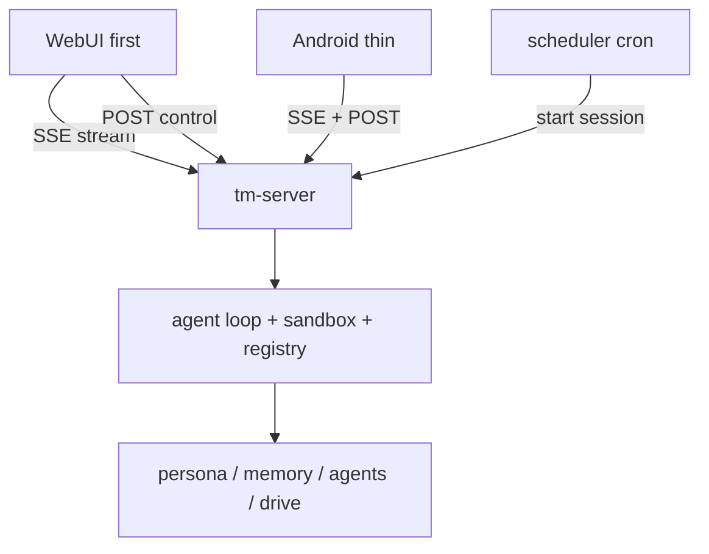

# 27. Server, scheduler & clients

> A headless, single-user, self-hosted daemon; WebUI + Android are thin clients over one streaming
> API. Grounded in two proven primitives: **Server-Sent Events** (the server pushes tokens / events
> down one long-lived connection) and **cron** (the companion is proactive on a schedule).

The core declared UI / deployment out of scope (design README). This is the deliberate expansion
(decision A): the Rust core runs as a long-lived service; clients are thin views over its event stream.

## 27.0 Design stance

- **Transport = Server-Sent Events** (WHATWG HTML Living Standard, `EventSource`). One long-lived
  HTTP connection, `text/event-stream`, **unidirectional** server→client, auto-reconnect via
  `Last-Event-ID`. Chosen over WebSocket because the agent loop is **push-dominant** — tokens, cell
  events, mode changes, and approval prompts stream *out*; the client's input (send a message, lock a
  mode, resolve an approval) is **discrete** and fits plain POSTs. SSE is HTTP-native, proxy- and
  HTTP/2-friendly, and **resumable** — which lines up with the core's streaming-first LlmClient (§04)
  and `EventSink` (§05 / §10).
- **Proactivity = cron** (Vixie cron, 1987; the de-facto Unix scheduler, five-field crontab). The
  companion acts on a schedule, not only on request; the current deployment already runs cron jobs
  (weekly ship ledger, reminders) with `cron_mode: deny`.
- **Replayable** (core principle #6): every client surface is a **view over one ordered event
  stream**, so a session can be resumed, audited, and reproduced.
- **No on-device sandbox** (decision A): V8 / `deno_core` stays on the server; clients never execute code.

## 27.1 `tm-server` & the session event stream

Wraps the agent loop (§05 / §10) as a long-lived service; owns session lifecycle, the capability
registry, and the product subsystems (mode router §21, memory §22, agents §23, drive §24).

A session is a long-lived `EventSource`. The core `EventSink` (§10) maps 1:1 onto SSE `event:` types;
the server **extends** it with product events the core trait doesn't carry:

| SSE `event:` | `data:` payload | source |
|---|---|---|
| `text` | assistant token delta | core `on_text` |
| `tool_call` | `{name}` | core `on_tool_call` |
| `cell_start` | `{code}` | core `on_cell_start` |
| `cell_result` | shaped result | core `on_cell_result` |
| `mode` | `{from, to, reason, locked}` | **product** — mode router (§21) |
| `approval` | `{action, scope, timeout}` | **product** — `ApprovalPolicy` (§08, §27.6) |
| `write_proposal` | memory / skill / drive write awaiting OK | **product** (§22 / §24 / §26) |
| `final` | final text | core `on_final` |
| `error` | `{message}` | server |

- **Wire format.** `text/event-stream`, UTF-8; one block per event (`event:` + `data:` JSON + `id:`
  seq), blank-line separated.
- **Resumability.** Each frame's `id:` is a turn/event sequence. On reconnect the client sends
  `Last-Event-ID`; the server resumes from the **replay log** (#6) — no lost tokens; if the turn
  already finished it replays `final`; a completed stream closes (HTTP 204 stops reconnection).
- **Control plane (client→server).** Discrete POSTs, **not** the SSE channel (SSE is one-way): create
  session, send message, lock / override mode (§21), resolve an approval (§27.6), open a browser view.
- **Single-user auth.** One owner (Brian); a token / local-pairing scheme. Multi-tenant parked (§15).

## 27.2 Scheduler & proactivity

A **scheduler** (cron lineage) starts sessions on a schedule: the **weekly ship ledger**
(`weekly-ship-ledger` skill, §29), deadline nudges, post-session **dreaming** (§22.5), and the drive
**organizer** (§24.3).

- **Bounds.** Scheduled runs honor `goals.max_turns` (baseline **8**), the proactivity bounds (§21.3),
  and `cron_mode: deny` — a scheduled run that hits an approval gate **defers** (queues for Brian),
  never auto-acts. `cron.wrap_response: true`, `script_timeout_seconds: 120` (§29).
- **Visibility.** A scheduled run emits through the same `EventSink` / SSE, so it is streamed,
  audited, and replayable exactly like an interactive turn (#6).

## 27.3 Model roles

The config carries a **model-role / alias system** (principle #9 — config, not code). `tm-llm` (§10)
gains **role resolution + the existing fallback chain** (default `gpt-5.5` → fallback `gpt-5.4-mini`);
the outbound call is OpenAI-compatible chat completions (§11, `api_mode: chat_completions`).

- **Primary aliases** (§29): `daily` · `heavy` · `cheap` · `openai-heavy` · `coding-plan` ·
  `code-review` (→ a distinct `codex-auto-review` model).
- **Auxiliary roles** (10, mostly → `cheap` / `gpt-5.4-mini` with per-role timeouts + fallback
  chains): `compression`, `web_extract`, `title_generation`, `approval`, `skills_hub`, `mcp`,
  `triage_specifier`, `kanban_decomposer`, `profile_describer`, `curator`.
- **Resolution per call site.** Interactive turns → `daily` / `heavy`; engineer plan / review →
  `coding-plan` / `code-review`; memory / consolidation / aux passes → `cheap` / aux roles (§22);
  embeddings → the `embeddings` role (`api | local`, §22).
- **Memory provider note.** The baseline `memory.provider: honcho` is a **parity artifact**; in
  TempestMiku these roles resolve against the **self-built `tm-memory`** (§22) — the alias system is
  unchanged, the backend is ours.

## 27.4 Clients

- **WebUI (first).** Full surface + dogfooding client (§28): chat stream + **mode badge** (§21),
  memory browser (`memory://` §22), drive browser (`drive.*` / `drive://` §24), artifact viewer
  (`artifact://` / `agent://` §25), agent roster (`agent://` §23), self-evolution review (§26.4).
- **Android (thin).** Same API; chat + badge + browsers. **No on-device sandbox** (decision A).
- Both consume the same SSE stream + POST control plane; nothing client-specific lives in the core.

## 27.5 API shape (open question, §28)

- **Outbound** (server→LLM): **settled** — OpenAI-compatible chat completions with `stream: true`
  (§11); SSE all the way from the model provider through the loop to the client.
- **Inbound** (client→server): **default = a custom session API + SSE** (it carries the full product
  event set above — `mode` / `approval` / `write_proposal` — which plain chat cannot). Optional
  **addition**: also expose an **OpenAI-compatible** endpoint (§11) so third-party clients / SDKs work
  drop-in — but that flattens the product events to plain chat, so it is a **secondary** surface, not
  the primary one. Decided at the server phase (P0, §28); not a v1 blocker.

## 27.6 Approvals surface

The server is the **client-side of the proactivity bounds** (§21.3, §08). Gated actions raise an
`approval` event (§27.1); the client resolves it via POST; on timeout the action is denied-by-default.

- **Baseline (parity §29):** `approvals.mode: manual`, `approvals.timeout: 60`, `cron_mode: deny`,
  `mcp_reload_confirm: true`, `skills.write_approval: true`, `memory.write_approval: true`.
- **Enforced as `ApprovalPolicy`** (§08) for: destructive / external / spend actions, **memory-write**
  (§22 `memory.note`), **skill-write** (§26), **drive-link** + auto-file (§24), and **MCP reload**.
- This is the single choke point behind every "propose, don't apply" path in the product (§22 / §24 / §26).

## 27.7 Crate layout (`tm-server`, §28)

- `session` — session lifecycle; the SSE event stream; `Last-Event-ID` resume over the replay log (#6).
- `api` — inbound HTTP: session create / send, mode lock, approval resolve, browser feeds; optional
  OpenAI-compatible endpoint (§27.5).
- `schedule` — cron-style scheduler; job table; bounds (`max_turns`, `cron_mode`).
- `roles` — model-role resolution + fallback (delegates to `tm-llm` §10).
- `auth` — single-user token / pairing.
- Clients live **outside** the Rust workspace: `web` (WebUI) + `android` (§28).

## 27.8 Failure modes & degradation

- **SSE disconnect** — client reconnects with `Last-Event-ID`; server resumes from the replay log; no
  token loss; a finished turn replays `final`.
- **Scheduler fires while offline / approval pending** — `cron_mode: deny` **defers**; the job is
  queued and surfaced on next connect, never auto-acted.
- **Model role unavailable** — fallback chain (`gpt-5.5` → `gpt-5.4-mini`); an aux role down degrades
  to `cheap`.
- **Approval timeout (60s)** — denied-by-default (manual mode), logged; the loop continues without the
  gated effect.
- **Client diversity** — both clients are thin views of one stream; a missing client feature never
  blocks the server.

## 27.9 Mechanism provenance

| We adopt | From | For |
|---|---|---|
| `EventSource`, `text/event-stream`, `Last-Event-ID` resume, one-way push | **WHATWG HTML Living Standard** (SSE) | the streaming transport |
| five-field crontab, per-minute daemon, scheduled jobs | **Vixie cron** (Paul Vixie, 1987) | proactive scheduling (§27.2) |
| chat completions with `stream: true` | **OpenAI API** | outbound model transport (§11) |
| model-role aliases + fallback, manual approvals, `max_turns`, cron bounds | **deployment `config.yaml`** | parity behavior (§29) |
| ordered, resumable, replayable event log | **core principle #6** | resume / audit / reproduce |

---

**Sources** (verified 2026-06-26): WHATWG **HTML Living Standard — Server-Sent Events**
(`html.spec.whatwg.org/multipage/server-sent-events.html` — the `EventSource` interface, the
`text/event-stream` MIME type, `data:` / `event:` / `id:` / `retry:` fields, `Last-Event-ID`
reconnection resume, HTTP 204 to stop reconnection, unidirectional server→client over one long-lived
HTTP connection). **Vixie cron** (Paul Vixie, **1987**, later ISC Cron — the de-facto Unix scheduler;
the standard five-field crontab `minute hour day-of-month month day-of-week`; per-minute daemon;
lineage: Ken Thompson late-1970s → SysV cron, Keith Williamson 1979). **OpenAI Chat Completions API**
(streaming over SSE; §11) for the outbound model transport and the optional inbound compat surface.
Deployment **`config.yaml`** (host `lumo`, `hermes-agent`) for the model-role aliases + fallback,
`approvals` (manual / 60s / `cron_mode: deny` / `mcp_reload_confirm`), `goals.max_turns: 8`, and
`cron` knobs — the parity baseline (§29). **Decision A holds: headless single-user daemon; thin
WebUI + Android clients; streaming-first; no on-device sandbox.**
