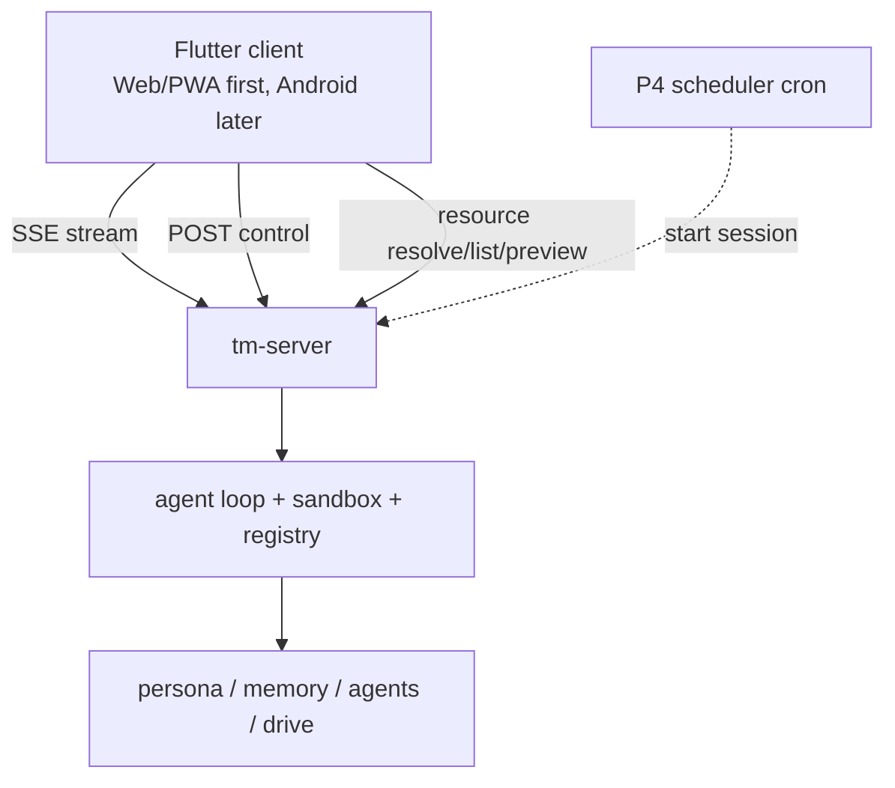

# 27. Server, scheduler & clients

> A headless, single-user, self-hosted daemon; one Flutter client targets Web/PWA first and Android
> later over the same streaming API. Grounded in two proven primitives: **Server-Sent Events** (the
> server pushes tokens / events down one long-lived connection) and, for P4, **cron** (the companion is
> proactive on a schedule).

The core declared UI / deployment out of scope (design README). This is the deliberate expansion
(decision A): the Rust core runs as a long-lived service; clients are thin views over its event stream.

## 27.0 Design stance

- **Transport = Server-Sent Events** (WHATWG HTML Living Standard, `EventSource`). One long-lived
  HTTP connection, `text/event-stream`, **unidirectional** server→client, auto-reconnect via
  `Last-Event-ID`. Chosen over WebSocket because the agent loop is **push-dominant** — tokens, cell
  events, mode changes, and approval prompts stream *out*; the client's input (send a message, lock a
  mode, resolve an approval) is **discrete** and fits plain POSTs. SSE is HTTP-native, proxy- and
  HTTP/2-friendly, and **resumable** — which lines up with the core's streaming-first LlmClient (§04)
  and `EventSink` (§05 / §10).
- **Scheduled proactivity = P4 cron** (Vixie cron, 1987; the de-facto Unix scheduler, five-field
  crontab). The current deployment already runs cron jobs (weekly ship ledger, reminders) with
  `cron_mode: deny`; the Rust rewrite keeps P2 bounded proactivity request-bound until the P4
  scheduler lands.
- **Replayable** (core principle #6): every client surface is a **view over one ordered event
  stream**, so a session can be resumed, audited, and reproduced.
- **No on-device sandbox** (decision A): V8 / `deno_core` stays on the server; clients never execute code.

## 27.1 `tm-server` & the session event stream

Wraps the agent loop (§05 / §10) as a long-lived service; owns session lifecycle, the capability
registry, and the current product subsystems (mode router §21, memory §22, agents §23), with drive
and scheduler surfaces reserved for later milestones (§24 / §27.2).



A session is a long-lived `EventSource`. The core `EventSink` (§10) maps 1:1 onto SSE `event:` types;
the server **extends** it with product events the core trait doesn't carry:

| SSE `event:` | `data:` payload | source |
|---|---|---|
| `text` | assistant token delta | core `on_text` |
| `tool_call` | `{name}` | core `on_tool_call` |
| `cell_start` | `{code}` | core `on_cell_start` |
| `cell_result` | shaped result | core `on_cell_result` |
| `mode` | `{from, to, reason, locked}` | **product** — mode router (§21) |
| `approval` | `{action, scope, timeout}` | **product** — `ApprovalPolicy` (§08, §27.6) |
| `write_proposal` | memory / skill / drive write awaiting OK | **product** (§22 / §24 / §26) |
| `final` | final text | core `on_final` |
| `error` | `{message}` | server |

- **Wire format.** `text/event-stream`, UTF-8; one block per event (`event:` + `data:` JSON + `id:`
  seq), blank-line separated.
- **Resumability.** Each frame's `id:` is a turn/event sequence. On reconnect the client sends
  `Last-Event-ID`; the server resumes from the configured replay store (Postgres when
  `TM_DATABASE_URL` is set, in-memory for local dev/tests) — no lost tokens within that store; if the
  turn already finished it replays `final`; a completed stream closes (HTTP 204 stops reconnection).
- **Control plane (client→server).** Discrete POSTs, **not** the SSE channel (SSE is one-way): create
  session, send message, lock / override mode (§21), resolve an approval (§27.6), open a browser view.
  This control plane is mobile-ready in P1: a phone/browser can attach to the same server-side session,
  send a task, resolve a gated local-file / `proc.run` action, disconnect, and resume from
  `Last-Event-ID` without gaining any on-device execution authority.
- **Single-user auth.** One owner (Brian). Local dev may use token / no-auth; deployed mode supports
  forwarded auth from a trusted reverse proxy. Multi-tenant parked (§15).

### 27.1.1 Postgres test gate

Normal `cargo test` stays external-service-free: server persistence tests use the in-memory store unless
Postgres coverage is explicitly enabled. To run the gated persistence checks for event replay, real
memory `write_proposal` approval flows, profile fact / recall chunk rows, idempotent writes, and
promoted artifact/resource references, set:

```sh
TM_POSTGRES_TESTS=1 TM_TEST_DATABASE_URL=postgres://... cargo test -p tm-server
```

`TM_TEST_DATABASE_URL` is preferred for tests; if it is absent, the tests fall back to
`TM_DATABASE_URL`. Without `TM_POSTGRES_TESTS=1`, the gated Postgres tests return early and do not
open a network or local database connection. The memory coverage exercises approve, deny,
timeout/default-deny, durable-write idempotency, replay, and both P2 record types through the normal
HTTP approval route.

## 27.2 Scheduler & proactivity

P2 implements bounded proactivity without a scheduler: Personal Assistant turns can propose reminder
and open-loop recall chunks through the existing `write_proposal` + approval path. Approved entries are
memory records visible through `memory://`; they are not background jobs and never push on their own.

In P4, a **scheduler** (cron lineage) will start sessions on a schedule: the **weekly ship ledger**
(`weekly-ship-ledger` skill, §29), deadline nudges, post-session **dreaming** (§22.5), and the drive
**organizer** (§24.3). Until that lands, `cron://` is a reserved resource shape and scheduled jobs are
not part of the live server surface.

- **P4 bounds.** Scheduled runs honor `goals.max_turns` (baseline **8**), the proactivity bounds (§21.3),
  and `cron_mode: deny` — a scheduled run that hits an approval gate **defers** (queues for Brian),
  never auto-acts. `cron.wrap_response: true`, `script_timeout_seconds: 120` (§29).
- **P4 visibility.** A scheduled run emits through the same `EventSink` / SSE, so it is streamed,
  audited, and replayable exactly like an interactive turn (#6).

## 27.3 Model roles

The config carries a **model-role / alias system** (principle #9 — config, not code). `tm-llm` (§10)
gains **role resolution + the existing fallback chain** (default `gpt-5.5` → fallback `gpt-5.4-mini`);
the outbound call is OpenAI-compatible chat completions (§11, `api_mode: chat_completions`).

- **Primary aliases** (§29): `daily` · `heavy` · `cheap` · `openai-heavy` · `coding-plan` ·
  `code-review` (→ a distinct `codex-auto-review` model).
- **Auxiliary roles** (10, mostly → `cheap` / `gpt-5.4-mini` with per-role timeouts + fallback
  chains): `compression`, `web_extract`, `title_generation`, `approval`, `skills_hub`, `mcp`,
  `triage_specifier`, `kanban_decomposer`, `profile_describer`, `curator`.
- **Resolution per call site.** Interactive turns → `daily` / `heavy`; engineer plan / review →
  `coding-plan` / `code-review`; memory / consolidation / aux passes → `cheap` / aux roles (§22);
  embeddings → the `embeddings` role (`api | local`, §22).
- **Memory provider note.** The baseline `memory.provider: honcho` is a **parity artifact**; in
  TempestMiku these roles resolve against the **self-built `tm-memory`** (§22) — the alias system is
  unchanged, the backend is ours.

## 27.4 Clients

- **Flutter client (single codebase).** P1 has shipped a **project-manager dogfooding** client on top of the
  P0 coding loop, targeting Web/PWA first: message input, streamed token rendering, final response,
  approval prompts, artifact/resource links, and project/open-loop views. Mode/skill-bundle state is
  read from the runtime `GET /modes` catalog and observable through debug/advanced controls, not a
  default badge in the normal chat surface. The web target is usable from a phone-sized browser
  because remote control of the computer-hosted agent is a first-class workflow.
- **Mobile remote control (P1).** Phone/browser control uses the same server API as every client: SSE
  for tokens/events, POSTs for messages/mode locks/approval resolution, project promotion, and the
  session-scoped resource gateway (§09) for `artifact://`, `agent://`, `workspace://`, `linked://`,
  `project://`, `memory://`, and `history://` links. Reserved `drive://` and `cron://` links use the
  same gateway shape once P5/P4 registers handlers and grants. The phone is only a view and controller;
  the sandbox, host adaptor, linked-folder grants, and command execution stay on the server/host machine (§25).
  The P2 memory gateway currently exposes `memory://root`, `memory://user-model`, and exact approved
  profile fact / scoped recall record URIs, with compact previews and fail-closed unknown paths (§22.9).
- **Android target (later).** The Android app is the same Flutter codebase packaged after the server API
  and product surfaces stabilize. It adds OS integrations — secure pairing storage, push approval
  notifications, app links, reconnect/resume polish — but **no on-device sandbox** and no second
  execution path.
- All targets consume the same SSE stream, POST control plane, and resource gateway; nothing
  client-specific lives in the core.

## 27.5 API shape (resolved for the current P0-P3 surface)

- **Outbound** (server→LLM): **settled** — OpenAI-compatible chat completions with `stream: true`
  (§11); SSE all the way from the model provider through the loop to the client.
- **Inbound (client→server):** **custom session API + SSE** is primary: `POST /sessions`,
  `POST /sessions/:id/messages`, `GET /sessions/:id/events`, `POST /sessions/:id/approvals/:approval_id`,
  `POST /sessions/:id/memory/proposals`, `POST /sessions/:id/promote`, `GET /modes`, mode lock /
  override endpoints, session-scoped resource endpoints (§09), and `GET /health`. Optional addition: also expose an **OpenAI-compatible** endpoint (§11) so third-party
  clients / SDKs work drop-in, but that flattens product events to plain chat, so it is secondary and not
  a v1 blocker.

The session resource gateway supports resolve/list/preview for the live P0-P3 schemes:
`artifact://`, `workspace://session/...`, `linked://...`, `project://...`, the P2 `memory://`
surface (§22.9), and the P3 `agent://` / `history://` actor resources (§23). Reserved `drive://`
and `cron://` paths fail closed until their milestones register handlers and grants. `GET
/sessions/:id/resources/preview` returns a bounded metadata envelope with empty `content`; clients
resolve full content only on demand.

Coding execution is a backend choice behind the same API. `TM_OMP_ACP_ENABLED=1` dispatches Serious
Engineer / Handoff turns to the P0a OMP ACP bridge; otherwise, when a real LLM is configured,
`tm-server` uses the native Deno coding backend. The client API does not change: ACP and native Deno
events normalize into the same `session_events` and SSE event names.

`POST /sessions/:id/promote` turns an ad-hoc session into a project or merges it into an existing one.
The request selects which session summary, open loops, decisions, `workspace://session` files,
`artifact://` outputs, and linked-folder references to keep. User-initiated promotion is the approval;
Miku-initiated promotion emits a `write_proposal` and waits for approval. The response returns the
created/updated `project://<id>` URI plus every promoted target and its source provenance.

## 27.6 Approvals surface

The server is the **client-side of the proactivity bounds** (§21.3, §08). Gated actions raise an
`approval` event (§27.1); the client resolves it via POST; on timeout the action is denied-by-default.

- **Baseline (parity §29):** `approvals.mode: manual`, `approvals.timeout: 60`, `cron_mode: deny`,
  `mcp_reload_confirm: true`, `skills.write_approval: true`, `memory.write_approval: true`.
- **Enforced as `ApprovalPolicy`** (§08) for: destructive / external / spend actions, **memory-write**
  (§22 `memory.note`), **skill-write** (§26), **project promotion** when Miku proposes it, **drive-link**
  + auto-file (§24), and **MCP reload**.
- **Memory writes:** `POST /sessions/:id/memory/proposals` emits `write_proposal` with
  `kind: "memory"`, `memoryKind`, `proposalId`, `status`, `dedupeKey`, provenance, and the candidate
  text/fact fields; the shared approval broker then emits `approval` and `approval_resolved`. Approved
  writes upsert one durable record by dedupe key, while denied, cancelled, and timed-out proposals emit a
  resolved `write_proposal` status without writing.
- **Personal-assistant state capture:** normal Personal Assistant turns may enqueue the same memory
  write flow in the background when `personal-assistant-state-capture` finds stable state (§22.8).
  Message POSTs do not block on approval; clients see pending `write_proposal` / `approval` events and
  resolve them through the same approval route. Skipped transient, sensitive, or raw-log content emits no
  memory approval event.
- **OMP ACP bridge (P0a):** ACP `session/request_permission` and elicitation prompts are translated
  into the same `approval` event + POST resolution path; unsupported or timed-out prompts deny by
  default.
- **Native Deno coding backend:** `manual` mode maps host `ApprovalPolicy` requests for approval-gated
  `fs.*`, `code.*`, and unsafe `proc.run` calls into the same `ApprovalBroker`; approve, deny, and
  timeout are observable as `approval` / `approval_resolved` events. `deny` mode keeps default-deny
  behavior.
- This is the single choke point behind every "propose, don't apply" path in the product (§22 / §24 / §26).

## 27.7 Crate layout (`tm-server`, §28)

- `api` — inbound HTTP: session create / send, mode lock, approval resolve, session promote,
  session-scoped resource resolve/list/preview gateway for `artifact://`, `workspace://`, `linked://`,
  `project://`, `memory://`, and the other registered schemes (§09), browser feeds; optional
  OpenAI-compatible endpoint (§27.5).
- `store` — in-memory and Postgres-shaped session storage: sessions, messages, append-only events,
  approvals, project refs, and replay from `Last-Event-ID`.
- Future `schedule` (P4) — cron-style scheduler, job table, bounds (`max_turns`, `cron_mode`), and
  `cron://` handler (list jobs / a job's def + run history) in the §9.2 registry.
- `roles` — model-role resolution + fallback (delegates to `tm-llm` §10).
- `auth` — local token / no-auth for dev plus trusted forwarded identity for reverse-proxy deployments.
- `coding_backend` / `native_deno` / `omp_acp` — the common backend interface, native Serious
  Engineer Deno backend, and P0a adapter that owns the `omp acp` subprocess, JSON-RPC framing, event
  normalization, permission translation, and bridge health/version checks.
- Clients live **outside** the Rust workspace: `clients/miku_flutter` (single Flutter codebase targeting Web/PWA first and Android later, §28).

## 27.8 Failure modes & degradation

- **SSE disconnect** — client reconnects with `Last-Event-ID`; server resumes from the replay log; no
  token loss; a finished turn replays `final`.
- **Future scheduler fires while offline / approval pending** — P4 `cron_mode: deny` **defers**; the
  job is queued and surfaced on next connect, never auto-acted.
- **Model role unavailable** — fallback chain (`gpt-5.5` → `gpt-5.4-mini`); an aux role down degrades
  to `cheap`.
- **Approval timeout (60s)** — denied-by-default (manual mode), logged; the loop continues without the
  gated effect.
- **Client diversity** — both clients are thin views of one stream; a missing client feature never
  blocks the server.

## 27.9 Local E2E hatch

`apps/tm-e2e` is a local/dev harness that lets a scripted or opt-in live LLM actor speak to Miku
through the same public session API as the Web/PWA client. It creates sessions, sends messages,
reads SSE with `Last-Event-ID`, resolves approvals, verifies memory resources, promotes project
state, and reads resource views without adding a privileged debug endpoint or a second execution path.

Normal `cargo test` uses the scripted mode and an in-process `tm-server` fixture, so it stays
network-free. Live actor runs require `TM_LLM_E2E_LIVE=1` plus `OPENAI_*` configuration. Native Deno
engineering coverage remains in the focused server tests for `fs.*`, `code.*`, `proc.*`, artifacts,
and approval approve/deny/timeout behavior.

## 27.10 Mechanism provenance

| We adopt | From | For |
|---|---|---|
| `EventSource`, `text/event-stream`, `Last-Event-ID` resume, one-way push | **WHATWG HTML Living Standard** (SSE) | the streaming transport |
| five-field crontab, per-minute daemon, scheduled jobs | **Vixie cron** (Paul Vixie, 1987) | proactive scheduling (§27.2) |
| chat completions with `stream: true` | **OpenAI API** | outbound model transport (§11) |
| model-role aliases + fallback, manual approvals, `max_turns`, cron bounds | **deployment `config.yaml`** | parity behavior (§29) |
| ordered, resumable, replayable event log | **core principle #6** | resume / audit / reproduce |

---

**Sources** (verified 2026-06-26): WHATWG **HTML Living Standard — Server-Sent Events**
(`html.spec.whatwg.org/multipage/server-sent-events.html` — the `EventSource` interface, the
`text/event-stream` MIME type, `data:` / `event:` / `id:` / `retry:` fields, `Last-Event-ID`
reconnection resume, HTTP 204 to stop reconnection, unidirectional server→client over one long-lived
HTTP connection). **Vixie cron** (Paul Vixie, **1987**, later ISC Cron — the de-facto Unix scheduler;
the standard five-field crontab `minute hour day-of-month month day-of-week`; per-minute daemon;
lineage: Ken Thompson late-1970s → SysV cron, Keith Williamson 1979). **OpenAI Chat Completions API**
(streaming over SSE; §11) for the outbound model transport and the optional inbound compat surface.
Deployment **`config.yaml`** (host `lumo`, `hermes-agent`) for the model-role aliases + fallback,
`approvals` (manual / 60s / `cron_mode: deny` / `mcp_reload_confirm`), `goals.max_turns: 8`, and
`cron` knobs — the parity baseline (§29). **Decision A holds: headless single-user daemon; one Flutter
client targeting Web/PWA first and Android later; streaming-first; no on-device sandbox.**
