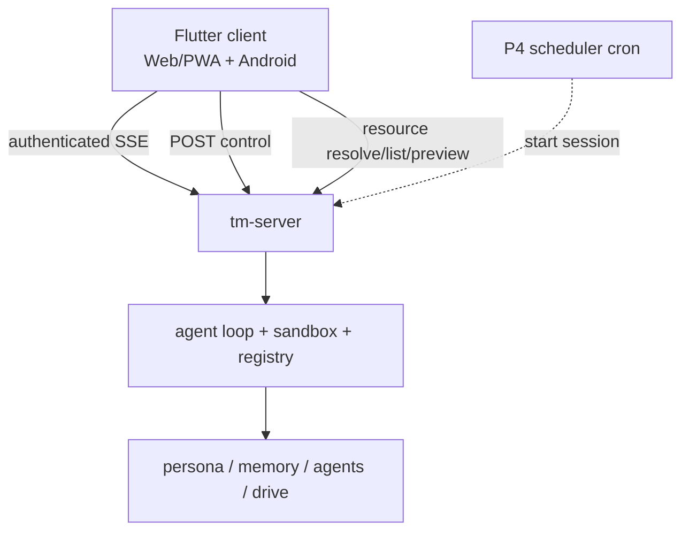

# 27. Server, scheduler & clients

> A headless, single-user, self-hosted daemon; one Flutter client targets Web/PWA and Android over
> the same authenticated streaming API. Grounded in two proven primitives: **Server-Sent Events** (the
> server pushes tokens / events down one long-lived connection) and, for P4, **cron** (the companion is
> proactive on a schedule).

The core declared UI / deployment out of scope (design README). This is the deliberate expansion
(decision A): the Rust core runs as a long-lived service; clients are thin views over its event stream.

**Implementation status (2026-07-10):** the audit hardening described here has landed, but production
completion remains gated on the full Rust, two-process Postgres, Flutter/Playwright, authenticated
Android release, certificate, and secret-leak verification matrix.

## 27.0 Design stance

- **Transport = Server-Sent Events** (WHATWG `text/event-stream` wire format). One long-lived HTTP
  connection, **unidirectional** server→client, resumed with `Last-Event-ID`. Native and Web use a
  generic authenticated fetch-stream decoder rather than browser `EventSource`, so bearer headers and
  one numeric-dedup path work on both targets. Chosen over WebSocket because the agent loop is
  **push-dominant** — tokens, cell
  events, mode changes, and approval prompts stream *out*; the client's input (send a message, lock a
  mode, resolve an approval) is **discrete** and fits plain POSTs. SSE is HTTP-native, proxy- and
  HTTP/2-friendly, and **resumable** — which lines up with the core's streaming-first LlmClient (§04)
  and `EventSink` (§05 / §10).
- **Scheduled proactivity = P4 cron** (Vixie cron, 1987; the de-facto Unix scheduler, five-field
  crontab). `worker`/`all` roles supervise the weekly ship ledger scheduler with fenced leases,
  bounded catch-up, exact capabilities, and `cron_mode: deny`; prompt text is never the boundary.
- **Replayable** (core principle #6): every client surface is a **view over one ordered event
  stream**, so a session can be resumed, audited, and reproduced.
- **No on-device sandbox** (decision A): V8 / `deno_core` stays on the server; clients never execute code.

## 27.1 `tm-server` & the session event stream

Wraps the agent loop (§05 / §10) as a long-lived service; owns authentication, durable session/turn
lifecycle, the capability registry, and the product subsystems (mode router §21, memory §22, agents
§23, drive §24, scheduler §27.2). It does not fork a second execution loop.



A session is one long-lived SSE stream, but the event name is deliberately singular:

```text
event: session_event
id: <durable numeric sequence>
data: {"type":"text","turnId":"<uuid-or-null>","payload":{...},"createdAt":"<rfc3339>"}
```

`type` carries core and product variants (`text`, `tool_call`, `cell_start`, `cell_result`, `mode`,
`approval`, `write_proposal`, dream/cron lifecycle, `final`, `runtime_reset`, `error`, and
`session_end`). Native/Web clients use a generic fetch-stream decoder and numeric sequence
deduplication; there is no named-event compatibility stream.

- **Resumability.** `Last-Event-ID` is the last durable sequence. Replay captures a high-water mark,
  then drops live events at or below it. Broadcast lag refills from Postgres after the last delivered
  sequence, and API-only processes poll the same store so worker-process deltas are visible without an
  in-process sender. The connection stays open across turn `final` events and closes only after
  `session_end`.
- **Durable control plane.** `POST /sessions/:id/messages` requires
  `{clientMessageId, content}` and returns `202 {turnId, clientMessageId, status:"queued"}`.
  `UNIQUE(session_id, client_message_id)` makes equal retries idempotent and conflicting content a
  `409`; `GET /sessions/:id/turns/:turnId` reports completion. One turn runs at a time per session,
  while workers process different sessions concurrently. Queued turns resume after restart; stale
  running turns fail rather than replay possible side effects.
- **History/runtime recovery.** A turn restores the newest 40 complete messages within 128 KiB into
  the sole core loop. V8 state is thread-affine and not snapshotted: restart or TTL eviction opens a
  clean isolate and emits `runtime_reset`, never re-executing old cells.
- **Single-owner auth.** `auth_devices` stores revocable hashed credentials. Android sends bearer
  auth on every request/SSE; Web uses the same device through a Secure/HttpOnly/SameSite=Strict cookie
  plus origin-based CSRF checks. Pairing codes are hashed, single-use, random 256-bit values with a
  five-minute expiry. The QR/browser form carries only the one-time code and origin; no bearer
  credential enters a URL, HTML, event, or log. Trusted forwarded headers are accepted only from
  configured proxy CIDRs.
- **Deployment boundary.** Production binds loopback behind an HTTPS reverse proxy or Tailscale
  Serve; setting a public URL never makes raw HTTP secure. Postgres is required outside loopback and
  for `worker`/`all`. The only non-loopback HTTP escape is a debug-build emulator override.

### 27.1.1 Postgres test gate

Production schema evolution is an ordered, checksummed `schema_migrations` ledger. Migrations upgrade
the existing pre-ledger schema in place and backfill owner/global authority; already-applied SQL is
never rewritten or destructively recreated. Startup fails if a checksum differs or a migration does
not apply. Postgres is mandatory outside loopback and for `worker`/`all` roles.

Normal `cargo test` stays external-service-free: server persistence tests use the in-memory store unless
Postgres coverage is explicitly enabled. The gated suite covers migration/backfill checksums, durable
turn/event replay, approval outbox effects, profile/recall rows, FTS, fenced dream/cron claims,
transactional session end, drive metadata/link tombstones, and cross-store stale-owner rejection. Run:

```sh
TM_POSTGRES_TESTS=1 TM_TEST_DATABASE_URL=postgres://... cargo test -p tm-server
```

`TM_TEST_DATABASE_URL` is preferred for tests; if it is absent, the tests fall back to
`TM_DATABASE_URL`. Without `TM_POSTGRES_TESTS=1`, the gated Postgres tests return early and do not
open a network or local database connection. The memory coverage exercises approve, deny,
timeout/default-deny, durable-write idempotency, replay, and both P2 record types through the normal
HTTP approval route.

## 27.2 Scheduler & proactivity

P2 implements bounded proactivity without a scheduler: General-mode turns can propose reminder
and open-loop recall chunks through the existing `write_proposal` + approval path. Approved entries are
memory records visible through `memory://`; they are not background jobs and never push on their own.

In P4, a **scheduler** (cron lineage) can start sessions on a schedule. The implemented first job is
the **weekly ship ledger** (`weekly-ship-ledger` skill, §29); deadline nudges and the drive organizer
are not registered scheduler jobs. The drive organizer's durable manual/proposal flow lives in §24;
automatic scheduled organizer policy remains a later explicit enablement.

- **P4 dream queue + worker:** `POST /sessions/:id/end` marks a session `ended`, writes an idempotent
  durable `dream_queue` record, and emits `session_end` + `dream_queued` in the same transaction. The server-owned
  `ServerDreamWorker` / `DreamWorkerDaemon` leases ready dreams with exact owner/epoch fencing, loops on a
  poll interval with configured concurrency, exits on shutdown, emits replayable `dream_started` /
  `dream_progress` / `dream_completed` / `dream_failed`, writes a bounded `memory://summaries/<id>`
  session summary, and emits approval-gated memory/skill `write_proposal` events without blocking
  normal chat turns.
- **P4 scheduler tables:** `cron_jobs` stores cron-style job definitions, bounds, `next_run_at`, and
  enabled state; `cron_runs` stores run history, status, result JSON, linked session id, and fenced
  lease state. Materializing a due fire and advancing `next_run_at` is one cursor-CAS transaction;
  `UNIQUE(job_id, scheduled_for)` prevents duplicate fires across scheduler processes. Execution is
  leased separately by exact owner/epoch, with heartbeat, stale reclaim, timeout, and three-attempt
  terminal failure. Missed-run catch-up is bounded from the stored schedule cursor; callers choose a
  `max_catch_up` count (the weekly ship ledger uses a single-fire policy) rather than backfilling
  unbounded offline history.
- **P4 bounds.** Scheduled runs honor `goals.max_turns` (baseline **8**), bounded missed-run catch-up
  (baseline **1**), the proactivity bounds (§21.3), and an exact background grant set with no
  mode/host authority beyond fixed core reads. `cron_mode: deny` disables approval waits in code,
  not merely in the prompt;
  `script_timeout_seconds` is capped at **120** (§29).
- **P4 visibility.** Dream and scheduled runs emit through the same `session_events` / SSE replay log,
  so they are streamed, audited, and replayable like interactive turns (#6). The session resource
  gateway exposes `cron://`, `cron://<job>`, `cron://<job>/runs`, and `cron://<job>/runs/<run>` for job
  definitions and run history.
- **P4 supervision.** `worker` and `all` roles supervise the turn dispatcher, approval expiry/effects,
  dream worker, and scheduler. They require Postgres, stop claiming on SIGINT/SIGTERM, keep
  heartbeats alive while draining, and abort remaining work after 30 seconds. `api` serves only the
  authenticated HTTP/SSE plane.

## 27.3 Model roles

The config carries a **model-role / alias system** (principle #9 — config, not code). `tm-llm` (§10)
gains **role resolution + the existing fallback chain** (default `gpt-5.5` → fallback `gpt-5.4-mini`);
the outbound call is OpenAI-compatible chat completions (§11, `api_mode: chat_completions`).

- **Primary aliases** (§29): `daily` · `heavy` · `cheap` · `openai-heavy` · `coding-plan` ·
  `code-review` (→ a distinct `codex-auto-review` model).
- **Auxiliary roles** (10, mostly → `cheap` / `gpt-5.4-mini` with per-role timeouts + fallback
  chains): `compression`, `web_extract`, `title_generation`, `approval`, `skills_hub`, `mcp`,
  `triage_specifier`, `kanban_decomposer`, `profile_describer`, `curator`. P4 dream worker config
  exposes `extraction`, `reflection`, `summarization`, `skill_distillation`, `self_critique`,
  `verification`, and future `embeddings` role names; defaults keep all dream aux roles on `cheap`
  until a live-test configuration explicitly overrides them. Empty dream role names fail the dream
  visibly with `last_error` before summaries/proposals are written.
- **Resolution per call site.** Interactive turns → `daily` / `heavy`; engineer plan / review →
  `coding-plan` / `code-review`; memory / consolidation / aux passes → `cheap` / aux roles (§22);
  embeddings → the `embeddings` role (`api | local`, §22).
- **Memory provider note.** The baseline `memory.provider: honcho` is a **parity artifact**; in
  TempestMiku these roles resolve against the **self-built `tm-memory`** (§22) — the alias system is
  unchanged, the backend is ours.

## 27.4 Clients

- **Flutter client (single codebase).** P1 has shipped a **project-manager dogfooding** client on top of the
  P0 coding loop, targeting Web/PWA first: message input, streamed token rendering, final response,
  approval prompts, artifact/resource links, and project/open-loop views. Mode/skill-bundle state is
  read from the runtime `GET /modes` catalog and observable through debug/advanced controls, not a
  default badge in the normal chat surface. The web target is usable from a phone-sized browser
  because remote control of the computer-hosted agent is a first-class workflow.
- **Mobile remote control (P1/P4).** Phone/browser control uses the same server API as every client: SSE
  for tokens/events, POSTs for messages/mode locks/approval resolution, project promotion, and the
  session-scoped resource gateway (§09) for `artifact://`, `agent://`, `workspace://`, `linked://`,
  `project://`, `memory://`, `history://`, P4 `cron://`, configured P5 `drive://`, and P7.1 managed
  `skill://` links. The phone is only a view and controller;
  the sandbox, host adaptor, linked-folder grants, and command execution stay on the server/host machine (§25).
  The P2/P4 memory gateway currently exposes `memory://root`, `memory://user-model`, exact approved
  profile fact / scoped recall record URIs, dream queue/record previews, dream summaries, and skill
  proposal previews, P7.0 evolution audit history, typed persona/mode review-proposal resources, and
  P7.1 active/immutable managed-skill versions and P7.2a typed mode-addendum review/apply/rollback,
  with compact previews and fail-closed unknown paths (§22.9 / §26.4).
- **Android target (P6 security slice).** The same Flutter app uses an in-app camera scanner
  (`mobile_scanner` 7.2.0, bundled ML Kit) for versioned one-time pairing QR data. No exported Android
  intent filter accepts the `tempestmiku://pair?...` payload and URL-only target changes are disabled.
  Before exchange it confirms HTTPS origin, host, effective port, and device name. The origin-bound
  bearer token lives in `flutter_secure_storage` 10.3.1; server/session cursor preferences are cleared
  with the credential when origins change. Android min SDK is 23, credential backup/transfer is
  excluded, release cleartext is disabled, and release builds require a configured non-debug key.
  Debug/profile retain emulator-only cleartext support. The provider-neutral push foundation binds
  encrypted registration secrets to existing device authority, materializes approval request and
  resolution deliveries through a leased Postgres outbox, and keeps provider payloads limited to
  opaque routing identifiers. Android background-SSE notifications expose Approve once / Deny;
  Android 12+ requires device authentication, older releases reopen the authenticated approval UI,
  and lock-screen content remains generic. The production UnifiedPush adapter accepts only encrypted
  Android endpoint/key envelopes under one configured HTTPS origin, refuses redirects, and sends
  RFC 8291 `aes128gcm` routing payloads to the self-hosted ntfy distributor. The connector's native
  service renders/cancels notifications while Flutter is killed. The signed Android 15 physical
  canary proved remote request delivery and timeout-resolution cancellation through the live lumo
  provider on 2026-07-14. There is still **no on-device sandbox** or second execution path.
- All targets consume the same SSE stream, POST control plane, and resource gateway; nothing
  client-specific lives in the core.

## 27.5 API shape (resolved for the hardened server surface)

- **Outbound** (server→LLM): **settled** — OpenAI-compatible chat completions with `stream: true`
  (§11); SSE all the way from the model provider through the loop to the client.
- **Inbound (client→server):** **custom authenticated session API + SSE** is primary:
  `POST /sessions`, durable `POST /sessions/:id/messages`, `GET /sessions/:id/turns/:turnId`,
  `POST /sessions/:id/scope`, `POST /sessions/:id/end`, `GET /sessions/:id/events`,
  `GET|POST /sessions/:id/approvals/:approval_id`, `POST /sessions/:id/memory/proposals`,
  `POST /sessions/:id/evolution/review-proposals`,
  `POST /sessions/:id/evolution/skills/:name/rollback`,
  `POST /sessions/:id/promote`, `GET /modes`, mode lock / override endpoints, session-scoped
  resource endpoints (§09), protected `GET /ready`/`GET /metrics`, and minimal public `GET /health`.
  Optional addition: also expose an **OpenAI-compatible** endpoint (§11) so third-party
  clients / SDKs work drop-in, but that flattens product events to plain chat, so it is secondary and not
  a v1 blocker.

Device auth is centralized in router middleware. Public routes are limited to static assets, minimal
health, the pairing page/code exchange, while code creation itself requires loopback, an authenticated
device, or an explicit bootstrap credential. `GET /auth/devices`, device revocation, and logout are
authenticated. The pairing response returns a bearer token only to non-Web clients; Web receives an
HttpOnly cookie and no script-visible token. Device revocation invalidates new API calls and existing
SSE connections on their periodic auth check.

Push registration extends that same device identity rather than creating a second credential model.
`PUT /auth/push-registration` upserts the authenticated device's provider token and
`DELETE /auth/push-registration` disables it. Registration secrets are XChaCha20-Poly1305 encrypted
with device/provider-bound AAD and never serialized or logged. Logout, device revocation, invalid
provider registrations, approval expiry, and approval resolution all close the corresponding
notification lifecycle. Notification approval omits `optionId`, so the existing broker selects
`allow_once` before any wider allow option.

The session resource gateway supports resolve/list/preview for the live P0-P7.1 schemes:
`artifact://`, `workspace://session/...`, `linked://...`, `project://...`, the P2 `memory://`
surface plus P4 summary/skill-proposal previews (§22.9), the P3 `agent://` / `history://` actor
resources (§23), P4 `cron://` job/run views, P5 `drive://` documents/virtual dirs when a drive
store is configured, and P7.1 `skill://` managed catalog/version views. `GET
/sessions/:id/resources/preview` returns a bounded metadata envelope with empty `content`; clients
resolve full content only on demand.

P5 also exposes a compact read-only drive browser feed at `GET /sessions/:id/drive/feed`: recent
drive docs, virtual directory roots, pending organizer proposals, and a pending-approvals slot for
mobile/web views. Full document content still flows through the normal resource gateway, and drive
writes remain approval/host-call mediated rather than client-authoritative.

Session authority is server-owned. `TM_OWNER_SUBJECT` is persisted/backfilled on sessions;
`POST /sessions` may choose only `global` or an active linked `project:<slug>` scope, and
`POST /sessions/:id/scope` changes it explicitly while the session is active. Message/memory requests
cannot supply arbitrary subject or scope, and mode changes never change memory authority. Exact
memory/profile/drive reads compare the authorized subject/scope and return not-found on mismatch;
persisted unlink tombstones revoke project access immediately.

Coding execution is a backend choice behind the same API. `TM_OMP_ACP_ENABLED=1` dispatches Serious
Engineer / Handoff turns to the P0a OMP ACP bridge; otherwise, when a real LLM is configured,
`tm-server` uses the native Deno coding backend. The client API does not change: ACP and native Deno
events normalize into the same durable `session_event` envelope.

`POST /sessions/:id/promote` turns an ad-hoc session into a project or merges it into an existing one.
The request selects which session summary, open loops, decisions, `workspace://session` files,
`artifact://` outputs, and linked-folder references to keep. By default workspace attachments remain
project pointers; `importResourcesToDrive: true` materializes `workspace://session/...` or
`project://<id>/workspace/...` files into `drive://projects/<id>/attachments/...` with source
provenance. User-initiated promotion is the approval; Miku-initiated promotion emits a
`write_proposal` and waits for approval. The response returns the created/updated `project://<id>` URI
plus every promoted target and its source provenance.

## 27.6 Approvals surface

The server is the **client-side of the proactivity bounds** (§21.3, §08). Gated actions raise an
`approval` event (§27.1); the client resolves it via POST; on timeout the action is denied-by-default.

`approval_requests` persists origin, action, scope/options, expiry, status, and resumability;
`approval_effects` is an idempotent outbox. Resolution uses compare-and-swap and appends its event in
the same transaction. Local notification plus store polling lets another process resolve/apply an
effect exactly once. ACP/V8 waits are non-resumable and cancel after origin loss; durable
memory/skill/drive proposal effects can resume after restart. After an idempotent proposal mutation,
the terminal `write_proposal` append and effect `applied` transition commit atomically; broadcast is
post-commit, so a crash or local publish failure is recovered through durable event replay.

- **Baseline (parity §29):** `approvals.mode: manual`, `approvals.timeout: 60`, `cron_mode: deny`,
  `skills.write_approval: true`, `memory.write_approval: true`. `mcp_reload_confirm` remains a parity
  setting for the deferred `tm-mcp` lifecycle, not a currently enabled effect.
- **Enforced as `ApprovalPolicy` / approval-broker prompts** (§08) for: destructive / external /
  spend actions, **model-proposed mode switches** (§21 `modes.suggest`), **memory-write** (§22
  `memory.note`), **skill-write** (§26), **project promotion** when Miku proposes it, **drive-link**
  + auto-file (§24). MCP reload remains out of scope.
- **Mode switches:** a chat model invokes `await modes.suggest(targetMode, reason)` through the
  one `execute` tool. The grant-controlled host capability emits an `approval` event with backend
  `"mode"` and does not change the session until Brian approves. Approved suggestions persist
  through `ModeState` with `overrideSource: "model_suggestion"` and emit `mode`; denied, timed-out,
  stale, or locked suggestions leave the current mode unchanged. Only unlocked normal ChatRunner
  turns receive the `modes.suggest` grant; coding backends, actors, scheduler runs, and locked turns
  fail closed. The legacy `/mode/suggest` route is
  compatibility-only and never mutates mode state; explicit user switches use `/mode/apply` or
  `/mode/override`.
- **Memory writes:** `POST /sessions/:id/memory/proposals` emits `write_proposal` with
  `kind: "memory"`, `memoryKind`, `proposalId`, `status`, `dedupeKey`, provenance, and the candidate
  text/fact fields; the shared approval broker then emits `approval` and `approval_resolved`. Approved
  writes upsert one durable record by dedupe key, while denied, cancelled, and timed-out proposals emit a
  resolved `write_proposal` status without writing.
- **Personal-assistant state capture:** normal General-mode turns may enqueue the same memory
  write flow in the background when `personal-assistant-state-capture` finds stable state (§22.8).
  Message POSTs do not block on approval; clients see pending `write_proposal` / `approval` events and
  resolve them through the same approval route. Skipped transient, sensitive, or raw-log content emits no
  memory approval event.
- **Managed skill writes:** an approved, self-verified dream proposal installs one immutable
  digest-addressed version and atomically activates it; a denied/timed-out/stale effect cannot mutate
  the catalog. Rollback is a separate durable manual approval with expected-current and target digests.
  Both remain resumable through the approval outbox, and disconnected clients recover their pending
  events through `/sessions/:id/messages` `pendingEvents` after the terminal `session_end` fence.
- **OMP ACP bridge (P0a):** ACP `session/request_permission` and elicitation prompts are translated
  into the same `approval` event + POST resolution path; unsupported or timed-out prompts deny by
  default. If the bridge process disappears, its outstanding non-resumable requests are cancelled;
  they are never replayed into a new backend process.
- **Native Deno coding backend:** `manual` mode maps host `ApprovalPolicy` requests for approval-gated
  `fs.*`, `code.*`, and unsafe `proc.run` calls into the same `ApprovalBroker`; approve, deny, and
  timeout are observable as `approval` / `approval_resolved` events. `deny` mode keeps default-deny
  behavior.
- This is the single choke point behind every "propose, don't apply" path in the product (§22 / §24 / §26).

## 27.7 Crate layout (`tm-server`, §28)

- `api` — authenticated inbound HTTP: device pairing/revocation, session create / durable turn send,
  turn status/scope, mode lock, approval resolve, session promote,
  session-scoped resource resolve/list/preview gateway for `artifact://`, `workspace://`, `linked://`,
  `project://`, `memory://`, `skill://`, and the other registered schemes (§09), browser feeds; optional
  OpenAI-compatible endpoint (§27.5).
- `store` — explicit in-memory development and Postgres production implementations: ordered
  checksummed migrations; sessions, turns, messages, append-only events, approvals/effects, dreams,
  cron, project refs, durable drive metadata/link tombstones, and replay from `Last-Event-ID`.
- `runtime` — `api|worker|all` role validation, turn/effect/dream/scheduler supervision, protected
  readiness/metrics, SIGINT/SIGTERM drain, and 30-second abort grace.
- `scheduler` (P4) — cron-style scheduler, job/run tables, scheduled-fire claim/reuse, bounded
  missed-run catch-up, bounds (`max_turns`, `cron_mode`, `script_timeout_seconds`), weekly
  ship-ledger trigger, and `cron://` handler (list jobs / a job's
  def + run history) in the session resource gateway.
- `roles` — model-role resolution + fallback (delegates to `tm-llm` §10).
- `auth` — single-owner device records, hashed five-minute pairing codes, bearer/cookie+CSRF auth,
  local token/no-auth debug modes, and trusted-CIDR forwarded identity.
- `coding_backend` / `native_deno` / `omp_acp` — the common backend interface, native Serious
  Engineer Deno backend, and P0a adapter that owns the `omp acp` subprocess, JSON-RPC framing, event
  normalization, permission translation, and bridge health/version checks.
- Clients live **outside** the Rust workspace: `clients/miku_flutter` (one codebase targeting
  Web/PWA and Android) plus `clients/miku_web` smoke/evidence tests (§28).

## 27.8 Failure modes & degradation

- **SSE disconnect/broadcast lag** — client reconnects with `Last-Event-ID`; replay/live handoff
  deduplicates by numeric sequence and lag refills from Postgres after the last delivered id. A
  finished turn replays its `final` envelope and the connection remains open for later turns.
- **Offline / client-disconnected approvals** — unresolved `write_proposal` and `approval` events remain
  durable and are surfaced as `pendingEvents` when a client fetches the transcript or reconnects.
  Resumable proposal effects apply from the outbox exactly once; non-resumable origin-bound waits are
  cancelled. P4 `cron_mode: deny` cannot create an interactive approval wait and never auto-acts.
- **Model role unavailable** — fallback chain (`gpt-5.5` → `gpt-5.4-mini`); an aux role down degrades
  to `cheap`.
- **Approval timeout (60s)** — denied-by-default (manual mode), logged; the loop continues without the
  gated effect.
- **Client diversity** — both clients are thin views of one stream; a missing client feature never
  blocks the server.
- **Postgres unavailable/migration mismatch** — worker roles stop claiming and readiness fails; the
  server never silently downgrades production state to process-local storage.

## 27.9 Local E2E hatch

`apps/tm-e2e` is a local/dev harness that lets a scripted or opt-in live LLM actor speak to Miku
through the same authenticated session API as the Web/PWA client. It creates sessions, sends durable turns,
reads SSE with `Last-Event-ID`, resolves approvals, verifies memory resources, promotes project
state, and reads resource views without adding a privileged debug endpoint or a second execution path.
The `evolution-policy` recording also runs real post-session dreaming, recovers pending install and
rollback approvals, activates two immutable versions, reads `skill://` through the public gateway,
and proves catalog reload plus rollback.

The preferred manual/dev gate is `cargo run -p tm-e2e -- record suite`. It starts an in-process
`tm-server` fixture, records raw SSE and HTTP evidence, captures referenced resources, drives the real
Flutter Web UI through Playwright, and writes a human-openable evidence bundle under
`target/tm-e2e/runs/<timestamp>-suite/` (`manifest.json`, `events.ndjson`, `http.ndjson`,
`transcript.md`, resource captures, UI screenshots/video/trace, `report.md`, and `index.html`).

Normal `cargo test` uses scripted API/actor coverage and an in-process `tm-server` fixture, so it stays
network-free and does not require Flutter or Playwright. Live actor recordings require
`TM_LLM_E2E_LIVE=1` plus `OPENAI_*` configuration. Native Deno engineering keeps focused server tests
for `fs.*`, `code.*`, `proc.*`, artifacts, and approval approve/deny/timeout paths, while
`cargo run -p tm-e2e -- record native-coding` now composes those contracts through the public API in
one offline evidence run. It patches a disposable linked crate, runs a targeted argv-vector test,
resolves the resulting process-output spill through `artifact://`, proves denied/timed-out writes do
not apply, and preserves the message turn id on every replayed approval/cell/final event.

Client smoke is split by cost:

- `cd clients/miku_flutter && nix develop --command flutter test` runs the phone/widget smoke,
  including dream-origin memory proposal approval.
- `cd clients/miku_flutter/android && nix develop --command ./gradlew ... assembleDebug` packages the
  Android debug APK from the same client code; see `docs/running-miku.md` for the full command.
- `cd clients/miku_web && npm test` runs the normal Playwright API/web smoke. The heavier UI evidence
  recording is opt-in: set `TM_E2E_RUN_DIR=<run-dir>` and `TM_E2E_BASE_URL=<server-url>` and run
  `npm run test:evidence`.
- `TM_WEB_SMOKE_PORT` overrides the normal web-smoke server port; by default it uses `8787`.

## 27.10 Mechanism provenance

| We adopt | From | For |
|---|---|---|
| `text/event-stream`, `Last-Event-ID` resume, one-way push; authenticated fetch decoder | **WHATWG HTML Living Standard** (SSE) | the streaming transport |
| five-field crontab, per-minute daemon, scheduled jobs | **Vixie cron** (Paul Vixie, 1987) | proactive scheduling (§27.2) |
| chat completions with `stream: true` | **OpenAI API** | outbound model transport (§11) |
| model-role aliases + fallback, manual approvals, `max_turns`, cron bounds | **deployment `config.yaml`** | parity behavior (§29) |
| ordered, resumable, replayable event log | **core principle #6** | resume / audit / reproduce |

---

**Sources** (verified 2026-06-26): WHATWG **HTML Living Standard — Server-Sent Events**
(`html.spec.whatwg.org/multipage/server-sent-events.html` — the `EventSource` interface, the
`text/event-stream` MIME type, `data:` / `event:` / `id:` / `retry:` fields, `Last-Event-ID`
reconnection resume, HTTP 204 to stop reconnection, unidirectional server→client over one long-lived
HTTP connection). **Vixie cron** (Paul Vixie, **1987**, later ISC Cron — the de-facto Unix scheduler;
the standard five-field crontab `minute hour day-of-month month day-of-week`; per-minute daemon;
lineage: Ken Thompson late-1970s → SysV cron, Keith Williamson 1979). **OpenAI Chat Completions API**
(streaming over SSE; §11) for the outbound model transport and the optional inbound compat surface.
Deployment **`config.yaml`** (host `lumo`, `hermes-agent`) for the model-role aliases + fallback,
`approvals` (manual / 60s / `cron_mode: deny` / `mcp_reload_confirm`), `goals.max_turns: 8`, and
`cron` knobs — the parity baseline (§29). **Decision A holds: headless single-user daemon; one Flutter
client targeting Web/PWA and Android through the authenticated fetch/SSE decoder; streaming-first;
no on-device sandbox.**
