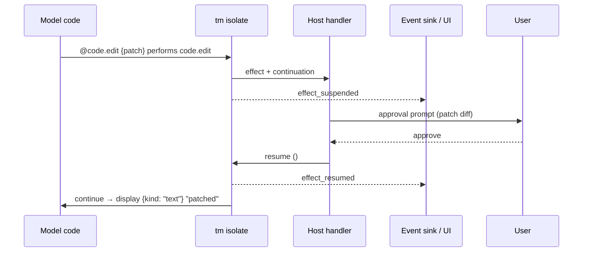

# 3. Effects & approval — the load-bearing idea

This is the section that justifies the whole folder. Everything else is sugar; this is the
bet.

## 3.1 Effects as the capability manifest

Every external interaction is an **algebraic effect** and every effect perform is written with
`@` at the call site. A capability declaration lives in the host registry (§3.9) and is
rendered by help/checker output as an effect signature:

```
eff fs.read   : (path: Path) -> ResourceContent
eff fs.write  : (path: Path, data: Data) -> Unit
eff http.get  : (url: Url) -> Bytes
eff code.edit : (patch: Patch) -> Unit
eff proc.run  : (cmd: String, args: List String) -> ProcResult
```

These are registry documentation, not tm source forms. The declaration identifies authority and
value types. Separate registry metadata describes
execution policy: approval class (`none`, `on-write`, `on-external`, `always`), whether the
handler supports suspend/resume, safe argument/result previews, and human-facing UI
labels. Those properties are discoverable through `tools.docs`, but are not part of the
canonical capability name.

`error` is also an effect, but it is a core control effect rather than a grant-bearing host
capability. Its following signature is likewise documentation:

```
eff error : HostError -> Never
```

Host capability docs declare which `HostError` payloads they may perform, and fallible pure
prelude functions do the same (for example `json.parse` performs `error ParseError`). For
audit, the transcript shows the grant-bearing capability row separately from the possible
error set: capabilities answer "what authority did this code touch?", while errors answer
"how could this cell abort or be handled?" The checker infers both; source contains neither
effect-row nor value-type annotations.

A function's grant-bearing effect row is its **capability manifest**, computed by the type
checker from the host capability effects it performs:

```
fun backup src dst =
  do {
    let data = @fs.read src;
    @fs.write dst data
  }
```

The checker records the concrete capability row <fs.read, fs.write> plus the possible error set
in the typed cell and transcript. The grant-bearing effect names are exactly the host registry's
canonical capability names. A policy change can alter whether fs.write prompts without changing
source or authority type.

Three invariants from AGENTS.md / §3 fall out *for free, at type-check time, before any code
runs*:

### Fail-closed becomes a type error

```
fun oops url = @http.get url   -- inferred <http.get>, not granted
```

If the session's granted effect row does not include `http.get`, this is **rejected before
eval** — not a runtime missing namespace, not a `CapabilityDeniedError` thrown mid-cell. The
offending capability never enters the transcript because the cell never runs. This is strictly
stronger than §7's runtime-policy approach.

### Provenance is the effect log

Each `@` perform of an effect is a transcript node (§3.6 replay, §12 observability). Pure
functions (empty authority row and no core error/presentation effects) are **trivially
replayable / memoizable** — they cannot touch the host or emit user-visible output, so the host
may skip them on replay and serve the cached value. The type tells the replay engine what is
safe to skip; today it has to guess from op names.

### The host registry *is* the handler table

§6.4's `op_host_call → registry.invoke()` is, in effect-system terms, the **effect handler**.
`registry.invoke(name, args, ctx)` is `handle eff with handler`. Adding a capability (§3.9:
register handler + emit stub) is, in `tm`, adding an effect declaration + a handler branch.
The "one bridge, a runtime registry" principle is not violated — it is *realized* as the
language's dispatch.

The `@` marker is not part of the capability name. It is the syntax for crossing the sandbox
boundary. `@mcp.github.create_issue` and `@fs.read` both dispatch through the same host
registry; MCP tools are just dynamically imported capabilities whose canonical names keep the
`mcp.<server_alias>.` prefix.

This dispatch is not new — it is the shape of every algebraic-effect library. Haskell's
[`effectful`](https://github.com/haskell-effectful/effectful) and
[`atelier-core`](https://github.com/atelier-hub/tricorder/tree/b21172e/atelier-core) already
model `Process`/`FileSystem`/`Cache`/`Conc` as effects dispatched by an interpreter, and
`atelier-core`'s `Component` lifecycle (`setup → listeners → start`) is a credible template
for how the `tm` host could register capability handlers. What `tm` imports from that
ecosystem is the **dispatch shape**; what it cannot import is below.

## 3.2 Approval as a resumable effect

This is the aha from §1.3. A registry handler may support **resumable approval**: it can suspend
the current cell, ask the host (which asks the user), and resume the saved continuation with
the decision. The effective approval policy decides whether a particular perform suspends.

Resumability is handler metadata, not call-site punctuation. `@` already marks the stable
language boundary that matters for authority, type checking, provenance, and review.
Encoding policy as `!` in `@code.edit!` or `<code.edit!>` would conflate capability identity
with deployment/session policy and would misleadingly resemble a mutation marker. The source
therefore uses the same `@capability` form for every host effect.

```
do {
  let before = @fs.read workspace:config.json;
  @code.edit {patch: replace "v1" "v2" before};
  display {kind: "text"} "patched"
}
```

Control flow under approval policy `always` for `code.edit`:



Under policy `on-write` the same code might not suspend at all if the session pre-approved
writes. **The model's code is identical either way.** The policy is a handler config, not a
language construct the model has to branch on.

### Why this matters

Today (§7 + ApprovalPolicy) the model has to know: which calls might block, which might be
denied, how to handle denial, whether to retry. That knowledge is scattered across the system
prompt, the SDK `.d.ts`, and the orchestrator. In `tm`:

- `tools.docs` exposes approval/resumability metadata when the model needs to plan around it.
- `effect_suspended` / `effect_resumed` record whether this invocation actually waited, and
  drive the same inline approval UI used during live execution and replay.
- Denial = the approval handler performs `error ApprovalDenied`; the model can catch it with
  an error handler (§4.5), or let it bubble to the cell result.
- Retry = the model's choice, explicit, not a hidden runtime retry loop.

The approval boundary (AGENTS.md: "manual approvals" as a parity invariant) becomes a
**language-level affordance** instead of a host policy the model has to be *told* about.

## 3.3 The effect vocabulary maps to §7

| §7 SDK namespace | `tm` effect | Registry policy metadata |
|---|---|---|
| `print` | capped diagnostic output | no grant or approval |
| `display` | core presentation effect, never a host capability | no grant or approval |
| `help`, `tools.search/docs/call` | `tools.docs` / `tools.search` / `tools.call` | no approval |
| `@fs.read` / `@fs.ls` / `@fs.find` | `fs.read` / `fs.ls` / `fs.find` | normally none |
| `@fs.write` | `fs.write` | `on-write`, resumable |
| `@code.search` | `code.search` | normally none |
| `@code.edit` | `code.edit` | `on-write`, resumable |
| `@proc.run` | `proc.run` | `always`, resumable per §7 |
| `@resources.read` / `@resources.preview` / `@resources.list` | `resources.read` / `resources.preview` / `resources.list` | none |
| `@artifacts.put` / `@artifacts.get` / `@artifacts.slice` / `@artifacts.list` | `artifacts.put` / `artifacts.get` / `artifacts.slice` / `artifacts.list` | capability-specific, normally none |
| `@http.*` (future) | `http.*` | policy-dependent |
| `@secrets.*` (future) | `secrets.resolve` etc. — returns a handle, never a value (§3.4) | resumable approval |
| `@memory.*` / `@skills.*` / `@agents.*` / `@mcp.*` (future/imported) | their own effects | per-capability |

Approval metadata is still the existing §7 policy, not a new authority mechanism. Keeping it
in the registry ensures config validation, runtime enforcement, introspection, transcript, and
UI all consume the same source of truth.

## 3.4 Secrets stay by-reference (§3.5)

`@secrets.resolve "OPENAI_KEY"` returns an opaque `SecretHandle`, never the bytes. The handle
is passed to `@http` / `@proc` calls; the host substitutes the real value at the boundary
(§3.5). In `tm` this is just an effect whose result type is `SecretHandle`, and there is
*no language operation* that dereferences a handle — so the invariant is enforced by the type
system, not by convention.

## 3.5 What suspend/resume costs the implementation

A resumable effect needs the isolate to capture its continuation. Two implementation paths
(§5):

1. **On deno_core / V8** — not natively supported; would require transpiling `tm` → a
   state-machine TS where each resumable perform becomes a `yield` to a generator the host drives.
   Doable, but you lose the clean "V8 just runs it" story.
2. **On a Rust AST interpreter** — continuation capture is literally "save the interpreter
   stack frames." This is where `tm` earns its keep: the interpreter is already in Rust, the
   host is in Rust, suspend/resume is a Rust enum, no V8 in the path.

This is the real argument for `tm` having its own Rust backend rather than transpiling to TS:
**resumable effects are awkward on V8 but natural in a tree-walking interpreter.** §5 picks
this up.

And it is the argument against reusing a mature effect runtime instead of building one.
[`atelier-core`](https://github.com/atelier-hub/tricorder/tree/b21172e/atelier-core) on
[`effectful`](https://github.com/haskell-effectful/effectful) is the closest existing thing
to `tm`'s effect catalog — yet none of its interpreters *resumes*: every `perform` returns
synchronously from a compile-time-linked `interpret`. Resumable effects are not a library
feature; they are a property of the execution substrate. A tree-walking interpreter's frame
stack *is* the continuation, so `suspend → ask → resume` is a Rust enum. That is why `tm`
builds its own backend rather than hosting on Effectful or V8: the load-bearing pillar (§3.2)
demands a substrate that libraries do not provide.
