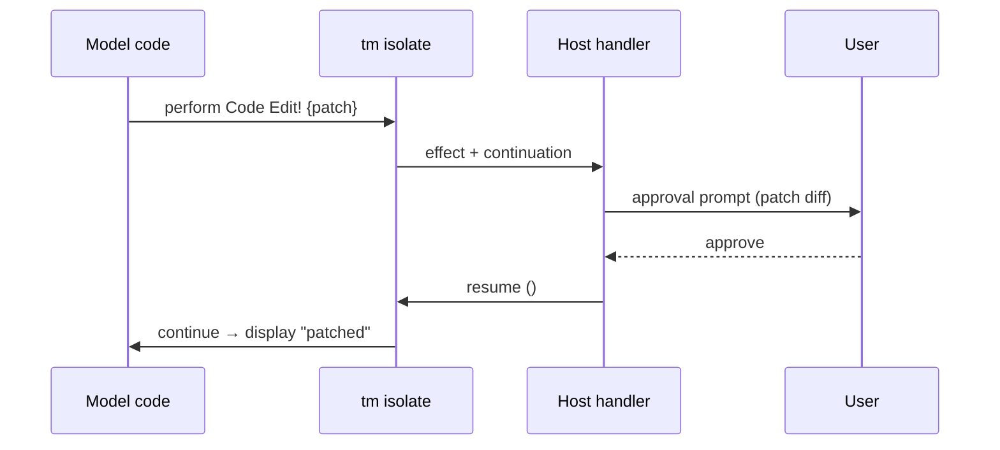

# 3. Effects & approval — the load-bearing idea

This is the section that justifies the whole folder. Everything else is sugar; this is the
bet.

## 3.1 Effects as the capability manifest

Every external interaction is an **algebraic effect**. A capability declaration (which lives
in the host registry, §3.9) is also a language-level effect declaration:

```
eff FS   Read   : (path: Path) -> String
eff FS   Write! : (path: Path, data: Data) -> Unit
eff HTTP Get    : (url: Url) -> Bytes
eff Code Edit!  : (patch: Patch) -> Unit
eff Proc Run!   : (cmd: String, args: [String]) -> ProcResult
```

A function's effect row is its **capability manifest**, computed by the type checker from the
effects it performs:

```
fun backup(src, dst) : {FS Read, FS Write!} Unit :=
  let data = fs.read src
  fs.write dst data
```

Three invariants from AGENTS.md / §3 fall out *for free, at type-check time, before any code
runs*:

### Fail-closed becomes a type error

```
fun oops(url) : Unit := http.get url   -- {HTTP Get} not granted this session
```

If the session's granted effect row does not include `HTTP Get`, this is **rejected before
eval** — not a runtime `undefined` (§7's current trick), not a `CapabilityDeniedError` thrown
mid-cell. The offending capability never enters the transcript because the cell never runs.
This is strictly stronger than the §7 `globalThis.http = undefined` approach.

### Provenance is the effect log

Each `perform` of an effect is a transcript node (§3.6 replay, §12 observability). Pure
functions (empty effect row) are **trivially replayable / memoizable** — they cannot touch
the host, so the host may skip them on replay and serve the cached value. The type tells the
replay engine what is safe to skip; today it has to guess from op names.

### The host registry *is* the handler table

§6.4's `op_host_call → registry.invoke()` is, in effect-system terms, the **effect handler**.
`registry.invoke(name, args, ctx)` is `handle eff with handler`. Adding a capability (§3.9:
register handler + emit stub) is, in `tm`, adding an effect declaration + a handler branch.
The "one bridge, a runtime registry" principle is not violated — it is *realized* as the
language's dispatch.

## 3.2 Approval as a resumable effect

This is the aha from §1.3. Effects marked `!` are **approval-bearing**: their handler may
*suspend* execution, ask the host (which asks the user), and *resume* with the result.

```
do
  let before = fs.read "config.json"
  code.edit {patch: replace "v1" "v2"}
  display "patched"
```

Control flow under approval policy `always` for `Code Edit!`:



Under policy `on-write` the same code might not suspend at all if the session pre-approved
writes. **The model's code is identical either way.** The policy is a handler config, not a
language construct the model has to branch on.

### Why this matters

Today (§7 + ApprovalPolicy) the model has to know: which calls might block, which might be
denied, how to handle denial, whether to retry. That knowledge is scattered across the system
prompt, the SDK `.d.ts`, and the orchestrator. In `tm`:

- `!` in the type = "this can wait for a human." The model sees it at authoring time.
- Denial = the effect resumes with an `ApprovalDenied` value = a normal `match` arm (§4.5).
- Retry = the model's choice, explicit, not a hidden runtime retry loop.

The approval boundary (AGENTS.md: "manual approvals" as a parity invariant) becomes a
**language-level affordance** instead of a host policy the model has to be *told* about.

## 3.3 The effect vocabulary maps to §7

| §7 SDK namespace | `tm` effect | `!`? |
|---|---|---|
| `print`, `display` | core primitive (not an effect — pure output to sink) | no |
| `tools.search/docs/call` | `Tools Search` / `Tools Docs` / `Tools Call` | no |
| `fs.read/ls/find` | `FS Read` | no |
| `fs.write` | `FS Write!` | **yes** |
| `code.search` | `Code Search` | no |
| `code.edit` | `Code Edit!` | **yes** |
| `proc.run` | `Proc Run!` | **yes** (always, per §7) |
| `resources.read/preview/list` | `Resources Read` etc. | no |
| `artifacts.put/get/slice/list` | `Artifacts Put` etc. | no |
| `http.*` (future) | `HTTP *` | policy-dependent |
| `secrets.*` (future) | `Secrets Resolve` — returns a handle, never a value (§3.5) | yes |
| `memory.*` / `skills.*` / `agents.*` (future) | their own effects | per-capability |

The `!` is not arbitrary; it encodes §7's existing `approval` field (`none`/`on-write`/…).
We are not inventing policy — we are giving the existing policy a place in the type.

## 3.4 Secrets stay by-reference (§3.5)

`secrets.resolve "OPENAI_KEY"` returns an opaque `SecretHandle`, never the bytes. The handle
is passed to `http` / `proc` calls; the host substitutes the real value at the boundary
(§3.5). In `tm` this is just an effect whose result type is `SecretHandle`, and there is
*no language operation* that dereferences a handle — so the invariant is enforced by the type
system, not by convention.

## 3.5 What suspend/resume costs the implementation

A resumable effect needs the isolate to capture its continuation. Two implementation paths
(§5):

1. **On deno_core / V8** — not natively supported; would require transpiling `tm` → a
   state-machine TS where each `!`-perform becomes a `yield` to a generator the host drives.
   Doable, but you lose the clean "V8 just runs it" story.
2. **On a Rust AST interpreter** — continuation capture is literally "save the interpreter
   stack frames." This is where `tm` earns its keep: the interpreter is already in Rust, the
   host is in Rust, suspend/resume is a Rust enum, no V8 in the path.

This is the real argument for `tm` having its own Rust backend rather than transpiling to TS:
**resumable effects are awkward on V8 but natural in a tree-walking interpreter.** §5 picks
this up.
