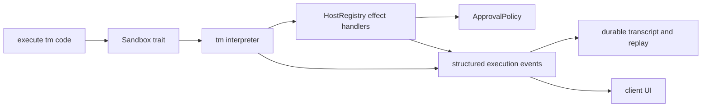

# 5. Runtime placement and historical fluency gate

## 5.1 Where tm sits

tm-lang is the sole `Sandbox` implementation shipped for `execute(code)`. The core agent loop and
host registry remain language-independent trait boundaries, but CLI/server expose no runtime
selector and no second language.

The Rust AST interpreter performs effects directly into `HostRegistry`. Continuation state,
effect-row checks, atomic binding commit, and approval suspension are interpreter concepts rather
than conventions layered over another language.

## 5.2 Historical comparative gate

Before the hard cut, tm had to prove model fluency against the incumbent TypeScript runtime. The
frozen `tm-fluency-prompt-v2` run produced 2,000 unique records: 20 cases x 50 runs x two languages.
Both languages achieved 1,000/1,000 first-try successes with zero retries. Mean first-attempt
generated-code tokens were 50.849 for TypeScript and 40.228 for tm; mean provider completion tokens
were 71.577 and 62.521 respectively. The success, usage, code-length, and retry checks passed.

That evidence justified default cutover; it is not an ongoing multi-backend contract. The
executable comparator and runtime-specific fixture module were retired when Deno/V8 was deleted.
The immutable raw record, summary, prompt, and preserved corpus live under
`docs/evidence/2026-07-16-tm-fluency-prompt-v2/`.

## 5.3 Closed implementation contract

The T0-T7 slice closed:

- the frozen parser/checker conformance corpus;
- persistent cells, atomic rollback, runtime limits, and structured presentation;
- explicit effect rows and fail-closed capability/resource checks;
- approval suspend/resume/cancel with stable cell/node ids;
- the existing `Sandbox`, `HostRegistry`, artifact, resource, and event boundaries;
- public API, real approval-gated edit, runtime-loss, reconnect, PostgreSQL replay, and affected
  client proofs;
- the historical comparative live-model gate above.

The subsequent tm-only slice removed the old backend crate, Deno/V8 dependencies, backend enums and
selectors, shipped stub, JavaScript declaration artifact, and comparator command. New native coding
events use `native-tm`; stored historical events are replayed unchanged.

## 5.4 The fun

tm makes the common model workflow—read, transform, show—compact, while making the host's concerns
explicit: what authority ran, what suspended for a human, what completed, and what value was shown.
The code is therefore both the model's working language and an auditable execution artifact.
