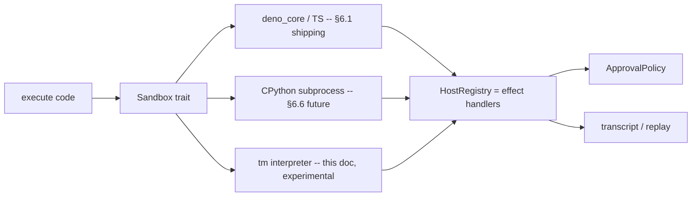

# 5. Backend, fluency risk & where it lives

## 5.1 Where `tm` sits in the architecture

It is a `Sandbox` backend (§3.7 pluggable everything), a sibling of deno_core (TS) and
CPython — same `Sandbox` trait, same agent loop, same host registry, same transcript.

The agent loop (§5) is unchanged. `execute(code)` still the one tool (§5.2). The only
difference: when `code` is `tm`, the sandbox is the `tm` interpreter and the host-call bridge
(§6.4) is the effect-handler table.

## 5.2 Two implementation paths, pick the second

1. **Transpile `tm` → TS prelude, run on deno_core.** Cheap to build (reuse V8), but loses
   the load-bearing feature: resumable approval effects become "a host op that blocks," and
   effect-row fail-closed becomes a runtime check again — back to §7's `undefined` trick, just
   with a transpile step. **Not worth it.** If `tm` is just TS sugar, don't ship it.

2. **Rust AST interpreter, effects performed directly into `HostRegistry`.** A tree-walking
   interpreter in a new `crates/tm-lang` (or `tm-sandbox-tm`). Continuation capture for
   resumable effects is "save the interpreter frame stack" — natural in a tree-walker,
   awkward in V8. Startup is faster than V8 (§6.1's rquickjs rationale applies). The effect
   row check is a tiny type checker over a closed capability set. **This is where `tm` earns
   its keep.**

Path 2 is more code (parser + type checker + interpreter) but it is the only path that
delivers the §3 bet. Path 1 is a warning, not a plan.

## 5.3 The fluency gate (hard)

§6.1 rejected Rhai/Rune for "low model fluency." `tm` faces the same risk. The gate:

- **Benchmark**: take 20 representative agent prompts (read+filter, edit, fan-out read,
  approval-gated write, error-recovery, table summarization). Run each 50× with the model
  writing the TS prelude vs writing `tm`. Measure:
  1. **Task success rate** (does the code do the right thing on first try).
  2. **Token count** of the generated code.
  3. **Edit/retry rate** (how often the model re-emits a cell to fix a syntax error).
- **Pass criterion**: `tm` not-worse on (1) and better on (2); (3) within 1.2× of TS.
- **Failure action**: if `tm` loses on (1), it stays a design exercise. The fun is not a
  justification for a worse agent.

`tm`'s syntax is chosen to stay *inside* the model's fluency basin (JSON, pipelines, match —
all things models already write in Nu / OCaml / Roc-flavored examples). The benchmark is
what tells us whether that bet landed.

## 5.4 Milestone sequencing (do not jump the line)

Per AGENTS.md and §14, the real sandbox (deno_core) ships **before** this. Concretely:

1. M0 close + M1 real `deno_core` sandbox — ships with TS. **Do not start `tm` here.**
2. `tm-host` + `ApprovalPolicy` real — so the approval semantics `tm` lifts into the language
   actually exist as host behavior first. **`tm` models existing semantics; it does not
   invent them.**
3. P0/P1 vertical slice running, approval flow exercised on real tasks — *then* `tm` as a
   `Sandbox` backend experiment, gated on the §5.3 benchmark.

Order matters: if `tm` lands before approval policy is real, the language will invent
approval semantics that the host then has to conform to — that inverts the dependency and
risks freezing a wrong design. Get the semantics right in TS first; **then** compile those
semantics into language primitives.

## 5.5 What would make this real

The smallest credible slice, if/when the gate is cleared:

- `crates/tm-lang`: parser (rowan / pratt), effect-row type checker, tree-walking
  interpreter with suspend/resume.
- A `Sandbox` impl that runs `tm` cells and performs effects into the existing
  `HostRegistry` (no new registry).
- `tools.docs` returning `tm` effect declarations instead of TS `.d.ts` when the session is a
  `tm` session.
- One E2E test: an approval-gated `code.edit!` that suspends, gets approved, resumes, and the
  transcript shows the effect node. **That test is the proof that the §3 bet landed.**

## 5.6 The fun

The user said the most important thing is that this is **好玩**. The honest version of "fun"
here: `tm` is a language where the thing the agent does most — *read, transform, show* — is
one line, and the thing the host cares about most — *what did this code touch, what needs a
human* — is readable off the type of that line. That is a satisfying shape. Whether it ships
is a fluency benchmark; whether it is worth *designing* is, per the user, yes — because
designing it clarifies which parts of §6/§7 are load-bearing and which are TS accident.

If we build it and it loses the benchmark, the design doc still paid for itself: it is the
cleanest articulation of what "agent-first" would mean if fluency were not a constraint.
