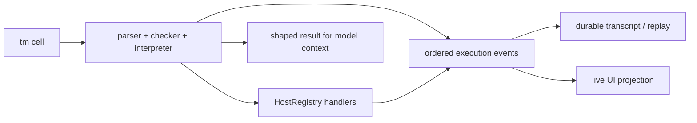

# 6. Persistent REPL, execution trace & UI

The product reason for `tm` is not only shorter model-authored code. Because the interpreter
knows the AST, effect row, `par` scopes, registry metadata, continuation, bindings, and intended
presentations, one cell can also be the source of truth for a useful live UI. The client should
not have to parse source, infer relationships from text, or render every internal host call as an
unrelated generic tool card.

The resulting language is **not generally declarative**. It is a persistent, eager, effectful
REPL with declarative presentation and a structured observable execution model.

## 6.1 Cell semantics

A submitted cell runs now against the current committed REPL environment. Its top-level forms are
separated by standalone --- syntax, but the whole cell is still one transaction:

1. Parse and type-check the complete cell, including its grant-bearing effect row.
2. Reject missing capability grants before evaluation.
3. Evaluate expressions in dependency order; only explicit `par` scopes introduce concurrency.
4. Stream structured lifecycle events while host effects run or approval suspends the cell.
5. On success, commit new top-level bindings and the final value/reference as one REPL-state step.
6. On language error, denial, timeout, or cancellation, discard partial bindings.

The binding commit is atomic inside the current interpreter; arbitrary external effects are not
rolled back. Each host handler keeps the existing approval, idempotency, and durable-effect
contracts. Reconnect replays recorded events without disturbing the live interpreter. A process
restart or runtime eviction follows the existing `runtime_reset` contract and starts a fresh REPL
environment; it never re-executes an old effectful cell to reconstruct either bindings or UI.

Therefore:

```tm
let todos = @fs.read workspace:TODO.md |> lines |> filter (contains "P6")
```

means "read and bind this value now," not "keep `todos` reactively synchronized with the file."

## 6.2 One execution tree, two consumers

Every `execute(code)` remains the one model-visible tool and uses the existing agent loop. The
`tm` interpreter enriches the current `cell_start` / `cell_result` path with nodes inside the
cell; it does not create a second message loop or client-only execution channel.



The transcript and UI consume the same durable event envelope. Clients still receive the single
`session_event` SSE stream from §27; `tm` adds event variants and correlation fields rather than a
parallel protocol.

Every trace node carries at least:

```text
turnId, cellId, nodeId, parentNodeId?, sequence, type, status, createdAt
```

Capability nodes additionally carry the canonical capability name, bounded/redacted argument and
result previews, registry presentation metadata, duration, and resource/artifact references for
content too large or sensitive to inline. Raw secrets and unbounded source/result bodies never enter
events.

## 6.3 Lifecycle events

The minimum event vocabulary extends the existing core events:

| Event | Meaning |
|---|---|
| `cell_start` | A checked cell began evaluation; includes bounded source or a source artifact reference. |
| `scope_start` | A structured scope such as `par` began and owns child nodes. |
| `scope_progress` | A bounded aggregate such as completed/total children changed. |
| `effect_start` | An `@capability` perform reached its host handler. |
| `effect_progress` | Optional bounded progress from a long-running or fan-out handler. |
| `effect_suspended` | The continuation is waiting, normally for an approval id. |
| `effect_resumed` | A suspended continuation resumed with an approved/control result. |
| `effect_result` | The effect completed, failed, timed out, or was cancelled. |
| `scope_result` | A structured scope completed or cancelled its remaining children. |
| `display` | The cell emitted a declarative presentation item. |
| `binding_committed` | Successful top-level bindings became available to later cells. |
| `cell_result` | The cell completed with its shaped final result or structured error. |

Existing `approval` and `approval_resolved` events remain the durable approval control plane. They
link to `cellId` and `nodeId`; `effect_suspended` / `effect_resumed` describe interpreter state, not
a second approval record. The approval decision can survive process failure, but serializing an
interpreter continuation is not assumed: if its runtime is lost, the cell ends under the existing
stale-running/runtime-reset rules rather than replaying its effects.

An effect node follows a small state machine:

```text
running -> suspended -> running -> completed
   |                       |------> failed
   |------------------------------> timed_out
   |------------------------------> cancelled
```

Events are append-only and ordered. Replaying through a sequence number must produce the same node
tree and visible terminal states as the original live stream. Reconnect may coalesce progress for
rendering, but it may not invent, reorder, or drop terminal/approval transitions.

## 6.4 Structured concurrency becomes UI structure

The interpreter knows that:

```tm
paths |> par map @fs.read
```

is one `par` scope with N child `fs.read` effects, not N unrelated tool calls. The default UI can
therefore render one compact aggregate:

```text
Read 24 files    18 / 24
```

and expand it into per-file children only on demand. Failure cancels siblings according to §2.8;
the scope and child events make that cancellation visible without flooding the main conversation.
Pure pipeline stages such as `filter`, `map`, and `sort_by` do not emit nodes by default. A bounded
debug trace may expose them, but ordinary UI follows authority, latency, concurrency, approval, and
intended presentation rather than every AST reduction.

## 6.5 Declarative presentation

`display` is a core **presentation effect**, not a grant-bearing host capability and not a pure
function. It records what the agent intends the user to see without granting arbitrary widget or
client authority:

```tm
hits |> display {
  kind: "table",
  title: "TODOs",
  columns: ["file", "line", "text"]
}
```

The first presentation vocabulary stays aligned with existing result shaping: `text`, `markdown`,
`code`, `json`, and `table`, plus resource/artifact links and an approval-owned diff view where the
host already has a safe diff. Unsupported kinds fail closed or fall back to bounded JSON; model code
cannot name Flutter widgets, HTML, coordinates, colors, event handlers, or client actions.

Presentation effects are tracked separately from the grant-bearing authority row and the possible
error set:

- authority answers "what host capability may this code touch?";
- errors answer "how may evaluation abort or recover?";
- presentation answers "what value did the agent intentionally expose?"

A function is replay/memoization-pure only when all three tracked sets are empty. `display` may be
streamed to the UI as provisional output, but it reaches model context only through the existing
bounded cell result. If the cell later fails, the UI retains the item inside the failed trace rather
than presenting it as a successful final result.

`print` remains capped diagnostic stdout. It can appear in an expanded cell inspector but is not an
intended presentation and should not compete with `display` in the conversation.

## 6.6 Example projection

For:

```tm
let files = @fs.find {root: workspace:src, glob: "**/*.rs"}
---
let hits =
  files
  |> par map @fs.read
  |> flatmap lines
  |> filter (contains "TODO")
---

do {
  @code.edit {patch: build_patch hits};
  hits |> display {kind: "table", title: "Updated TODOs"}
}
```

the main conversation can show:

```text
Find Rust files                         completed · 24 files
Read files                             running   · 18 / 24
Apply code patch                       waiting for approval
Updated TODOs                          pending
```

After approval, the same nodes transition in place; they are not duplicated as new chat messages.
An expanded inspector may show source, typed authority row, timings, children, bounded previews,
errors, and resource links. The collapsed view favors human-relevant progress.

## 6.7 Non-goals and acceptance

This contract does not make `tm` a UI framework, reactive language, workflow scheduler, or query
planner. It does not let model code bypass server-owned approval rendering or invent trusted client
actions. It does not expose more sensitive arguments/results merely because the UI can render them.

The first credible UI acceptance test should prove one cell containing `par map`, an approval-gated
`@code.edit`, and a table `display`:

- emits one correctly parented, gap-free execution tree;
- folds fan-out into stable progress while retaining expandable child outcomes;
- suspends and resumes the same effect node around `approval` / `approval_resolved`;
- renders the same terminal projection after SSE reconnect and durable replay;
- commits bindings only after cell success; and
- keeps secrets, oversized bodies, and unapproved diffs out of event previews.
